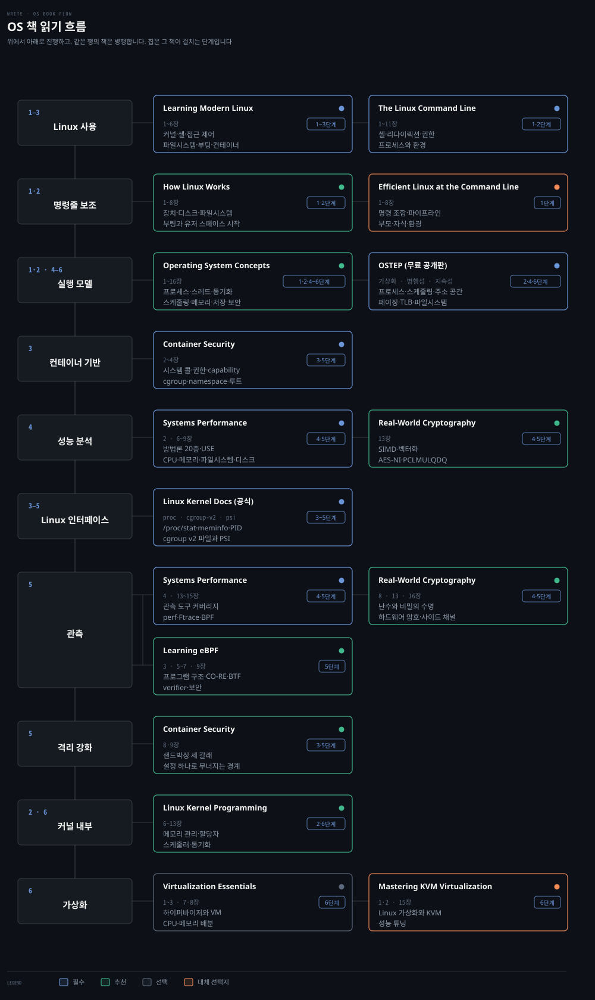
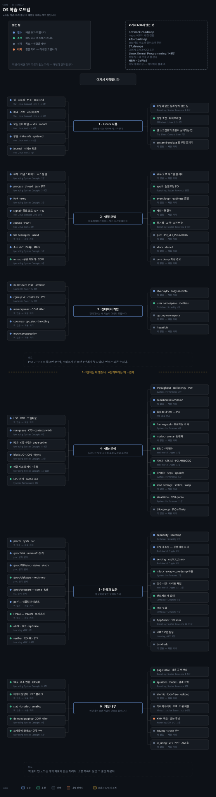

# OS 학습 로드맵
---

> Linux 운영에서 실행 모델과 격리로 내려간 뒤 성능·관측·커널 내부로 이어집니다. 개념이 주인공이고 책은 그 개념을 다루는 자리입니다.

## 이 순서를 잡은 기준

> 커널을 자료구조부터 배우면 `task_struct` 에서 지칩니다. 운영에서 올라온 증상에서 시작해 그 증상이 서 있는 층으로 내려갑니다.

1~3단계는 컨테이너가 무엇 위에 서 있는지를 잡는 바닥입니다. 4~5단계는 느려진 이유를 재는 축이고, 6단계는 그 아래 커널 구현입니다.

**증상이 단계를 정합니다.** Pod가 137로 죽으면 3단계, 서비스가 안 뜨면 1단계, CPU 사용률이 낮은데 응답이 느리면 4단계가 첫 자리입니다. 번호는 의존 순서이지 진도가 아닙니다.

**우선순위는 개념마다 붙습니다.** `필수` 는 빼면 뒤가 막히는 자리, `추천` 은 빼도 되지만 손해가 큰 자리, `선택` 은 목표가 생겼을 때 여는 자리입니다. `대체` 는 같은 자리를 다른 자료가 대신 채우는 경우이므로 둘 다 읽지 않습니다.

**책이 없는 개념도 노드로 둡니다.** 소장본이 그 주제를 안 다루면 `책` 칸을 비워 두고, 책이 들어오면 그 칸만 채웁니다. 네트워크는 3단계의 network namespace까지만 잡고 [네트워크 로드맵](network-roadmap.md)에 넘깁니다.

## 책 읽기 흐름

> 이 로드맵이 쓰는 책 열하나와 각 책에서 읽을 장입니다. 통독하는 책은 없습니다.

| 책 | 읽을 장 | 우선순위 | 자리 |
|---|---|:---:|---|
| [Learning Modern Linux](../02_os/book/learning-modern-linux/README.md) | 1~6장 | 필수 | 1~3단계 |
| The Linux Command Line | 1~11장 | 필수 | 1·2단계 |
| [Container Security](../08_cloud/book/container-security/README.md) | 2~4 · 8·9장 | 필수 | 3·5단계 |
| [Systems Performance](../02_os/book/systems-performance/README.md) | 2 · 4 · 6~9 · 13~15장 | 필수 | 4·5단계 |
| How Linux Works | 1~8장 | 추천 | 1·2단계 |
| Operating System Concepts | 1~9 · 13~16장 | 추천 | 2·4·6단계 |
| Learning eBPF | 3 · 5~7 · 9장 | 추천 | 5단계 |
| [Linux Kernel Programming](../02_os/book/linux-kernel-programming/README.md) | 6~13장 | 추천 | 2·6단계 |
| Virtualization Essentials | 1~3 · 7·8장 | 선택 | 6단계 |
| Efficient Linux at the Command Line | 1~8장 | 대체 | 1단계 — The Linux Command Line 자리 |
| Mastering KVM Virtualization | 1·2 · 15장 | 대체 | 6단계 — Virtualization Essentials 자리 |

소장 목록은 계속 늘어납니다. 새 책이 들어오면 이 표와 아래 단계별 표의 `책` 열을 함께 갱신합니다.

## 학습 순서

> 단계마다 배우는 개념입니다. 우선순위와 자료 위치는 아래 단계별 표가 짚습니다.

| 단계 | 무엇을 여는가 | 배우는 개념 |
|---|---|---|
| 1 · Linux 사용 | 명령을 치는 자리 | 셸 · 스트림 · 변수 · 종료 상태 · 파일 · 권한 · 리다이렉션 · 파이프 · 모든 것이 파일 · VFS · mount · 부팅 · initramfs · systemd unit · 의존성 · journal |
| 2 · 실행 모델 | 애플리케이션이 하는 일 | 유저 스페이스 · 커널 스페이스 · 시스템 콜 · `strace` · process · thread · task 구조 · signal · 종료 코드 137 · 143 · zombie · PID 1 · file descriptor · `ulimit` · `epoll` · 동기화 · 교착 |
| 3 · 컨테이너 기반 | 컨테이너가 서는 바닥 | namespace 여덟 · `unshare` · cgroup v2 · controller · `cpu.max` · `cpu.stat` · `memory.max` · PSI · OOM Killer · mount propagation · OverlayFS · copy-on-write · user namespace · rootless · capability |
| 4 · 성능 분석 | 왜 느린가 | USE · RED · 드릴다운 · run queue · CFS · context switch · load average · softirq · RSS · VSS · PSS · page cache · swap · overcommit · block I/O · IOPS · `fsync` · 파일 시스템 캐시 |
| 5 · 관측과 보안 | 어느 창을 여는가 | procfs · sysfs · `sar` · perf · Ftrace · tracepoint · kprobe · uprobe · BCC · bpftrace · verifier · CO-RE · BTF · capability · seccomp · AppArmor · SELinux · 샌드박싱 |
| 6 · 커널 내부 | 커널의 안 | VAS · 주소 변환 · KASLR · 페이지 할당자 · GFP 플래그 · slab · `kmalloc` · `vmalloc` · demand paging · 스케줄링 클래스 · CFS 구현 · 임계 구역 · mutex · spinlock · atomic · lock-free · lockdep · 하이퍼바이저 · KVM |

## 기반 · 1~3단계

> 컨테이너가 무엇 위에 서 있는지를 잡습니다. 여기까지가 운영자가 반드시 지나가는 구간입니다.

### 1단계 · Linux 사용

| 개념 | 우선순위 | 노트 | 책 |
|---|:---:|---|---|
| 셸 — 스트림 · 변수 · 종료 상태 | 필수 | [03-01](../02_os/book/learning-modern-linux/03-01.%EC%85%B8%EC%9D%98%20%EC%8B%A4%EC%B2%B4%EB%8A%94%20%EC%8A%A4%ED%8A%B8%EB%A6%BC%EA%B3%BC%20%EB%B3%80%EC%88%98%EC%99%80%20%EC%A2%85%EB%A3%8C%20%EC%83%81%ED%83%9C%EB%8B%A4.md) | The Linux Command Line 1·5~8장 |
| 파일 · 권한 · 리다이렉션 | 필수 | [05-01](../02_os/book/learning-modern-linux/05-01.%EB%AA%A8%EB%93%A0%20%EA%B2%83%EC%9D%B4%20%ED%8C%8C%EC%9D%BC%EC%9D%B4%EB%9D%BC%EB%8A%94%20%EB%A7%90%EC%9D%80%20%EC%86%90%EC%9E%A1%EC%9D%B4%EA%B0%80%20%ED%95%98%EB%82%98%EB%9D%BC%EB%8A%94%20%EB%9C%BB%EC%9D%B4%EB%8B%A4.md) | The Linux Command Line 4·6·9장 |
| 모든 것이 파일 — VFS · mount · 장치 | 필수 | [05-01](../02_os/book/learning-modern-linux/05-01.%EB%AA%A8%EB%93%A0%20%EA%B2%83%EC%9D%B4%20%ED%8C%8C%EC%9D%BC%EC%9D%B4%EB%9D%BC%EB%8A%94%20%EB%A7%90%EC%9D%80%20%EC%86%90%EC%9E%A1%EC%9D%B4%EA%B0%80%20%ED%95%98%EB%82%98%EB%9D%BC%EB%8A%94%20%EB%9C%BB%EC%9D%B4%EB%8B%A4.md) | How Linux Works 3·4장 |
| 부팅 · initramfs · systemd | 필수 | [06-01](../02_os/book/learning-modern-linux/06-01.%EB%A8%BC%EC%A0%80%20%EC%BC%9C%EC%A7%80%EB%8A%94%20%EA%B2%83%20%ED%95%98%EB%82%98%EA%B0%80%20%EB%82%98%EB%A8%B8%EC%A7%80%20%EC%A0%84%EB%B6%80%EB%A5%BC%20%EC%BC%A0%EB%8B%A4.md) | How Linux Works 5·6장 |
| journal · 시스템 설정 · 서비스 의존 | 필수 | [06-01](../02_os/book/learning-modern-linux/06-01.%EB%A8%BC%EC%A0%80%20%EC%BC%9C%EC%A7%80%EB%8A%94%20%EA%B2%83%20%ED%95%98%EB%82%98%EA%B0%80%20%EB%82%98%EB%A8%B8%EC%A7%80%20%EC%A0%84%EB%B6%80%EB%A5%BC%20%EC%BC%A0%EB%8B%A4.md) | How Linux Works 7장 |
| 커널이 맡는 일과 맡지 않는 일 | 필수 | [02-01](../02_os/book/learning-modern-linux/02-01.%EC%BB%A4%EB%84%90%EC%9D%80%20%EC%A0%84%EB%B6%80%EB%A5%BC%20%ED%95%98%EC%A7%80%EB%A7%8C%20%EC%9A%B4%EC%98%81%EC%B2%B4%EC%A0%9C%EB%8A%94%20%EC%95%84%EB%8B%88%EB%8B%A4.md) · [01-01](../02_os/book/learning-modern-linux/01-01.%ED%95%98%EB%93%9C%EC%9B%A8%EC%96%B4%EB%A5%BC%20%EA%B0%80%EB%A6%AC%EA%B3%A0%20%EB%82%98%EB%A9%B4%20%EB%AC%B4%EC%97%87%EC%9D%B4%20%EB%B3%B4%EC%9D%BC%EC%A7%80%EB%A5%BC%20%EC%A0%95%ED%95%B4%EC%95%BC%20%ED%95%9C%EB%8B%A4.md) | Operating System Concepts 1·2장 |
| 셸 스크립트가 조용히 실패하는 법 | 추천 | [03-03](../02_os/book/learning-modern-linux/03-03.bash%20%EB%8A%94%20%EC%A1%B0%EC%9A%A9%ED%9E%88%20%EC%8B%A4%ED%8C%A8%ED%95%98%EB%AF%80%EB%A1%9C%20%EC%8B%9C%EB%81%84%EB%9F%BD%EA%B2%8C%20%EB%A7%8C%EB%93%A4%EC%96%B4%EC%95%BC%20%ED%95%9C%EB%8B%A4.md) | The Linux Command Line 7장 |
| 명령 조합 · 파이프라인 · 단축 | 추천 | [03-02](../02_os/book/learning-modern-linux/03-02.%EC%9E%90%EC%A3%BC%20%EC%B9%98%EB%8A%94%20%EA%B2%83%EC%9D%BC%EC%88%98%EB%A1%9D%20%EC%A7%A7%EC%95%84%EC%95%BC%20%ED%95%9C%EB%8B%A4.md) | Efficient Linux 1·3·5·7장 |
| `systemd-analyze` 로 부팅 쪼개기 | 선택 | | |
| core dump 저장 경로 | 선택 | | |

### 2단계 · 실행 모델

| 개념 | 우선순위 | 노트 | 책 |
|---|:---:|---|---|
| 유저 · 커널 스페이스 · 시스템 콜 | 필수 | [커널과 컨테이너](../02_os/kernel/01-01.%EC%BB%A4%EB%84%90%EA%B3%BC%20%EC%BB%A8%ED%85%8C%EC%9D%B4%EB%84%88.md) · [03-01](../02_os/book/systems-performance/03-01.%EC%9A%B4%EC%98%81%EC%B2%B4%EC%A0%9C%20%281%29%20%E2%80%94%20%EC%BB%A4%EB%84%90%C2%B7%EC%8B%9C%EC%8A%A4%ED%85%9C%20%EC%BD%9C%C2%B7%EC%9D%B8%ED%84%B0%EB%9F%BD%ED%8A%B8%C2%B7%ED%94%84%EB%A1%9C%EC%84%B8%EC%8A%A4.md) | Operating System Concepts 2장 |
| `strace` 로 시스템 콜 세기 | 필수 | [커널과 컨테이너](../02_os/kernel/01-01.%EC%BB%A4%EB%84%90%EA%B3%BC%20%EC%BB%A8%ED%85%8C%EC%9D%B4%EB%84%88.md) | |
| process · thread · task 구조 · VAS | 필수 | [06-01](../02_os/book/linux-kernel-programming/06-01.%ED%94%84%EB%A1%9C%EC%84%B8%EC%8A%A4%EC%99%80%20%EC%8A%A4%EB%A0%88%EB%93%9C%20%281%29%20%E2%80%94%20%EC%BB%A8%ED%85%8D%EC%8A%A4%ED%8A%B8%C2%B7VAS%C2%B7%EC%8A%A4%ED%83%9D.md) · [06-02](../02_os/book/linux-kernel-programming/06-02.%ED%94%84%EB%A1%9C%EC%84%B8%EC%8A%A4%EC%99%80%20%EC%8A%A4%EB%A0%88%EB%93%9C%20%282%29%20%E2%80%94%20task%20%EA%B5%AC%EC%A1%B0%EC%99%80%20current.md) | Operating System Concepts 3·4장 |
| signal · 종료 코드 137 · 143 | 필수 | [03-01](../02_os/book/learning-modern-linux/03-01.%EC%85%B8%EC%9D%98%20%EC%8B%A4%EC%B2%B4%EB%8A%94%20%EC%8A%A4%ED%8A%B8%EB%A6%BC%EA%B3%BC%20%EB%B3%80%EC%88%98%EC%99%80%20%EC%A2%85%EB%A3%8C%20%EC%83%81%ED%83%9C%EB%8B%A4.md) | The Linux Command Line 10장 |
| zombie · PID 1 | 필수 | [06-01](../02_os/book/learning-modern-linux/06-01.%EB%A8%BC%EC%A0%80%20%EC%BC%9C%EC%A7%80%EB%8A%94%20%EA%B2%83%20%ED%95%98%EB%82%98%EA%B0%80%20%EB%82%98%EB%A8%B8%EC%A7%80%20%EC%A0%84%EB%B6%80%EB%A5%BC%20%EC%BC%A0%EB%8B%A4.md) | How Linux Works 8장 |
| file descriptor · `ulimit` · 관측 창 | 필수 | [05-01](../02_os/book/learning-modern-linux/05-01.%EB%AA%A8%EB%93%A0%20%EA%B2%83%EC%9D%B4%20%ED%8C%8C%EC%9D%BC%EC%9D%B4%EB%9D%BC%EB%8A%94%20%EB%A7%90%EC%9D%80%20%EC%86%90%EC%9E%A1%EC%9D%B4%EA%B0%80%20%ED%95%98%EB%82%98%EB%9D%BC%EB%8A%94%20%EB%9C%BB%EC%9D%B4%EB%8B%A4.md) · [08-02](../02_os/book/learning-modern-linux/08-02.%EC%9E%90%EC%9B%90%EB%A7%88%EB%8B%A4%20%EC%B0%BD%EC%9D%B4%20%EB%94%B0%EB%A1%9C%20%EB%82%98%20%EC%9E%88%EC%96%B4%20%EC%96%B4%EB%8A%90%20%EC%B0%BD%EC%9D%84%20%EC%97%AC%EB%8A%90%EB%83%90%EA%B0%80%20%EA%B3%A7%20%EC%A7%84%EB%8B%A8%EC%9D%B4%EB%8B%A4.md) | |
| `epoll` · 논블로킹 I/O | 추천 | [03-03](../02_os/book/systems-performance/03-03.%EC%9A%B4%EC%98%81%EC%B2%B4%EC%A0%9C%20%283%29%20%E2%80%94%20%EC%BB%A4%EB%84%90%20%EA%B5%AC%ED%98%84%C2%B7Linux%20%EB%B0%9C%EC%A0%84%EC%82%AC%C2%B7BPF.md) · [05-01](../02_os/book/systems-performance/05-01.%EC%95%A0%ED%94%8C%EB%A6%AC%EC%BC%80%EC%9D%B4%EC%85%98%20%281%29%20%E2%80%94%20%EA%B8%B0%EC%B4%88%EC%99%80%20%EC%84%B1%EB%8A%A5%20%EA%B8%B0%EB%B2%95.md) | Operating System Concepts 13장 |
| 동기화 · 교착 | 추천 | | Operating System Concepts 5·7장 |
| `prctl` · `PR_SET_PDEATHSIG` | 선택 | | |
| `vfork` · `clone3` | 선택 | | |

### 3단계 · 컨테이너 기반

| 개념 | 우선순위 | 노트 | 책 |
|---|:---:|---|---|
| namespace 여덟 가지 · `unshare` | 필수 | [namespace 실습](../02_os/kernel/01-05.namespace%20%EC%8B%A4%EC%8A%B5%20%E2%80%94%208%EA%B0%80%EC%A7%80%20%EA%B2%A9%EB%A6%AC%EC%99%80%20unshare.md) | Container Security 4장 |
| cgroup v2 — controller · PSI | 필수 | [cgroup v2 깊이](../02_os/kernel/01-02.cgroup%20v2%20%EA%B9%8A%EC%9D%B4.md) | Container Security 3장 |
| `memory.max` · `memory.events` · OOM Killer | 필수 | [cgroup 파일시스템 실습](../02_os/kernel/01-04.cgroup%20%ED%8C%8C%EC%9D%BC%EC%8B%9C%EC%8A%A4%ED%85%9C%20%EC%8B%A4%EC%8A%B5.md) · [Endowus OOMKilled](../02_os/kernel/01-06.cgroup%20%EC%82%AC%EB%A1%80%20%E2%80%94%20Endowus%20OOMKilled.md) | |
| `cpu.max` · `cpu.stat` · throttling | 필수 | [cgroup v2 깊이](../02_os/kernel/01-02.cgroup%20v2%20%EA%B9%8A%EC%9D%B4.md) | |
| mount propagation 네 가지 | 필수 | [마운트 네임스페이스와 propagation](../02_os/kernel/01-03.%EB%A7%88%EC%9A%B4%ED%8A%B8%20%EB%84%A4%EC%9E%84%EC%8A%A4%ED%8E%98%EC%9D%B4%EC%8A%A4%EC%99%80%20propagation.md) | |
| OverlayFS · copy-on-write | 필수 | [OverlayFS와 user namespace](../02_os/kernel/01-07.OverlayFS%EC%99%80%20user%20namespace%20%E2%80%94%20Netflix%20UID%20%EA%B2%A9%EB%A6%AC.md) | |
| user namespace · rootless | 추천 | [OverlayFS와 user namespace](../02_os/kernel/01-07.OverlayFS%EC%99%80%20user%20namespace%20%E2%80%94%20Netflix%20UID%20%EA%B2%A9%EB%A6%AC.md) | Container Security 4장 |
| 시스템 콜 · 권한 · capability 의 바닥 | 추천 | [02-01](../08_cloud/book/container-security/02-01.Linux%20%EC%8B%9C%EC%8A%A4%ED%85%9C%20%EC%BD%9C%C2%B7%EA%B6%8C%ED%95%9C%C2%B7capability%20%E2%80%94%20%EC%BB%A8%ED%85%8C%EC%9D%B4%EB%84%88%20%EB%B3%B4%EC%95%88%EC%9D%98%20%EB%B0%94%EB%8B%A5.md) | Container Security 2장 |
| 재료가 아니라 조합이라는 관점 | 추천 | [06-02](../02_os/book/learning-modern-linux/06-02.%EC%BB%A8%ED%85%8C%EC%9D%B4%EB%84%88%EC%9D%98%20%EC%83%88%EB%A1%9C%EC%9B%80%EC%9D%80%20%EC%9E%AC%EB%A3%8C%EA%B0%80%20%EC%95%84%EB%8B%88%EB%9D%BC%20%EC%A1%B0%ED%95%A9%EC%97%90%20%EC%9E%88%EB%8B%A4.md) | |
| cgroup namespace | 선택 | | |
| hugetlbfs | 선택 | | |

## 자원과 관측 · 4~5단계

> 죽지는 않는데 느린 경우를 다룹니다. 3단계까지가 왜 멈췄나라면 여기는 왜 느린가입니다.

### 4단계 · 성능 분석

| 개념 | 우선순위 | 노트 | 책 |
|---|:---:|---|---|
| USE · RED · 드릴다운 · 지연 분석 | 필수 | [02-01](../02_os/book/systems-performance/02-01.%EB%B0%A9%EB%B2%95%EB%A1%A0%20%281%29%20%E2%80%94%20%EC%9A%A9%EC%96%B4%C2%B7%EB%AA%A8%EB%8D%B8%C2%B7%ED%95%B5%EC%8B%AC%20%EA%B0%9C%EB%85%90.md) · [02-02](../02_os/book/systems-performance/02-02.%EB%B0%A9%EB%B2%95%EB%A1%A0%20%282%29%20%E2%80%94%20%EB%B6%84%EC%84%9D%20%EB%B0%A9%EB%B2%95%EB%A1%A0%2020%EC%A2%85.md) | |
| run queue · CFS · context switch | 필수 | [06-01](../02_os/book/systems-performance/06-01.CPU%20%281%29%20%E2%80%94%20%EC%9A%A9%EC%96%B4%C2%B7%EB%AA%A8%EB%8D%B8%C2%B7%ED%95%B5%EC%8B%AC%20%EA%B0%9C%EB%85%90.md) ~ [06-04](../02_os/book/systems-performance/06-04.CPU%20%284%29%20%E2%80%94%20%EA%B4%80%EC%B8%A1%20%EB%8F%84%EA%B5%AC%C2%B7%EC%8B%9C%EA%B0%81%ED%99%94.md) | Operating System Concepts 6장 |
| RSS · VSS · PSS · page cache | 필수 | [07-01](../02_os/book/systems-performance/07-01.%EB%A9%94%EB%AA%A8%EB%A6%AC%20%281%29%20%E2%80%94%20%EC%9A%A9%EC%96%B4%C2%B7%ED%95%B5%EC%8B%AC%20%EA%B0%9C%EB%85%90.md) ~ [07-04](../02_os/book/systems-performance/07-04.%EB%A9%94%EB%AA%A8%EB%A6%AC%20%284%29%20%E2%80%94%20%EA%B4%80%EC%B8%A1%20%EB%8F%84%EA%B5%AC.md) | Operating System Concepts 8·9장 |
| block I/O · IOPS · queue depth · `fsync` | 필수 | [09-01](../02_os/book/systems-performance/09-01.%EB%94%94%EC%8A%A4%ED%81%AC%20%281%29%20%E2%80%94%20%EB%B0%B0%EA%B2%BD%C2%B7%EB%AA%A8%EB%8D%B8%C2%B7%ED%95%B5%EC%8B%AC%20%EA%B0%9C%EB%85%90.md) ~ [09-04](../02_os/book/systems-performance/09-04.%EB%94%94%EC%8A%A4%ED%81%AC%20%284%29%20%E2%80%94%20%EA%B4%80%EC%B8%A1%20%EB%8F%84%EA%B5%AC.md) | Operating System Concepts 10장 |
| 파일 시스템 캐시 · 유형 · 튜닝 | 추천 | [08-01](../02_os/book/systems-performance/08-01.%ED%8C%8C%EC%9D%BC%20%EC%8B%9C%EC%8A%A4%ED%85%9C%20%281%29%20%E2%80%94%20%EB%B0%B0%EA%B2%BD%C2%B7%ED%95%B5%EC%8B%AC%20%EA%B0%9C%EB%85%90.md) ~ [08-04](../02_os/book/systems-performance/08-04.%ED%8C%8C%EC%9D%BC%20%EC%8B%9C%EC%8A%A4%ED%85%9C%20%284%29%20%E2%80%94%20%EA%B4%80%EC%B8%A1%20%EB%8F%84%EA%B5%AC.md) | Operating System Concepts 11·12장 |
| load average · softirq | 추천 | [06-02](../02_os/book/systems-performance/06-02.CPU%20%282%29%20%E2%80%94%20%EC%95%84%ED%82%A4%ED%85%8D%EC%B2%98%C2%B7%EC%8A%A4%EC%BC%80%EC%A4%84%EB%9F%AC.md) | |
| swap · overcommit | 추천 | [07-03](../02_os/book/systems-performance/07-03.%EB%A9%94%EB%AA%A8%EB%A6%AC%20%283%29%20%E2%80%94%20%EB%B0%A9%EB%B2%95%EB%A1%A0%C2%B7%ED%8A%9C%EB%8B%9D.md) | |
| 재는 것은 바깥이고 알고 싶은 것은 안이다 | 추천 | [08-01](../02_os/book/learning-modern-linux/08-01.%EC%9E%AC%EB%8A%94%20%EA%B2%83%EC%9D%80%20%EB%B0%94%EA%B9%A5%EC%9D%B4%EA%B3%A0%20%EC%95%8C%EA%B3%A0%20%EC%8B%B6%EC%9D%80%20%EA%B2%83%EC%9D%80%20%EC%95%88%EC%9D%B4%EB%8B%A4.md) | |
| 모델링 · 용량계획 · 통계 · 시각화 | 선택 | [02-03](../02_os/book/systems-performance/02-03.%EB%B0%A9%EB%B2%95%EB%A1%A0%20%283%29%20%E2%80%94%20%EB%AA%A8%EB%8D%B8%EB%A7%81%C2%B7%EC%9A%A9%EB%9F%89%EA%B3%84%ED%9A%8D%C2%B7%ED%86%B5%EA%B3%84%C2%B7%EC%8B%9C%EA%B0%81%ED%99%94.md) | |
| blk-cgroup · `io.max` | 선택 | | |
| IRQ affinity · `irqbalance` | 선택 | | |

### 5단계 · 관측과 보안

| 개념 | 우선순위 | 노트 | 책 |
|---|:---:|---|---|
| procfs · sysfs · `sar` · 관측 소스 | 필수 | [04-01](../02_os/book/systems-performance/04-01.%EA%B4%80%EC%B8%A1%20%EB%8F%84%EA%B5%AC%20%281%29%20%E2%80%94%20%EB%8F%84%EA%B5%AC%20%EC%BB%A4%EB%B2%84%EB%A6%AC%EC%A7%80%C2%B7%EC%9C%A0%ED%98%95.md) ~ [04-03](../02_os/book/systems-performance/04-03.%EA%B4%80%EC%B8%A1%20%EB%8F%84%EA%B5%AC%20%283%29%20%E2%80%94%20sar%C2%B7%ED%8A%B8%EB%A0%88%EC%9D%B4%EC%8B%B1%20%EB%8F%84%EA%B5%AC%C2%B7%EA%B4%80%EC%B8%A1%EC%9D%98%20%EA%B4%80%EC%B8%A1.md) | |
| perf — 샘플링과 이벤트 소스 | 필수 | [13-01](../02_os/book/systems-performance/13-01.perf%20%281%29%20%E2%80%94%20%EA%B0%9C%EC%9A%94%C2%B7%EC%84%9C%EB%B8%8C%EC%BB%A4%EB%A7%A8%EB%93%9C%C2%B7%EC%9B%90%EB%9D%BC%EC%9D%B4%EB%84%88.md) ~ [13-03](../02_os/book/systems-performance/13-03.perf%20%283%29%20%E2%80%94%20%EB%AA%85%EB%A0%B9.md) | |
| capability · seccomp | 필수 | [02-01](../08_cloud/book/container-security/02-01.Linux%20%EC%8B%9C%EC%8A%A4%ED%85%9C%20%EC%BD%9C%C2%B7%EA%B6%8C%ED%95%9C%C2%B7capability%20%E2%80%94%20%EC%BB%A8%ED%85%8C%EC%9D%B4%EB%84%88%20%EB%B3%B4%EC%95%88%EC%9D%98%20%EB%B0%94%EB%8B%A5.md) | Container Security 2장 |
| Ftrace — tracefs · 트레이서 | 추천 | [14-01](../02_os/book/systems-performance/14-01.Ftrace%20%281%29%20%E2%80%94%20%EA%B0%9C%EC%9A%94%C2%B7tracefs%C2%B7%ED%94%84%EB%A1%9C%ED%8C%8C%EC%9D%BC%EB%9F%AC.md) ~ [14-03](../02_os/book/systems-performance/14-03.Ftrace%20%283%29%20%E2%80%94%20%ED%94%84%EB%A1%A0%ED%8A%B8%EC%97%94%EB%93%9C.md) | |
| eBPF · BCC · bpftrace | 추천 | [15-01](../02_os/book/systems-performance/15-01.BPF%20%281%29%20%E2%80%94%20%EA%B0%9C%EC%9A%94%C2%B7BCC%20vs%20bpftrace%C2%B7BCC.md) ~ [15-03](../02_os/book/systems-performance/15-03.BPF%20%283%29%20%E2%80%94%20bpftrace%20%ED%94%84%EB%A1%9C%EA%B7%B8%EB%9E%98%EB%B0%8D%C2%B7%EB%A0%88%ED%8D%BC%EB%9F%B0%EC%8A%A4.md) | Learning eBPF 3장 |
| verifier · CO-RE · BTF | 추천 | | Learning eBPF 5·6·7장 |
| 샌드박싱 세 갈래 | 추천 | [08-01](../08_cloud/book/container-security/08-01.%EC%BB%A8%ED%85%8C%EC%9D%B4%EB%84%88%20%EA%B2%A9%EB%A6%AC%20%EA%B0%95%ED%99%94%20%E2%80%94%20%EC%83%8C%EB%93%9C%EB%B0%95%EC%8B%B1%EC%9D%98%20%EC%84%B8%20%EA%B0%88%EB%9E%98.md) | Container Security 8장 |
| 설정 하나로 무너지는 경계 | 추천 | [09-01](../08_cloud/book/container-security/09-01.%EC%BB%A8%ED%85%8C%EC%9D%B4%EB%84%88%20%EA%B2%A9%EB%A6%AC%20%EA%B9%A8%EB%9C%A8%EB%A6%AC%EA%B8%B0%20%E2%80%94%20%EC%84%A4%EC%A0%95%20%ED%95%98%EB%82%98%EB%A1%9C%20%EB%AC%B4%EB%84%88%EC%A7%80%EB%8A%94%20%EA%B2%BD%EA%B3%84.md) | Container Security 9장 |
| AppArmor · SELinux · 보호와 보안 | 선택 | | Operating System Concepts 14·15장 |
| eBPF 보안 활용 | 선택 | | Learning eBPF 9장 |
| Landlock | 선택 | | |

## 커널 내부 · 6단계

> 앞의 다섯 단계가 커널을 바깥에서 봤다면 여기서는 안으로 들어갑니다. 필요가 생겼을 때 엽니다.

### 6단계 · 커널 내부

| 개념 | 우선순위 | 노트 | 책 |
|---|:---:|---|---|
| VM split · 주소 변환 · KASLR · NUMA | 추천 | [07-01](../02_os/book/linux-kernel-programming/07-01.%EB%A9%94%EB%AA%A8%EB%A6%AC%20%EA%B4%80%EB%A6%AC%20%281%29%20%E2%80%94%20VM%20split%EA%B3%BC%20%EC%A3%BC%EC%86%8C%20%EB%B3%80%ED%99%98.md) ~ [07-03](../02_os/book/linux-kernel-programming/07-03.%EB%A9%94%EB%AA%A8%EB%A6%AC%20%EA%B4%80%EB%A6%AC%20%283%29%20%E2%80%94%20%EB%AC%BC%EB%A6%AC%20%EB%A9%94%EB%AA%A8%EB%A6%AC%EC%99%80%20NUMA.md) | Operating System Concepts 8·9장 |
| 페이지 할당자 · GFP 플래그 | 추천 | [08-01](../02_os/book/linux-kernel-programming/08-01.%EB%A9%94%EB%AA%A8%EB%A6%AC%20%ED%95%A0%EB%8B%B9%20%281%29%20%E2%80%94%20%ED%8E%98%EC%9D%B4%EC%A7%80%20%ED%95%A0%EB%8B%B9%EC%9E%90%EC%99%80%20GFP%20%ED%94%8C%EB%9E%98%EA%B7%B8.md) | |
| slab · `kmalloc` 낭비 · `vmalloc` | 추천 | [08-02](../02_os/book/linux-kernel-programming/08-02.%EB%A9%94%EB%AA%A8%EB%A6%AC%20%ED%95%A0%EB%8B%B9%20%282%29%20%E2%80%94%20slab%20%ED%95%A0%EB%8B%B9%EC%9E%90%EC%99%80%20kmalloc%20%EB%82%AD%EB%B9%84.md) · [09-01](../02_os/book/linux-kernel-programming/09-01.%EB%A9%94%EB%AA%A8%EB%A6%AC%20%ED%95%A0%EB%8B%B9%20%283%29%20%E2%80%94%20custom%20slab%20cache%EC%99%80%20vmalloc.md) | |
| demand paging · OOM killer | 추천 | [09-03](../02_os/book/linux-kernel-programming/09-03.%EB%A9%94%EB%AA%A8%EB%A6%AC%20%ED%95%A0%EB%8B%B9%20%285%29%20%E2%80%94%20demand%20paging%EA%B3%BC%20OOM%20killer.md) | Operating System Concepts 9장 |
| 스케줄링 클래스 · CFS 구현 · 선점 | 추천 | [10-01](../02_os/book/linux-kernel-programming/10-01.CPU%20%EC%8A%A4%EC%BC%80%EC%A4%84%EB%9F%AC%20%281%29%20%E2%80%94%20%EC%8A%A4%EC%BC%80%EC%A4%84%EB%A7%81%20%EA%B8%B0%EC%B4%88%EC%99%80%20%ED%9D%90%EB%A6%84%20%EC%8B%9C%EA%B0%81%ED%99%94.md) ~ [11-03](../02_os/book/linux-kernel-programming/11-03.CPU%20%EC%8A%A4%EC%BC%80%EC%A4%84%EB%9F%AC%20%286%29%20%E2%80%94%20cgroups%20CPU%20%EC%A0%9C%EC%95%BD%EA%B3%BC%20RTOS.md) | Operating System Concepts 6장 |
| 임계 구역 · mutex · spinlock | 추천 | [12-01](../02_os/book/linux-kernel-programming/12-01.%EC%BB%A4%EB%84%90%20%EB%8F%99%EA%B8%B0%ED%99%94%20%281%29%20%E2%80%94%20%EC%9E%84%EA%B3%84%20%EA%B5%AC%EC%97%AD%EA%B3%BC%20data%20race.md) ~ [12-03](../02_os/book/linux-kernel-programming/12-03.%EC%BB%A4%EB%84%90%20%EB%8F%99%EA%B8%B0%ED%99%94%20%283%29%20%E2%80%94%20spinlock%EA%B3%BC%20%EC%9D%B8%ED%84%B0%EB%9F%BD%ED%8A%B8.md) | Operating System Concepts 5장 |
| atomic · lock-free · lockdep · memory barrier | 선택 | [13-01](../02_os/book/linux-kernel-programming/13-01.%EC%BB%A4%EB%84%90%20%EB%8F%99%EA%B8%B0%ED%99%94%20%284%29%20%E2%80%94%20atomic%C2%B7refcount%EC%99%80%20RMW%20%EC%97%B0%EC%82%B0%EC%9E%90.md) ~ [13-03](../02_os/book/linux-kernel-programming/13-03.%EC%BB%A4%EB%84%90%20%EB%8F%99%EA%B8%B0%ED%99%94%20%286%29%20%E2%80%94%20lock-free%EC%99%80%20lockdep%C2%B7memory%20barrier.md) | |
| 하이퍼바이저 · VM · CPU·메모리 배분 | 선택 | | Virtualization Essentials 1~3 · 7·8장 · Operating System Concepts 16장 |
| KVM 구조 · 성능 튜닝 | 대체 | | Mastering KVM Virtualization 1·2 · 15장 |
| kdump · crash 분석 | 선택 | | |
| io_uring · VFS 구현 · LSM 훅 | 선택 | | |

## 손으로 확인하는 실습

> 노트 안에 실제로 있는 실습 절만 적습니다. 지어낸 출처를 채우지 않았습니다.

| 출처 | 단계 | 무엇 |
|---|:---:|---|
| [namespace 실습](../02_os/kernel/01-05.namespace%20%EC%8B%A4%EC%8A%B5%20%E2%80%94%208%EA%B0%80%EC%A7%80%20%EA%B2%A9%EB%A6%AC%EC%99%80%20unshare.md) §9~11 | 3 | `unshare` 로 PID · UTS · MNT · NET 격리 |
| [cgroup 파일시스템 실습](../02_os/kernel/01-04.cgroup%20%ED%8C%8C%EC%9D%BC%EC%8B%9C%EC%8A%A4%ED%85%9C%20%EC%8B%A4%EC%8A%B5.md) §6·8·10 | 3 | cgroup 파일 확인 · OOM 트리거 · QoS별 oom_score |
| [CPU 스케줄러 (6)](../02_os/book/linux-kernel-programming/11-03.CPU%20%EC%8A%A4%EC%BC%80%EC%A4%84%EB%9F%AC%20%286%29%20%E2%80%94%20cgroups%20CPU%20%EC%A0%9C%EC%95%BD%EA%B3%BC%20RTOS.md) §2 | 3 | `cpu.max` 로 throttling 재현 |
| [파일 시스템 (3)](../02_os/book/systems-performance/08-03.%ED%8C%8C%EC%9D%BC%20%EC%8B%9C%EC%8A%A4%ED%85%9C%20%283%29%20%E2%80%94%20%EB%B0%A9%EB%B2%95%EB%A1%A0%C2%B7%EC%8B%A4%ED%97%98%C2%B7%ED%8A%9C%EB%8B%9D.md) · [디스크 (3)](../02_os/book/systems-performance/09-03.%EB%94%94%EC%8A%A4%ED%81%AC%20%283%29%20%E2%80%94%20%EB%B0%A9%EB%B2%95%EB%A1%A0%C2%B7%EC%8B%9C%EA%B0%81%ED%99%94%C2%B7%EC%8B%A4%ED%97%98%C2%B7%ED%8A%9C%EB%8B%9D.md) §4 | 4 | 의도적 부하로 포화 지점 찾기 |
| [벤치마킹 (3)](../02_os/book/systems-performance/12-03.%EB%B2%A4%EC%B9%98%EB%A7%88%ED%82%B9%20%283%29%20%E2%80%94%20%EB%B0%A9%EB%B2%95%EB%A1%A0%C2%B7%EB%B2%A4%EC%B9%98%EB%A7%88%ED%81%AC%20%EC%A7%88%EB%AC%B8.md) §3 | 4 | ramping load 로 한계 찾기 |
| [troubleshooting/os](../troubleshooting/os/README.md) · [runtime](../troubleshooting/runtime/README.md) | 2·4 | 증상에서 원인 역추적 다섯 편 |

1·5·6단계 자리는 비어 있습니다. 5·6단계는 노트가 명령과 코드를 본문에 섞어 두어 실습 절로 떼어져 있지 않습니다.

## 로드맵에 넣지 않은 것

> 다른 문서가 정본이거나 이 로드맵의 축과 다른 것들입니다.

| 대상 | 이유 |
|---|---|
| 네트워크 패킷 경로 | [네트워크 로드맵](network-roadmap.md)이 여섯 단계로 맡습니다 |
| Linux Kernel Programming 1~5장 | 커널 빌드와 모듈 개발 환경. 증상을 읽는 축이 아닙니다 |
| Systems Performance 11·12장 | 클라우드 가상화와 벤치마킹. 12장은 실습 표에만 걸었습니다 |
| Container Security 6·7장 | 이미지와 공급망. `07_devops` 소관입니다 |
| Operating System Concepts 17~20장 | 분산 시스템과 특정 OS 사례. 이 로드맵의 축이 아닙니다 |
| How Linux Works 9~17장 | 네트워크 · 데스크톱 · 컴파일. 다른 로드맵이거나 축 밖입니다 |

## 경계

> 이 문서가 정하는 것과 인접 문서에 넘기는 것입니다.

이 문서는 **개념의 순서와 우선순위**를 정합니다. 폴더 경계는 [02_os MOC](../02_os/README.md)가 맡습니다.

맞닿는 문서가 둘입니다. 패킷이 namespace를 떠난 뒤는 [네트워크 로드맵](network-roadmap.md)이, 오브젝트 수준의 배포와 운영은 [Kubernetes 로드맵](k8s-roadmap.md)이 맡습니다.

**Kubernetes 로드맵과는 같은 증상을 양쪽에서 봅니다.** OOMKilled가 그쪽 7단계와 이쪽 3단계에 모두 나오는데, 그쪽이 `kubectl describe` 로 보이는 것을 다루고 이쪽이 cgroup 파일로 보이는 것을 다룹니다.
