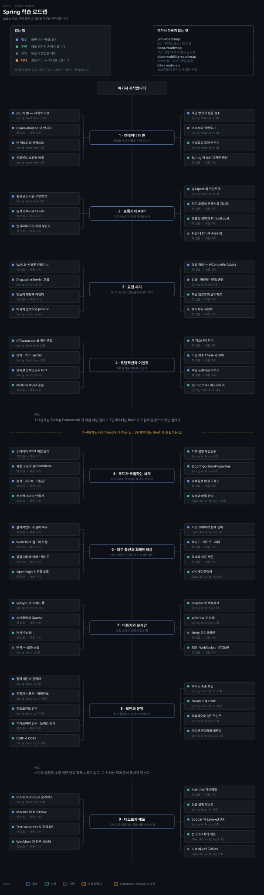
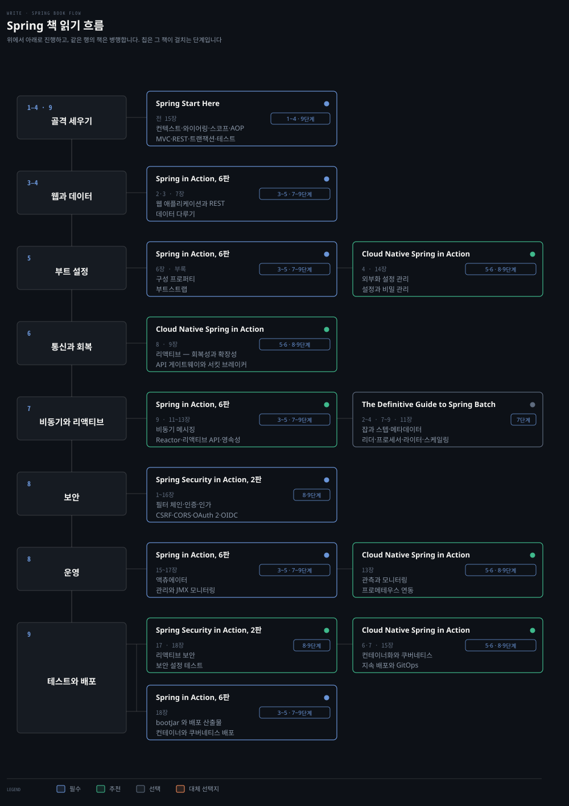

# Spring 학습 로드맵
---

> API 를 만드는 법이 아니라 왜 그렇게 동작하는지를 여는 순서입니다. 컨테이너와 프록시에서 시작해 요청 처리와 트랜잭션을 지나 부트의 자동 구성, 통신과 보안과 운영, 테스트와 배포로 갑니다.

## 학습 순서

> 단계마다 배우는 개념을 묶음으로 갈랐습니다. 자료 위치는 아래 단계별 표가 짚습니다.

| 단계 | 묶음 | 배우는 개념 |
|---|---|---|
| 1 · 컨테이너와 빈 | 등록 | IoC · DI · `BeanDefinition` · `BeanFactory` · `ApplicationContext` · 컴포넌트 스캔 |
| 1 · 컨테이너와 빈 | 조립 | 생성자 주입 · `@Qualifier` · `@Primary` · 순환 참조 · `@Configuration` 프록시 |
| 1 · 컨테이너와 빈 | 수명 | 싱글톤 · 프로토타입 · 웹 스코프 · `@PostConstruct` · 소멸 콜백 · 지연 초기화 |
| 2 · 프록시와 AOP | 등장 배경 | 횡단 관심사 · 필터와 인터셉터의 한계 · 템플릿·콜백 · `ThreadLocal` |
| 2 · 프록시와 AOP | 프록시 | JDK 동적 프록시 · CGLIB · 프록시 팩토리 · 빈 후처리기 · 어드바이저 |
| 2 · 프록시와 AOP | 선언 | `@Aspect` · 포인트컷 표현식 · 어드바이스 다섯 · 자기 호출 문제 · 위빙 네 방식 |
| 3 · 요청 처리 | 토대 | 서블릿 · WAS · 멀티스레드 · 내장 톰캣 · `SpringApplication` |
| 3 · 요청 처리 | 흐름 | `DispatcherServlet` · 핸들러 매핑 · 핸들러 어댑터 · `ArgumentResolver` · 뷰 리졸버 |
| 3 · 요청 처리 | 몸통 | 메시지 컨버터 · Jackson · 멀티파트 · `@JsonView` · 다형성 직렬화 |
| 3 · 요청 처리 | 실패와 변환 | `@ControllerAdvice` · `HandlerExceptionResolver` · 검증 · 데이터 바인딩 · `ConversionService` |
| 4 · 트랜잭션과 이벤트 | 경계 | `@Transactional` 프록시 · `PlatformTransactionManager` · 전파 · 격리 · 동기화 |
| 4 · 트랜잭션과 이벤트 | 영속성 | 영속성 컨텍스트 · 쓰기 지연 · N+1 · 락 · Spring Data 리포지토리 · MyBatis 혼용 |
| 4 · 트랜잭션과 이벤트 | 이벤트 | `@EventListener` · `@TransactionalEventListener` · Phase 넷 · 죽은 트랜잭션 · 보상 |
| 5 · 부트가 조립하는 세계 | 스타터 | 스타터 · BOM · 의존성 버전 관리 · `@AutoConfiguration` · `@Conditional` · 순서와 게이트 |
| 5 · 부트가 조립하는 세계 | 외부 설정 | 설정 우선순위 · `application.yml` · `@ConfigurationProperties` · 프로필 · 비밀 관리 |
| 6 · 외부 통신과 회복탄력성 | 클라이언트 | `RestTemplate` · `RestClient` · `WebClient` · OpenFeign · `@HttpExchange` |
| 6 · 외부 통신과 회복탄력성 | 실패 모델 | 상태 코드 실패 · 무응답 실패 · 타임아웃 · 필터 함수 · `block` 안티패턴 |
| 6 · 외부 통신과 회복탄력성 | 방어 | 서킷 브레이커 · 슬라이딩 윈도우 · 재시도 · 백오프 · 지터 · 격벽 · 속도 제한 |
| 7 · 비동기와 실시간 | 요청 밖 | `@Async` · 스레드 풀 · `@Scheduled` · Quartz · 캐시 추상화 · `@Retryable` |
| 7 · 비동기와 실시간 | 리액티브 | Reactor · 백프레셔 · WebFlux 두 모델 · Netty 채널 파이프라인 · 바이트 버퍼 |
| 7 · 비동기와 실시간 | 밀어 보내기 | SSE · WebSocket 핸드셰이크 · STOMP · 재연결 · 메시지 동기화 |
| 7 · 비동기와 실시간 | 일괄 처리 | 잡 · 스텝 · `JobRepository` · 리더 · 프로세서 · 라이터 · 스케일링 |
| 8 · 보안과 운영 | 인증 | 필터 체인 · `UserDetailsService` · 비밀번호 인코더 · 인증 제공자 |
| 8 · 보안과 운영 | 인가 | 엔드포인트 인가 · 메서드 수준 보안 · CSRF · CORS · OAuth 2 · OIDC |
| 8 · 보안과 운영 | 운영 | 액츄에이터 엔드포인트 · 마이크로미터 · Counter · Gauge · Timer · JMX |
| 9 · 테스트와 배포 | 층 | 테스트 피라미드 · 단위 · 슬라이스 · `@SpringBootTest` · `ApplicationContextRunner` |
| 9 · 테스트와 배포 | 진짜 의존 | Testcontainers · EmbeddedKafka · WireMock · ArchUnit · 보안 설정 테스트 |
| 9 · 테스트와 배포 | 산출물 | `bootJar` 와 plain jar · Boot Loader · Layered JAR · 컨테이너화 · GitOps |

## 책 읽기 흐름

> 위 단계를 무엇으로 배우는가입니다. 통독하는 책은 하나뿐이고 나머지는 부분 독서입니다.

같은 책이 여러 단계에 갈려 걸리므로 행이 단계가 아니라 책의 역할로 묶입니다.

| 책 | 읽을 장 | 우선순위 | 자리 |
|---|---|:---:|---|
| [Spring Start Here](../09_spring/books/spring-start-here/README.md) | 전 15장 | 필수 | 1~4 · 9단계 |
| Spring in Action, 6판 | 2·3 · 6·7 · 9 · 11~18장 | 필수 | 3~5 · 7~9단계 |
| Spring Security in Action, 2판 | 1~18장 | 필수 | 8·9단계 |
| [Cloud Native Spring in Action](../09_spring/books/cloud-native-spring-in-action/README.md) | 4~9 · 13~15장 | 추천 | 5·6 · 8·9단계 |
| The Definitive Guide to Spring Batch | 2~4 · 7~9 · 11장 | 선택 | 7단계 |

공식 문서가 빈칸을 메웁니다. [Spring Framework Reference](https://docs.spring.io/spring-framework/reference/)가 1~4단계, [Spring Boot Reference](https://docs.spring.io/spring-boot/reference/)가 5단계, [Project Reactor](https://projectreactor.io/docs/core/release/reference/)와 [Resilience4j](https://resilience4j.readme.io/docs)가 6·7단계, [Spring Security Reference](https://docs.spring.io/spring-security/reference/)가 8단계를 받칩니다.

**보유 노트가 백 편에 가깝지만 두 축이 비어 있습니다.** Spring Security 와 Bean Validation 은 소장 책만 있고 정독 노트가 없습니다. 그 자리의 `노트` 칸은 비워 두고 책과 공식 문서로 받습니다.

## Framework 가 하는 일 · 1~4단계

> 컨테이너와 프록시와 서블릿과 트랜잭션입니다. Boot 없이도 성립하는 구간입니다.

### 1단계 · 컨테이너와 빈

| 개념 | 우선순위 | 노트 | 책 |
|---|:---:|---|---|
| IoC 와 DI — 제어의 역전 | 필수 | [01-01](../09_spring/01_core/01-01.%EA%B0%9D%EC%B2%B4%EC%A7%80%ED%96%A5%20%EC%9B%90%EB%A6%AC%20%EC%A0%81%EC%9A%A9%20%E2%80%94%20DI%EC%99%80%20IoC.md) | Spring Start Here 2·3장 |
| BeanDefinition 이 먼저다 | 필수 | [01-01](../09_spring/01_core/01-01.%EA%B0%9D%EC%B2%B4%EC%A7%80%ED%96%A5%20%EC%9B%90%EB%A6%AC%20%EC%A0%81%EC%9A%A9%20%E2%80%94%20DI%EC%99%80%20IoC.md) | |
| 빈 팩토리와 컨텍스트 | 필수 | [02](../09_spring/books/spring-start-here/02.Spring%20Context%EC%99%80%20Bean%20%EB%93%B1%EB%A1%9D.md) | Spring Start Here 2장 |
| 컴포넌트 스캔과 등록 | 필수 | [02](../09_spring/books/spring-start-here/02.Spring%20Context%EC%99%80%20Bean%20%EB%93%B1%EB%A1%9D.md) | Spring Start Here 2장 |
| 주입 방식과 순환 참조 | 필수 | [03](../09_spring/books/spring-start-here/03.Bean%20%EC%99%80%EC%9D%B4%EC%96%B4%EB%A7%81%EA%B3%BC%20%EC%9D%98%EC%A1%B4%EC%84%B1%20%EC%A3%BC%EC%9E%85.md) | Spring Start Here 3장 |
| 스코프와 생명주기 | 필수 | [05](../09_spring/books/spring-start-here/05.Bean%20%EC%8A%A4%EC%BD%94%ED%94%84%EC%99%80%20%EC%83%9D%EC%95%A0%EC%A3%BC%EA%B8%B0.md) | Spring Start Here 5장 |
| 추상화로 갈아 끼우기 | 추천 | [04](../09_spring/books/spring-start-here/04.%EC%B6%94%EC%83%81%ED%99%94%EC%99%80%20%EC%9D%98%EC%A1%B4%EC%84%B1%20%EC%A3%BC%EC%9E%85.md) | Spring Start Here 4장 |
| Spring 이 쓰는 디자인 패턴 | 추천 | [01-02](../09_spring/01_core/01-02.Spring%EA%B3%BC%20%EB%94%94%EC%9E%90%EC%9D%B8%20%ED%8C%A8%ED%84%B4.md) | |
| 웹 스코프와 로그인 | 선택 | [09](../09_spring/books/spring-start-here/09.%EC%9B%B9%20%EC%8A%A4%EC%BD%94%ED%94%84%EC%99%80%20%EB%A1%9C%EA%B7%B8%EC%9D%B8.md) | Spring Start Here 9장 |

`@Service` 하나가 언제 설계도가 되고 언제 객체가 되는지를 말할 수 있어야 합니다. 그 답이 **BeanDefinition 을 먼저 만들고 그것으로 조립한다**이고, 뒤 단계의 프록시와 자동 구성이 전부 이 순서 위에 얹힙니다.

### 2단계 · 프록시와 AOP

| 개념 | 우선순위 | 노트 | 책 |
|---|:---:|---|---|
| 횡단 관심사란 무엇인가 | 필수 | [01-01](../09_spring/05_aop/01-01.%ED%9A%A1%EB%8B%A8%20%EA%B4%80%EC%8B%AC%EC%82%AC%EC%99%80%20AOP%20%E2%80%94%20%ED%94%84%EB%A1%9D%EC%8B%9C%EB%A1%9C%20%ED%92%80%EC%96%B4%EB%82%B4%EA%B8%B0.md) | Spring Start Here 6장 |
| 동적 프록시와 CGLIB | 필수 | [01-01](../09_spring/05_aop/01-01.%ED%9A%A1%EB%8B%A8%20%EA%B4%80%EC%8B%AC%EC%82%AC%EC%99%80%20AOP%20%E2%80%94%20%ED%94%84%EB%A1%9D%EC%8B%9C%EB%A1%9C%20%ED%92%80%EC%96%B4%EB%82%B4%EA%B8%B0.md) | |
| 빈 후처리기가 끼워 넣는다 | 필수 | [01-01](../09_spring/05_aop/01-01.%ED%9A%A1%EB%8B%A8%20%EA%B4%80%EC%8B%AC%EC%82%AC%EC%99%80%20AOP%20%E2%80%94%20%ED%94%84%EB%A1%9D%EC%8B%9C%EB%A1%9C%20%ED%92%80%EC%96%B4%EB%82%B4%EA%B8%B0.md) | |
| @Aspect 와 포인트컷 | 필수 | [06](../09_spring/books/spring-start-here/06.Spring%20AOP%EC%99%80%20Aspect.md) | Spring Start Here 6장 |
| 자기 호출이 프록시를 지나침 | 필수 | [01-01](../09_spring/05_aop/01-01.%ED%9A%A1%EB%8B%A8%20%EA%B4%80%EC%8B%AC%EC%82%AC%EC%99%80%20AOP%20%E2%80%94%20%ED%94%84%EB%A1%9D%EC%8B%9C%EB%A1%9C%20%ED%92%80%EC%96%B4%EB%82%B4%EA%B8%B0.md) | |
| 템플릿·콜백과 ThreadLocal | 추천 | [01-03](../09_spring/05_aop/01-03.%ED%85%9C%ED%94%8C%EB%A6%BF%C2%B7%EC%BD%9C%EB%B0%B1%EA%B3%BC%20ThreadLocal%20%E2%80%94%20AOP%20%EB%93%B1%EC%9E%A5%20%EC%A7%81%EC%A0%84%EC%9D%98%20%EB%91%90%20%EC%8B%9C%EB%8F%84.md) | |
| 어노테이션 기반 응용 | 추천 | [01-04](../09_spring/05_aop/01-04.%EC%96%B4%EB%85%B8%ED%85%8C%EC%9D%B4%EC%85%98%20%EA%B8%B0%EB%B0%98%20AOP%20%EC%9D%91%EC%9A%A9%20%E2%80%94%20%40Async%C2%B7%40Cacheable%C2%B7%40Retryable.md) | |
| 위빙 네 방식과 AspectJ | 선택 | | |

프록시를 이해하지 못하면 `@Transactional` 이 왜 같은 클래스 안에서 안 먹는지 설명할 수 없습니다. 이 단계는 **부가기능이 객체 바깥에서 끼어드는 자리**를 손에 쥐는 구간입니다.

### 3단계 · 요청 처리

| 개념 | 우선순위 | 노트 | 책 |
|---|:---:|---|---|
| WAS 와 서블릿 컨테이너 | 필수 | [02-01](../09_spring/01_core/02-01.WAS%EC%99%80%20%EC%84%9C%EB%B8%94%EB%A6%BF%20%E2%80%94%20HTTP%20%EC%B2%98%EB%A6%AC%EC%9D%98%20%ED%86%A0%EB%8C%80.md) | |
| 내장 톰캣과 SpringApplication | 필수 | [02-02](../09_spring/01_core/02-02.%EB%82%B4%EC%9E%A5%20%ED%86%B0%EC%BA%A3%EA%B3%BC%20SpringApplication%20%E2%80%94%20JAR%EB%A1%9C%20WAS%EB%A5%BC%20%ED%92%88%EB%8B%A4.md) | Spring in Action 부록 |
| DispatcherServlet 흐름 | 필수 | [03-01](../09_spring/01_core/03-01.Spring%20MVC%20%E2%80%94%20FrontController%EC%97%90%EC%84%9C%20DispatcherServlet%EA%B9%8C%EC%A7%80.md) | Spring in Action 2장 |
| 핸들러 매핑과 어댑터 | 필수 | [03-01](../09_spring/01_core/03-01.Spring%20MVC%20%E2%80%94%20FrontController%EC%97%90%EC%84%9C%20DispatcherServlet%EA%B9%8C%EC%A7%80.md) | |
| 메시지 컨버터와 Jackson | 필수 | [01-01](../09_spring/02_data-binding/01-01.HTTP%20%EC%9A%94%EC%B2%AD%C2%B7%EC%9D%91%EB%8B%B5%EA%B3%BC%20%EB%A9%94%EC%8B%9C%EC%A7%80%20%EC%BB%A8%EB%B2%84%ED%84%B0.md) | Spring in Action 7장 |
| 예외 처리 — @ControllerAdvice | 필수 | [03-02](../09_spring/01_core/03-02.%EC%98%88%EC%99%B8%20%EC%B2%98%EB%A6%AC%20%E2%80%94%20%EC%84%9C%EB%B8%94%EB%A6%BF%EC%97%90%EC%84%9C%20%40ControllerAdvice%EA%B9%8C%EC%A7%80.md) | |
| 검증 · 바인딩 · 타입 변환 | 필수 | [01-01](../09_spring/02_data-binding/01-01.HTTP%20%EC%9A%94%EC%B2%AD%C2%B7%EC%9D%91%EB%8B%B5%EA%B3%BC%20%EB%A9%94%EC%8B%9C%EC%A7%80%20%EC%BB%A8%EB%B2%84%ED%84%B0.md) | Spring in Action 2장 |
| 파일 업로드와 멀티파트 | 추천 | [01-02](../09_spring/02_data-binding/01-02.%ED%8C%8C%EC%9D%BC%20%EC%97%85%EB%A1%9C%EB%93%9C%20%E2%80%94%20Multipart.md) | |
| JSON 직렬화 심화 | 추천 | [01-03](../09_spring/02_data-binding/01-03.JSON%20%EC%A7%81%EB%A0%AC%ED%99%94%20%EC%8B%AC%ED%99%94%20%E2%80%94%20%EC%BB%A4%EC%8A%A4%ED%85%80%20Serializer%C2%B7%40JsonView%C2%B7%EB%8B%A4%ED%98%95%EC%84%B1.md) | |
| 컨버터 자동 설정 | 추천 | [01-04](../09_spring/02_data-binding/01-04.%EB%A9%94%EC%8B%9C%EC%A7%80%20%EC%BB%A8%EB%B2%84%ED%84%B0%20%EC%9E%90%EB%8F%99%20%EC%84%A4%EC%A0%95%20%E2%80%94%20WebMvcAutoConfiguration%EA%B3%BC%20%EB%93%B1%EB%A1%9D%20%EA%B2%B0%EC%A0%95.md) | |
| REST 서비스 만들고 소비하기 | 필수 | [10](../09_spring/books/spring-start-here/10.REST%20%EC%84%9C%EB%B9%84%EC%8A%A4.md) | Spring Start Here 10·11장 |
| 메시지와 국제화 | 선택 | [03-01](../09_spring/02_data-binding/03-01.%EB%A9%94%EC%8B%9C%EC%A7%80%C2%B7%EA%B5%AD%EC%A0%9C%ED%99%94%20%E2%80%94%20MessageSource%EC%99%80%20LocaleResolver.md) | |

요청 한 건이 소켓에서 컨트롤러 메서드 인자까지 어떤 손을 거치는지 그릴 수 있어야 합니다. **그 그림이 있어야 커스텀 `ArgumentResolver` 를 어디에 끼울지가 보입니다.**

### 4단계 · 트랜잭션과 이벤트

| 개념 | 우선순위 | 노트 | 책 |
|---|:---:|---|---|
| @Transactional 내부 구조 | 필수 | [04-01](../05_data/03_persistence/jpa/04-01.%EC%8A%A4%ED%94%84%EB%A7%81%20%ED%8A%B8%EB%9E%9C%EC%9E%AD%EC%85%98.md) | Spring Start Here 13장 |
| 전파 · 격리 · 동기화 | 필수 | [04-01b](../05_data/03_persistence/jpa/04-01b.%ED%8A%B8%EB%9E%9C%EC%9E%AD%EC%85%98%20%EC%A0%84%ED%8C%8C%20%ED%99%9C%EC%9A%A9.md) | Spring Start Here 13장 |
| 영속성 컨텍스트와 N+1 | 필수 | [03-03](../05_data/03_persistence/jpa/03-03.%ED%94%84%EB%A1%9D%EC%8B%9C%EC%99%80%20N%2B1.md) | Spring in Action 3장 |
| 낙관적 · 비관적 락 | 추천 | [04-02](../05_data/03_persistence/jpa/04-02.%EB%82%99%EA%B4%80%EC%A0%81%20%EB%B9%84%EA%B4%80%EC%A0%81%20%EB%9D%BD.md) | |
| MyBatis 와 JPA 혼용 | 추천 | [07-01](../05_data/03_persistence/jpa/07-01.%EB%8F%84%EA%B5%AC%20%ED%98%BC%EC%9A%A9%20%ED%8C%A8%ED%84%B4.md) | |
| Spring Data 리포지토리 | 추천 | [03-01](../05_data/03_persistence/jpa/03-01.Spring%20Data%20JPA%20%EA%B3%B5%ED%86%B5%20%EC%9D%B8%ED%84%B0%ED%8E%98%EC%9D%B4%EC%8A%A4.md) | Spring Start Here 14장 |
| 두 리스너의 차이 | 필수 | [01-01](../09_spring/06_events/01-01.%EC%8A%A4%ED%94%84%EB%A7%81%20%EC%9D%B4%EB%B2%A4%ED%8A%B8%EC%99%80%20%EB%91%90%20%EB%A6%AC%EC%8A%A4%EB%84%88%20%E2%80%94%20%40EventListener%20vs%20%40TransactionalEventListener.md) | |
| 커밋 전후 Phase 와 전파 | 필수 | [01-03](../09_spring/06_events/01-03.%40TransactionalEventListener%20%EB%82%B4%EB%B6%80%20%EB%8F%99%EC%9E%91%20%EC%9B%90%EB%A6%AC.md) | |
| 죽은 트랜잭션 피하기 | 필수 | [01-02](../09_spring/06_events/01-02.%ED%8A%B8%EB%9E%9C%EC%9E%AD%EC%85%98%20%EC%A0%84%ED%8C%8C%20%EC%A1%B0%ED%95%A9%20%E2%80%94%20%EC%A3%BD%EC%9D%80%20%ED%8A%B8%EB%9E%9C%EC%9E%AD%EC%85%98%EA%B3%BC%20REQUIRES_NEW.md) | |
| 동기와 비동기 이벤트 · 보상 | 추천 | [01-04](../09_spring/06_events/01-04.%EB%8F%99%EA%B8%B0%EC%99%80%20%EB%B9%84%EB%8F%99%EA%B8%B0%20%EC%9D%B4%EB%B2%A4%ED%8A%B8%20%E2%80%94%20%40Async%EC%99%80%20%EB%B3%B4%EC%83%81%20%ED%8A%B8%EB%9E%9C%EC%9E%AD%EC%85%98.md) | |

이벤트를 트랜잭션과 같은 단계에 둔 이유가 있습니다. `@TransactionalEventListener` 는 **커밋 시점에 매달린 콜백**이라, 전파 조합을 모르면 커밋 뒤에 죽은 트랜잭션 위에서 DB 를 건드리게 됩니다.

## Boot 가 조립하는 일 · 5~9단계

> 자동 구성과 통신과 보안과 운영입니다. 여기부터는 애플리케이션을 실제로 굴리는 이야기입니다.

### 5단계 · 부트가 조립하는 세계

| 개념 | 우선순위 | 노트 | 책 |
|---|:---:|---|---|
| 스타터와 BOM 버전 관리 | 필수 | [01-01](../09_spring/07_autoconfig/01-01.%EC%8A%A4%ED%83%80%ED%84%B0%EC%99%80%20%EB%9D%BC%EC%9D%B4%EB%B8%8C%EB%9F%AC%EB%A6%AC%20%EB%B2%84%EC%A0%84%20%EA%B4%80%EB%A6%AC.md) | |
| 자동 구성과 @Conditional | 필수 | [01-02](../09_spring/07_autoconfig/01-02.%EC%9E%90%EB%8F%99%20%EA%B5%AC%EC%84%B1%20%E2%80%94%20%40AutoConfiguration%EA%B3%BC%20%40Conditional.md) | |
| 순서 · 게이트 · 기본값 | 필수 | [01-04](../09_spring/07_autoconfig/01-04.%EC%9E%90%EB%8F%99%20%EA%B5%AC%EC%84%B1%20%EC%8B%AC%ED%99%94%20%E2%80%94%20%EC%88%9C%EC%84%9C%C2%B7%EA%B2%8C%EC%9D%B4%ED%8A%B8%C2%B7%EA%B8%B0%EB%B3%B8%EA%B0%92%20%EC%A3%BC%EC%9E%85.md) | |
| 커스텀 스타터 만들기 | 추천 | [01-03](../09_spring/07_autoconfig/01-03.%EC%BB%A4%EC%8A%A4%ED%85%80%20%EC%8A%A4%ED%83%80%ED%84%B0%20%EB%A7%8C%EB%93%A4%EA%B8%B0.md) | |
| 외부 설정 우선순위 | 필수 | [02-01](../09_spring/07_autoconfig/02-01.%EC%99%B8%EB%B6%80%20%EC%84%A4%EC%A0%95%20%E2%80%94%20%EC%BB%A4%EB%A7%A8%EB%93%9C%EB%9D%BC%EC%9D%B8%EB%B6%80%ED%84%B0%20application.yml%EA%B9%8C%EC%A7%80.md) | Spring in Action 6장 |
| @ConfigurationProperties | 필수 | [02-02](../09_spring/07_autoconfig/02-02.%40ConfigurationProperties%EC%99%80%20%ED%83%80%EC%9E%85%20%EC%95%88%EC%A0%84%20%EC%84%A4%EC%A0%95.md) | Spring in Action 6장 |
| 프로필로 환경 가르기 | 필수 | [02-03](../09_spring/07_autoconfig/02-03.%ED%94%84%EB%A1%9C%ED%95%84%20%E2%80%94%20%ED%99%98%EA%B2%BD%EB%B3%84%20%EC%84%A4%EC%A0%95%20%EB%B6%84%EB%A6%AC.md) | |
| 설정과 비밀 관리 | 추천 | [04](../09_spring/books/cloud-native-spring-in-action/04.%EC%99%B8%EB%B6%80%ED%99%94%20%EC%84%A4%EC%A0%95%20%EA%B4%80%EB%A6%AC.md) | Cloud Native Spring 4·14장 |

자동 구성은 마법이 아니라 **조건이 붙은 `@Bean` 목록**입니다. `--debug` 로 조건 평가 보고서를 열어 무엇이 켜지고 무엇이 밀렸는지 읽을 수 있으면 이 단계는 끝난 것입니다.

### 6단계 · 외부 통신과 회복탄력성

| 개념 | 우선순위 | 노트 | 책 |
|---|:---:|---|---|
| 클라이언트 네 갈래 비교 | 필수 | [01-01](../09_spring/03_network/webflux/01-01.WebClient%20%EC%9E%85%EB%AC%B8%EA%B3%BC%20RestTemplate%C2%B7RestClient%20%EB%B9%84%EA%B5%90.md) | |
| WebClient 빌드와 요청 | 필수 | [01-02](../09_spring/03_network/webflux/01-02.WebClient%20%EB%B9%8C%EB%93%9C%EC%99%80%20%EC%9D%B8%ED%94%84%EB%9D%BC%20%EC%84%A4%EC%A0%95.md) | |
| 응답 처리와 에러 · 재시도 | 필수 | [01-05](../09_spring/03_network/webflux/01-05.%EC%97%90%EB%9F%AC%20%EC%B2%98%EB%A6%AC%EC%99%80%20%EC%9E%AC%EC%8B%9C%EB%8F%84.md) | |
| 필터 함수로 공통 관심사 | 추천 | [01-06](../09_spring/03_network/webflux/01-06.ExchangeFilterFunction.md) | |
| block 안티패턴 | 필수 | [02-02](../09_spring/03_network/webflux/02-02.%EB%8F%99%EA%B8%B0%C2%B7%EB%B9%84%EB%8F%99%EA%B8%B0%20%EA%B2%B0%EC%A0%95%20%28block%20%EC%95%88%ED%8B%B0%ED%8C%A8%ED%84%B4%29.md) | |
| OpenFeign 선언형 호출 | 추천 | [01-02](../09_spring/03_network/feign/01-02.%EA%B8%B0%EB%B3%B8%20%EC%84%A4%EC%A0%95%EA%B3%BC%20%EC%9D%B8%ED%84%B0%ED%8E%98%EC%9D%B4%EC%8A%A4%20%EC%84%A0%EC%96%B8.md) | |
| 상태 코드 실패와 무응답 실패 | 필수 | [01-03](../09_spring/03_network/feign/01-03.%EC%97%90%EB%9F%AC%20%EB%AA%A8%EB%8D%B8%20%E2%80%94%20%EC%83%81%ED%83%9C%20%EC%BD%94%EB%93%9C%20%EC%8B%A4%ED%8C%A8%20vs%20%EB%AC%B4%EC%9D%91%EB%8B%B5%20%EC%8B%A4%ED%8C%A8.md) | |
| Resilience4j 도입 결정 | 필수 | [01-01](../09_spring/03_network/resilience/01-01.Resilience4j%20%EA%B0%9C%EC%9A%94%20%E2%80%94%205%EA%B0%80%EC%A7%80%20%EB%AA%A8%EB%93%88%EA%B3%BC%20%EB%8F%84%EC%9E%85%20%EA%B2%B0%EC%A0%95.md) | |
| 서킷 브레이커 상태 전이 | 필수 | [01-02](../09_spring/03_network/resilience/01-02.Circuit%20Breaker%20%EC%83%81%EC%84%B8%20%E2%80%94%20%EC%83%81%ED%83%9C%20%EC%A0%84%EC%9D%B4%EC%99%80%20Sliding%20Window.md) | Cloud Native Spring 9장 |
| 재시도 · 백오프 · 지터 | 필수 | [01-03](../09_spring/03_network/resilience/01-03.Retry%20%E2%80%94%20exponential%20backoff%C2%B7jitter%C2%B7%EC%9E%AC%EC%8B%9C%EB%8F%84%20%ED%8F%AD%EC%A3%BC%20%EB%B0%A9%EC%A7%80.md) | |
| 격벽과 속도 제한 | 추천 | [01-04](../09_spring/03_network/resilience/01-04.Bulkhead%20%E2%80%94%20Semaphore%20vs%20ThreadPool%20%EA%B2%A9%EB%A6%AC.md) | |
| API 게이트웨이 | 추천 | | Cloud Native Spring 9장 |

호출하는 쪽이 안 죽는 법을 배우는 구간입니다. **재시도를 걸기 전에 그 실패가 재시도해도 되는 실패인지 가르는 것**이 순서상 먼저이고, 그래서 Feign 의 에러 모델이 Resilience4j 앞에 옵니다.

### 7단계 · 비동기와 실시간

| 개념 | 우선순위 | 노트 | 책 |
|---|:---:|---|---|
| @Async 와 스레드 풀 | 필수 | [01-04](../09_spring/05_aop/01-04.%EC%96%B4%EB%85%B8%ED%85%8C%EC%9D%B4%EC%85%98%20%EA%B8%B0%EB%B0%98%20AOP%20%EC%9D%91%EC%9A%A9%20%E2%80%94%20%40Async%C2%B7%40Cacheable%C2%B7%40Retryable.md) | Spring in Action 9장 |
| 스케줄링과 Quartz | 필수 | [01-02](../09_spring/05_aop/01-02.%EC%8A%A4%ED%94%84%EB%A7%81%20%EC%8A%A4%EC%BC%80%EC%A4%84%EB%A7%81%20%E2%80%94%20%40Scheduled%EC%97%90%EC%84%9C%20Quartz%EA%B9%8C%EC%A7%80.md) | |
| 캐시 추상화 | 추천 | [01-04](../09_spring/05_aop/01-04.%EC%96%B4%EB%85%B8%ED%85%8C%EC%9D%B4%EC%85%98%20%EA%B8%B0%EB%B0%98%20AOP%20%EC%9D%91%EC%9A%A9%20%E2%80%94%20%40Async%C2%B7%40Cacheable%C2%B7%40Retryable.md) | |
| Reactor 와 백프레셔 | 추천 | [01-02](../09_spring/03_network/reactive-net/01-02.%EC%9D%B4%EB%B2%A4%ED%8A%B8%20%EA%B8%B0%EB%B0%98%20%ED%94%84%EB%A1%9C%EA%B7%B8%EB%9E%98%EB%B0%8D%EA%B3%BC%20BIO%20vs%20NIO.md) | Spring in Action 11장 |
| WebFlux 두 모델 | 추천 | [04-01](../09_spring/01_core/04-01.WebFlux%20%EC%84%9C%EB%B2%84%20%E2%80%94%20%EB%A6%AC%EC%95%A1%ED%8B%B0%EB%B8%8C%20%EC%8A%A4%ED%83%9D%EA%B3%BC%20%EC%96%B4%EB%85%B8%ED%85%8C%EC%9D%B4%EC%85%98%20%EB%AA%A8%EB%8D%B8.md) | Spring in Action 12장 |
| Netty 파이프라인 | 선택 | [01-04](../09_spring/03_network/reactive-net/01-04.%EC%B1%84%EB%84%90%20%ED%8C%8C%EC%9D%B4%ED%94%84%EB%9D%BC%EC%9D%B8%EA%B3%BC%20%EC%BD%94%EB%8D%B1.md) | |
| SSE 와 신뢰성 | 추천 | [02-01](../09_spring/03_network/realtime/02-01.SSE%20%EC%9B%90%EB%A6%AC%EC%99%80%20Spring%20%EA%B5%AC%ED%98%84.md) | |
| WebSocket 과 STOMP | 추천 | [03-03](../09_spring/03_network/realtime/03-03.WebSocket%20vs%20STOMP.md) | |
| 연결 관리와 재연결 | 추천 | [04-01](../09_spring/03_network/realtime/04-01.%EC%97%B0%EA%B2%B0%20%EA%B4%80%EB%A6%AC%EC%99%80%20%EC%9E%AC%EC%97%B0%EA%B2%B0%20%EC%A0%84%EB%9E%B5.md) | |
| 배치 — 잡과 스텝 | 선택 | | Spring Batch 2~4장 |
| 배치 — 리더 · 프로세서 · 라이터 | 선택 | | Spring Batch 7~9장 |

`@Scheduled` 로 감당이 안 되는 규모가 오면 그때 Spring Batch 를 엽니다. **재시작 가능성과 청크 단위 커밋이 필요해진 순간**이 그 경계이고, 그 전까지는 소장본을 덮어 둡니다.

### 8단계 · 보안과 운영

| 개념 | 우선순위 | 노트 | 책 |
|---|:---:|---|---|
| 필터 체인이 먼저다 | 필수 | | Spring Security 5장 |
| 인증과 사용자 · 비밀번호 | 필수 | | Spring Security 3·4·6장 |
| 엔드포인트 인가 | 필수 | | Spring Security 7·8장 |
| CSRF 와 CORS | 추천 | | Spring Security 9·10장 |
| 메서드 수준 보안 | 추천 | | Spring Security 11·12장 |
| OAuth 2 와 OIDC | 추천 | | Spring Security 13~16장 |
| 액츄에이터 엔드포인트 | 필수 | [01-01](../06_observability/05_SpringActuator/01-01.%EC%95%A1%EC%B8%84%EC%97%90%EC%9D%B4%ED%84%B0%20%E2%80%94%20%EC%9A%B4%EC%98%81%20%EC%97%94%EB%93%9C%ED%8F%AC%EC%9D%B8%ED%8A%B8.md) | Spring in Action 15장 |
| 마이크로미터와 메트릭 | 필수 | [01-02](../06_observability/05_SpringActuator/01-02.%EB%A7%88%EC%9D%B4%ED%81%AC%EB%A1%9C%EB%AF%B8%ED%84%B0%EC%99%80%20%EB%A9%94%ED%8A%B8%EB%A6%AD%20%E2%80%94%20Counter%C2%B7Gauge%C2%B7Timer.md) | Spring in Action 16·17장 |
| 프로메테우스 연동 | 추천 | [01-03](../06_observability/05_SpringActuator/01-03.%ED%94%84%EB%A1%9C%EB%A9%94%ED%85%8C%EC%9A%B0%EC%8A%A4%C2%B7%EA%B7%B8%EB%9D%BC%ED%8C%8C%EB%82%98%20%EC%97%B0%EB%8F%99.md) | Cloud Native Spring 13장 |

보안은 이 로드맵에서 **노트가 한 편도 없는 유일한 축**입니다. 소장본이 열여덟 장짜리 단행본 하나뿐이라 책과 공식 문서로만 받고, 정독 노트를 쓰면 그때 이 표의 `노트` 칸을 채웁니다.

### 9단계 · 테스트와 배포

| 개념 | 우선순위 | 노트 | 책 |
|---|:---:|---|---|
| 테스트 피라미드와 슬라이스 | 필수 | [01-01](../09_spring/04_testing/01-01.%ED%85%8C%EC%8A%A4%ED%8A%B8%20%ED%94%BC%EB%9D%BC%EB%AF%B8%EB%93%9C%EC%99%80%20Spring%20%ED%85%8C%EC%8A%A4%ED%8A%B8%20%EC%A2%85%EB%A5%98.md) | Spring Start Here 15장 |
| JUnit 5 와 AssertJ | 필수 | [01-02](../09_spring/04_testing/01-02.JUnit%205%20%2B%20AssertJ%EB%A1%9C%20%EB%8B%A8%EC%9C%84%20%ED%85%8C%EC%8A%A4%ED%8A%B8%20%EC%9E%91%EC%84%B1.md) | |
| Mockito 와 MockMvc | 필수 | [01-03](../09_spring/04_testing/01-03.Mockito%EC%99%80%20MockMvc%20%EC%8A%AC%EB%9D%BC%EC%9D%B4%EC%8A%A4.md) | |
| @SpringBootTest 와 컨텍스트 러너 | 필수 | [01-04](../09_spring/04_testing/01-04.%40SpringBootTest%EC%99%80%20ApplicationContextRunner.md) | |
| Testcontainers 로 진짜 DB | 필수 | [02-01](../09_spring/04_testing/02-01.Testcontainers%EC%99%80%20%EC%A7%84%EC%A7%9C%20DB%20%ED%86%B5%ED%95%A9%20%ED%85%8C%EC%8A%A4%ED%8A%B8.md) | |
| 메시징 테스트 | 추천 | [02-02](../09_spring/04_testing/02-02.EmbeddedKafka%C2%B7Testcontainers%EB%A1%9C%20%EB%A9%94%EC%8B%9C%EC%A7%95%20%ED%85%8C%EC%8A%A4%ED%8A%B8.md) | |
| ArchUnit 가드레일 | 추천 | [02-03](../09_spring/04_testing/02-03.ArchUnit%EC%9C%BC%EB%A1%9C%20%EC%95%84%ED%82%A4%ED%85%8D%EC%B2%98%20%EA%B0%80%EB%93%9C%EB%A0%88%EC%9D%BC.md) | |
| WireMock 과 외부 시스템 | 추천 | [02-04](../09_spring/04_testing/02-04.WireMock%EA%B3%BC%20%EC%99%B8%EB%B6%80%20%EC%8B%9C%EC%8A%A4%ED%85%9C%20E2E.md) | |
| 보안 설정 테스트 | 추천 | | Spring Security 18장 |
| bootJar 와 Layered JAR | 필수 | [02-02](../09_spring/01_core/02-02.%EB%82%B4%EC%9E%A5%20%ED%86%B0%EC%BA%A3%EA%B3%BC%20SpringApplication%20%E2%80%94%20JAR%EB%A1%9C%20WAS%EB%A5%BC%20%ED%92%88%EB%8B%A4.md) | Spring in Action 18장 |
| 컨테이너화와 쿠버네티스 | 추천 | [06](../09_spring/books/cloud-native-spring-in-action/06.Spring%20Boot%20%EC%BB%A8%ED%85%8C%EC%9D%B4%EB%84%88%ED%99%94.md) | Cloud Native Spring 6·7장 |
| 지속 배포와 GitOps | 선택 | | Cloud Native Spring 15장 |

테스트를 마지막에 둔 것은 덜 중요해서가 아닙니다. **무엇을 격리하고 무엇을 진짜로 띄울지 고르려면 앞 여덟 단계의 경계를 알아야** 하기 때문이고, 그래서 슬라이스 테스트가 1단계가 아니라 여기 있습니다.

## 손으로 확인하는 실습

> 노트 안에 실제로 있는 실습 자리만 적습니다. 지어낸 출처를 채우지 않았습니다.

| 출처 | 단계 | 무엇 |
|---|:---:|---|
| [내장 톰캣과 SpringApplication](../09_spring/01_core/02-02.%EB%82%B4%EC%9E%A5%20%ED%86%B0%EC%BA%A3%EA%B3%BC%20SpringApplication%20%E2%80%94%20JAR%EB%A1%9C%20WAS%EB%A5%BC%20%ED%92%88%EB%8B%A4.md) | 3·9 | `bootJar` 를 풀어 안에 무엇이 들었는지 확인 |
| [Netty 컴포넌트와 서버 구현](../09_spring/03_network/reactive-net/01-06.Netty%20%EC%BB%B4%ED%8F%AC%EB%84%8C%ED%8A%B8%EC%99%80%20%EC%84%9C%EB%B2%84%20%EA%B5%AC%ED%98%84.md) | 7 | 서버를 직접 세워 채널 파이프라인이 도는 것을 보기 |
| [Netty 클라이언트 구현](../09_spring/03_network/reactive-net/01-07.Netty%20%ED%81%B4%EB%9D%BC%EC%9D%B4%EC%96%B8%ED%8A%B8%20%EA%B5%AC%ED%98%84.md) | 7 | 같은 파이프라인을 클라이언트 쪽에서 다시 짜기 |
| [WebClient 테스트](../09_spring/03_network/webflux/02-03.%ED%85%8C%EC%8A%A4%ED%8A%B8%20%28MockWebServer%EC%99%80%20WebTestClient%29.md) | 6·9 | MockWebServer 로 응답을 조작해 재시도 동작 확인 |
| [Testcontainers 와 진짜 DB](../09_spring/04_testing/02-01.Testcontainers%EC%99%80%20%EC%A7%84%EC%A7%9C%20DB%20%ED%86%B5%ED%95%A9%20%ED%85%8C%EC%8A%A4%ED%8A%B8.md) | 9 | 컨테이너 DB 를 띄워 트랜잭션 경계를 실제로 밟기 |
| [ArchUnit 가드레일](../09_spring/04_testing/02-03.ArchUnit%EC%9C%BC%EB%A1%9C%20%EC%95%84%ED%82%A4%ED%85%8D%EC%B2%98%20%EA%B0%80%EB%93%9C%EB%A0%88%EC%9D%BC.md) | 9 | 계층 의존 규칙을 일부러 어겨 실패를 확인 |
| [TPS 메시징 플로우 종합 E2E](../09_spring/04_testing/02-05.TPS%20%EB%A9%94%EC%8B%9C%EC%A7%95%20%ED%94%8C%EB%A1%9C%EC%9A%B0%20%EC%A2%85%ED%95%A9%20E2E.md) | 9 | 실제 업무 흐름 하나를 끝에서 끝까지 세우기 |

**실무 사례 한 편이 6단계에 붙습니다.** [WebClient 로 결재 URL 어댑터를 만든 기록](../09_spring/03_network/webflux/02-04.%EC%8B%A4%EB%AC%B4%20%EC%82%AC%EB%A1%80%20-%20TPS%20ApprovalUrlAdapter.md)은 앞의 여섯 편을 한 어댑터에 모은 자리라, 개념을 다 읽은 뒤 마지막에 폅니다.

## 로드맵에 넣지 않은 것

> 다른 문서가 정본이거나 이 로드맵의 축과 다른 것들입니다.

| 대상 | 이유 |
|---|---|
| GC · 클래스 로딩 · 힙 덤프 | [JVM 로드맵](jvm-roadmap.md)이 맡습니다. Spring 이 느린 것과 JVM 이 멈춘 것은 다른 층입니다 |
| SQL 실행 계획 · 인덱스 · 분산 일관성 | [데이터 로드맵](data-roadmap.md)이 맡습니다. 4단계는 트랜잭션 경계까지만 봅니다 |
| PromQL · SLO · 알림 설계 | [관측 가능성 로드맵](observability-roadmap.md)이 맡습니다. 8단계는 내보내는 쪽만 봅니다 |
| 쿠버네티스 오브젝트와 내부 구조 | [Kubernetes 로드맵](k8s-roadmap.md)이 맡습니다. 9단계는 배포 산출물까지입니다 |
| Kafka 프로듀서 · 컨슈머 설계 | `04_messaging` 이 정본입니다. `@KafkaListener` 는 그 주제 축 안에 둡니다 |
| QueryDSL 과 동적 쿼리 | `05_data/03_persistence/querydsl` 이 정본입니다 |
| 뷰 템플릿과 서버 렌더링 | Thymeleaf 로 화면을 그리는 축은 다룰 일이 없습니다. 3단계는 REST 응답까지입니다 |
| XML 설정과 레거시 마이그레이션 | 소장본에 부록으로 있지만 새로 쓸 일이 없습니다 |
| 비관계형 데이터 · Spring Integration · RSocket | Spring in Action 4·10·14장입니다. 쓰게 될 때 그 장만 폅니다 |
| GraalVM 네이티브 이미지와 Knative | Cloud Native Spring 16장입니다. 기동 시간이 문제가 되면 엽니다 |

## 경계

> 이 문서가 정하는 것과 인접 문서에 넘기는 것입니다.

이 문서는 **Spring 이 왜 그렇게 동작하는지를 여는 순서**를 정합니다. 프레임워크 자체의 동작이 대상이고, 그 위에 올라가는 도메인 기술은 각 주제 카테고리가 맡습니다. 자료가 여러 카테고리에 흩어져 있어도 순서는 여기 하나로 모읍니다.

**절단선을 4단계 뒤에 그었습니다.** 1~4단계는 Spring Framework 가 직접 하는 일이라 Boot 없이도 성립하고, 5단계부터는 Boot 가 그 부품을 조립해 운영으로 잇습니다. 부트부터 배운 사람이 컨테이너를 모르는 채로 자동 구성을 읽으면 조건 평가 보고서가 무엇을 말하는지 알 수 없습니다.

맞닿는 문서가 넷입니다. 런타임 아래층은 [JVM 로드맵](jvm-roadmap.md)이, 저장소 쪽은 [데이터 로드맵](data-roadmap.md)이, 지표를 받아 보는 쪽은 [관측 가능성 로드맵](observability-roadmap.md)이, 배포 대상 클러스터는 [Kubernetes 로드맵](k8s-roadmap.md)이 맡습니다.

**같은 증상을 네 문서가 다른 층에서 봅니다.** 응답이 느려졌을 때 이 문서는 커넥션 풀과 트랜잭션 범위와 N+1 을 보고, JVM 로드맵은 GC 정지를, 데이터 로드맵은 실행 계획을, 관측 가능성 로드맵은 지표 분포와 에러 버짓을 봅니다.
