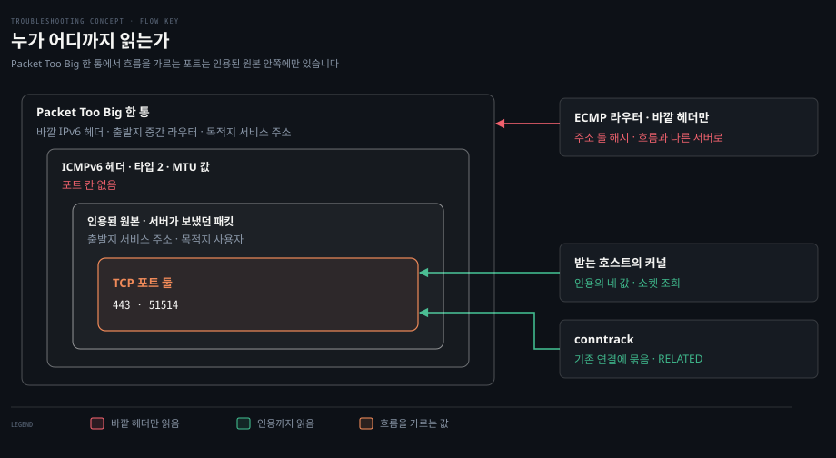

# 흐름을 가르는 다섯 값

---

> 패킷 하나가 어느 연결의 것인지는 출발지·목적지 주소, 프로토콜, 두 포트로 가립니다. 이 값을 바깥 헤더에 싣지 않은 패킷은 읽는 쪽이 어디까지 들여다보느냐에 따라 흐름과 함께 가기도 하고 따로 떨어지기도 합니다.

## 이 노트가 있는 이유

> 두 문항이 같은 값에 걸렸는데 문항마다 다른 이름으로 나왔습니다.

2026-09-12 B 에서는 SNAT 포트 배정과 conntrack 장부로 나왔고, 2026-09-14 A 에서는 ECMP 해시와 Packet Too Big 으로 나왔습니다. 겉은 달라도 두 문항의 급소는 같습니다. 패킷을 어느 흐름으로 알아보는가입니다.

A 회차에서 "목적지 IP 가 같으니 같은 서버로 가지 않나"에서 멈춘 것이 그 증거입니다. 무엇이 흐름을 가르는지, 그리고 그 값을 바깥 헤더에 안 싣는 패킷이 있다는 것 둘이 비어 있었습니다. 그래서 이 노트는 값 다섯을 누가 쓰는지부터 묻고, 그 값이 없는 패킷이 어디서 어긋나는지로 내려갑니다.


## 다섯 값을 쓰는 곳은 셋입니다

> 한 연결에 속한 패킷이 수십 개 오가는 동안, 받는 호스트와 conntrack 과 ECMP 라우터는 패킷마다 어느 흐름의 것인지 정해야 합니다.

연결 하나가 핸드셰이크와 데이터 왕복과 종료를 거치면 패킷이 수십 개입니다. 그 패킷들이 한 연결의 것이라는 표시는 패킷 안에 따로 없습니다. 셋이 모두 헤더의 같은 값으로 알아봅니다.

| 쓰는 곳 | 무엇을 하려고 | 값이 어긋나면 |
|--------|-------------|-------------|
| 받는 호스트의 소켓 조회 | 세그먼트를 맞는 소켓에 넘깁니다 | 맞는 소켓이 없어 버리거나 리셋합니다 |
| conntrack · SNAT | 흐름마다 상태와 주소 변환을 기억합니다 | 같은 값의 흐름이 둘이면 장부에 못 들어갑니다 |
| ECMP 해시 | 한 흐름을 다음 홉 하나에 고정합니다 | 흐름이 서버 사이로 흩어집니다 |

### 받는 호스트는 소켓을 찾습니다

리눅스 TCP 는 들어온 세그먼트의 출발지·목적지 주소와 두 포트로 연결된 소켓을 찾습니다. 프로토콜은 그 앞에서 이미 쓰였습니다. IP 헤더의 다음 헤더 값이 TCP 처리기를 고르므로, 소켓 조회는 TCP 표 안에서만 일어납니다.

### conntrack 과 SNAT 은 장부를 씁니다

conntrack 장부의 한 줄에는 방향마다 주소·프로토콜·포트가 들어 있습니다. `iptables-extensions(8)` 의 conntrack 매치가 그 구조를 드러냅니다. `--ctproto` 와 함께 `--ctorigsrc`·`--ctreplsrc`·`--ctorigsrcport`·`--ctrepldstport` 처럼 원래 방향과 응답 방향의 값을 따로 고르게 합니다.

SNAT 은 이 장부 위에서 돕니다. 같은 man 페이지는 SNAT 이 출발지 주소를 바꾸면 그 연결의 뒤따르는 패킷도 모두 같게 바뀐다고 적습니다. 포트는 가능한 한 바꾸지 않는다고도 적습니다.

주소 여럿이 노드 IP 하나로 모이면 주소로는 흐름을 못 가르므로 남은 칸인 포트로 가릅니다. [정확히 1초씩 늦는 요청](../kubernetes/2026-09-12_%EC%A0%95%ED%99%95%ED%9E%88%201%EC%B4%88%EC%94%A9%20%EB%8A%A6%EB%8A%94%20%EC%9A%94%EC%B2%AD.md)이 그 포트를 두 흐름이 동시에 집어 장부에 못 들어간 사건이었습니다.

### ECMP 는 다음 홉을 고정합니다

비용이 같은 경로가 여럿일 때 라우터는 흐름을 가리키는 헤더 값을 해시해 다음 홉을 고릅니다. 무엇으로 흐름을 가리킬지는 정해져 있지 않습니다. [RFC 2991](https://www.rfc-editor.org/rfc/rfc2991.txt) §3 은 목적지 주소 하나일 수도, 출발지·목적지·프로토콜 셋일 수도 있다고 적습니다.

[RFC 6438](https://www.rfc-editor.org/rfc/rfc6438.txt) §1.1 은 두 쪽의 이유를 댑니다. 주소 둘만으로도 순서 뒤섞임을 막기에는 충분합니다. 그래도 많은 구현이 프로토콜과 포트 둘을 더한 다섯 값을 씁니다. 연결마다 달라지는 임시 포트가 해시를 고르게 퍼뜨리기 때문입니다.

리눅스를 라우터로 쓸 때는 이 선택이 sysctl 하나입니다. 커널 문서의 `fib_multipath_hash_policy` 는 기본값 0 이 주소 기준의 L3 이고, 1 이 다섯 값의 L4 입니다.

```bash
sysctl net.ipv4.fib_multipath_hash_policy net.ipv6.fib_multipath_hash_policy
```


## 같은 흐름은 같은 곳에 가야 합니다

> 패킷마다 경로를 고르면 순서가 뒤섞이고, 연결 상태가 없는 곳에 세그먼트가 떨어집니다.

패킷마다 경로를 따로 고르면 무엇이 깨질까요? 하나는 순서입니다. [RFC 2991](https://www.rfc-editor.org/rfc/rfc2991.txt) §2 에 따르면 경로마다 지연이 다르면 한 흐름의 패킷이 뒤바뀐 순서로 도착합니다. 늦은 패킷보다 뒤 패킷이 셋 이상 먼저 오면 TCP 는 빠른 재전송에 들어가 필요 없는 재전송에 대역폭을 씁니다. 같은 절은 경로마다 MTU 가 다르면 경로 MTU 가 패킷마다 바뀌어 경로 MTU 발견이 쓸모없어진다고도 적습니다.

다른 하나는 상태입니다. 연결의 소켓은 연결을 받은 기계에만 있고, conntrack 줄은 그 흐름이 지난 장비에만 있습니다. 다음 홉이 서로 다른 서버라면 순서보다 먼저 연결이 갈립니다. 상태 없는 서버에 세그먼트가 떨어지는 모양은 [AS 안과 AS 사이](../../02_os/book/cntd_computer-networking-top-down/05-02.AS%20%EC%95%88%EA%B3%BC%20AS%20%EC%82%AC%EC%9D%B4.md) §5 의 애니캐스트와 같습니다.


## 바깥 헤더에 포트가 없는 패킷

> 흐름에 속하면서도 바깥 헤더만으로는 어느 흐름인지 드러나지 않는 패킷이 있습니다. ICMP 오류와 IP 비선두 조각이 그렇고, 터널은 안쪽 흐름 전부를 바깥 헤더 하나로 덮습니다.

### ICMP 오류는 원본 앞부분을 인용합니다

라우터가 우리 패킷을 버리며 알림을 보낼 때, 알림은 원래 흐름의 한 조각이 아니라 라우터가 새로 만든 패킷입니다. 그래서 바깥 헤더의 값이 원래 흐름과 다릅니다.

[RFC 4443](https://www.rfc-editor.org/rfc/rfc4443.txt) §3.2 에서 Packet Too Big 의 목적지는 원래 패킷의 출발지를 그대로 옮긴 것입니다. 출발지는 §2.2 대로 알림을 만든 노드 자신의 유니캐스트 주소입니다. 포트는 ICMPv6 헤더에 칸이 없고, §2.4 (c) 가 요구하는 인용, 곧 원래 패킷을 최소 IPv6 MTU 를 넘지 않는 만큼 담은 부분 안에만 있습니다.

| | 서버가 보낸 원래 패킷 | 경로 중간 라우터가 만든 Packet Too Big |
|---|---|---|
| 출발지 주소 | 서비스 주소 | 경로 중간 라우터 |
| 목적지 주소 | 사용자 | 서비스 주소 |
| 프로토콜 | TCP | ICMPv6 |
| 포트 둘 | `443` · `51514` | 없음. 인용 안에만 있음 |

인용 안의 값은 방향도 뒤집혀 있습니다. 인용된 것은 **우리가 보낸** 패킷이라, 같은 흐름에서 들어오는 패킷과 출발지·목적지가 서로 바뀌어 있습니다. [RFC 7690](https://www.rfc-editor.org/rfc/rfc7690.txt) §4 가 라우터 개선안으로 인용을 해시하되 원소 순서를 흐름의 들어오는 방향에 맞춰 바꾸자고 적은 이유입니다. IPv4 알림이 원본을 실제로 어디까지 담는지는 [5장 실습](../../02_os/book/cntd_computer-networking-top-down/05-04.%EC%8B%A4%EC%8A%B5%20-%20traceroute%C2%B7ICMP%C2%B7%ED%9D%90%EB%A6%84%20%ED%91%9C%EB%A5%BC%20%EC%86%90%EC%9C%BC%EB%A1%9C%20%ED%99%95%EC%9D%B8%ED%95%A9%EB%8B%88%EB%8B%A4.md) §2 가 트레이스로 보였습니다.

### IP 비선두 조각에는 포트가 없습니다

패킷이 조각나면 전송 계층 헤더는 첫 조각에만 실립니다. [RFC 2991](https://www.rfc-editor.org/rfc/rfc2991.txt) §3 은 이 때문에 다음 홉 선택에 전송 계층 정보를 넣는 것이 문제가 될 수 있다고 적고, [RFC 6438](https://www.rfc-editor.org/rfc/rfc6438.txt) §1.1 도 IP 조각과 암호화된 트래픽을 같은 예로 듭니다. 두 번째 조각에 포트도 VXLAN 표식도 없는 캡처는 [작은 것은 되고 큰 것만 멎는다](../../02_os/book/network-fundamentals-lab/06-01.%EC%9E%91%EC%9D%80%20%EA%B2%83%EC%9D%80%20%EB%90%98%EA%B3%A0%20%ED%81%B0%20%EA%B2%83%EB%A7%8C%20%EB%A9%8E%EB%8A%94%EB%8B%A4.md) §4 에 있습니다.

다섯 값으로 해시하는 장비가 첫 조각과 나머지 조각을 어떻게 한 흐름으로 묶는지는 *(미정)* 입니다. 구현마다 다를 것으로 보이고, 1차 자료로 확인한 장비가 아직 없습니다.

### 터널은 안쪽 흐름을 바깥 헤더 하나로 덮습니다

반대 방향의 어긋남도 있습니다. RFC 6438 §1.1 은 터널 끝점 A 에서 B 로 가는 IP-in-IP 터널을 예로 듭니다. 터널 안의 모든 패킷은 바깥 출발지가 A, 목적지가 B 이고 포트와 프로토콜도 같을 가능성이 높습니다.

이때 거의 모든 하드웨어는 가장 바깥 IP 헤더로만 흐름을 알아보므로, 다섯 값의 해시가 상수가 되어 부하가 한 경로에 몰립니다. ICMP 오류가 흐름에서 **떨어져 나가는** 경우라면, 터널은 서로 다른 흐름이 **한데 묶이는** 경우입니다. RFC 6438 은 그 해법으로 터널 입구가 바깥 IPv6 헤더의 흐름 레이블을 채우자고 제안합니다.


## 쓰는 쪽마다 처리가 갈립니다

> 받는 호스트와 conntrack 은 ICMP 오류의 인용을 열어 원래 흐름을 찾고, ECMP 라우터는 보통 바깥 헤더만 봅니다. 같은 알림이 한쪽에서는 제자리를 찾고 다른 쪽에서는 엉뚱한 곳으로 갑니다.



겹 상자가 알림 한 통이고 가장 안쪽이 포트입니다. 오른쪽 셋의 화살표가 끝나는 겹이 그쪽이 읽는 깊이이며, 바깥 겹에서 멈춘 것은 ECMP 라우터뿐입니다.

### 받는 호스트는 인용에서 상위 프로토콜을 꺼냅니다

[RFC 4443](https://www.rfc-editor.org/rfc/rfc4443.txt) §2.4 (d) 는 오류를 상위 프로세스에 넘겨야 할 때 인용된 원본에서 상위 프로토콜 종류를 꺼내 처리기를 고르라고 요구합니다. 꺼낼 수 없으면 IPv6 층 처리 뒤에 조용히 버립니다.

리눅스가 그대로 합니다. `net/ipv6/icmp.c` 의 `icmpv6_notify` 는 인용된 IPv6 헤더의 다음 헤더 값으로 처리기를 고릅니다. TCP 처리기 `tcp_v6_err` 는 인용의 주소와 포트로 연결된 소켓을 찾고, 없으면 `Icmp6InErrors` 를 올린 뒤 끝냅니다. 타입별 카운터 `Icmp6InPktTooBigs` 는 이 조회보다 앞서 오르므로, 연결이 없는 서버에서도 오릅니다.

### conntrack 은 기존 연결에 묶습니다

`iptables-extensions(8)` 의 conntrack 상태 설명에서 `RELATED` 는 "새 연결을 시작하지만 기존 연결과 연관된 패킷"이고, 그 예로 FTP 데이터 전송과 **ICMP 오류**를 듭니다. `state` 매치도 같은 상태 이름을 씁니다.

어떻게 연관을 찾는지는 man 페이지에 없어 소스로 확인했습니다. `net/netfilter/nf_conntrack_proto_icmp.c` 의 `nf_conntrack_inet_error` 는 ICMP 헤더 뒤의 인용 패킷으로 튜플을 만들고, 뒤집어 기존 연결을 찾습니다. 찾은 연결의 목적지가 바깥 헤더의 목적지와 같을 때만 `RELATED` 로 표시합니다.

### ECMP 라우터는 보통 바깥 헤더만 해시합니다

[RFC 7690](https://www.rfc-editor.org/rfc/rfc7690.txt) §2 는 흐름을 해시로 나누는 앞단에서 인용 안의 헤더가 전달 결정에 쓰이지 않는다고 적습니다. 그래서 알림이 흐름과 같은 다음 홉으로 해시될 가능성이 낮습니다. §4 는 인용까지 파싱하는 구현이 저자들이 아는 한 2016년 당시 라우터·스위치·부하 분산기에 없었다고 적습니다.

같은 일을 호스트 쪽 도구가 하는 자리는 있습니다. `iptables-extensions(8)` 의 `HMARK` 타깃은 패킷 값을 해시해 표식을 붙이는데, man 페이지는 ICMP 오류를 들여다보고 그 내용으로 해시한다고 적습니다.

리눅스를 ECMP 라우터로 쓸 때 ICMP 오류를 해시에서 어떻게 다루는지는 *(미정)* 입니다. `fib_multipath_hash_policy` 문서는 정책 이름만 적고 ICMP 오류를 언급하지 않습니다.

| 읽는 쪽 | 읽는 깊이 | 알림의 결과 | 근거 |
|--------|---------|-----------|------|
| 받는 호스트의 커널 | 인용된 포트까지 | 연결이 있으면 그 소켓에 전달 | RFC 4443 §2.4, 리눅스 소스 |
| conntrack | 인용된 포트까지 | 기존 연결의 `RELATED` | man 페이지, 리눅스 소스 |
| ECMP 라우터 | 바깥 주소 | 흐름과 다른 다음 홉일 수 있음 | RFC 7690 §2 |

해결의 방향도 이 표에서 나옵니다. 라우터가 인용을 읽게 하거나, 읽는 장치를 앞에 두거나, 알림을 모든 다음 홉에 뿌려 읽을 수 있는 쪽이 고르게 합니다. 셋이 무엇을 대가로 치르는지는 다음 절에서 봅니다.


## 줄이라는 알림이 연결을 못 찾아가는 길

> 위의 조각을 한 줄로 잇습니다. 크기를 넘은 패킷은 버려지고 알림이 돌아오지만, 흐름을 나누는 앞단이 알림을 연결 없는 서버로 보내면 연결을 가진 서버는 끝내 크기를 줄이지 못합니다.


같은 주소를 서버 여럿이 나눠 받고, 앞단 라우터가 흐름을 해시로 나누는 구성에서 일어납니다. 그림의 번호를 따라갑니다.

| 걸음 | 무엇이 일어나나 | 어긋나는 까닭 |
|---|---|---|
| 1 | 사용자와 서버 2 의 TCP 흐름이 해시로 서버 2 에 고정됩니다 | 여기까지는 정상입니다 |
| 2 | 서버 2 의 큰 패킷이 MTU 가 작은 구간 앞에서 버려집니다 | IPv6 라우터는 쪼개지 않습니다. 겉에 헤더를 붙이는 터널 입구가 흔한 자리입니다 |
| 3 | 그 라우터가 Packet Too Big 을 서비스 주소로 돌려보냅니다 | 알림은 라우터가 새로 만든 패킷이라 출발지가 라우터이고, 헤더에 포트 칸이 없습니다 |
| 4 | 앞단 라우터가 알림을 바깥 주소로만 해시해 서버 1 로 보냅니다 | 포트는 인용 안에만 있고, 라우터는 인용을 읽지 않습니다 |
| 5 | 서버 1 의 커널은 인용을 열어 소켓을 찾지만 없어서 알림을 버립니다 | 연결 상태는 서버 2 에만 있습니다 |
| 6 | 서버 2 는 경로 MTU 를 낮추지 못하고 같은 크기로 재전송합니다 | 알림이 방화벽에 막힌 블랙홀과 결과가 같습니다 |

"포트가 없어서 연결을 못 찾는다"는 말은 둘로 나눠야 정확합니다. 알림을 엉뚱한 서버로 보낸 것은 바깥 헤더만 보는 **라우터의 해시**입니다. 서버는 인용을 열어 포트까지 읽을 수 있고, 서버 1 이 못 찾은 까닭은 그 연결이 거기 없어서입니다.

겉으로 보이는 증상은 경로 중간 방화벽이 ICMP 를 막는 블랙홀과 같습니다. 알림이 데이터센터까지 오는지, 온다면 어느 서버에서 `Icmp6InPktTooBigs` 가 오르는지를 서버마다 견줘야 둘이 갈립니다. 서버별로 치는 명령은 [무엇을 보려면 무엇을 치는가](./common-%EB%AC%B4%EC%97%87%EC%9D%84-%EB%B3%B4%EB%A0%A4%EB%A9%B4-%EB%AC%B4%EC%97%87%EC%9D%84-%EC%B9%98%EB%8A%94%EA%B0%80.md) 에 있습니다.

교과서 쪽 사정도 적어 둡니다. 《Computer Networking: A Top-Down Approach》 9판은 ECMP 를 흐름 단위의 무작위 다음 홉 선택까지만 적습니다. ICMP 오류가 어떻게 해시되는지는 다루지 않습니다. 책의 흐름에서 이 자리에 가장 가까운 곳은 [데이터센터와 웹 페이지 하나의 하루](../../02_os/book/cntd_computer-networking-top-down/06-05.%EB%8D%B0%EC%9D%B4%ED%84%B0%EC%84%BC%ED%84%B0%EC%99%80%20%EC%9B%B9%20%ED%8E%98%EC%9D%B4%EC%A7%80%20%ED%95%98%EB%82%98%EC%9D%98%20%ED%95%98%EB%A3%A8.md) §3 이고, 알림이 끝내 오지 않을 때의 블랙홀은 [IPv6 와 일반화 포워딩](../../02_os/book/cntd_computer-networking-top-down/04-04.IPv6%20%EC%99%80%20%EC%9D%BC%EB%B0%98%ED%99%94%20%ED%8F%AC%EC%9B%8C%EB%94%A9.md) §3 입니다.

### 막는 방법은 읽는 깊이를 맞추는 것입니다

[RFC 7690](https://www.rfc-editor.org/rfc/rfc7690.txt) §3 의 완화책 셋은 앞 절 표의 읽는 깊이 차이를 메우는 세 방향입니다.

| 완화책 | 하는 일 | 대가 |
|---|---|---|
| 인용 안의 흐름 값으로 해시 | 라우터가 ICMPv6 적재량 안의 TCP 흐름 값을 꺼내 해시합니다 | 그만큼 깊이 파싱하는 하드웨어가 필요합니다. §4 는 저자들이 아는 한 2016년 당시 장비에 없었다고 적습니다 |
| 읽는 장치를 앞에 둠 | 정책 라우팅 뒤나 부하 분산기·서버마다 둔 장치가 알림을 파싱해 나눠 줍니다 | 장치 하나를 더 운영합니다 |
| 모든 서버에 복사 | 흐름을 알아보는 서버만 쓰고 나머지는 버립니다 | 자원 소비와 스스로 부르는 서비스 거부가 위험이라 들어오는 양을 속도 제한으로 막아야 합니다 |

§3.1 은 알림에 기대지 않는 대안으로 TCP MSS 를 1220 으로 낮춰 1280 MTU 에 맞추는 방법도 듭니다. 다만 호스트가 주소 체계마다 MSS 를 따로 정하기 어려워 IPv4 까지 작아지거나, 중간 장비가 따로 클램핑해야 해서 바람직하지 않다고 봅니다. 2015년에 이 일을 실제로 겪은 곳이 어느 완화책을 골랐는지는 [몇몇 사용자만 들어오지 못하는 사이트](../os/2026-09-14_%EB%AA%87%EB%AA%87%20%EC%82%AC%EC%9A%A9%EC%9E%90%EB%A7%8C%20%EB%93%A4%EC%96%B4%EC%98%A4%EC%A7%80%20%EB%AA%BB%ED%95%98%EB%8A%94%20%EC%82%AC%EC%9D%B4%ED%8A%B8.md) 의 해결 방법 절에 있습니다.


## 근거

> 등급을 붙입니다. 확인하지 않은 것은 확인하지 않았다고 적습니다.

- ECMP 의 흐름 정의가 구현마다 다르다는 것, 조각의 포트 문제, 순서 뒤섞임과 경로 MTU 변동 — [RFC 2991](https://www.rfc-editor.org/rfc/rfc2991.txt) §2·§3 · 1차
- 주소 둘과 다섯 값의 선택 이유, 터널의 해시 쏠림 — [RFC 6438](https://www.rfc-editor.org/rfc/rfc6438.txt) §1.1 · 1차
- 알림의 주소 규칙과 인용, 받는 쪽의 처리기 선택 — [RFC 4443](https://www.rfc-editor.org/rfc/rfc4443.txt) §2.2·§2.4·§3.2 · 1차
- ECMP 앞단에서 알림이 흐름과 갈리는 이유와 완화책 — [RFC 7690](https://www.rfc-editor.org/rfc/rfc7690.txt) §2·§3·§4 · 1차
- conntrack 매치 옵션, `RELATED` 의 정의, SNAT 의 포트 규칙, `HMARK` 의 ICMP 오류 해시 — [man7 iptables-extensions(8)](https://man7.org/linux/man-pages/man8/iptables-extensions.8.html) · 1차
- `fib_multipath_hash_policy` 의 값 — [커널 문서 ip-sysctl](https://docs.kernel.org/networking/ip-sysctl.html) · 1차
- 소켓 조회 값, `icmpv6_notify`·`tcp_v6_err`·`nf_conntrack_inet_error` 의 동작과 카운터 순서 · 1차 — torvalds/linux master 소스에서 확인했습니다. 읽은 파일은 [`net/ipv4/tcp_ipv4.c`](https://github.com/torvalds/linux/blob/master/net/ipv4/tcp_ipv4.c)·[`net/ipv6/ip6_input.c`](https://github.com/torvalds/linux/blob/master/net/ipv6/ip6_input.c)·[`net/ipv6/icmp.c`](https://github.com/torvalds/linux/blob/master/net/ipv6/icmp.c) 입니다. [`net/ipv6/tcp_ipv6.c`](https://github.com/torvalds/linux/blob/master/net/ipv6/tcp_ipv6.c)·[`net/netfilter/nf_conntrack_proto_icmp.c`](https://github.com/torvalds/linux/blob/master/net/netfilter/nf_conntrack_proto_icmp.c) 도 함께 봤습니다. 2026-09-14 기준이며 이전 커널과 같은지는 확인하지 않았습니다
- SNAT 이 노드 IP 하나로 모을 때 포트로 흐름을 가른다는 설명 — 2026-09-12 B 문항의 원본 포스트모템 · 2차
- 조각을 다섯 값으로 해시하는 장비의 동작, 리눅스 라우터의 ICMP 오류 해시 — 미확인 *(미정)*


## 나온 문항

> 이 개념이 갈라져 나온 회차입니다.

- [정확히 1초씩 늦는 요청](../kubernetes/2026-09-12_%EC%A0%95%ED%99%95%ED%9E%88%201%EC%B4%88%EC%94%A9%20%EB%8A%A6%EB%8A%94%20%EC%9A%94%EC%B2%AD.md) — B · 2026-09-12 · SNAT 포트 배정이 흐름 값을 두 번 내줌
- [몇몇 사용자만 들어오지 못하는 사이트](../os/2026-09-14_%EB%AA%87%EB%AA%87%20%EC%82%AC%EC%9A%A9%EC%9E%90%EB%A7%8C%20%EB%93%A4%EC%96%B4%EC%98%A4%EC%A7%80%20%EB%AA%BB%ED%95%98%EB%8A%94%20%EC%82%AC%EC%9D%B4%ED%8A%B8.md) — A · 2026-09-14 · 포트 없는 Packet Too Big 이 ECMP 해시에서 흐름과 갈림


## 관련 문서

- [개념 노트 목록](./README.md) — 다른 주제
- [무엇을 보려면 무엇을 치는가](./common-%EB%AC%B4%EC%97%87%EC%9D%84-%EB%B3%B4%EB%A0%A4%EB%A9%B4-%EB%AC%B4%EC%97%87%EC%9D%84-%EC%B9%98%EB%8A%94%EA%B0%80.md) — `conntrack -S` 와 알림 카운터를 치는 자리
- [패킷이 사라지는 네 자리](./os-%ED%8C%A8%ED%82%B7%EC%9D%B4-%EC%82%AC%EB%9D%BC%EC%A7%80%EB%8A%94-%EB%84%A4-%EC%9E%90%EB%A6%AC.md) — conntrack 의 조회와 등록 두 시점
- [데이터센터와 웹 페이지 하나의 하루](../../02_os/book/cntd_computer-networking-top-down/06-05.%EB%8D%B0%EC%9D%B4%ED%84%B0%EC%84%BC%ED%84%B0%EC%99%80%20%EC%9B%B9%20%ED%8E%98%EC%9D%B4%EC%A7%80%20%ED%95%98%EB%82%98%EC%9D%98%20%ED%95%98%EB%A3%A8.md) — §3 흐름 단위 ECMP 를 책의 흐름에서 푼 자리
- [IPv6 와 일반화 포워딩](../../02_os/book/cntd_computer-networking-top-down/04-04.IPv6%20%EC%99%80%20%EC%9D%BC%EB%B0%98%ED%99%94%20%ED%8F%AC%EC%9B%8C%EB%94%A9.md) — 알림이 닿지 않을 때의 블랙홀 연결
