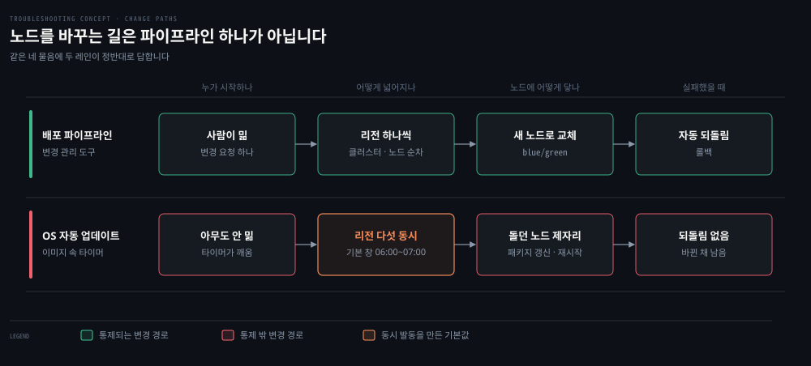

# 파이프라인 밖에서 노드를 바꾸는 장치

---

> 배포 파이프라인이 노드를 바꾸는 유일한 길은 아닙니다. OS 이미지에는 아무도 밀지 않아도 정해진 창에 깨어 패키지를 가는 장치가 들어 있고, 같은 이미지에서 온 노드는 리전이 달라도 같은 창에 함께 깨어납니다.

## 이 노트가 있는 이유

> "우리가 아무것도 바꾸지 않았다" 를 "노드가 바뀌지 않았다" 로 읽으면 원인이 들어올 자리가 사라져 진단이 멈춥니다.

2026-09-21 A 문항에서 막힌 자리가 여기였습니다. 증상은 "그 시간대에 우리가 민 변경은 없다" 고 적었는데, 그것을 "변경이 없었다" 로 읽었습니다. 되물음 뒤에 나온 반응도 "배포 파이프라인이 아닌 곳에서 노드에 변경이 들어올 수 있는가" 라는 물음이었습니다.

오답 노트에 쌓인 약점과 같은 축입니다. 무엇이 없다는 진술을 만나면 그 진술의 주어와 범위를 먼저 잘라야 합니다. "우리가 민 변경" 이 없다는 것은 우리 파이프라인 밖의 변경에 대해 아무것도 말하지 않습니다.


## 노드를 바꾸는 길은 둘 이상이다

> 같은 네 물음에 배포 파이프라인과 OS 자동 업데이트는 정반대로 답합니다.

파이프라인을 잘 만들어 둔 팀일수록 "노드는 파이프라인으로만 바뀐다" 고 믿기 쉽습니다. 그 믿음이 틀리는 자리를 네 물음으로 나란히 놓으면 이렇습니다.



위 레인은 Datadog 의 파이프라인입니다. 네 칸이 모두 폭발 반경을 줄이려는 장치입니다. 순차로 넓히니 한 리전에서 멈출 수 있습니다. 새것으로 바꾸므로 노드의 상태가 늘 이미지와 같고, 되돌리는 장치가 있어 실패가 남지 않습니다.

아래 레인의 네 칸은 모두 그 반대입니다. 파이프라인이 공들여 만든 보호가 이 길에는 하나도 걸려 있지 않습니다. 이 사고의 규모를 정한 것은 둘째 칸입니다. 같은 이미지에서 온 노드가 리전을 가리지 않고 같은 창에 돌았습니다.


## 자동 보안 업데이트는 타이머가 부르는 패키지 관리자다

> 사람이 치던 `apt` 를 systemd 타이머가 대신 부릅니다.

이 장치가 낯설게 느껴지는 것은 이름 때문입니다. "보안 업데이트" 라고 부르면 별도의 시스템 같지만, 뜯어 보면 이미 아는 부품 둘을 이어 붙인 것입니다.

[먼저 켜지는 것 하나가 나머지 전부를 켠다 §7](../../02_os/book/learning-modern-linux/06-01.%EB%A8%BC%EC%A0%80%20%EC%BC%9C%EC%A7%80%EB%8A%94%20%EA%B2%83%20%ED%95%98%EB%82%98%EA%B0%80%20%EB%82%98%EB%A8%B8%EC%A7%80%20%EC%A0%84%EB%B6%80%EB%A5%BC%20%EC%BC%A0%EB%8B%A4.md) 은 앱이 기계에 닿는 공급망을 셋으로 나눕니다. 소프트웨어를 만들어 발행하는 관리자, 패키지를 쌓아 두는 저장소, 대상 시스템에서 패키지를 찾아 설치하고 갱신하는 도구입니다. 자동 업데이트는 그 셋째 자리의 도구를 사람 대신 타이머가 부르는 것입니다.

타이머는 같은 편 §6 에서 손으로 만들어 본 그 단위입니다. `OnCalendar=` 로 일정을 적고, 깨어나면 짝이 되는 service 를 돌립니다. Debian apt 저장소가 싣는 `apt-daily-upgrade.timer` 가 그 모양입니다.

```bash
# Debian apt 저장소 main 브랜치의 debian/apt-daily-upgrade.timer
[Unit]
Description=Daily apt upgrade and clean activities
After=apt-daily.timer

[Timer]
OnCalendar=*-*-* 6:00
RandomizedDelaySec=60m
Persistent=true

[Install]
WantedBy=timers.target
```

매일 06:00 에 깨어나되 최대 60분 안에서 무작위로 늦춥니다. Datadog 원문이 적은 06:00~07:00 창과 같은 폭입니다. 짝인 `apt-daily.timer` 는 `OnCalendar=*-*-* 6,18:00` 에 `RandomizedDelaySec=12h` 로 깨어 내려받기를 맡고, 이 타이머는 `After=apt-daily.timer` 로 그 뒤에 섭니다.

다만 둘을 잇는 것은 해석입니다. Datadog 원문은 "예전 보안 업데이트 통로" 라고만 적고 유닛을 지목하지 않았습니다. 그리고 이 파일은 Debian 저장소 main 브랜치 판본이라, Ubuntu 22.04 가 싣는 판본과 같은지는 확인하지 않았습니다.


## 같은 이미지는 같은 시계를 공유한다

> 기본값은 결합 없이도 동시성을 만듭니다.

리전 다섯 곳은 직접 연결도 결합도 없었는데 한 시간 안에 함께 무너졌습니다. 이어 주는 선이 없어도 같은 이미지에서 온 노드는 같은 타이머와 같은 기본 창을 들고 있기 때문입니다. 원문은 이 대목을 초기 대응자들을 헷갈리게 한 자리로 꼽습니다.

> *"Thus it affected multiple regions at the exact same time, even though the regions have no direct network connection or coupling between them."*

무작위 지연이 흩는 범위는 한 시간 안입니다. 그 한 시간은 모든 노드에 같습니다. 그래서 노드끼리는 몇 분씩 어긋나도, 리전 경계에서 폭발 반경이 끊기지는 않습니다.

리전끼리 이어진 데가 없다는 사실을 아는 사람일수록 동시 발동을 결합 말고 다른 것으로 설명하려 듭니다. 그 목록에서 "같은 기본값" 은 뒤로 밀리기 쉽습니다. 동시에 난 장애 앞에서 공유된 선만이 아니라 공유된 이미지와 기본값을 함께 세야 하는 이유입니다.


## 막는 법은 노드를 바꾸는 길을 하나로 모으는 것이다

> 두 회사 모두 첫 조치로 자동 업데이트 통로를 막았고, Heroku 는 그 뿌리를 불변성 통제의 부족으로 적었습니다.

Datadog 은 예전 통로를 모든 리전에서 끄고, 비슷한 통로가 남았는지 인프라 전체를 감사했습니다. 끄는 것이 보안 태세를 낮추지 않는 이유도 적었습니다. 보안 업데이트는 이미 변경 관리 도구가 적용하고 있어 그 통로가 중복이었기 때문입니다.

Heroku 는 2025년 6월 사고 뒤 무인 OS 업그레이드를 영구 중단했습니다. 원인을 이렇게 적습니다.

> *"A lack of sufficient immutability controls allowed an automated process to make unplanned changes to our production environment."*

Heroku 가 말한 불변성은 **불변 인프라**(immutable infrastructure)에서 온 말입니다. 돌고 있는 노드를 제자리에서 고치지 않는 운영 방식입니다. 바꿀 것이 있으면 새 이미지로 새 노드를 띄워 갈아 끼웁니다. Datadog 의 blue/green 교체가 그 방식이고, 자동 업데이트는 그 방식에 뚫린 구멍이었습니다. 불변성을 통제한다는 것은 이런 구멍을 찾아 막는 일입니다.

대가도 분명합니다. 통로를 끄면 그 통로가 하던 보안 패치가 멈춥니다. Datadog 이 괜찮았던 것은 파이프라인이 이미 그 일을 하고 있었기 때문이고, 그런 파이프라인이 없는 조직이 통로만 끄면 패치가 멎습니다. 끄는 것과 파이프라인으로 옮기는 것은 한 묶음입니다.

창을 리전마다 엇갈리게 두는 반쪽 해법도 있습니다. 동시 발동은 막지만 돌던 노드를 제자리에서 바꾸는 성질은 그대로라, 모두 함께 무너지던 것이 한 리전씩 차례로 무너지는 것으로 바뀔 뿐입니다.


## 무엇을 보면 갈리는가

> 노드에 걸린 타이머와, 그 창에 패키지를 간 기록을 봅니다.

```bash
# 이 노드에 걸린 타이머 전부 — 다음 발동과 지난 발동 시각
systemctl list-timers --all

# 그 타이머가 어떻게 적혀 있는가
systemctl cat apt-daily-upgrade.timer

# 그 창에 무엇이 갈렸는가
journalctl -u apt-daily-upgrade.service --since "06:00"
grep -h ' upgrade ' /var/log/dpkg.log
```

`list-timers` 의 지난 발동 시각이 증상 시작과 맞물리면 그 타이머가 첫 용의자가 됩니다. 저널과 dpkg 기록에서 그 창에 어떤 패키지가 갈렸는지를 보면, 재시작한 데몬이 무엇이었는지까지 좁혀집니다. 이 사고에서는 그 패키지가 `systemd` 였고, 재시작한 데몬이 라우팅 테이블을 지웠습니다. 그 뒤의 이야기는 [한 노드의 라우팅 테이블을 둘이 만질 때](./os-%ED%95%9C-%EB%85%B8%EB%93%9C%EC%9D%98-%EB%9D%BC%EC%9A%B0%ED%8C%85-%ED%85%8C%EC%9D%B4%EB%B8%94%EC%9D%84-%EB%91%98%EC%9D%B4-%EB%A7%8C%EC%A7%88-%EB%95%8C.md) 에 있습니다.

감사할 때는 타이머만 보면 부족합니다. 파이프라인 밖에서 노드를 바꾸는 장치는 cron 작업, 설정 관리 에이전트, 클라우드 제공자 에이전트처럼 여럿일 수 있습니다. 그 목록을 세는 일이 Datadog 의 세 번째 조치였습니다.


## 근거

> 1차 자료와 사고 보고를 가르고, 확인하지 않은 것은 그렇다고 적습니다.

- **1차** · [Debian apt — debian/apt-daily-upgrade.timer](https://github.com/Debian/apt/blob/main/debian/apt-daily-upgrade.timer) — `OnCalendar=*-*-* 6:00`, `RandomizedDelaySec=60m`, `After=apt-daily.timer`. main 브랜치 판본입니다
- **1차** · [Debian apt — debian/apt-daily.timer](https://github.com/Debian/apt/blob/main/debian/apt-daily.timer) — `OnCalendar=*-*-* 6,18:00`, `RandomizedDelaySec=12h`
- **2차** · [Datadog 2023-03-08 사고 보고](https://www.datadoghq.com/blog/2023-03-08-multiregion-infrastructure-connectivity-issue/) — 예전 보안 업데이트 통로, OS 기본값의 06:00~07:00 UTC 창, 끄는 이유와 감사
- **2차** · [Heroku 요약 보고](https://www.heroku.com/blog/summary-of-june-10-outage/) · [시정 조치 보고](https://www.heroku.com/blog/corrective-action-update-june-10-outage/) — 불변성 통제의 부족, 무인 OS 업그레이드 영구 중단
- **확인 안 함**: Ubuntu 22.04 가 싣는 apt 판본의 타이머 값, Datadog 의 "예전 통로" 가 이 타이머였는지, 타이머가 어느 시간대 기준으로 도는지, `/var/log/dpkg.log` 의 줄 형식


## 나온 문항

> 이 개념이 갈라져 나온 회차입니다.

- [배포하지 않은 아침에 끊긴 리전 다섯 곳](../os/2026-09-21_%EB%B0%B0%ED%8F%AC%ED%95%98%EC%A7%80%20%EC%95%8A%EC%9D%80%20%EC%95%84%EC%B9%A8%EC%97%90%20%EB%81%8A%EA%B8%B4%20%EB%A6%AC%EC%A0%84%20%EB%8B%A4%EC%84%AF%20%EA%B3%B3.md) — A 2026-09-21. 우리가 민 것이 없는 아침에 이미지 속 타이머가 노드를 바꿨습니다


## 관련 문서

- [개념 노트 지도](./README.md) — 무엇이 여기 오고 무엇이 문항에 남나
- [한 노드의 라우팅 테이블을 둘이 만질 때](./os-%ED%95%9C-%EB%85%B8%EB%93%9C%EC%9D%98-%EB%9D%BC%EC%9A%B0%ED%8C%85-%ED%85%8C%EC%9D%B4%EB%B8%94%EC%9D%84-%EB%91%98%EC%9D%B4-%EB%A7%8C%EC%A7%88-%EB%95%8C.md) — 이 장치가 부른 재시작이 무엇을 지웠나
- [먼저 켜지는 것 하나가 나머지 전부를 켠다](../../02_os/book/learning-modern-linux/06-01.%EB%A8%BC%EC%A0%80%20%EC%BC%9C%EC%A7%80%EB%8A%94%20%EA%B2%83%20%ED%95%98%EB%82%98%EA%B0%80%20%EB%82%98%EB%A8%B8%EC%A7%80%20%EC%A0%84%EB%B6%80%EB%A5%BC%20%EC%BC%A0%EB%8B%A4.md) — §6 타이머를 손으로 만들어 보기, §7 패키지 공급망
- [업그레이드 2분 뒤 멈춘 클러스터](../kubernetes/2026-09-14_%EC%97%85%EA%B7%B8%EB%A0%88%EC%9D%B4%EB%93%9C%202%EB%B6%84%20%EB%92%A4%20%EB%A9%88%EC%B6%98%20%ED%81%B4%EB%9F%AC%EC%8A%A4%ED%84%B0.md) — 사람이 민 업그레이드가 노드의 상태를 지운 사례. 이쪽은 아무도 밀지 않은 업그레이드였습니다
