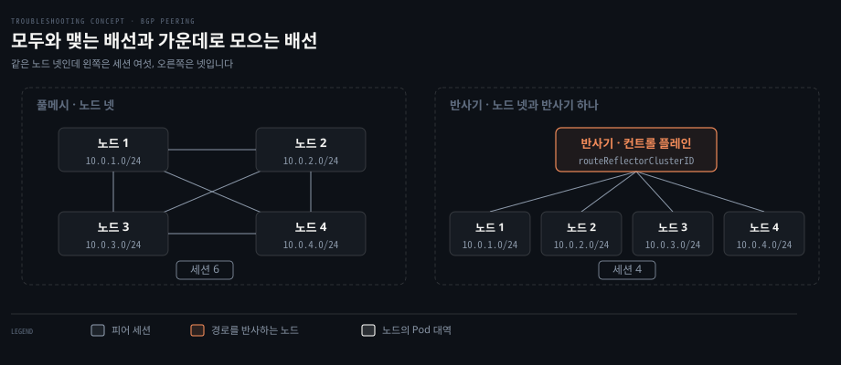
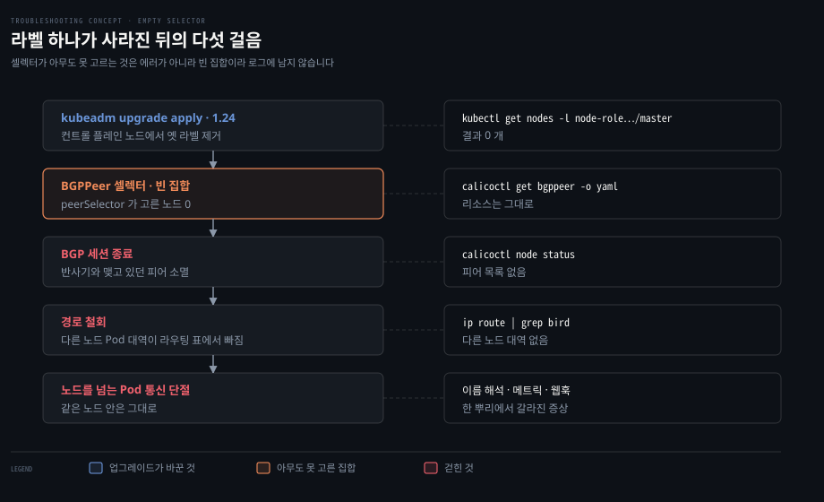

# 노드 간 경로를 누가 퍼뜨리는가

---

> 노드를 넘는 Pod 통신은 노드들이 "내가 데리고 있는 Pod 대역은 이것"이라고 서로 알려 준 결과입니다. 그 알림을 누구와 주고받을지는 라벨 셀렉터가 정하고, 셀렉터가 아무도 고르지 못하면 알림은 에러 한 줄 없이 멈춥니다.

## 이 노트가 있는 이유

> 진단이 CNI 이름에서 멈추면 그다음 칸이 비어 버립니다.

2026-09-14 B 문항에서 막힌 자리가 여기였습니다. "노드 사이 통신을 만드는 층이 Calico다"까지는 갔는데, 그 층이 실제로 무엇을 주고받아 통신을 만드는지가 비어 있었습니다. 그래서 "Calico Pod이 비정상"이라는 관찰 앞에서 Pod을 지워 보는 것 말고 할 수 있는 일이 없었습니다.

CNI를 컴포넌트 이름으로만 알고 있으면 이 자리에서 늘 멈춥니다. 컴포넌트는 지우고 다시 띄울 수 있지만, 그 컴포넌트가 만들어 둔 **상태**는 지운다고 돌아오지 않습니다. 경로가 바로 그 상태입니다.


## 같은 노드 안은 되는데 노드를 넘으면 안 되는 이유

> Pod 대역은 노드마다 다른 조각이라, 다른 조각으로 가는 길을 배우지 못하면 그 노드의 Pod은 없는 것과 같습니다.

Pod 주소는 클러스터 대역 하나를 노드들이 조각내어 나눠 가진 것입니다. 노드 1이 `10.0.1.0/24` 를 맡고 노드 2가 `10.0.2.0/24` 를 맡는 식입니다.

같은 노드 안의 Pod끼리는 이 사실이 필요 없습니다. 노드 안에서 veth 쌍과 브리지로 이어져 있어 커널이 로컬에서 끝냅니다. 문제는 노드를 넘을 때입니다. 노드 1의 커널이 `10.0.2.7` 로 가는 패킷을 받으면 "그 대역은 노드 2에 있다"는 줄이 라우팅 표에 있어야 보냅니다. 그 줄이 없으면 패킷은 기본 경로로 새거나 버려집니다.

그 줄을 누가 적어 주느냐가 CNI가 하는 일의 절반입니다. Calico는 노드마다 가상 라우터를 하나씩 둔 셈으로 보고, 노드들이 BGP로 자기 대역을 서로 광고하게 만듭니다. 그래서 진단할 때 세 쌍을 나눠 재는 것이 의미를 갖습니다.

| 재는 쌍 | 되는데 다른 쪽이 안 되면 | 다음에 볼 곳 |
|---------|------------------------|-------------|
| 같은 노드의 Pod끼리 | 노드 안 배선은 정상 | 노드를 넘는 쌍으로 |
| 다른 노드의 Pod끼리 | 경로 배포가 끊김 | BGP 세션과 라우팅 표 |
| Pod에서 API 서버로 | 컨트롤 플레인 경로 | API 서버 자체와 그 앞단 |

대상은 Service 이름이 아니라 Pod 주소로 잡습니다. 이름으로 걸면 실패했을 때 그것이 이름을 못 찾아서인지 길이 없어서인지 갈리지 않습니다.


## 모두와 맺으면 세션이 노드 수의 제곱으로 늘어난다

> 노드가 늘수록 광고를 주고받을 상대도 함께 늘어서, 작은 클러스터에서 잘 돌던 배선이 큰 클러스터에서 부담이 됩니다.



작은 클러스터에서는 이 배선을 신경 쓸 일이 없습니다. 노드가 넷이면 세션이 여섯뿐이라 모두가 모두와 맺어도 가볍습니다. 부담은 노드가 늘면서 옵니다. n대가 서로 맺으면 세션은 n(n-1)/2 개이므로 100대에서 4,950개가 됩니다.

Calico의 기본값이 그 풀메시입니다. 문서는 이 방식이 100대 안팎까지는 잘 동작하고 그보다 훨씬 커지면 효율이 떨어져 경로 반사기를 권한다고 적습니다.

경로 반사기는 BGP에서 온 장치입니다. 몇 대를 반사기로 정하면 나머지 노드는 반사기하고만 세션을 맺고, 반사기가 한쪽에서 받은 경로를 다른 쪽에 그대로 반사해 줍니다. 세션 수가 노드 수에 비례하는 선까지 내려갑니다. 큰 클러스터가 컨트롤 플레인 노드를 이 자리에 앉히는 구성이 흔합니다.

되비추는 규칙과 루프를 막는 두 속성은 [AS 안과 AS 사이 §3](../../02_os/book/cntd_computer-networking-top-down/05-02.AS%20%EC%95%88%EA%B3%BC%20AS%20%EC%82%AC%EC%9D%B4.md) 이 정본입니다. 이 노트는 그 장치를 쿠버네티스가 어떻게 쓰는지만 다룹니다.

바꾸는 순간에 주의할 것이 둘 있습니다. 노드 spec에 `routeReflectorClusterID` 를 붙이면 그 노드는 **즉시** 풀메시에서 빠지고 기존 세션이 끊깁니다. 그리고 풀메시를 끄면 대체 피어링을 구성하기 전까지 Pod 네트워킹이 깨집니다. 그래서 문서는 BGPPeer를 먼저 만들어 피어링이 맺힌 것을 확인한 뒤 메시를 끄라고 적습니다.


## 반사기를 고르는 것은 라벨이고, 빈 집합은 에러가 아니다

> 셀렉터가 아무도 고르지 못하면 오브젝트는 그대로 남고 로그도 조용한데, 그 집합에 기대던 동작만 소리 없이 멈춥니다.



어느 노드를 반사기로 삼을지는 정해져 있지 않습니다. Calico 문서는 반사기로 쓸 노드에 `routeReflectorClusterID` 를 붙이라고만 하고 노드를 고르는 기준은 말하지 않습니다. 컨트롤 플레인 노드가 자주 쓰이는 것은 대수가 적고 오래 살아 있어서이지 권장 사항이라서가 아닙니다.

그 선택에는 대가가 따릅니다. 쿠버네티스는 컨트롤 플레인이 멈춰도 데이터 플레인이 살아 있도록 설계돼 있는데, 반사기를 컨트롤 플레인에 얹으면 그 분리가 사라집니다. 업그레이드처럼 컨트롤 플레인을 건드리는 작업이 곧 경로 배포를 건드리는 작업이 됩니다.

반사기 구성에서 "누가 반사기인가"는 BGPPeer 리소스의 `nodeSelector` 와 `peerSelector` 가 정합니다. Calico 문서의 예시는 `peerSelector: route-reflector == 'true'` 처럼 라벨로 씁니다. 컨트롤 플레인 노드를 반사기로 쓰는 클러스터라면 그 자리에 컨트롤 플레인 노드에만 붙어 있는 라벨을 적게 됩니다.

여기서 이 노트의 급소가 나옵니다. 라벨이 사라지면 셀렉터는 **빈 집합**을 고릅니다.

이때 경고도 에러도 나오지 않습니다. 셀렉터의 뜻이 "조건에 맞는 것을 고른다"이고, 맞는 것이 없는 상태 역시 정상적인 결과이기 때문입니다.

리소스는 그대로 있습니다. 컨트롤러도 멀쩡히 돕니다. 사라진 것은 결과뿐입니다.

같은 손잡이가 다른 층에도 있습니다. Service의 selector가 Pod 라벨과 어긋나면 EndpointSlice가 조용히 빕니다. 2026-09-07 B 문항이 그 자리였고, 거기서도 에러 로그는 없었습니다.

### 업그레이드가 라벨을 지운 이유

쿠버네티스는 `master` 라는 낱말을 라벨과 taint에서 걷어내는 작업을 두 단계로 나눠 진행했습니다. 1.20이 첫 단계로 새 이름을 알리고 미리 감내하라고 안내했고, 1.24가 둘째 단계였습니다.

1.24 변경 기록의 문장은 이렇습니다. 새 클러스터에는 `node-role.kubernetes.io/master` 라벨을 더 이상 붙이지 않고 `node-role.kubernetes.io/control-plane` 만 붙입니다. 그리고 `kubeadm upgrade apply` 로 1.24에 올리는 클러스터에서는 **기존 컨트롤 플레인 노드들에서 옛 라벨을 제거**합니다. taint는 한 판 늦어서, 옛 taint `node-role.kubernetes.io/master:NoSchedule` 은 1.25에서 없어졌습니다.

이 문장이 위험한 이유는 대상이 "새로 만드는 것"이 아니라 **이미 돌고 있는 노드**라는 데 있습니다. 라벨 이름을 쓰고 있던 설정이 어딘가에 있으면, 업그레이드 명령 한 번에 그 설정이 가리키던 대상이 통째로 사라집니다. 그 설정이 코드로 관리되지 않고 사람이 CLI로 넣어 둔 것이라면 아무도 그 사실을 모릅니다.


## 무엇을 보면 갈리는가

> 세션과 경로는 API 서버가 아니라 노드에서 읽습니다. API 서버가 흔들릴 때도 이 경로는 살아 있습니다.

증상만 보면 "네트워크가 이상하다"에서 더 내려가기 어렵습니다. 아래는 그 덩어리를 층으로 가르는 명령들입니다.

```bash
# 셀렉터가 무엇을 고르는가 — 결과가 0 개면 빈 집합이다
kubectl get nodes -l node-role.kubernetes.io/master
calicoctl get bgppeer -o yaml

# 세션이 살아 있는가 — 로컬 에이전트와 통신하므로 보려는 그 노드에서 실행한다
sudo calicoctl node status

# 경로가 남아 있는가 — 다른 노드의 Pod 대역 줄이 있는지 본다
ip route

# API 서버가 아파도 읽히는 로그
crictl logs <컨테이너>
journalctl -u kubelet
```

`calicoctl node status` 는 그 노드의 에이전트에 붙어 상태를 읽으므로 상태를 보려는 노드에서 실행해야 합니다. 노드에 들어가기 어려우면 `CalicoNodeStatus` 리소스를 만들어 BGP 세션 상태를 받아 보는 길도 문서에 있습니다.

마지막 두 줄은 도구의 위치 때문에 필요합니다. `kubectl` 은 API 서버에 물어서 답을 받습니다. API 서버가 흔들리면 진단 도구가 진단 대상 뒤에 서 있는 셈이라 화면이 함께 흐려집니다. 노드에 올라가 컨테이너 런타임과 systemd의 로그를 직접 읽으면 그 의존이 끊깁니다.


## 근거

> 등급을 붙입니다. 확인하지 않은 것은 확인하지 않았다고 적습니다.

- **1차** · [Calico — Configure BGP peering](https://docs.tigera.io/calico/latest/networking/configuring/bgp)
  - 풀메시는 100대 안팎까지 적합하고 그보다 커지면 반사기를 권합니다
  - `routeReflectorClusterID` 를 노드에 붙이면 즉시 메시에서 빠지고 기존 세션이 끊깁니다
  - 풀메시를 끄면 대체 피어링을 구성하기 전까지 Pod 네트워킹이 깨집니다
  - `nodeSelector` 와 `peerSelector` 의 예시가 라벨이고, `calicoctl node status` 는 그 노드에서 실행합니다
  - 반사기로 쓸 노드에는 우리가 만든 라벨을 붙이라고 안내합니다. 예시 명령이 `kubectl label node my-node route-reflector=true` 입니다
- **1차** · [Kubernetes CHANGELOG-1.24](https://github.com/kubernetes/kubernetes/blob/master/CHANGELOG/CHANGELOG-1.24.md)
  - `kubeadm upgrade apply` 가 기존 컨트롤 플레인 노드에서 `node-role.kubernetes.io/master` 라벨을 제거합니다
  - 1.20이 첫 단계였고 옛 taint는 1.25에서 없어졌습니다 (PR #107533)
- **확인 안 함**: 반사기를 몇 대 두는 것이 적절한지의 권장치, 세션이 끊긴 뒤 경로가 라우팅 표에서 빠지기까지의 시간, 백업 복원이 라벨을 되살리는 정확한 경로


## 나온 문항

> 이 개념이 갈라져 나온 회차입니다.

- [업그레이드 2분 뒤 멈춘 클러스터](../kubernetes/2026-09-14_%EC%97%85%EA%B7%B8%EB%A0%88%EC%9D%B4%EB%93%9C%202%EB%B6%84%20%EB%92%A4%20%EB%A9%88%EC%B6%98%20%ED%81%B4%EB%9F%AC%EC%8A%A4%ED%84%B0.md) — B 2026-09-14. 라벨 하나가 반사기 집합을 비웠습니다
- [Pod 로는 되고 이름으로는 안 되는 호출](../kubernetes/2026-09-07_Pod%20%EB%A1%9C%EB%8A%94%20%EB%90%98%EA%B3%A0%20%EC%9D%B4%EB%A6%84%EC%9C%BC%EB%A1%9C%EB%8A%94%20%EC%95%88%20%EB%90%98%EB%8A%94%20%ED%98%B8%EC%B6%9C.md) — B 2026-09-07. 같은 손잡이가 Service selector에서 나왔습니다


## 관련 문서

- [개념 노트 지도](./README.md) — 무엇이 여기 오고 무엇이 문항에 남나
- [오버레이와 노드 간 트래픽](../../08_cloud/kubernetes/04_networking/04-03.%EC%98%A4%EB%B2%84%EB%A0%88%EC%9D%B4%EC%99%80%20%EB%85%B8%EB%93%9C%20%EA%B0%84%20%ED%8A%B8%EB%9E%98%ED%94%BD.md) — CNI가 Pod 대역을 광고하는 구성
- [AS 안과 AS 사이](../../02_os/book/cntd_computer-networking-top-down/05-02.AS%20%EC%95%88%EA%B3%BC%20AS%20%EC%82%AC%EC%9D%B4.md) — 풀메시의 비용, 되비추기 규칙, `ORIGINATOR_ID` 와 `CLUSTER_LIST` 의 정본
- [IP·라우팅·Ethernet](../../08_cloud/book/networking-and-kubernetes/01-03.IP%C2%B7%EB%9D%BC%EC%9A%B0%ED%8C%85%C2%B7Ethernet%20%E2%80%94%20%ED%8C%A8%ED%82%B7%EC%9D%B4%20%EA%B8%B8%EC%9D%84%20%EC%B0%BE%EB%8A%94%20%EB%B2%95.md) — Calico 가 노드를 작은 라우터로 만드는 구성
- [무엇을 보려면 무엇을 치는가](./%EB%AC%B4%EC%97%87%EC%9D%84-%EB%B3%B4%EB%A0%A4%EB%A9%B4-%EB%AC%B4%EC%97%87%EC%9D%84-%EC%B9%98%EB%8A%94%EA%B0%80.md) — 알고 싶은 단위가 도구를 정한다
