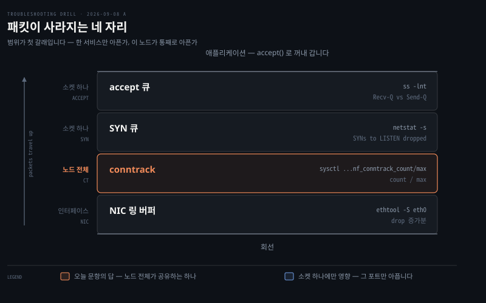
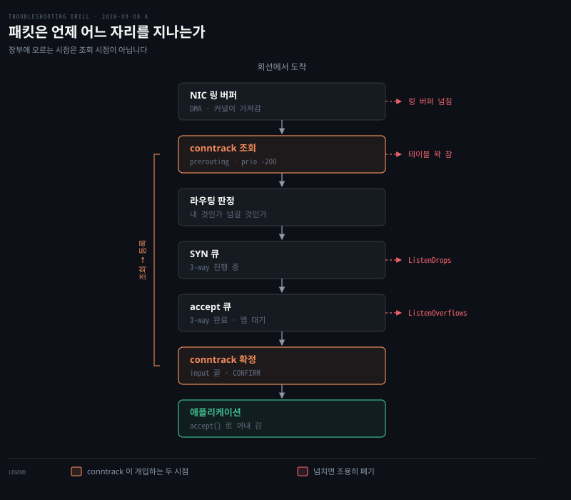

# 패킷이 사라지는 네 자리

---

> "네트워크 문제"는 덩어리입니다. 패킷은 한 장비 안에서도 여러 자리를 지나고, 자리마다 버린 수를 세는 카운터가 따로 있습니다. 어느 카운터가 느는지가 곧 사라진 자리입니다.

아래는 그 네 자리를 아래에서 위로 쌓은 지도입니다. 각 행의 왼쪽이 그 자리의 범위, 오른쪽이 확인 명령과 읽을 값이며, 강조된 conntrack 이 2026-09-08 A 문항의 답이었습니다.




## 이 노트가 있는 이유

> 지식이 없어서가 아니라 의심에서 명령으로 가는 한 칸이 비어 있었습니다.

드릴에서 같은 지점에 네 번 걸렸습니다. 가설과 처방은 대는데 "그럼 무엇을 쳐서 확인하나"에서 멈춥니다. [오답 노트](../_drill/_mistakes.md) 반복 패턴 표의 "확인할 명령을 내지 못함"이 그것입니다.

원인을 짚어 보면 노트가 없어서가 아닙니다. conntrack 도 백로그도 학습 노트에 이미 있습니다. 없던 것은 "conntrack 이 의심된다"와 "`sysctl net.netfilter.nf_conntrack_count`" 사이의 한 칸이었습니다. 그래서 이 노트는 원리를 다시 설명하지 않고 자리마다 칠 명령 하나를 고정합니다.


## 한 층의 성공이 다른 층의 실패입니다

> 자리마다 카운터가 따로 있다는 말에는 뒷면이 있습니다. **그 층에서 정상으로 센 것이 다음 층에서 버려질 수 있습니다.**

방화벽이 버린 패킷을 생각해 보면 바로 드러납니다. `iptables` 룰에 걸려 `DROP` 된 패킷은 `/proc/net/dev` 의 `drop` 에 **오르지 않습니다.** 인터페이스 입장에서는 받아서 위로 넘기는 데 성공했으니 `packets` 에 세어지고 끝입니다. 버린 주체가 인터페이스가 아니라 그 위의 netfilter 니까요.

```bash
선 → NIC → 인터페이스 카운터 → netfilter → 소켓 → 앱
              ↑ /proc/net/dev 는 여기까지만 압니다
```

그래서 "패킷이 사라졌다"를 숫자 하나로 못 잡습니다. 층마다 창을 따로 열어야 하고, 어느 층에서 성공이 실패로 바뀌는지가 곧 사라진 자리입니다.

| 버린 주체 | `/proc/net/dev` 의 `drop` | 어디서 세나 |
|-----------|--------------------------|------------|
| 인터페이스·드라이버 | 오릅니다 | `/proc/net/dev`, `ethtool -S` |
| netfilter 룰 | **안 오릅니다** (수신 성공) | `iptables -L -v -n`, `nft list ruleset` |

### 반대 방향으로도 안 보입니다

같은 사실이 도구 선택에서도 나타납니다. **아래층에만 존재하는 것은 위층 도구로 다룰 수 없습니다.**

이더타입 `0x8912` 같은 비 IP 프레임은 `iptables` 로 막지 못합니다. 룰이 부족해서가 아니라 그 프레임이 IP 계층에 **도달 자체를 안 하기 때문**입니다. 없는 것은 막을 수 없습니다. 이럴 때는 브리지 계층 도구인 `ebtables` 를 씁니다.

| | 보는 것 | 판단 근거 |
|---|---|---|
| `iptables` | IP 패킷 (L3) | IP 주소 · 포트 · 프로토콜 |
| `ebtables` | 이더넷 프레임 (L2) | MAC 주소 · **이더타입** |

이름이 그 차이입니다. `eb` 는 ethernet bridge 이고, netfilter 프레임워크를 공유해 테이블·체인·타깃 구조가 `iptables` 와 같습니다. 다른 것은 **어느 층에 훅을 거느냐**뿐입니다.

두 사례가 한 가지를 말합니다. **도구를 고르기 전에 그 사건이 어느 층에서 일어났는지 먼저 정합니다.** 층을 틀리면 아무리 정확한 명령도 빈 출력을 냅니다.


## 범위가 진단의 첫 갈래입니다

> 네 자리는 영향을 주는 범위가 다릅니다. 한 서비스만 아픈지 노드가 통째로 아픈지를 먼저 물으면 후보가 절반으로 줍니다.

| 자리 | 범위 | 명령 | 갈리는 값 |
|------|------|------|----------|
| NIC 링 버퍼 | 인터페이스 하나 — 그 NIC 로 들어오는 전부가 공유 | `ethtool -S <iface>` | `rx_missed_errors` 증가분 |
| SYN 큐 | 소켓 하나 — `listen()` 한 소켓마다 | `nstat -a \| grep TCPReqQFull` | `TcpExtTCPReqQFullDrop` 또는 `...DoCookies` |
| accept 큐 | 소켓 하나 — 같은 소켓의 다음 단계 | `ss -lnt` | `LISTEN` 줄의 Recv-Q vs Send-Q |
| conntrack | 노드 전체 — 하나를 전부가 공유 | `sysctl net.netfilter.nf_conntrack_count net.netfilter.nf_conntrack_max` | count / max 비율 |

여기서 "노드 전체"는 그 장비 한 대 안의 전부를 뜻합니다. 클러스터 전체가 아닙니다. 노드 A 의 conntrack 이 꽉 차도 노드 B 는 멀쩡하고, 사양이 섞인 클러스터에서 작은 노드만 넘치는 이유가 이것입니다.

accept 큐는 앱이 `listen(fd, backlog)` 을 호출하는 순간 커널이 그 소켓 전용으로 만듭니다. 8080 과 9090 은 다른 소켓이므로 큐도 둘이고, 하나가 차도 다른 하나는 영향받지 않습니다. conntrack 이 부팅 때 하나 만들어져 전부가 나눠 쓰는 것과 갈리는 지점이 여기입니다.

### 링 버퍼와 conntrack 은 종류가 다릅니다

넷을 나란히 놓으면 다 비슷한 "넘치면 버리는 자리"로 보이지만, 이 둘은 담는 것 자체가 다릅니다.

| | NIC 링 버퍼 | conntrack |
|---|---|---|
| 정체 | 패킷 자체를 담는 그릇 | 흐름에 대한 메모 |
| 담기는 것 | 바이트 덩어리 | 이 주소 쌍이 열려 있다는 기록 한 줄 |
| 비워지는 때 | 커널이 가져가는 즉시 | 흐름이 끝나고 타임아웃까지 |
| 넘치는 이유 | 커널이 못 따라감 | 동시에 열린 흐름이 너무 많음 |
| 세는 단위 | 패킷 개수 | 흐름 개수 |

링 버퍼는 우체통이고 conntrack 은 배달 장부입니다. 우체통은 집배원이 가져가면 비워지고, 넘치는 것은 편지가 빨리 와서가 아니라 집배원이 안 와서입니다. 그래서 링 버퍼 드롭은 대개 CPU 와 인터럽트 처리 문제이지 커넥션 수 문제가 아닙니다.

장부는 관계 하나가 한 줄입니다. 커넥션 하나가 패킷 1만 개를 주고받아도 장부에는 한 줄입니다. 그래서 초당 패킷이 아무리 많아도 커넥션이 100 개면 conntrack 은 100 줄이라 안 넘치고, 반대로 패킷이 적어도 커넥션을 계속 새로 열고 닫으면 찹니다.

2026-09-08 A 문항이 후자였습니다. 트래픽 양이 아니라 동시에 열린 흐름의 수가 늘어난 것이 부담이 됐습니다.

### 링 버퍼 넘침은 `rx_dropped` 가 아닙니다

빈칸을 채우면서 걸린 자리입니다. 링 버퍼가 넘쳤을 때 오르는 카운터는 이름이 직관과 어긋납니다.

커널 문서가 `rx_dropped` 를 이렇게 규정합니다. "받았으나 처리하지 못한 패킷 — 자원 부족이나 **지원하지 않는 프로토콜** 때문. 하드웨어 인터페이스에서는 L2 주소 필터링으로 버린 것을 포함할 수 있으나 **장치의 버퍼 고갈로 버린 것은 포함하지 않아야 한다**."

즉 `rx_dropped` 는 포화 카운터가 아닙니다. 버퍼가 넘쳐 못 받은 것은 `rx_missed_errors` 로 갑니다.

| 카운터 | 무엇을 세나 |
|--------|------------|
| `rx_dropped` | 받긴 했는데 줄 데가 없었다 — 모르는 프로토콜, L2 필터링 |
| `rx_missed_errors` | 호스트가 준 버퍼에 안 들어가 못 받았다 — **링 버퍼 포화** |
| `rx_fifo_errors` | 장치 FIFO 오버플로 이벤트. 드롭 수와 1:1 이 아닐 수 있음 |

2026-09-10 A 문항이 정확히 첫 행이었습니다. `/proc/net/dev` 의 `drop` 이 오르는데 포화는 아니었던 이유가 이 정의에 있습니다. **드롭 카운터가 오른다고 포화가 아닙니다.**

### SYN 큐와 accept 큐는 카운터가 갈립니다

둘 다 소켓 하나의 것이고 순서만 다르지만, 넘쳤을 때 오르는 이름이 다릅니다.

| 넘친 곳 | 오르는 카운터 | 조건 |
|---------|-------------|------|
| accept 큐 | `TcpExtListenOverflows` | 핸드셰이크는 끝났는데 앱이 `accept()` 를 못 따라감 |
| SYN 큐 | `TcpExtTCPReqQFullDoCookies` | SYN 백로그 초과 + SYN 쿠키 켜짐 → 쿠키로 넘김 |
| SYN 큐 | `TcpExtTCPReqQFullDrop` | SYN 백로그 초과 + SYN 쿠키 꺼짐 → 그냥 버림 |

`ListenDrops` 는 SYN 큐 전용이 아닙니다. `ListenOverflows` 를 **포함하는 상위 집합**이라, 이 값만 보면 어느 큐가 넘쳤는지 안 갈립니다. 두 큐를 가르려면 `ListenOverflows` 와 `TCPReqQFull*` 을 나란히 읽습니다.

```bash
nstat -a | grep -E 'ListenOverflows|ListenDrops|TCPReqQFull'
```

`nstat` 을 쓰는 이유가 있습니다. `netstat -s` 는 부팅 이후 누적만 주는데 `nstat` 은 **직전 호출 이후 증가분**을 줍니다. 아래 "두 번 찍어 증가분을 본다"가 도구 하나로 끝나는 셈입니다.


## 패킷 하나가 지나는 순서

> 앞 그림이 네 자리가 어디에 있는지를 보였다면, 이 그림은 패킷 하나가 그 자리들을 언제 만나는지를 보입니다.



회선에서 도착한 패킷은 위에서 아래로 내려가고, 관문마다 상한에 걸리면 오른쪽으로 조용히 빠집니다. 오른쪽 라벨이 그 자리에서 늘어나는 카운터의 이름입니다.

순서를 알면 진단이 좁혀집니다. accept 큐가 찼다는 것은 3-way 핸드셰이크가 이미 끝났다는 뜻이므로 그 아래 자리들은 전부 통과한 것입니다. 반대로 링 버퍼에서 버려지면 위쪽 자리들은 패킷을 구경도 못 합니다. 어느 카운터가 느는지가 곧 어디까지 갔는지를 말해 줍니다.

### conntrack 은 두 번 개입합니다

이 그림에서 가장 헷갈리는 자리입니다. conntrack 은 앞에서 한 번, 뒤에서 한 번 관여하는데 하는 일이 다릅니다.

- prerouting 에서 우선순위 -200 으로 **조회** 합니다. 이 패킷이 이미 아는 흐름인지 찾는 단계입니다
- input 과 postrouting 의 맨 끝에서 `CONFIRM` 으로 **등록** 합니다. 새 흐름이 장부에 실제로 오르는 시점이 여기입니다

**두 번 들르는 것은 응답 패킷 때문이 아닙니다. 들어오는 패킷 하나가 커널을 한 번 지나는 동안 두 지점에서 conntrack 코드가 실행된다는 뜻입니다.** 왕복이 아니라 가는 길에 두 번 들릅니다.

나눠 둔 이유는 중간에 버려질 수 있기 때문입니다. 

- 앞에서 조회하는 것은 이 패킷을 어떻게 다룰지 정하려면 아는 흐름인지 먼저 알아야 하기 때문입니다. NAT 규칙도 방화벽의 `ESTABLISHED` 판정도 이 정보가 있어야 돕니다. 그런데 새 흐름이면 그 시점에는 아직 후보로만 들고 있습니다. 
- 방화벽에 걸려 폐기될 수도 있고 라우팅이 안 될 수도 있는데, 미리 등록하면 결국 버려질 패킷 때문에 장부에 쓰레기가 쌓입니다. 그래서 끝까지 살아남은 것이 확정된 뒤에야 적습니다.

응답 패킷은 별개의 여정입니다. 나중에 응답이 돌아오면 그것도 조회 단계를 거치는데, 그때는 장부에 이미 있으므로 아까 그 흐름의 답이라고 매칭됩니다. conntrack 이 존재하는 목적이 그 매칭입니다.

우선순위 값은 nftables 위키의 hook 문서가 정본입니다. `NF_IP_PRI_CONNTRACK` 이 -200, `NF_IP_PRI_CONNTRACK_CONFIRM` 이 `INT_MAX` 입니다.

### 큐가 넘쳤을 때 클라이언트가 받는 것

`listen(2)` 이 이렇게 적습니다. 큐가 찼을 때 클라이언트는 `ECONNREFUSED` 를 받거나, 재전송을 지원하는 프로토콜이면 그 요청이 무시되어 나중 재시도가 성공할 수 있습니다.

TCP 는 재전송을 지원하므로 후자가 흔합니다. 그래서 accept 큐가 넘치는 서버는 완전히 죽은 것처럼 보이지 않고 간헐적으로 느려지는 모습으로 나타납니다. 이 모호함이 진단을 어렵게 만드는 지점이라, 카운터를 직접 보는 편이 빠릅니다.


## 카운터는 두 번 찍어 증가분을 봅니다

> 넘쳐서 버린 횟수는 부팅 이후 누적입니다. 한 번 봐서는 지금 문제인지 과거 흔적인지 구분되지 않습니다.

부팅한 지 30일 된 서버에서 `1,246` 이라는 값을 봤다고 합시다. 어제 하루에 몰린 것일 수도 있고 30일에 걸쳐 흩어진 것일 수도 있는데, 그 숫자 하나로는 둘을 가를 수 없습니다.

```bash
netstat -s | grep -i 'SYNs to LISTEN'   # 1246
# 10초 뒤 다시
netstat -s | grep -i 'SYNs to LISTEN'   # 그대로면 과거 흔적, 올랐으면 지금 진행 중
```

그리고 이 손동작은 이미 장애가 났을 때 쓰는 것입니다. 터지기 전에 차오르는 것은 못 봅니다. 그래서 오늘 사례의 재발 방지책이 손으로 찍기가 아니라 알람이었습니다.

| | 손으로 두 번 찍기 | 모니터링 알람 |
|---|---|---|
| 언제 | 지금 장애 중, 원인 좁힐 때 | 상시 |
| 무엇을 | 증가분 | 사용률 추세 |
| 한계 | 터진 뒤에만 가능 | 미리 걸어 둬야 함 |

둘은 대체재가 아니라 순서입니다. 처방의 응급 칸에 손으로 찍기가, 재발 방지 칸에 알람이 들어갑니다.

비교할 값은 나란히 읽습니다. `count` 만 보면 아무것도 모르고 `max` 와 같이 봐야 비율이 나옵니다. `ss -lnt` 가 Recv-Q 와 Send-Q 를 한 줄에 붙여 주는 것도 같은 이유입니다.


## ss 의 두 컬럼은 상태에 따라 뜻이 바뀝니다

> 같은 Recv-Q 가 `LISTEN` 에서는 대기 연결 수이고 `ESTAB` 에서는 안 읽은 바이트입니다.

| 소켓 상태 | Recv-Q | Send-Q |
|-----------|--------|--------|
| `LISTEN` | 대기 중인 연결 수 | accept 큐 한도 |
| `ESTAB` | 아직 안 읽은 바이트 | 아직 ACK 못 받은 바이트 |

`LISTEN` 줄에서 Recv-Q 가 Send-Q 에 붙어 있으면 앱이 `accept()` 를 제때 못 하고 있다는 신호입니다. 한가한 서버에서 0 으로 보이는 것이 정상이고, 문제가 날 때만 숫자가 쌓입니다.

`man ss` 에는 이 상태별 차이가 적혀 있지 않습니다. 커널이 listening 소켓의 accept 큐 길이를 `rx_queue` 로 내보내면서 생긴 의미라, man page 만 읽으면 알 수 없는 자리입니다.


## sysctl 로 커널에게 직접 묻습니다

> 프로세스가 아니라 커널이 들고 있는 값이라, 애플리케이션 쪽 명령으로는 보이지 않습니다.

```bash
# 읽기 — 비교할 값은 반드시 나란히
sysctl net.netfilter.nf_conntrack_count net.netfilter.nf_conntrack_max

# 무슨 항목이 있는지 모를 때
sysctl -a | grep conntrack

# 쓰기 — 지금만. 재부팅하면 사라집니다 (응급용)
sudo sysctl -w net.netfilter.nf_conntrack_max=262144

# 쓰기 — 영구 (재발 방지용)
echo 'net.netfilter.nf_conntrack_max=262144' | sudo tee /etc/sysctl.d/99-conntrack.conf
sudo sysctl --system
```

이름 규칙 하나를 알면 외울 것이 줄어듭니다. `sysctl` 의 점은 `/proc/sys/` 아래 슬래시와 1:1 로 대응합니다. `net.netfilter.nf_conntrack_max` 는 곧 `/proc/sys/net/netfilter/nf_conntrack_max` 입니다.

컨테이너 안에서 읽으면 안 됩니다. conntrack 테이블은 노드 커널의 것이라 Pod 에서는 값이 없거나 다르게 보입니다. 증상이 나는 노드에 직접 들어가서 읽습니다.

### 한도를 커널이 하드웨어에서 유도합니다

`nf_conntrack_max` 는 관리자가 정한 값이 아니라 기본값이 총 메모리에서 나옵니다. 커널 공식 문서가 이렇게 적습니다.

- `nf_conntrack_buckets` — 모듈 로딩 시 지정하지 않으면 총 메모리를 16384 로 나눠 버킷 수를 정합니다. 하한 1,024 · 상한 262,144
- `nf_conntrack_max` — 기본적으로 `nf_conntrack_buckets` 와 같게 설정됩니다

그래서 노드 사양을 낮추면 커넥션 추적 한도도 조용히 함께 내려갑니다. 사양 축소는 CPU 와 메모리 여유만 건드리는 결정으로 보이지만 네트워크 상태 테이블의 상한까지 옮깁니다. 이 연결이 안 보이면 "인프라는 안 건드렸는데"라는 말이 나옵니다.

커널 5.15 이전에는 `max` 가 `buckets` 의 4배였고 5.15 부터 같은 값입니다. 배수를 외우지 말고 그 노드에서 직접 읽는 편이 안전합니다.


## 백로그와 conntrack 은 다른 자리입니다

> 백로그는 이 서버로 들어오는 연결을 기다리게 하는 줄이고, conntrack 은 이 장비를 지나는 모든 흐름의 장부입니다.

| | 백로그 (SYN 큐 · accept 큐) | conntrack |
|---|---|---|
| 누구 것 | 소켓 하나 | 노드 전체 하나 |
| 방향 | 들어오는 것만 | 나가는 것도 포함 |
| 수명 | `accept()` 되면 즉시 빠짐 | 흐름이 사는 내내, 종료 후 더 |
| 한도 | `listen(backlog)` 와 `somaxconn` | 커널이 RAM 에서 유도 |

나가는 연결이 많은 서비스는 백로그와 무관하게 conntrack 을 채웁니다. 붙는 상대가 늘거나 커넥션을 재사용하지 않으면 그대로 장부가 찹니다. 2026-09-08 A 문항에서 하위 서비스 샤딩이 부담이 된 경로가 이것입니다.


## DROP 과 RST 는 같은 사건이 아닙니다

> 네 자리에서 넘쳐 버려지는 것은 전부 조용한 폐기입니다. 그런데 클라이언트 쪽에는 리셋으로 잡히는 일이 흔합니다.

앞뒤로 이어진 세 사건이라 순서로 풀어야 맞아떨어집니다.

1. 커널이 조용히 버립니다. 거절 응답을 만들어 주지 않으므로 상대에 닿지 않고 상대 로그에도 남지 않습니다
2. 보낸 쪽은 응답이 없으니 타임아웃에 걸립니다
3. 타임아웃을 처리하며 반쯤 열린 소켓을 정리할 때 RST 가 나갑니다

즉 RST 는 폐기가 직접 만든 것이 아니라, 폐기 때문에 응답을 못 받은 쪽이 뒤늦게 만든 것입니다. "상대 로그에 요청이 없다"와 "리셋 카운트가 오른다"가 동시에 성립하는 이유입니다.


## 근거

> 등급을 붙입니다. 확인하지 않은 것은 확인하지 않았다고 적습니다.

- `nf_conntrack_max` 기본값 유도 — [커널 공식 문서 nf_conntrack-sysctl](https://docs.kernel.org/networking/nf_conntrack-sysctl.html) · 1차
- `ss` 옵션 — [man7 ss(8)](https://man7.org/linux/man-pages/man8/ss.8.html) · 1차. 단 `LISTEN` 상태의 Recv-Q 와 Send-Q 의미는 man page 에 없어 커널이 accept 큐 길이를 `rx_queue` 로 내보내는 쪽 근거로 보완했습니다
- 넘침 카운터 이름 — `ListenOverflows` 는 accept 큐 초과입니다. **`ListenDrops` 는 SYN 큐 드롭이 아니라 `ListenOverflows` 를 포함하는 상위 집합**입니다. SYN 큐 초과는 `TcpExtTCPReqQFullDoCookies`(쿠키 켜짐)와 `TcpExtTCPReqQFullDrop`(꺼짐)으로 갈립니다. 근거는 [Scaling Linux Services](https://theojulienne.io/2020/07/03/scaling-linux-services-before-accepting-connections.html) · 2차이고 커널 `LINUX_MIB_*` 상수명과 대조했습니다. 2026-09-10 에 이 줄의 앞선 서술을 정정했습니다
- 링 버퍼 포화 카운터 — 포화는 `rx_dropped` 가 아니라 `rx_missed_errors` 입니다. `rx_dropped` 는 "지원하지 않는 프로토콜·L2 필터링"을 포함하고 "장치 버퍼 고갈은 포함하지 않아야 한다"고 규정됩니다 — [커널 공식 문서 Network statistics](https://docs.kernel.org/networking/statistics.html) · 1차
- netfilter hook 순서와 conntrack 우선순위 (`NF_IP_PRI_CONNTRACK` -200, `..._CONFIRM` `INT_MAX`) — [nftables 위키 Netfilter hooks](https://wiki.nftables.org/wiki-nftables/index.php/Netfilter_hooks) · 준1차
- 큐가 찼을 때의 클라이언트 동작 (`ECONNREFUSED` 또는 무시 후 재시도), `somaxconn` 상한 절삭 — [man7 listen(2)](https://man7.org/linux/man-pages/man2/listen.2.html) · 1차
- 커널 버전별 배수 (5.15 전 4배, 이후 1배) — 가설 등급. 1차로 재확인하기 전에는 노드에서 직접 읽습니다


## 나온 문항

> 이 개념이 갈라져 나온 회차입니다. 빈칸이 채워지면 여기에 줄이 늘어납니다.

- [아무것도 안 바꿨는데 늘어난 커넥션 리셋](../os/2026-09-08_아무것도%20안%20바꿨는데%20늘어난%20커넥션%20리셋.md) — A · 2026-09-08 · conntrack 포화
- [초당 한 번 규칙적으로 늘어나는 드롭](../os/2026-09-10_초당%20한%20번%20규칙적으로%20늘어나는%20드롭.md) — A · 2026-09-10 · 포화 아닌 드롭. 빈 두 칸을 이때 채웠습니다


## 관련 문서

- [개념 노트 목록](./README.md) — 다른 주제
- [K8s 패킷 여정](../../02_os/networking/01-02.K8s%20패킷%20여정%20—%20netfilter·conntrack·라우팅.md) — conntrack 장부의 양방향 기록과 타임아웃
- [오답 노트](../_drill/_mistakes.md) — 이 노트를 쓰게 만든 반복 패턴
