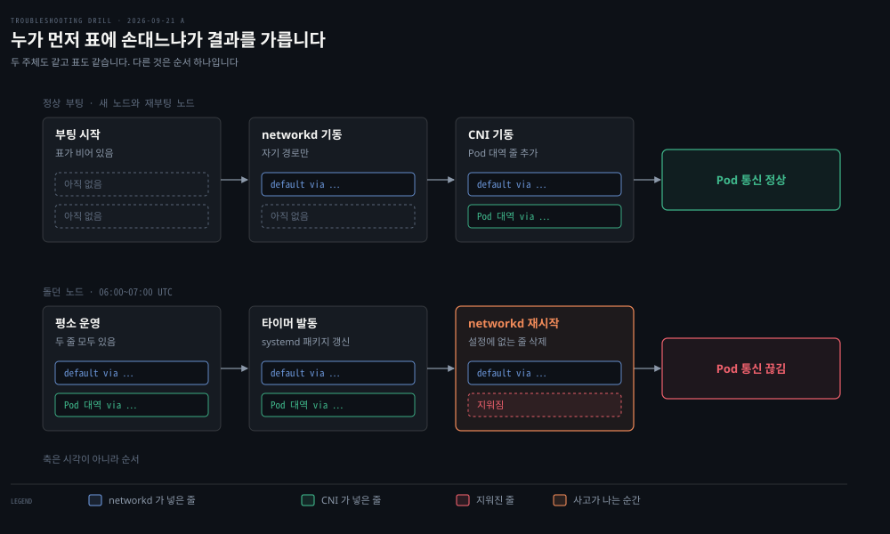

# 한 노드의 라우팅 테이블을 둘이 만질 때

---

> 커널의 라우팅 테이블은 노드에 하나뿐인데 거기 줄을 넣는 프로그램은 여럿입니다. 그중 하나가 "이 표는 내 것" 이라고 믿고 다시 뜨면, 자기가 넣지 않은 줄을 찌꺼기로 보고 치웁니다.

## 이 노트가 있는 이유

> 표를 읽을 줄 알아도 그 줄을 누가 넣었고 누가 지울 수 있는지를 모르면, 진단이 "줄이 없다" 에서 멈춥니다.

2026-09-21 A 문항에서 `ip route` 로 끊긴 노드와 새 노드를 나란히 놓는 데까지는 갔습니다. 컨테이너 대역 줄이 한쪽에만 없다는 것이 보이면 다음 물음은 "누가 넣었고 누가 지웠는가" 입니다. 그 칸이 비어 있었고, 표를 지운 주체인 `systemd-networkd` 라는 이름도 거기서 처음 나왔습니다.

라우팅 테이블을 커널의 자료구조로만 보면 이 물음이 떠오르지 않습니다. 표가 하나라 주인도 하나일 것 같기 때문입니다. 실제로는 여러 프로그램이 같은 표에 줄을 넣고, 그중 일부는 자기가 관리하는 표라고 믿고 정리까지 합니다.


## 한 표에 줄을 넣는 쪽은 여럿이다

> 노드의 표에는 커널, 네트워크 설정 데몬, CNI, 사람이 모두 줄을 넣습니다.

줄이 사라졌을 때 누가 지웠는지를 물으려면 먼저 누가 넣는지부터 셀 수 있어야 합니다. 쿠버네티스 노드도 떼어 놓고 보면 평범한 리눅스 서버입니다. NIC 하나, 라우팅 테이블 하나, netfilter 규칙과 conntrack 이 있고 쿠버네티스는 그 위에 얹힌 추상입니다. [Pod 네트워크와 Linux 기반 §1](../../08_cloud/kubernetes/04_networking/04-02.Pod%20%EB%84%A4%ED%8A%B8%EC%9B%8C%ED%81%AC%EC%99%80%20Linux%20%EA%B8%B0%EB%B0%98.md) 이 이 관점에서 출발합니다.

그 표 하나에 줄을 넣는 쪽을 꼽으면 이렇습니다.

| 누가 | 무엇을 넣나 | 언제 |
|------|-----------|------|
| 커널 | 인터페이스에 주소를 붙이면 생기는 직결 경로 | 주소가 붙는 순간 |
| 네트워크 설정 데몬 | 기본 경로, 설정 파일에 적힌 경로, DHCP 로 받은 경로 | 데몬이 뜨거나 임대를 받을 때 |
| CNI | Pod 대역으로 가는 경로 | Pod 가 붙을 때, 다른 노드의 대역을 배울 때 |
| 사람 | 그때그때 필요한 경로 | `ip route add` 를 칠 때 |

CNI 플러그인이 하는 일은 손으로 veth 를 만들고 경로를 넣던 실습과 같습니다. 네임스페이스를 정하고 인터페이스를 만들고 주소와 기본 경로를 넣습니다. 그 호출 한 번에 무엇이 넘어가는지는 [CNI와 kube-proxy §1](../../08_cloud/book/networking-and-kubernetes/04-02.CNI%EC%99%80%20kube-proxy%20%E2%80%94%20Pod%20%EB%84%A4%ED%8A%B8%EC%9B%8C%ED%81%AC%EC%9D%98%20%EB%B0%B0%EC%84%A0%EA%B3%B5%EA%B3%BC%20%EB%A1%9C%EB%93%9C%EB%B0%B8%EB%9F%B0%EC%84%9C.md) 이 적어 둡니다. 다른 노드의 Pod 대역을 어디서 배워 와 같은 표에 넣는지는 [노드 간 경로를 누가 퍼뜨리는가](./%EB%85%B8%EB%93%9C-%EA%B0%84-%EA%B2%BD%EB%A1%9C%EB%A5%BC-%EB%88%84%EA%B0%80-%ED%8D%BC%EB%9C%A8%EB%A6%AC%EB%8A%94%EA%B0%80.md) 가 따로 다룹니다.


## 표는 누가 넣었는지를 proto 한 칸에 적는다

> `ip route` 가 찍는 `proto` 칸이 그 줄을 넣은 쪽의 표식이고, 라우팅 데몬은 이 표식을 보고 치울 줄을 고릅니다.

줄 하나만 봐서는 누가 넣었는지 알 수 없을 것 같지만, 커널은 줄마다 표식을 하나 붙여 둡니다. `ip route` 출력의 `proto kernel` · `proto dhcp` · `proto static` 같은 칸입니다.

`ip-route(8)` 은 이것을 그 줄의 라우팅 프로토콜 식별자라고 부르고, 몇 값에 고정된 뜻을 줍니다.

| 값 | man page 가 주는 뜻 |
|----|------------------|
| `kernel` | 커널이 자동 설정 중에 넣은 줄 |
| `boot` | 부팅 과정에서 넣은 줄. 라우팅 데몬이 뜨면 전부 치웁니다 |
| `static` | 관리자가 동적 라우팅을 덮으려고 넣은 줄. 라우팅 데몬이 존중합니다 |
| `redirect` · `ra` | ICMP 리다이렉트와 라우터 탐색이 넣은 줄 |

눈여겨볼 값은 `boot` 입니다. `ip route add` 에 `proto` 를 주지 않으면 이 값이 붙고, man page 는 그 뜻을 이렇게 적습니다.

> *"If the routing protocol ID is not given, ip assumes protocol boot (i.e. it assumes the route was added by someone who doesn't understand what they are doing)."*
>
> *"boot - the route was installed during the bootup sequence. If a routing daemon starts, it will purge all of them."*

라우팅 데몬이 떠서 남의 줄을 치우는 것은 새 발상이 아니라 iproute2 가 오래 전제해 온 관례입니다. 나머지 값은 예약돼 있지 않아 누구든 자기 표식을 붙일 수 있다고 man page 는 덧붙입니다. CNI 가 자기 줄에 어떤 값을 붙이는지는 CNI 마다 다르고, 여기서는 확인하지 않았습니다.


## systemd-networkd 는 자기 설정에 없는 줄을 지운다

> 기본값에서 networkd 는 `.network` 파일에 없는 경로를 남의 것으로 보고 지웁니다. 예외는 `proto` 로 가릅니다.

재시작한 데몬이 CNI 의 줄을 지웠다면, 그 데몬이 무엇이고 왜 남의 줄에 손을 대는지가 다음 물음입니다. `systemd-networkd` 는 systemd 가 들고 있는 네트워크 설정 데몬입니다. `.network` · `.netdev` · `.link` 파일을 읽어 인터페이스를 올리고 주소와 경로를 넣습니다. [먼저 켜지는 것 하나가 나머지 전부를 켠다 §4](../../02_os/book/learning-modern-linux/06-01.%EB%A8%BC%EC%A0%80%20%EC%BC%9C%EC%A7%80%EB%8A%94%20%EA%B2%83%20%ED%95%98%EB%82%98%EA%B0%80%20%EB%82%98%EB%A8%B8%EC%A7%80%20%EC%A0%84%EB%B6%80%EB%A5%BC%20%EC%BC%A0%EB%8B%A4.md) 에서 본 대로 systemd 는 service·target·timer 같은 단위로 시스템을 조립하고, networkd 는 그중 네트워크를 맡은 service 입니다.

networkd 가 남의 경로를 어떻게 다루는지는 `networkd.conf(5)` 의 `[Network]` 절 옵션 `ManageForeignRoutes=` 가 정합니다.

> *"A boolean. When true, systemd-networkd will remove routes that are not configured in .network files (except for routes with protocol "kernel", "dhcp" when KeepConfiguration= is true or "dhcp", and "static" when KeepConfiguration= is true or "static"). When false, it will not remove any foreign routes, keeping them even if they are not configured in a .network file. Defaults to yes."*

기본값이 `yes` 이고 v246 에 들어왔습니다. 예외가 `proto` 값으로 적혀 있다는 점이 앞 절과 이어집니다. `kernel` 줄은 늘 남깁니다. `dhcp` 와 `static` 줄은 `KeepConfiguration=` 을 켰을 때만 남깁니다. 그 밖의 표식을 단 줄은 설정 파일에 없는 한 지울 대상이고, CNI 가 넣은 줄이 여기에 듭니다.

man page 는 왜 기본을 "지운다" 로 정했는지 적지 않습니다. 동작으로 읽으면 networkd 는 설정 파일을 원하는 상태로 보고, 거기서 벗어난 것을 드리프트로 치우는 선언형 데몬입니다. 기계의 네트워크 담당이 networkd 하나뿐이라면 옳은 설계입니다. 담당이 둘이 되는 순간 그 전제가 깨집니다.


## 부팅과 재시작은 순서가 달라 결과가 갈린다

> 두 주체도 같고 표도 같은데, 누가 먼저 표에 손대느냐로 결과가 갈립니다.

networkd 가 늘 남의 줄을 지운다면 쿠버네티스 노드는 부팅할 때마다 깨져야 합니다. 그렇지 않은 이유가 순서입니다.



부팅은 순서를 밟습니다. [먼저 켜지는 것 하나가 나머지 전부를 켠다 §2](../../02_os/book/learning-modern-linux/06-01.%EB%A8%BC%EC%A0%80%20%EC%BC%9C%EC%A7%80%EB%8A%94%20%EA%B2%83%20%ED%95%98%EB%82%98%EA%B0%80%20%EB%82%98%EB%A8%B8%EC%A7%80%20%EC%A0%84%EB%B6%80%EB%A5%BC%20%EC%BC%A0%EB%8B%A4.md) 가 적은 다섯 단계의 넷째에서 PID 1 이 시스템 데몬을 띄우고, 그 순서는 유닛 사이 의존으로 정해집니다. Datadog 은 이 사고의 보고에서 그 순서를 이렇게 적습니다.

> *"during a normal boot sequence systemd-networkd always starts before routing rules are installed by the CNI plugin."*

networkd 가 표를 훑는 시점에는 지울 남의 줄이 아직 없습니다. 재시작은 순서를 밟지 않습니다. 유닛 하나만 다시 띄우므로 그 유닛은 다른 유닛이 이미 해 둔 일 위에서 돕니다. 돌던 노드에서 networkd 만 다시 뜨면 CNI 의 줄이 이미 표에 있고, 기본값의 networkd 는 그 줄을 지웁니다.

이 차이가 재현을 속입니다. 새 노드를 띄우거나 재부팅하는 시험은 부팅 순서를 밟으므로 사고가 나지 않습니다. 이 부류를 시험하려면 사고의 순서를 그대로 밟아야 합니다. 줄이 깔린 노드에서 networkd 만 다시 띄우고 표를 다시 뜨는 것입니다.


## 막는 법은 세 층에 있다

> 지우는 쪽을 설정으로 묶거나, 넣는 쪽이 다시 맞춰 넣게 하거나, 재시작을 부르는 쪽을 막습니다.

지우는 쪽을 묶는 것이 가장 직접적입니다. `/etc/systemd/networkd.conf` 의 `[Network]` 절에 `ManageForeignRoutes=no` 를 두면 networkd 가 남의 경로를 건드리지 않습니다. 대가는 networkd 가 진짜 찌꺼기도 치우지 않게 된다는 것입니다.

넣는 쪽이 다시 맞춰 넣게 하는 것은 복원력의 문제입니다. 2025년 Heroku 는 자기 사고의 원인을 네트워크 서비스에서 찾았습니다. 그 서비스가 첫 부팅 때만 올바른 경로를 적용하는 예전 스크립트에 기대고 있어 재시작 뒤 경로가 다시 깔리지 않았다는 것입니다. 원리상 한 번 넣고 끝나는 쪽은 누가 지우면 그대로 비고, 표를 계속 원하는 상태로 맞추는 쪽은 지워져도 돌아옵니다.

재시작을 부르는 쪽을 막는 것은 한 층 위의 해법입니다. 이 사고의 재시작은 사람이 아니라 자동 보안 업데이트가 불렀고, 그 장치는 [파이프라인 밖에서 노드를 바꾸는 장치](./%ED%8C%8C%EC%9D%B4%ED%94%84%EB%9D%BC%EC%9D%B8-%EB%B0%96%EC%97%90%EC%84%9C-%EB%85%B8%EB%93%9C%EB%A5%BC-%EB%B0%94%EA%BE%B8%EB%8A%94-%EC%9E%A5%EC%B9%98.md) 가 다룹니다. Datadog 과 Heroku 모두 그쪽을 첫 조치로 적었습니다.


## 무엇을 보면 갈리는가

> 누가 넣었는지는 `proto` 로, 누가 관리하는지는 networkd 에게, 언제 지웠는지는 저널에 묻습니다.

```bash
# 줄마다 누가 넣었는가 — proto 칸을 본다
ip route show
ip route show proto kernel

# networkd 가 어느 링크를 관리하는가 — SETUP 칸이 configured 인지 unmanaged 인지
networkctl list

# networkd 가 실제로 읽는 설정 — drop-in 까지 합쳐서
systemd-analyze cat-config systemd/networkd.conf

# 언제 다시 떴고 무엇을 했는가
journalctl -u systemd-networkd
```

첫 줄로 끊긴 노드와 멀쩡한 노드를 비교하면 빠진 줄의 `proto` 가 보입니다. 그 값이 networkd 의 예외 목록에 없으면 지운 쪽을 networkd 로 좁힐 수 있습니다. 설정에 `ManageForeignRoutes=` 가 없으면 기본값 `yes` 가 살아 있는 것이고, 저널의 재시작 시각이 증상 시작과 맞물리면 갈림이 끝납니다. 알고 싶은 단위가 도구를 정한다는 원칙은 [무엇을 보려면 무엇을 치는가](./%EB%AC%B4%EC%97%87%EC%9D%84-%EB%B3%B4%EB%A0%A4%EB%A9%B4-%EB%AC%B4%EC%97%87%EC%9D%84-%EC%B9%98%EB%8A%94%EA%B0%80.md) 에 모아 두었습니다.


## 근거

> 1차 자료와 사고 보고를 가르고, 확인하지 않은 것은 그렇다고 적습니다.

- **1차** · [networkd.conf(5)](https://man7.org/linux/man-pages/man5/networkd.conf.5.html)
  - `[Network]` 절의 `ManageForeignRoutes=`. 기본값 `yes`, v246 도입, 예외는 `kernel`·`dhcp`·`static` 표식입니다
  - freedesktop.org 가 봇 차단으로 막혀 man7.org 렌더본(systemd 262~devel)으로 읽었습니다
- **1차** · [ip-route(8)](https://man7.org/linux/man-pages/man8/ip-route.8.html) — `protocol RTPROTO`. 값을 주지 않으면 `boot` 이고, `boot` 줄은 라우팅 데몬이 뜨면 치웁니다
- **1차** · [networkctl(1)](https://man7.org/linux/man-pages/man1/networkctl.1.html) — `list` 의 SETUP 칸이 `configured`·`unmanaged` 를 보입니다
- **2차** · [Datadog 2023-03-08 사고 보고](https://www.datadoghq.com/blog/2023-03-08-multiregion-infrastructure-connectivity-issue/) — 자동 업데이트로 networkd 가 재시작하며 Cilium 의 경로를 지웠고, 정상 부팅에서는 networkd 가 CNI 보다 먼저 뜹니다
- **2차** · [Heroku 2025-06-10 요약 보고](https://www.heroku.com/blog/summary-of-june-10-outage/) — 첫 부팅 때만 경로를 적용하는 예전 스크립트가 재시작 뒤 경로를 다시 깔지 못했습니다
- **확인 안 함**: CNI 마다 자기 경로에 붙이는 `proto` 값, networkd 가 관리하지 않는 링크(`unmanaged`)에 걸린 남의 경로까지 지우는지, `KeepConfiguration=` 의 세부


## 나온 문항

> 이 개념이 갈라져 나온 회차입니다.

- [배포하지 않은 아침에 끊긴 리전 다섯 곳](../os/2026-09-21_%EB%B0%B0%ED%8F%AC%ED%95%98%EC%A7%80%20%EC%95%8A%EC%9D%80%20%EC%95%84%EC%B9%A8%EC%97%90%20%EB%81%8A%EA%B8%B4%20%EB%A6%AC%EC%A0%84%20%EB%8B%A4%EC%84%AF%20%EA%B3%B3.md) — A 2026-09-21. 자동 업데이트가 networkd 를 다시 띄워 CNI 의 줄이 지워졌습니다


## 관련 문서

- [개념 노트 지도](./README.md) — 무엇이 여기 오고 무엇이 문항에 남나
- [파이프라인 밖에서 노드를 바꾸는 장치](./%ED%8C%8C%EC%9D%B4%ED%94%84%EB%9D%BC%EC%9D%B8-%EB%B0%96%EC%97%90%EC%84%9C-%EB%85%B8%EB%93%9C%EB%A5%BC-%EB%B0%94%EA%BE%B8%EB%8A%94-%EC%9E%A5%EC%B9%98.md) — 이 재시작을 부른 쪽
- [노드 간 경로를 누가 퍼뜨리는가](./%EB%85%B8%EB%93%9C-%EA%B0%84-%EA%B2%BD%EB%A1%9C%EB%A5%BC-%EB%88%84%EA%B0%80-%ED%8D%BC%EB%9C%A8%EB%A6%AC%EB%8A%94%EA%B0%80.md) — 다른 노드의 Pod 대역 줄이 어디서 오는가
- [결국은 선과 공기를 타고 다니는 비트다 §8](../../02_os/book/learning-modern-linux/07-01.%EA%B2%B0%EA%B5%AD%EC%9D%80%20%EC%84%A0%EA%B3%BC%20%EA%B3%B5%EA%B8%B0%EB%A5%BC%20%ED%83%80%EA%B3%A0%20%EB%8B%A4%EB%8B%88%EB%8A%94%20%EB%B9%84%ED%8A%B8%EB%8B%A4.md) — 라우팅 테이블이 다음 걸음을 정한다, `ip route`
- [먼저 켜지는 것 하나가 나머지 전부를 켠다](../../02_os/book/learning-modern-linux/06-01.%EB%A8%BC%EC%A0%80%20%EC%BC%9C%EC%A7%80%EB%8A%94%20%EA%B2%83%20%ED%95%98%EB%82%98%EA%B0%80%20%EB%82%98%EB%A8%B8%EC%A7%80%20%EC%A0%84%EB%B6%80%EB%A5%BC%20%EC%BC%A0%EB%8B%A4.md) — 부팅 다섯 단계, PID 1, 유닛
- [CNI와 kube-proxy §1](../../08_cloud/book/networking-and-kubernetes/04-02.CNI%EC%99%80%20kube-proxy%20%E2%80%94%20Pod%20%EB%84%A4%ED%8A%B8%EC%9B%8C%ED%81%AC%EC%9D%98%20%EB%B0%B0%EC%84%A0%EA%B3%B5%EA%B3%BC%20%EB%A1%9C%EB%93%9C%EB%B0%B8%EB%9F%B0%EC%84%9C.md) — CNI 호출 한 번에 넘어가는 것
- [Linux 네트워크 진단 도구 §6](../../08_cloud/book/networking-and-kubernetes/02-04.Linux%20%EB%84%A4%ED%8A%B8%EC%9B%8C%ED%81%AC%20%EC%A7%84%EB%8B%A8%20%EB%8F%84%EA%B5%AC%20%E2%80%94%20%EA%B3%84%EC%B8%B5%20%EC%88%9C%EC%84%9C%EB%8C%80%EB%A1%9C%20%EC%88%98%EC%82%AC%ED%95%98%EA%B8%B0.md) — 데이터패스를 따라 좁히는 사다리
