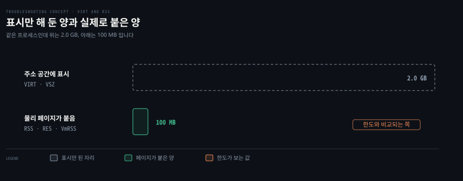
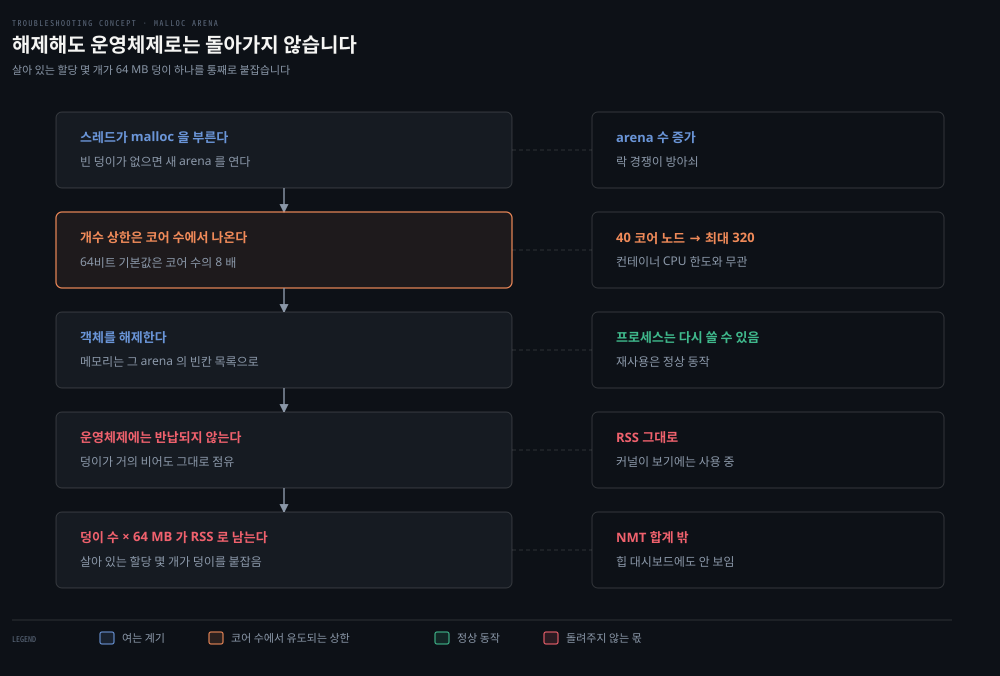
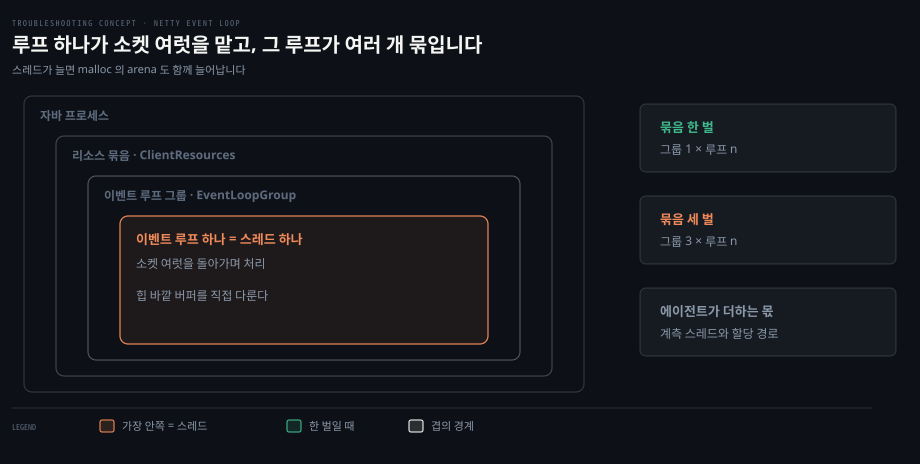

# 힙 밖에서 쌓이는 메모리

---

> 커널이 컨테이너 한도와 비교하는 것은 힙이 아니라 프로세스가 물리 메모리에 올려 둔 전부입니다. 그 안에는 JVM 이 세는 여섯 칸이 있고, 그 밖에 JVM 이 세지 않는 몫이 또 있습니다.

## 이 노트가 있는 이유

> 힙 대시보드가 평평하면 메모리를 다 본 것 같지만, 그 그래프가 보여 주는 것은 여섯 칸 중 하나입니다.

2026-09-14 E 문항에서 막힌 자리가 여기였습니다. "힙이 아니면 다른 곳"까지는 갔는데, 그 다른 곳의 목록이 없어 더 내려가지 못했습니다. 그리고 `OutOfMemoryError` 가 없다는 사실로 자바 쪽 누수 전체를 지우려 했습니다.

그 예외는 **JVM 이 스스로 지키는 한도**에 걸렸을 때만 나옵니다. JVM 이 한도를 두지 않은 메모리는 조용히 자라고, 커널이 컨테이너 한도에서 그것을 먼저 만납니다. 그래서 이 축이 없으면 진단이 힙 그래프 앞에서 멈춥니다.


## 잡아 둔 것과 실제로 올라온 것

> 주소 공간을 잡아 달라는 요청과 물리 페이지가 붙는 일은 다른 사건입니다. 한도와 비교되는 것은 뒤엣것입니다.



프로세스가 "이만큼 쓸 자리를 잡아 달라"고 하면 커널은 주소 공간에 표시만 합니다. 그 주소에 값을 쓰는 순간 물리 페이지가 붙고, 그때부터 그 몫이 RSS 로 셈에 들어갑니다.

| 이름 | 무엇 | 어디서 읽나 |
|------|------|-----------|
| VIRT · VSZ | 주소 공간에 표시된 총량 | `top` 의 `VIRT`, `ps -o vsz` |
| RSS · RES | 물리 메모리에 올라간 양 | `top` 의 `RES`, `ps -o rss`, `/proc/<pid>/status` 의 `VmRSS` |
| working set | 컨테이너가 쓰고 있다고 커널이 세는 양 | `container_memory_working_set_bytes` |

`-Xmx2800m` 으로 띄운 JVM 의 RSS 가 초반에 그보다 훨씬 작은 이유가 이것입니다. 힙 주소는 잡아 뒀지만 아직 다 만지지 않았기 때문입니다. 반대로 한도를 채워 죽는 순간에 봐야 하는 값도 이것입니다.


## 한도와 비교되는 것은 JVM 이 아는 몫이 아닙니다

> 자바 프로세스의 메모리는 힙 하나가 아니라 여러 칸이고, 그 칸들의 합조차 RSS 보다 작습니다.

```bash
# JVM 이 스스로 세는 여섯 칸
힙                객체가 사는 곳. -Xmx 가 한도를 정한다
메타스페이스        클래스 정보. 힙 바깥이다
코드 캐시          JIT 가 만든 기계어
스레드 스택         스레드 하나마다 한 덩이
direct buffer     힙 바깥에 잡는 입출력 버퍼
GC 자료구조        컬렉터가 일하려고 따로 쓰는 메모리

# JVM 이 세지 않는 몫
C 라이브러리가 malloc 으로 내준 메모리
```

대시보드의 "힙 사용량"은 첫 줄 하나입니다. 그래서 힙이 평평하다는 관찰로 지워지는 것은 **힙 누수**뿐입니다. 나머지 다섯 칸은 아무 말도 하지 않았고, 일곱 번째 줄은 JVM 에게 물어도 답이 없습니다.

`OutOfMemoryError` 의 범위도 같은 방식으로 좁혀 읽습니다. 힙이 꽉 차면 그 예외가 나오고, `MaxDirectMemorySize` 처럼 JVM 이 한도를 둔 영역도 넘으면 알립니다. 한도가 없는 쪽은 예외를 만들지 않습니다.


## arena 는 왜 쌓이는가

> 해제한 메모리가 프로세스 안에서는 재사용되지만 운영체제로는 돌아가지 않습니다. 누수가 아니라 반납이 없는 것입니다.



`malloc` 은 요청마다 커널에 가지 않습니다. 큰 덩이를 미리 받아 두고 그 안에서 잘라 줍니다. 그 덩이가 **arena** 이고, 스레드가 같은 arena 의 락을 다투면 새 덩이를 엽니다.

여기서 둘이 겹칩니다.

첫째, **개수 상한이 코어 수에서 나옵니다.** 64비트 기본값이 코어 수의 8배라 40코어 노드에서는 320개까지 열립니다. 컨테이너에 CPU 를 2개만 줬어도 그렇습니다. cgroup 의 CPU 한도는 쓸 수 있는 시간의 몫을 자르는 것이라 코어 목록을 가리지 않고, C 라이브러리는 cgroup 이 아니라 기계에 코어 수를 묻습니다.

둘째, **한 번 연 덩이는 거의 돌려주지 않습니다.** 객체를 해제하면 그 메모리는 arena 의 빈칸 목록으로 돌아갑니다. 프로세스는 다시 쓸 수 있지만 커널은 돌려받지 못하므로 RSS 가 내려가지 않습니다. 살아 있는 할당 몇 개가 64MB 덩이 하나를 통째로 붙잡습니다.

그래서 증상이 누수처럼 보입니다. 재시작하면 한동안 버티고, 시간이 지나며 조금씩 올라 한도에 닿습니다. 애플리케이션은 아무것도 잃지 않았는데 커널이 보기에는 계속 점유 중입니다.

64MB 라는 크기는 소스에서 나옵니다. arena 힙의 최대 크기가 `2 * DEFAULT_MMAP_THRESHOLD_MAX` 이고, 64비트에서 뒤의 값이 32MB 입니다.


## 스레드가 늘면 arena 도 늘어납니다

> arena 는 스레드 경쟁에서 열리므로, 스레드를 늘리는 구성이 곧 메모리를 늘리는 구성이 됩니다.



Netty 의 이벤트 루프는 스레드 하나가 소켓 여럿의 입출력을 돌아가며 처리하는 구조입니다. 그 루프를 여럿 묶은 것이 그룹이고, 그룹은 클라이언트의 리소스 묶음이 갖습니다. 그룹 크기의 기본값은 대개 CPU 수에서 유도됩니다.

문제는 묶음을 여러 벌 만들 때입니다. Redis 클라이언트를 만들며 리소스 묶음을 공유하지 않으면 그룹도 그만큼 생기고, 가장 안쪽 스레드 수가 곱해집니다. 계측 에이전트가 붙어 있으면 스레드와 할당 경로가 한 겹 더 늘어납니다.

**스레드 수를 줄이는 것이 메모리 처방이 되는 경로**가 여기입니다. 스레드를 줄이면 경쟁이 줄고, 경쟁이 줄면 열리는 arena 도 줄어듭니다.


## 무엇을 보면 갈리는가

> 알고 싶은 것은 "한도를 채운 양 중 JVM 이 아는 몫이 얼마냐"입니다. 두 값을 나란히 놓는 것에서 시작합니다.

```bash
# 1. 커널이 세는 값과 JVM 이 세는 값을 한 그래프에
#    process.rss (또는 container_memory_working_set_bytes) 옆에 jvm.memory.committed

# 2. NMT — JVM 을 이 옵션으로 띄워 둬야 한다
#    -XX:NativeMemoryTracking=summary
jcmd <pid> VM.native_memory baseline
jcmd <pid> VM.native_memory summary.diff

# 3. NMT 합계가 RSS 보다 한참 작으면 JVM 바깥이다. 덩이의 모양을 본다
pmap -x <pid>            # 64 MB 짜리 익명 매핑이 길게 늘어서는지
```

갈림은 2번에서 납니다. NMT 의 어느 영역이 함께 자라면 JVM 이 아는 곳이므로 그 영역을 따라갑니다. NMT 합계는 평평한데 RSS 만 오르면 3번으로 내려갑니다.

`top` 은 총량까지만 말해 줍니다. 무엇이 채웠는지는 메모리 지도를 열어야 보입니다.


## 손잡이는 메모리와 지연을 교환합니다

> arena 개수 상한을 직접 못 박으면 메모리는 줄고 락 경쟁은 늡니다. 공짜가 아닙니다.

```bash
MALLOC_ARENA_MAX=4       # 코어 수에서 유도되지 않게 개수 상한을 직접 준다
```

2026-09-14 E 문항의 원문이 Redis 를 많이 쓰는 경로에서 값을 바꿔 가며 잰 결과입니다.

| `MALLOC_ARENA_MAX` | 정상 상태 RSS | p99 지연 |
|---|---|---|
| 설정 안 함 (노드 40코어 × 8) | 몇 시간 안에 OOMKilled | — |
| 8 | 약 3.2 GB | 기준 |
| 4 | 약 2.4 GB | 기준 대비 +2% |
| 2 | 약 2.0 GB | 기준 대비 +11% |

4 를 고른 이유가 표에 보입니다. 2 까지 내리면 메모리는 더 줄지만 경쟁이 늘어 지연이 11% 올랐습니다. 그 밖의 처방은 스레드를 줄이는 것과, 할당기를 jemalloc 이나 tcmalloc 으로 바꾸는 것입니다.


## 근거

> 등급을 붙입니다. 확인하지 않은 것은 확인하지 않았다고 적습니다.

- **1차** · [mallopt(3)](https://man7.org/linux/man-pages/man3/mallopt.3.html): `M_ARENA_MAX` 는 만들 수 있는 arena 수의 상한이고 기본값 0 은 "상한을 `M_ARENA_TEST` 설정에 따라 정한다"는 뜻입니다. 같은 페이지가 arena 수와 스레드 수의 교환을 적습니다 — arena 가 많으면 스레드당 경쟁은 줄고 메모리 사용은 늡니다
- **1차** · glibc 소스 `malloc/arena.c`: 상한을 코어 수에서 유도하는 계산과 arena 힙의 최대 크기가 여기 있습니다. man 페이지는 곱수를 적지 않으므로 숫자는 소스로 확인했습니다 (2026-09-14 확인)
- **1차** · [JDK-8146115](https://bugs.openjdk.org/browse/JDK-8146115): JVM 이 운영체제 대신 컨테이너 설정에서 CPU 수와 메모리 한도를 읽도록 바꾼 변경입니다. JDK 10 에 들어가고 8u191 로 백포트됐으며 `-XX:-UseContainerSupport` 로 끌 수 있습니다. **JVM 쪽은 막혔고 그 밑의 C 라이브러리는 그대로**라는 것이 이 노트의 전제입니다
- **2차** · 2026-09-14 E 문항의 원문: RSS 와 힙의 차이, NMT 가 설명한 몫, `MALLOC_ARENA_MAX` 별 측정치
- **확인 안 함**: `cpuset` 으로 코어를 묶어 둔 컨테이너에서 C 라이브러리가 코어 수를 2로 읽는지. glibc 가 코어 수를 세는 경로가 2023년에 procfs·sysfs 방식으로 되돌아갔다는 사실만 확인했고, cpuset 환경의 실측은 하지 않았습니다


## 나온 문항

> 이 개념이 갈라져 나온 회차입니다.

- [힙은 평평한데 몇 시간마다 죽는 컨테이너](../runtime/2026-09-14_%ED%9E%99%EC%9D%80%20%ED%8F%89%ED%8F%89%ED%95%9C%EB%8D%B0%20%EB%AA%87%20%EC%8B%9C%EA%B0%84%EB%A7%88%EB%8B%A4%20%EC%A3%BD%EB%8A%94%20%EC%BB%A8%ED%85%8C%EC%9D%B4%EB%84%88.md) — E 2026-09-14. 힙 대시보드가 평평한 채로 컨테이너가 한도에 닿았습니다


## 관련 문서

- [개념 노트 지도](./README.md) — 무엇이 여기 오고 무엇이 문항에 남나
- [Native Memory Tracking — NMT와 shared library 한계](../../01_language/book/jpf_java-performance/08-02.Native%20Memory%20Tracking%20%E2%80%94%20NMT%EC%99%80%20shared%20library%20%ED%95%9C%EA%B3%84.md) — NMT 가 무엇을 세고 무엇을 못 보는지, `MALLOC_ARENA_MAX` 가 나오는 자리
- [실전 — Docker 컨테이너 네이티브 메모리와 OOMKilled](../../01_language/book/Inside%20the%20Java%20Virtual%20Machine%20JVM%20Advanced%20Features%20and%20Best%20Practices/ch02_automatic-memory-management/01-05.%EC%8B%A4%EC%A0%84%20%E2%80%94%20Docker%20%EC%BB%A8%ED%85%8C%EC%9D%B4%EB%84%88%20%EB%84%A4%EC%9D%B4%ED%8B%B0%EB%B8%8C%20%EB%A9%94%EB%AA%A8%EB%A6%AC%EC%99%80%20OOMKilled.md) — 힙은 멀쩡한데 RSS 가 터진 다른 사례. 거기는 닫지 않은 `Inflater` 의 네이티브 메모리였습니다
- [cgroup 사례 — Endowus OOMKilled](../../02_os/kernel/01-06.cgroup%20%EC%82%AC%EB%A1%80%20%E2%80%94%20Endowus%20OOMKilled.md) — RSS 와 힙의 관계, `MaxRAMPercentage` 로 한도에서 힙을 잡는 구성
- [cgroup v2 깊이](../../02_os/kernel/01-02.cgroup%20v2%20%EA%B9%8A%EC%9D%B4.md) — CPU 한도가 시간의 몫으로 잘리는 방식과 메모리 한도의 계정
- [OOMKilled 사례 분석](../../08_cloud/kubernetes/09_operations/09-02.OOMKilled%20%EC%82%AC%EB%A1%80%20%EB%B6%84%EC%84%9D.md) — 쿠버네티스 쪽에서 같은 증상을 읽는 순서
- [바이트 버퍼](../../09_spring/03_network/reactive-net/01-05.%EB%B0%94%EC%9D%B4%ED%8A%B8%20%EB%B2%84%ED%8D%BC.md) — Netty 가 힙 바깥 버퍼를 다루는 방식
- [무엇을 보려면 무엇을 치는가](./%EB%AC%B4%EC%97%87%EC%9D%84-%EB%B3%B4%EB%A0%A4%EB%A9%B4-%EB%AC%B4%EC%97%87%EC%9D%84-%EC%B9%98%EB%8A%94%EA%B0%80.md) — 알고 싶은 단위가 도구를 정한다
