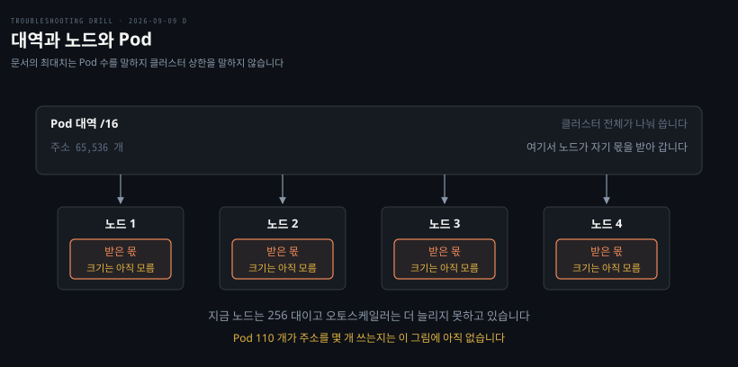
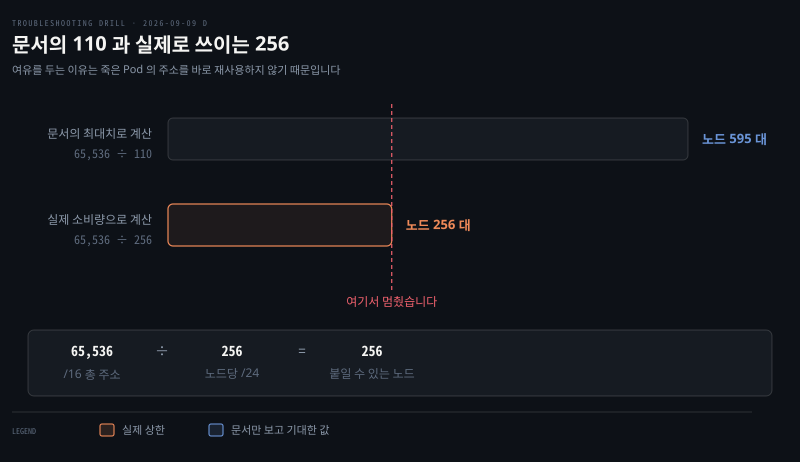

# 절반만 뜨고 멈춘 배포

---

> 노드가 소비하는 것은 Pod 수가 아니라 할당받는 IP 블록입니다. 문서의 최대치로 계산하면 두 배 넘게 틀립니다.


## 문제 소개

> 배포가 한 시간이 지나도 안 끝나고 절반만 떠 있습니다. 오토스케일러가 켜져 있는데 노드가 늘지 않습니다.

**출처** · [loveholidays · When GKE ran out of IP addresses](https://deploy.live/blog/when-gke-ran-out-of-ip-addresses/) (2022)



새 Pod 중 절반 정도만 뜨고 나머지는 계속 `Pending` 입니다. 안 뜨는 Pod 를 `describe` 하면 자원이 모자란 것처럼 보입니다.

```pseudocode
0/256 nodes are available:
  1 node(s) were unschedulable,
  173 Insufficient memory,
  214 node(s) didn't match node selector,
  87 Insufficient cpu.
```

애플리케이션도 노드풀 설정도 이 배포 전후로 건드리지 않았습니다. GKE 이고 VPC 네이티브 모드입니다.

Pod 대역으로 `/16` 을 잡아 두어 주소가 65,536 개입니다. 노드당 Pod 는 문서에 적힌 최대치인 110 개로 두었고, 그 계산이면 노드를 595 대까지 붙일 수 있어야 합니다. 지금 노드는 256 대입니다.

출력에서 읽히는 것은 스케줄러가 자원을 재 봤고 모자랐다는 사실입니다. 읽히지 않는 것은 노드당 IP 를 얼마나 쓰는지입니다. 증상은 Pod 수만 말하고 그것은 말하지 않습니다.


## 원인 분석

> Pod 대역이 고갈됐습니다. 노드가 소비하는 단위가 Pod 수가 아니라 IP 블록이라 문서의 최대치와 실제 상한이 두 배 넘게 벌어집니다.



같은 `/16` 을 두 방식으로 나눈 결과입니다. 아래가 실제로 일어난 계산이고, 점선이 노드가 멈춘 지점입니다.

**배제된 것.** 노드 상태 이상이 아닙니다. `NotReady` 노드는 스케줄러가 후보에서 제외하므로 `Insufficient memory` 가 아니라 taint 관련 메시지가 나옵니다. 자원을 재 봤다는 것은 노드가 살아서 스케줄링 대상이었다는 뜻이고, 기존 Pod 도 정상입니다.

**배제된 것.** 애플리케이션과 노드풀 설정 변경도 아닙니다. 배포 전후로 변경 이력이 없습니다.

**낮아진 것.** 순수한 자원 부족은 우선순위가 내려갑니다. 자원이 모자라면 오토스케일러가 노드를 늘려야 하는데 켜져 있는데도 안 늘어납니다. 무엇을 더 보면 갈리느냐 — 오토스케일러가 왜 못 늘렸는지를 보면 됩니다.

**남은 것.** Pod 대역 고갈입니다. 새 노드를 만들려면 IP 블록을 하나 떼 줘야 하는데 남은 것이 없어 오토스케일러가 확장에 실패했고, 그래서 자원 부족이 해소되지 않았습니다.

에러 메시지가 진단을 흐립니다. 1 + 173 + 214 + 87 은 475 인데 노드는 256 대이므로 한 노드가 여러 이유로 중복 집계된 것입니다. 요점은 개별 숫자가 아니라 스케줄러의 결론이 "자리가 없다"였다는 사실입니다.

### 노드당 소비량이 Pod 수와 다릅니다

GKE 공식 문서가 이렇게 적습니다. 노드당 최대 Pod 수를 따로 정하지 않으면 GKE 는 각 노드에 `/24` 즉 **256 개 주소**를 할당하고, 그 256 개로 최대 **110 개 Pod** 를 받칩니다.

Pod 110 개에 주소 256 개를 주는 이유는 여유입니다. Pod 가 죽고 새로 뜰 때 주소를 즉시 재사용하면 옛 연결이 엉뚱한 곳으로 갈 수 있어, 한동안 비워 둡니다. 그래서 대략 두 배 이상을 잡습니다.

여기서 계산이 갈립니다.

```pseudocode
문서의 최대치로       65,536 ÷ 110 = 595 대
실제 소비량으로       65,536 ÷ 256 = 256 대     ← 실제 상한
```

노드가 정확히 256 대에서 멈춘 것이 우연이 아닙니다. 주소를 다 썼습니다. 문서에 적힌 "최대 110 Pod" 를 그대로 나누면 두 배 넘게 낙관적인 수가 나옵니다.


## 해결 방법

> 대역을 넓히거나 노드당 소비를 줄입니다. 둘 다 못 하면 노드를 크게 만들어 대수를 줄입니다.

```bash
# 오토스케일러가 왜 못 늘렸는지 — 이벤트가 아니라 상태 오브젝트에 남습니다
kubectl describe -n kube-system configmap cluster-autoscaler-status
#   IP space of '...' is exhausted. 가 있으면 확정입니다
#   no.scale.up.nodegroup.max.limit.reached 면 노드풀 상한 문제로 갈립니다

# 이 노드가 실제로 받은 Pod 수용량
kubectl get node <NODE> -o jsonpath='{.status.allocatable.pods}'
```

- **응급**: 일부 노드풀에서 노드당 최대 Pod 수를 낮췄습니다. 110 을 줄이면 GKE 가 주는 블록도 작아져 IP 소비가 약 30% 줄었습니다
- **재발 방지**: 남은 IP 를 지표로 잡아 알람을 겁니다. 노드를 크게 만들어 노드 대수를 줄이는 방법도 함께 씁니다. 서브넷 확장은 secondary range 변경이라 문서가 부족해 피했습니다
- **검증**: 조치 뒤 오토스케일러 상태에서 고갈 메시지가 사라지고 `Pending` Pod 가 해소되는지 봅니다


## 다른 방법 비교

> Pod 가 Pending 에 남는 원인은 여럿이고, 오토스케일러 상태가 갈림길입니다.

노드풀 최대 대수에 걸린 경우가 가장 비슷합니다. 이때도 노드가 안 늘고 Pod 가 Pending 인데, 오토스케일러 상태에 `max.limit.reached` 가 남습니다.

Pod 의 requests 가 어떤 노드 타입에도 안 맞는 경우도 있습니다. 이때는 오토스케일러가 "늘려도 못 담는다"고 판단해 아예 시도하지 않으므로 실패 기록조차 없습니다.

`nodeSelector` 나 taint 로 후보 노드가 없는 경우도 같은 모습입니다. 다만 이쪽은 에러 메시지가 자원이 아니라 선택자 불일치로 몰립니다.

흔히 먼저 떠올리지만 틀린 선택지가 노드 상태 점검입니다. `NotReady` 였다면 애초에 자원 계산 대상이 아니므로 메시지 형태가 달라집니다. 이 구분을 먼저 하면 한 층을 건너뜁니다.


## 내 접근과 실제가 갈린 자리

> 스스로 배제를 뒤집었고, 증상에 없는 정보를 짚었습니다.

| 단계 | 내가 간 길 | 실제 | 갈린 이유 |
|------|-----------|------|----------|
| 첫 의심 | 노드 상태·노드 간 통신 | 노드는 정상 | 스스로 배제 — "준비 안 된 노드면 자원 이슈가 안 뜬다" |
| 관찰 | 노드당 CIDR 이 명시 안 됐고 그것이 노드 수를 정한다 | 같음 | 정답의 뼈대를 스스로 짚음 |
| 계산 | 110 이면 128(`/25`) | GKE 기본은 256(`/24`) | 2 의 거듭제곱 발상은 맞고 기본값이 다름 |
| 방향 전환 | Pod 가 아니라 오토스케일러를 봐야 함 | 같음 | 스스로 도달 |
| 첫 확인 | kube-system 어딘가 | `cluster-autoscaler-status` ConfigMap | 이름을 못 댐 |
| 처방 | 미작성 | 노드당 Pod 수 축소 | 첫 확인이 갈리지 않아 도달 못 함 |

배제를 스스로 뒤집은 것이 이 회차의 소득입니다. 노드 상태를 의심했다가 "준비 안 된 노드면 자원 이슈가 안 뜨는 것 아니냐"로 스스로 지웠습니다. 관찰과 배제를 한 문장에 이은 자리입니다.

증상에 **없는** 정보를 짚은 것도 같은 종류입니다. 노드당 CIDR 이 명시되지 않았고 그것이 이론적 노드 수를 정한다는 지적이 곧 정답이었습니다. 주어진 것만 보지 않고 빠진 것을 물었습니다.


## 나온 개념

> 여러 문항에 걸치는 이론은 개념 노트에 모읍니다. 여기서는 이 문항에서 걸린 지점만 적습니다.

- [한도는 어디서 오는가](../_concepts/한도는-어디서-오는가.md) — 이 문항이 "제품이 구조로 정한 한도"의 사례입니다. 문서가 적은 최대치와 실제 도달 가능한 상한이 다릅니다

### 문서의 최대치가 곧 상한은 아닙니다

문서에 적힌 수는 대개 **한 단위가 감당할 수 있는 최대**이고, 실제 상한은 그 단위가 **소비하는 자원**으로 정해집니다. 둘이 같으면 곱셈이 맞지만 여기처럼 여유를 두고 할당하면 두 배 넘게 벌어집니다.

용량을 계산할 때 물을 것은 "하나가 몇 개를 담나"가 아니라 "하나가 무엇을 얼마나 쓰나"입니다.

### 확장 실패는 상태 오브젝트에 남습니다

오토스케일러는 실패 이유를 이벤트가 아니라 ConfigMap 에 적습니다. 이벤트는 시간이 지나면 사라지지만 상태는 남으므로, 확장이 안 될 때 먼저 볼 곳이 여기입니다.

근거는 원 사례와 [GKE 공식 문서](https://docs.cloud.google.com/kubernetes-engine/docs/concepts/alias-ips)이고, 할당 규칙이 지금도 같음을 2026-09-09 에 확인했습니다.


## 관련 문서

- [D 계층 목록](./README.md) — 클러스터 바깥
- [회차 로그](../_drill/log.md) — 이 문항을 푼 날의 점수와 막힌 지점
- [한도는 어디서 오는가](../_concepts/한도는-어디서-오는가.md) — 숫자의 출처를 묻는 축
