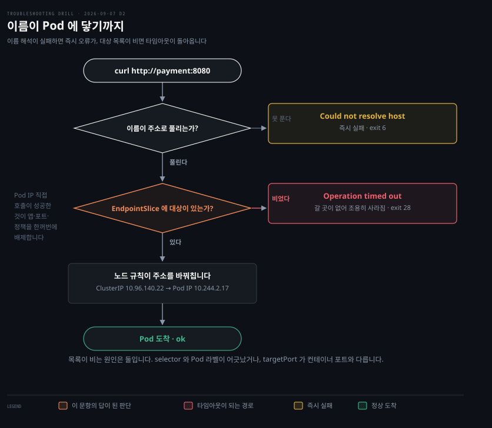

# Pod 로는 되고 이름으로는 안 되는 호출

---

> Pod IP 직접 호출이 성공했다는 사실 하나가 후보 여럿을 한꺼번에 지웁니다. 그러면 남는 것은 이름으로 부를 때만 지나는 두 관문입니다.

## 문제 소개

> Pod 는 멀쩡하고 직접 부르면 응답하는데, Service 이름으로 부르면 시간만 흐릅니다.

배포한 결제 서비스에 같은 네임스페이스의 다른 Pod에서 접근이 안 됩니다.

```bash
# kubectl get pods -l app=payment
NAME                      READY   STATUS    RESTARTS   AGE
payment-7d4b9c6f8-x2klm   1/1     Running   0          12m

# kubectl get svc payment
NAME      TYPE        CLUSTER-IP      PORT(S)    AGE
payment   ClusterIP   10.96.140.22    8080/TCP   12m

# kubectl exec -it client -- curl -s -m 3 http://10.244.2.17:8080/health
ok

# kubectl exec -it client -- curl -s -m 3 http://payment:8080/health
curl: (28) Operation timed out after 3001 milliseconds
```

Pod는 Running이고 Ready입니다. Pod IP로 직접 부르면 응답이 오고, 이름으로 부르면 시간만 흐릅니다.

여기까지가 확인된 사실입니다. 아직 모르는 것은 이름이 주소로 풀렸는지, 풀렸다면 그 주소 뒤에 대상이 서 있는지 둘입니다. 출력 어디에도 그 답이 없습니다.


## 원인 분석

> 성공한 관찰이 후보를 지웁니다. 남는 것은 이름을 주소로 바꾸는 일과, 그 주소가 어느 Pod 로 갈지 아는 일 둘입니다.



Pod IP 직접 호출이 `ok`였다는 것은 애플리케이션도, 컨테이너 포트도, Pod 사이 네트워크 경로도 살아 있다는 뜻입니다.

NetworkPolicy도 이 사실 하나로 지워집니다. 정책은 Pod의 인터페이스에서 평가되는데, Service로 온 패킷도 노드에서 이미 Pod IP로 바뀐 뒤 도착합니다.

```bash
Service 경로:  dst=10.96.140.22 → [노드에서 DNAT] → dst=10.244.2.17 → Pod
Pod IP 경로:   dst=10.244.2.17  → (변환 없음)     → dst=10.244.2.17 → Pod
```

도착 시점에 두 패킷은 목적지가 같습니다. 정책 입장에서는 어느 길로 왔는지 알 방법이 없으므로, 막고 있었다면 직접 호출도 실패했어야 합니다.

`targetPort` 불일치는 배제까지는 가지 않고 순위만 내려갑니다. 그 경우에도 이름으로만 실패할 수 있지만, 대상 목록은 차 있으므로 목록이 비었는지 확인하는 순간 갈립니다. 배제된 것과 낮아진 것을 섞어 두면 확인 순서가 흐려집니다.

**남은 것은 두 관문입니다.** 그리고 `curl`이 낸 오류가 둘을 가릅니다. 이름 해석이 실패했다면 `Could not resolve host`가 났을 텐데 타임아웃이 났습니다. 주소까지는 찾았는데 그 주소가 아무 데로도 안내하지 않았다는 뜻입니다.

Service는 `selector`에 적힌 라벨로 자기 뒤에 세울 Pod를 고릅니다. 그 라벨이 Pod의 실제 라벨과 어긋나면 아무도 안 걸리고 EndpointSlice는 빈 채로 남습니다. 목록이 비면 노드에는 만들 규칙이 없고, 바꿔칠 대상이 없으니 패킷은 갈 곳을 잃습니다.


## 해결 방법

> Service 가 들고 있는 대상 목록을 확인하고, selector 와 라벨을 나란히 놓습니다.

```bash
# 예상 — 목록이 비어 있으면 selector 가 아무도 못 고른 것입니다
kubectl get endpoints payment

# 예상 — 이 둘의 라벨이 어긋나 있으면 원인이 확정됩니다
kubectl get svc payment -o jsonpath='{.spec.selector}'
kubectl get pod payment-7d4b9c6f8-x2klm --show-labels
```

목록이 비어 있으면 selector와 라벨을 비교합니다. 반대로 목록이 차 있으면 라벨 가설을 버리고 `targetPort` 와 kube-proxy 쪽으로 넘어갑니다.

- **응급**: 라벨을 맞춰 붙입니다. `kubectl label pod ... app=payment` 또는 Service selector 수정
- **재발 방지**: 매니페스트에서 Service의 `selector`와 Deployment의 `template.metadata.labels`를 **같은 값에서 끌어오게** 만듭니다. Helm이면 `_helpers.tpl`의 공통 라벨, Kustomize면 `commonLabels`입니다
- **검증**: 이 회차는 지면 풀이라 실행하지 않았으므로 계획으로 남깁니다. 라벨을 맞춘 뒤 `kubectl get endpoints payment` 에 Pod IP 가 올라오고, 처음 실패했던 `curl -m 3 http://payment:8080/health` 가 타임아웃 대신 `ok` 를 돌려주면 확정입니다. 라벨을 다시 떼어 증상이 재현되는 것까지 보면 더 확실합니다

손으로 두 곳에 같은 문자열을 적는 한 언젠가 어긋납니다.


## 다른 방법 비교

> 목록이 비는 원인은 둘이고, kube-proxy 를 의심할 차례는 그 뒤입니다.

**목록이 비는 원인은 둘입니다.** 라벨 불일치가 첫째이고, `targetPort`가 컨테이너 포트와 다른 경우가 둘째입니다. 후자는 항목이 잡히고도 연결이 안 되므로 증상이 미묘하게 다릅니다. `kubectl get endpoints`가 비었는지 차 있는지가 두 갈래를 가릅니다.

**kube-proxy를 의심할 차례는 그 뒤입니다.** 목록이 차 있는데도 안 될 때만 `iptables-save | grep <서비스명>`이나 IPVS 모드의 `ipvsadm -Ln`을 봅니다. 그 전에 의심하면 대개 헛짚습니다. NetworkPolicy를 먼저 의심하는 것도 같은 종류의 성급함입니다.

**이름 해석을 확인하는 도구도 갈립니다.** `dig`는 DNS 서버에 직접 묻고, `getent hosts`는 `/etc/nsswitch.conf` 순서대로 `/etc/hosts`를 먼저 본 뒤 DNS로 갑니다. 앱이 실제로 겪는 경로를 보려면 후자가 정확합니다.


## 나온 개념

> Pod IP 와 ClusterIP 는 정하는 주체가 다르고, 이름을 푸는 경로는 파일 둘이 나눠 갖습니다.

| | 대역 정의 | 개별 IP 할당 |
|---|---|---|
| Service | kube-apiserver 플래그 | kube-apiserver가 직접 |
| Pod | controller-manager 플래그 또는 CNI 설정 | CNI의 IPAM |

한 줄로 줄이면 Service IP는 중앙이, Pod IP는 노드가 정합니다. 그리고 ClusterIP는 **어느 인터페이스에도 붙어 있지 않습니다.** 노드의 iptables 규칙이나 IPVS 테이블 안에만 존재하는 이름표라서 "가상"입니다.

CNI가 Service까지 맡지는 않습니다. Cilium이 특이한 쪽이고, Flannel이나 기본 Calico는 Service를 kube-proxy에 맡깁니다.

`/etc/nsswitch.conf`와 `/etc/resolv.conf`도 역할이 다릅니다. 앞은 **어떤 순서로 물을지**를 정하고 뒤는 **DNS로 물을 때 어디에 어떻게**를 정합니다. `/etc/hosts`는 로컬 DNS가 아니라 정적 파일이라 DNS 프로토콜을 쓰지 않습니다.

근거는 [k8s-net 04-04 Service와 EndpointSlice](../../08_cloud/kubernetes/04_networking/)입니다. 원본은 [Infratice](https://github.com/kiku99/Infratice) 의 04-01 서비스 디스커버리 사례 1이고, 그것을 먼저 읽고 여기로 왔습니다.


## 관련 문서

- [kubernetes 계층 목록](./README.md) — 클러스터 안에서 푼 문항들
- [회차 로그](../_drill/log.md) — 이 문항을 푼 날의 점수와 막힌 지점
- [Service와 EndpointSlice](../../08_cloud/kubernetes/04_networking/) — 대조 대상
- [Infratice](https://github.com/kiku99/Infratice) — 04-01 서비스 디스커버리 사례 1. 이 문항의 원본
