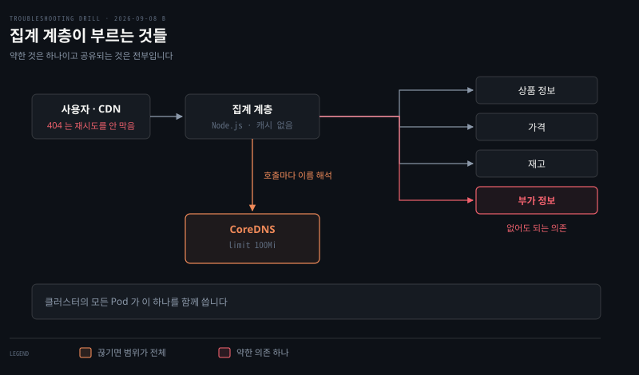
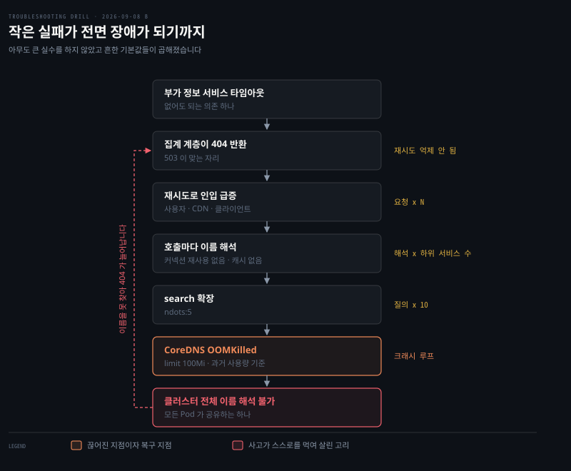

# 한 하위 서비스에서 시작된 전면 오류

---

> 핵심이 아닌 의존 하나의 타임아웃이 클러스터 전체 이름 해석을 무너뜨렸습니다. DNS 실패는 원인이 아니라 마지막에 무너진 자리입니다.


## 문제 소개

> 커머스 사이트의 상품 페이지가 한 시간 넘게 대량 오류를 냈습니다. 시작은 없어도 되는 서비스 하나였습니다.

**출처** · [Zalando · Total DNS outage in Kubernetes cluster (2019-01-07)](https://github.com/zalando-incubator/kubernetes-on-aws/blob/dev/docs/postmortems/jan-2019-dns-outage.md)



집계 계층 하나가 하위 서비스 여럿을 모아 페이지를 만듭니다. 호출마다 호스트명을 풀어야 하므로 모든 화살표가 CoreDNS 를 한 번씩 거칩니다. 붉게 표시된 부가 정보가 이 사고에서 처음 느려진 쪽이고, 아래 CoreDNS 는 클러스터의 모든 Pod 가 함께 쓰는 하나입니다.

여러 하위 서비스를 모아 페이지를 만드는 집계 계층이 있습니다. 그중 핵심이 아닌 하위 서비스 하나의 응답이 느려져 타임아웃이 나기 시작했습니다. 페이지에 없어도 되는 부가 정보를 주는 쪽이었습니다.

집계 계층은 그 실패를 404 로 돌려줍니다. 클라이언트는 재시도합니다. 그 뒤 지표가 이렇게 움직였습니다.

```pseudocode
집계 계층 인입 요청    ↑ 급증
CoreDNS 질의(QPS)     ↑ 인입과 비슷한 폭으로 급증
CoreDNS Pod 메모리     ↑ 급증 후 반복 재시작
클러스터 전체 이름 해석  ✕ 실패
```

집계 계층은 Node.js 이고 호스트명으로 하위 서비스를 부릅니다. 커넥션 최대 수명이 짧아 오래 붙들지 않습니다. CoreDNS Deployment 의 메모리 limit 은 `100Mi` 이고, 과거 사용량을 근거로 정한 값입니다.

출력에서 읽히는 것은 네 지표가 거의 동시에 움직였다는 사실뿐입니다. 무엇이 먼저인지는 이 그림만으로 정해지지 않습니다. 사고 중 내부 모니터링도 함께 죽어 관측 자체가 늦어졌습니다.


## 원인 분석

> 가장 크게 망가진 것이 원인은 아닙니다. DNS 는 마지막에 무너졌습니다.



위에서 아래로가 시간 순서이고, 오른쪽 라벨이 그 단계에서 곱해지는 배수입니다. 맨 아래에서 위로 돌아가는 점선이 사고를 한 시간 넘게 끌고 간 되먹임 고리입니다.

**배제된 것.** 처음 느려진 하위 서비스는 원인이 아닙니다. 페이지에 없어도 되는 부가 정보를 주는 쪽이라, 그것 하나로는 전면 장애를 만들 수 없습니다. 방아쇠일 뿐입니다.

**배제된 것.** DNS 인프라 자체의 결함도 아닙니다. 사고 전 일주일간 같은 구성으로 아무 문제가 없었고, 설정은 바뀌지 않았습니다. DNS 가 먼저 아팠다면 트래픽 급증 이전에 징후가 있어야 합니다.

**낮아진 것.** 애플리케이션 코드 결함은 우선순위가 내려갑니다. 배포 이력에 변경이 없습니다. 다만 404 를 반환한 처리 로직은 코드의 판단이므로 완전히 지워지지는 않습니다. 무엇을 더 보면 갈리느냐 — 그 응답 코드를 누가 정했는지 코드에서 확인하면 됩니다.

**남은 것.** 정상적인 것 넷이 곱해져 CoreDNS 가 감당할 수 없는 질의량을 만들었고, `100Mi` 를 넘긴 Pod 가 OOMKilled 됐습니다. CoreDNS 는 클러스터 하나를 모든 Pod 가 공유하므로 그것이 끊기는 순간 범위가 전체로 넓어집니다.

곱셈이 이렇게 붙습니다. 404 때문에 재시도가 억제되지 않아 요청이 몇 배로 늘어납니다. 그 요청 하나가 하위 서비스 여럿을 부릅니다. 커넥션을 재사용하지 않고 DNS 캐시도 없으니 호출마다 이름 해석이 일어납니다. `ndots:5` 와 search 도메인 때문에 외부 도메인 조회 하나가 질의 열 개가 됩니다.

여기에 되먹임이 붙습니다. DNS 가 죽으면 집계 계층이 하위 서비스를 더 못 찾습니다. 404 가 늘고 재시도가 늘고 질의가 다시 늘어납니다. 사고가 자기 자신을 먹여 살립니다.

404 가 사고를 키운 이유는 따로 있습니다. 하위 서비스가 404 를 준 것이 아니라 집계 계층이 스스로 만들어 낸 것인데, 404 는 원래 없는 리소스라는 뜻이라 받는 쪽이 영구적 사실로 취급합니다. 503 이었다면 CDN 과 클라이언트가 물러서고 backoff 가 걸렸을 텐데 그 완충이 작동하지 않았습니다. 실패를 어떤 상태 코드로 표현하느냐가 재시도 동작을 바꿉니다.


## 해결 방법

> 응급은 limit 을 올려 크래시 루프를 끊는 것이고, 재발 방지는 질의 수 자체를 줄이는 것입니다.

```bash
# CoreDNS 가 죽고 있는지, 왜 죽었는지
kubectl -n kube-system get pods -l k8s-app=kube-dns
kubectl -n kube-system describe pod <coredns-pod> | grep -A3 'Last State'
#   Reason: OOMKilled 가 보이면 메모리 초과입니다

# 질의량이 실제로 뛰었는지
kubectl -n kube-system logs <coredns-pod> | tail
#   CoreDNS 메트릭의 coredns_dns_requests_total 증가율을 봅니다

# Pod 안에서 search 확장이 몇 번 도는지
kubectl exec <pod> -- cat /etc/resolv.conf
```

- **응급**: CoreDNS 메모리 limit 을 올려 크래시 루프를 끊습니다. 실제 복구는 `100Mi` 에서 `2000Mi` 로 스무 배 올려 이뤄졌습니다. 이것은 질의 수를 줄이지 않으므로 임시방편입니다
- **재발 방지**: 노드마다 캐시를 두어 질의를 앞에서 끊습니다. 원 사례는 dnsmasq 를 CoreDNS 앞에 뒀고, 쿠버네티스 표준 기능으로는 NodeLocal DNSCache 가 같은 역할입니다. 외부 도메인은 끝에 점을 붙이거나 `dnsConfig` 로 ndots 를 낮춥니다. 없어도 되는 의존의 실패는 페이지 전체를 죽이지 않게 격리하고, 실패 응답은 503 으로 돌려 재시도 억제가 걸리게 합니다
- **검증**: 알람을 클러스터 바깥에 둡니다. 안에 두면 DNS 와 함께 죽어 눈이 멉니다. 조치 뒤 같은 부하에서 CoreDNS 질의 수와 메모리 사용률, 그리고 앱 트래픽 대비 질의 배수가 내려가는지 봅니다


## 다른 방법 비교

> 같은 증상을 만드는 다른 원인이 있고, 무엇을 보면 갈리는지가 다릅니다.

CoreDNS 가 죽는 다른 경로가 있습니다. 복제본 수가 부족해 정상 부하도 못 받는 경우, 업스트림 DNS 가 느려 질의가 쌓이는 경우, `forward` 설정이 잘못돼 루프가 도는 경우입니다. 이 셋은 트래픽 급증 없이도 일어나므로, 인입 지표가 함께 뛰었는지가 갈림길입니다.

이름 해석이 안 되는 것처럼 보이는 경우도 원인이 여럿입니다. NetworkPolicy 가 53 포트를 막았거나, `dnsPolicy` 가 잘못 잡혔거나, 노드의 `/etc/resolv.conf` 가 이상한 경우입니다. 이때는 CoreDNS 자체가 멀쩡하므로 CoreDNS Pod 의 재시작 횟수를 먼저 보면 갈립니다.

메모리 limit 을 올리는 것은 흔히 먼저 떠올리는 선택지이고 응급으로는 맞지만, 근본 해결로 착각하기 쉽습니다. 질의 수 자체가 그대로면 더 큰 스파이크에서 같은 자리로 돌아옵니다. 어제 A 문항에서 `nf_conntrack_max` 상향이 응급이고 알람이 재발 방지였던 것과 같은 구조입니다.


## 내 접근과 실제가 갈린 자리

> 원인은 맞혔고, 인과의 앞뒤에서 갈렸습니다.

| 단계 | 내가 간 길 | 실제 | 갈린 이유 |
|------|-----------|------|----------|
| 첫 의심 | 느려진 하위 서비스를 봐야 한다 | 방아쇠일 뿐 | 시작한 곳과 원인을 같게 봄 |
| 배제 | CoreDNS 가 터져 전체가 죽었다 | 같음 | 클러스터 하나를 전부가 공유한다는 범위 논리 |
| 인과 순서 | DNS 실패 → 타임아웃 → 재시도 | 재시도 → 질의 폭증 → DNS 실패 | 가장 크게 망가진 것을 원인으로 읽음 |
| 증폭 | ndots search 확장까지 도달 | 같음 | 힌트 뒤 스스로 도달 |
| 첫 확인 | 못 댐 | OOMKilled 확인과 질의 추세 | 다섯 번째 |

범위 논리를 스스로 적용한 것이 이 회차의 소득입니다. A 에서 "conntrack 은 노드 하나의 것"을 잡은 뒤, 여기서 "CoreDNS 는 클러스터 하나의 것"을 묻지 않고 꺼냈습니다. 배운 축을 다음 문항으로 옮긴 자리입니다.

갈린 곳은 인과의 앞뒤입니다. 네 지표가 거의 동시에 움직였을 때 가장 크게 망가진 DNS 를 원인으로 읽었습니다. 증상의 크기와 인과의 순서는 다른 축인데 같게 봤습니다. 지표가 함께 뛰면 무엇이 먼저였는지를 시간순으로 세워야 합니다.

읽는 중에 스스로 고친 것이 둘 있습니다. TTL 은 캐시가 있어야 의미가 있다는 것과, CoreDNS 는 커널 자료구조가 아니라 Pod 이라 OOMKilled 라는 것입니다. 후자는 A 에서 배운 커널 자료구조 틀을 여기 잘못 적용했다가 되돌린 자리입니다.


## 나온 개념

> 여러 문항에 걸치는 이론은 개념 노트에 모읍니다. 여기서는 이 문항에서 걸린 지점만 적습니다.

- [한도는 어디서 오는가](../_concepts/한도는-어디서-오는가.md) — `100Mi` 는 사람이 정했으되 피크가 아니라 과거 사용량을 근거로 삼은 값입니다. A 의 커널 유도 한도와 짝을 이룹니다
- [패킷이 사라지는 네 자리](../_concepts/패킷이-사라지는-네-자리.md) — 공유 자원의 범위를 묻는 같은 축입니다. conntrack 이 노드 하나라면 CoreDNS 는 클러스터 하나입니다

### DNS 캐시는 런타임마다 다릅니다

Node.js 는 기본적으로 캐시하지 않고, JVM 은 캐시하되 너무 오래 붙들어 반대 문제를 냅니다. 언어마다 맞추는 것보다 노드에 캐시를 두어 인프라에서 한 번 해결하는 쪽이 안정적입니다.

### 되먹임 고리

결과가 원인을 다시 키우는 구조에서는 방아쇠를 없애도 안 멈춥니다. 고리를 어디서 끊을지가 대응의 핵심이고, 이 사고에서는 CoreDNS 를 살리는 것이 그 지점이었습니다.

근거는 [DNS와 CoreDNS](../../08_cloud/kubernetes/04_networking/04-05.DNS와%20CoreDNS.md) §Q2, [nk 04-03](../../08_cloud/book/networking-and-kubernetes/04-03.NetworkPolicy와%20DNS%20—%20클러스터%20안의%20방화벽과%20이름.md) §5, [복제본 둘과 170Mi는 어디서 온 값인가](../../08_cloud/book/learning-coredns/06-03.복제본%20둘과%20170Mi는%20어디서%20온%20값인가.md) 입니다.


## 관련 문서

- [B 계층 목록](./README.md) — 쿠버네티스 클러스터 내부
- [회차 로그](../_drill/log.md) — 이 문항을 푼 날의 점수와 막힌 지점
- [패킷이 사라지는 네 자리](../_concepts/패킷이-사라지는-네-자리.md) — 공유 자원의 범위를 묻는 같은 축
- [DNS와 CoreDNS](../../08_cloud/kubernetes/04_networking/04-05.DNS와%20CoreDNS.md) — ndots·search·NodeLocal DNSCache
- [복제본 둘과 170Mi는 어디서 온 값인가](../../08_cloud/book/learning-coredns/06-03.복제본%20둘과%20170Mi는%20어디서%20온%20값인가.md) — CoreDNS 메모리 사이징
