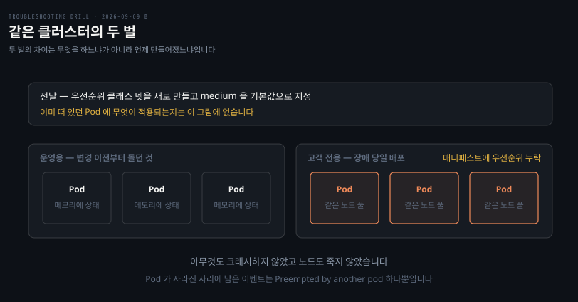
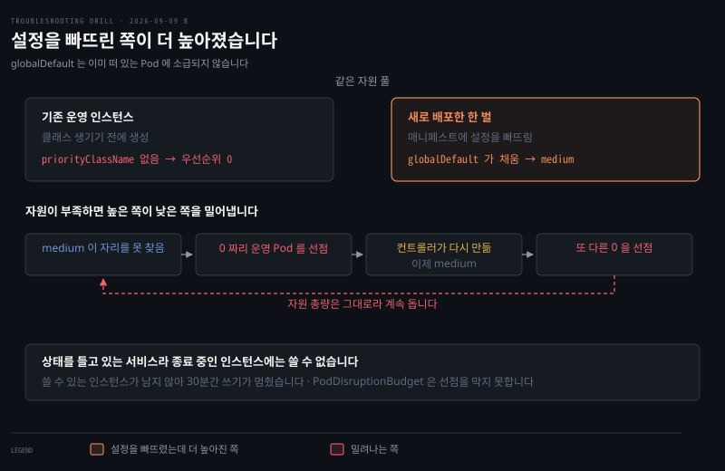

# 아무도 안 죽었는데 다 죽은 클러스터

---

> 우선순위 클래스를 도입해도 이미 떠 있던 Pod 에는 소급되지 않습니다. 그래서 설정을 빠뜨린 신규가 오히려 높아졌습니다.


## 문제 소개

> 시계열 데이터를 받아 저장하는 서비스가 30분 가까이 쓰기를 못 받았습니다. 그런데 아무것도 크래시하지 않았습니다.

**출처** · [Grafana Labs · How a Production Outage Was Caused Using Kubernetes Pod Priorities](https://grafana.com/blog/2019/07/24/how-a-production-outage-was-caused-using-kubernetes-pod-priorities/) (2019)



이 서비스는 받은 데이터를 메모리에 일정 시간 모아 두었다가 장기 저장소로 넘깁니다. 상태를 들고 있어서 종료 중인 인스턴스에는 새로 쓸 수 없습니다.

장애 중 Pod 들이 계속 없어졌다 다시 떴습니다. 컨테이너가 재시작한 것이 아니라 Pod 자체가 사라지고 새로 생기는 형태였습니다. 그런데 애플리케이션은 크래시하지 않았고 OOMKilled 도 아니었으며, 노드도 죽지 않았고 헬스체크가 실패한 적도 없었습니다.

사라진 Pod 를 `describe` 하면 이벤트가 하나 남아 있었습니다.

```pseudocode
Preempted by another pod on node ...
```

전날 우선순위 클래스 넷을 새로 만들었고 그중 medium 을 기본값으로 지정했습니다. 기존에 떠 있던 운영 인스턴스들은 그 변경 이전에 만들어진 것입니다. 장애 당일에는 고객 전용으로 같은 클러스터 안에 이 서비스를 한 벌 더 배포했는데, 그쪽 매니페스트에 우선순위 설정을 빠뜨렸습니다.

출력에서 읽히는 것은 Pod 가 스스로 죽은 것이 아니라 밀려났다는 사실뿐입니다. 누가 밀었는지는 이 이벤트만으로 정해지지 않습니다.


## 원인 분석

> 설정을 빠뜨린 쪽이 오히려 높은 우선순위를 받았습니다. `globalDefault` 가 이미 떠 있던 Pod 에는 소급되지 않기 때문입니다.



위가 두 무리의 우선순위이고 아래가 연쇄 고리입니다. 오른쪽 강조가 설정을 빠뜨렸는데 오히려 높아진 쪽입니다.

**배제된 것.** 애플리케이션 결함이 아닙니다. 크래시도 OOMKilled 도 헬스체크 실패도 없었습니다.

**배제된 것.** 노드 이상도 아닙니다. 노드가 죽지 않았고, `NotReady` 였다면 스케줄러가 후보에서 빼므로 자원 계산 결과가 아니라 taint 관련 메시지가 나왔을 것입니다.

**남은 것.** 스케줄러의 선점입니다. 우선순위가 갈린 상태에서 자원이 부족하면 높은 쪽이 낮은 쪽을 밀어냅니다.

우선순위가 갈린 경위가 이 사고의 핵심입니다. 쿠버네티스 공식 문서가 두 가지를 명시합니다. `priorityClassName` 이 없으면 우선순위는 0 이고, `globalDefault: true` 인 클래스를 추가해도 **이미 존재하는 Pod 의 우선순위는 바뀌지 않습니다.** 그 값은 클래스가 추가된 *이후* 생성된 Pod 에만 적용됩니다.

| 대상 | 우선순위 | 왜 |
|------|---------|-----|
| 기존 운영 인스턴스 | 0 | 클래스 생기기 전에 생성. 소급되지 않음 |
| 새로 배포한 한 벌 | medium | 설정을 빠뜨렸지만 `globalDefault` 가 채움 |

**설정을 빠뜨린 쪽이 더 높습니다.** 빠뜨렸는데 0 이 아니라 medium 을 받은 것이 시작이었습니다.

### 왜 한 번으로 끝나지 않았나

medium 이 자리를 못 찾으면 0 짜리를 밀어냅니다. 컨트롤러가 그 Pod 를 다시 만드는데, 이제는 클래스가 있으므로 새 Pod 도 medium 을 받습니다. 그 Pod 가 또 다른 0 짜리를 밀어냅니다.

여기서 갈아끼우기와 갈립니다. 밀려나는 것이 구버전이 아니라 **같은 서비스의 동료**이고, 선점은 자원을 만들어 내지 않으므로 총량이 부족한 동안 계속 돕니다. 배포 교체라면 한 번으로 끝나지만 이것은 자원을 늘려야 멈춥니다.

상태를 들고 있는 서비스라는 점이 피해를 키웠습니다. Pod 들이 줄줄이 종료 상태로 들어가 flush 를 기다리는 동안 쓸 수 있는 인스턴스가 남지 않았습니다. PodDisruptionBudget 을 걸어 두었어도 선점은 그것을 보장하지 않습니다.

정상적인 실패였다면 신규 Pod 가 `Pending` 으로 남아야 했습니다. 자원이 없으면 안 뜨는 것이 안전한 실패인데, 선점이 그것을 "남의 자리를 뺏는다"로 바꿨습니다.


## 해결 방법

> 자원을 늘려야 멈춥니다. 선점은 자리를 옮길 뿐 총량을 만들지 않습니다.

```bash
# 어떤 클래스가 있고 globalDefault 가 걸려 있는가
kubectl get priorityclass
#   GLOBAL-DEFAULT 열이 true 인 것이 있으면 설정 없는 Pod 가 0 이 아닙니다

# Pod 들의 실제 우선순위가 갈려 있는가
kubectl get pods -o custom-columns=NAME:.metadata.name,PRIO:.spec.priority,CLASS:.spec.priorityClassName
#   priorityClassName 이 없는데 priority 가 0 이 아니면 globalDefault 가 채운 것입니다

# 누가 누구를 밀었는가
kubectl get events --sort-by=.lastTimestamp | grep -i preempt
```

- **응급**: 클러스터를 늘렸습니다. 우선순위를 고친 것이 아닙니다. 총량 부족을 재배치로는 풀 수 없습니다
- **재발 방지**: 기존 워크로드에도 `priorityClassName` 을 명시해 0 을 없애고, `globalDefault` 에 의존하지 않습니다. `ResourceQuota` 로 높은 우선순위 남용을 막습니다
- **검증**: 알람이 4분 만에 울렸고 총 26분에 복구됐습니다. 진단과 확장에 5분, flush 와 재스케줄에 5분, 뒤이은 프록시 OOM 처리에 10분이 걸렸습니다


## 다른 방법 비교

> Pod 가 사라지는 증상은 원인이 여럿이고, 무엇을 보면 갈리는지가 다릅니다.

노드 압박에 의한 축출(eviction)이 비슷하게 보입니다. 이때는 kubelet 이 QoS 등급을 보고 죽이므로 `BestEffort` 부터 사라지고, `kubectl describe node` 에 압박 조건이 남습니다. 선점은 스케줄러가 하고 **QoS 를 완전히 무시**하므로 이 둘은 근거가 다릅니다.

`NotReady` 노드에서 밀려나는 경우도 있습니다. taint based eviction 인데, 이때는 노드 상태가 먼저 바뀌므로 노드를 보면 갈립니다.

컨트롤러의 롤링 업데이트도 Pod 가 없어졌다 뜨는 모습을 만듭니다. 다만 이쪽은 교체가 순서대로 일어나고 `Preempted` 이벤트가 남지 않습니다.

흔히 먼저 떠올리지만 틀린 선택지가 애플리케이션 디버깅입니다. 이 사고에서는 앱이 아무 잘못도 하지 않았고, 로그를 아무리 봐도 원인이 나오지 않습니다.


## 내 접근과 실제가 갈린 자리

> 기전 전체를 스스로 재구성했고, 기본값과 명령에서 갈렸습니다.

| 단계 | 내가 간 길 | 실제 | 갈린 이유 |
|------|-----------|------|----------|
| 배제 | 크래시·OOM·헬스체크·노드를 지움 | 같음 | 스스로 도달 |
| 기본 우선순위 | 1000 으로 봄 | **0** | 노트 예제의 `value: 1000` 을 기본값으로 읽음 |
| 소급 여부 | 물음으로 접근 | 소급되지 않음 | 노트에 없는 사실 |
| 연쇄 | 부활한 Pod 도 medium → 또 밀어냄 | 같음 | 스스로 도달 |
| 갈아끼우기 의문 | "그냥 교체된 것 아니냐" | 동료를 밀어냄 · 자원은 그대로 | 이 물음이 급소를 겨눔 |
| 첫 확인 | 두 갈래를 말로 설명 | `kubectl get priorityclass` 등 | 명령 이름을 못 댐 |

되물음 없이 스스로 던진 "그냥 갈아끼워진 것 아니냐"가 이 회차의 소득입니다. 그 물음이 정확히 이 사고와 배포 교체를 가르는 지점이었고, 답하는 과정에서 자원 총량 문제까지 갔습니다.

노트에 없던 사실이 하나 드러났습니다. `kubernetes-patterns` 02-01 은 `globalDefault` 를 "priorityClassName 없는 Pod 의 기본값"까지만 적고 **언제 만들어진 Pod 에 적용되는지**는 적지 않았습니다. 그래서 노트만으로는 맞힐 수 없는 자리였고, 이 문항이 그 빈칸을 채웁니다.


## 나온 개념

> 여러 문항에 걸치는 이론은 개념 노트에 모읍니다. 여기서는 이 문항에서 걸린 지점만 적습니다.

- [한도는 어디서 오는가](../_concepts/한도는-어디서-오는가.md) — 우선순위 0 도 "누가 정한 숫자인가"를 묻는 자리입니다. 아무도 안 정하면 0 이고, 기본값을 바꿔도 과거에는 적용되지 않습니다

### 소급되지 않는 기본값

설정의 기본값에는 두 종류가 있습니다. 읽을 때마다 적용되는 것과, 생성 시점에 한 번 박히는 것입니다. `globalDefault` 는 후자라 admission controller 가 Pod 를 만들 때 `.spec.priority` 에 값을 써 넣습니다. 그래서 이미 만들어진 Pod 는 나중에 기본값이 바뀌어도 그대로입니다.

같은 성질을 가진 설정을 만나면 "이 값이 언제 박히는가"를 물어야 합니다.

### 사용자 우선순위 상한과 시스템 예약

사용자가 만드는 PriorityClass 는 10억 이하만 허용됩니다. 그 위는 시스템 예약이고 `system-cluster-critical` 이 20억, `system-node-critical` 이 20억 1000 입니다. 상한을 둔 이유가 이것입니다 — 어떤 워크로드도 노드 필수 컴포넌트보다 위로 못 가게 막습니다.

근거는 [Predictable Demands](../../08_cloud/book/kubernetes-patterns/02-01.Predictable%20Demands%20—%20자원%20요구를%20선언해%20스케줄러에%20알리기.md) 와 [노드 에이전트 특수 기능](../../08_cloud/book/kubernetes-in-action/17-02.노드%20에이전트%20특수%20기능%20—%20privileged·hostPath·hostNetwork·PriorityClass.md) 이고, 소급 규칙은 [쿠버네티스 공식 문서](https://kubernetes.io/docs/concepts/scheduling-eviction/pod-priority-preemption/)로 확인했습니다.


## 관련 문서

- [B 계층 목록](./README.md) — 쿠버네티스 클러스터 내부
- [회차 로그](../_drill/log.md) — 이 문항을 푼 날의 점수와 막힌 지점
- [한도는 어디서 오는가](../_concepts/한도는-어디서-오는가.md) — 숫자의 출처를 묻는 축
- [Predictable Demands](../../08_cloud/book/kubernetes-patterns/02-01.Predictable%20Demands%20—%20자원%20요구를%20선언해%20스케줄러에%20알리기.md) — PriorityClass 와 preemption, QoS 와의 차이
