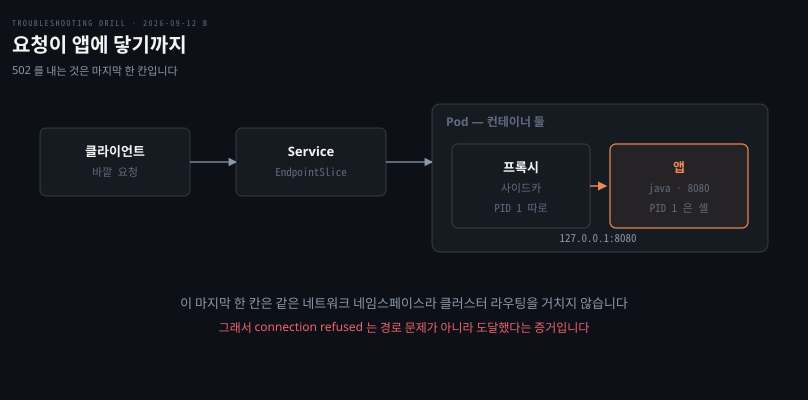
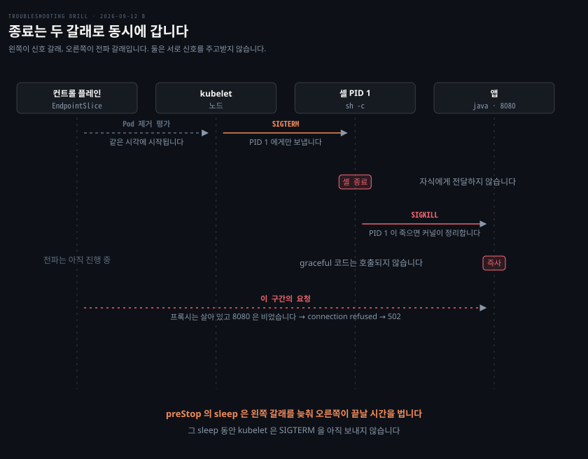

# 배포할 때마다 잠깐 나오는 502

---

> 신호가 PID 1 에서 멈추면 유예 기간은 약속만 남고, 엔드포인트 전파가 끝나기 전에 앱이 즉사합니다.

## 문제 소개

> 롤링 업데이트마다 502 가 수백 건 나갔다가 30초쯤 지나 저절로 사라졌습니다.

**출처** · [GitLab · How we removed all 502 errors by caring about PID 1 in Kubernetes](https://about.gitlab.com/blog/how-we-removed-all-502-errors-by-caring-about-pid-1-in-kubernetes/) (2022)


스케일 다운 때도, 노드 드레인 때도 같은 것이 나왔습니다. Pod 는 리버스 프록시 사이드카와 애플리케이션 컨테이너 둘로 되어 있고, 프록시가 같은 Pod 안 애플리케이션에게 `127.0.0.1:8080` 으로 넘기는 구조였습니다.

```bash
# 프록시 로그
502 Bad Gateway: dial tcp 127.0.0.1:8080: connect: connection refused
```

`terminationGracePeriodSeconds` 는 기본값 30 이고, 애플리케이션은 종료 신호를 받으면 진행 중 요청을 다 끝내고 내려가도록 구현돼 있었습니다. 그 코드는 로컬에서 직접 신호를 보내면 정상 동작했습니다. 그런데 배포 중 종료되는 Pod 의 로그에는 graceful shutdown 시작 줄이 찍히지 않고 로그가 그냥 끊겼습니다.

여기서 읽히는 것이 둘입니다. `connection refused` 는 무응답이 아니라 **명시적 거절**이므로 프록시가 앱에 닿았다는 뜻이고, 그 포트에 듣는 프로세스가 없다는 즉답입니다. 그리고 같은 코드가 환경에 따라 다르게 동작한다면 바뀐 것은 코드가 아니라 **신호가 그 코드까지 도달하는 경로**입니다.


## 원인 분석

> 두 가지가 겹쳤습니다. 신호가 앱에 닿지 않는 것과, 엔드포인트 전파가 종료를 기다려 주지 않는 것입니다.



**배제된 것.** Service·EndpointSlice·Pod IP 변경이 먼저 지워집니다. 호출 대상이 `127.0.0.1` 이라 같은 Pod 안 같은 네트워크 네임스페이스이고, 클러스터 라우팅을 아예 거치지 않습니다. 게다가 `refused` 자체가 도달의 증거라 경로 문제와 양립하지 않습니다.

롤링 업데이트 전략도 지워집니다. `maxUnavailable` 이나 교체 순서가 원인이라면 스케일 다운과 노드 드레인에서는 나오지 않아야 하는데 똑같이 나왔습니다. 세 상황의 공통점은 하나, **Pod 가 종료된다**는 것뿐입니다.

애플리케이션 코드도 지워집니다. 로컬에서 신호를 직접 보내면 동작하므로 graceful shutdown 로직 자체는 멀쩡합니다.

**남은 것.** 컨테이너를 `sh -c` 로 띄우면 PID 1 은 셸이고 자바는 그 자식입니다. 쿠버네티스는 PID 1 에게만 `SIGTERM` 을 보내는데 대부분의 셸은 그 신호를 자식에게 전달하지 않습니다. 셸은 신호를 받고 종료하고, PID 1 이 종료되면 커널이 그 PID 네임스페이스의 남은 프로세스를 전부 `SIGKILL` 로 정리합니다.

그래서 graceful shutdown 코드는 호출될 기회 자체가 없습니다. `terminationGracePeriodSeconds: 30` 도 무의미해집니다 — 30초를 기다려 주겠다는 약속인데 앱이 1초도 쓰지 않고 즉사합니다.

502 가 여기서 맞아떨어집니다. 앱은 즉사했고 프록시 사이드카는 자기 PID 1 이 따로라 정상적으로 내려가는 중입니다. 그동안 들어온 요청을 `127.0.0.1:8080` 으로 넘기는데 그 포트에 아무도 없어 `refused` 를 받고 502 로 변환합니다.

**왜 요청이 계속 오는가.** 공식 문서가 명시합니다. kubelet 이 Pod 의 graceful shutdown 을 시작하는 **것과 동시에** 컨트롤 플레인이 그 Pod 를 EndpointSlice 에서 제거할지 평가합니다. 두 갈래는 서로를 기다리지 않습니다.

엔드포인트 제거는 모든 노드의 kube-proxy 로 전파돼야 하므로 수 초가 걸립니다. 그동안 iptables 규칙에는 이 Pod 가 여전히 살아 있고 트래픽이 계속 옵니다. 앱이 유예 시간을 버텨 주면 이 창을 덮지만, 즉사하면 그 창이 통째로 502 가 됩니다.


## 해결 방법

> 유예를 벌어 주는 조치가 빠르고, 신호가 닿게 만드는 조치가 근본입니다.

```bash
# PID 1 이 앱인지 셸인지 — 이 한 줄이 두 가설을 가른다
kubectl exec <pod> -c app -- ps -ef | head -3

# 종료 중 Pod 가 엔드포인트에서 언제 빠지는지
kubectl get endpointslice -l kubernetes.io/service-name=web -w
```

- **응급**: `preStop` 훅에 대기를 넣습니다. YAML 한 줄이라 이미지 재빌드 없이 지금 배포로 나가고, 502 의 큰 덩어리가 여기서 사라집니다

```yaml
lifecycle:
  preStop:
    exec:
      command: ["sh", "-c", "sleep 10"]
```

아무것도 하지 않는 `sleep` 이 처방인 이유는 그 시간 동안 kubelet 이 `SIGTERM` 을 **아직 보내지 않기** 때문입니다. 앱은 계속 요청을 받고, 그 사이 엔드포인트 제거가 전파됩니다.

- **재발 방지**: PID 1 을 앱으로 만듭니다. `exec` 를 쓰면 셸이 자기 자신을 앱으로 덮어써 같은 PID 1 이 앱이 되고, 신호가 직접 갑니다. 셸을 꼭 거쳐야 하거나 서드파티 이미지라 못 고칠 때는 `tini` 같은 작은 init 을 PID 1 로 앉힙니다

```dockerfile
# 셸이 남지 않는다
CMD ["sh", "-c", "exec java -jar app.jar"]
# 또는 셸을 아예 안 거친다
CMD ["java", "-jar", "app.jar"]
# 또는 init 을 앞에 둔다
ENTRYPOINT ["/tini", "--"]
```

- **검증**: 지면 풀이라 미실행입니다. 확인하려면 종료되는 Pod 의 로그에 graceful shutdown 줄이 찍히는지 보고, 배포 중 502 건수를 조치 전후로 비교합니다. `preStop` 의 `sleep` 은 반드시 `terminationGracePeriodSeconds` 보다 짧아야 합니다 — 대기 시간과 앱 종료 시간의 합이 유예 안에 들어와야 합니다


## 다른 방법 비교

> 같은 502 라도 원인이 여럿이고, `refused` 인지 타임아웃인지가 먼저 가릅니다.

502 라고 다 같은 502 가 아닙니다. 프록시가 타임아웃으로 냈다면 앱은 살아 있는데 응답이 느린 것이므로 종료 순서와 무관합니다. `refused` 는 그 경우를 지웁니다.

`preStop` 만 넣고 끝내는 선택지도 있습니다. 502 는 크게 줄지만 앱은 여전히 `SIGKILL` 로 죽으므로 진행 중 요청은 계속 끊깁니다. 사용자에게는 502 대신 연결 끊김으로 보일 뿐 손실은 남습니다. 두 조치는 대체재가 아니라 순서입니다.

반대로 `exec` 만 고치고 `preStop` 을 안 넣으면, 앱은 유예 시간을 제대로 쓰지만 전파가 끝나기 전에 종료를 시작해 여전히 일부 요청을 놓칩니다. 전파 지연은 앱이 어떻게 죽든 독립적으로 존재하는 시간이라 별도로 덮어야 합니다.

`preStop` 을 모든 워크로드에 넣어야 하는가는 갈립니다. Service 뒤에서 트래픽을 받는 워크로드라면 사실상 필요하고, 사내 차트에 기본 탑재하는 조직이 많습니다. 배치 잡이나 큐 컨슈머처럼 엔드포인트가 없는 것은 전파할 대상이 없어 필요하지 않습니다. 쿠버네티스가 기본값으로 넣지 않는 이유는 적정 대기 시간이 노드 수·kube-proxy 모드·앱의 요청 처리 시간에 따라 달라 플랫폼이 정할 수 없기 때문입니다.

사이드카 리버스 프록시가 Ingress 와 겹치는 것 아니냐는 물음도 갈리는 자리입니다. 둘은 층이 다르고 직렬로 놓입니다.

| | Ingress | 사이드카 프록시 |
|---|---|---|
| 어디 | 클러스터 입구, 공용 | Pod 안, Pod 마다 |
| 무엇을 | 바깥에서 클러스터로 | Pod 안 앱의 앞단 |

원본 사례가 GitLab 입니다. Go 로 만든 Workhorse 가 Ruby 앱(Puma) 앞에 사이드카로 앉습니다. 큰 파일 업로드나 느린 클라이언트를 Go 쪽에서 흡수하는 구조입니다. 요청 하나에 프로세스 하나를 붙들어야 하는 Ruby 워커를 아끼려는 것입니다. Istio 의 Envoy 사이드카도 같은 자리이고, 앰비언트 모드는 그 프록시를 Pod 밖 노드 공용으로 빼서 컨테이너가 하나 더 늘어나는 부담과 종료 순서 복잡성을 줄인 것입니다.


## 내 접근과 실제가 갈린 자리

> PID 1 과 `exec` 를 스스로 꺼냈고, 컨테이너 수명과 `preStop` 에서 갈렸습니다.

| 내가 본 것 | 실제 | 갈린 이유 |
|-----------|------|----------|
| 사이드카가 앱을 못 봐서 502 | 맞음 | 구조를 바로 읽음 |
| 롤링 업데이트 교체 순서 의심 | 배제. 드레인·스케일다운에도 동일 | 증상의 공통점을 다시 셈 |
| `refused` 는 도달의 증거 | 맞음. 라우팅 후보가 지워짐 | 앞 회차 논리를 옮겨 옴 |
| `sh -c` 면 PID 1 은 셸, `exec` 없으면 자바는 자식 | 맞음 | **되물음 없이 나온 자리** |
| PID 1 이 죽어도 자바는 살아 있다 | 반대. PID 1 이 죽으면 커널이 전부 `SIGKILL` | 컨테이너 수명 = PID 1 수명을 뒤집어 읽음 |
| 엔드포인트 전파를 기다리게 하는 훅 | `preStop`. 노트에 있으나 아직 학습 전 | 이름이 안 나옴 |

가장 큰 전진은 PID 1 과 `exec` 입니다. 신호 전달 문제의 핵심을 되물음 없이 꺼냈고, 이후 `SIGKILL` 즉사와 유예 무력화까지 자기 문장으로 재구성했습니다. 남은 것은 컨테이너 수명에 대한 오해 하나와 도구 이름 하나입니다.


## 나온 개념

> 신호가 컨테이너 안에서 어디까지 가는가, 그리고 종료의 두 갈래가 동시에 간다는 사실입니다.

PID 1 은 그 PID 네임스페이스의 init 입니다. 고아가 된 프로세스를 거둬 `wait()` 로 좀비를 치우는 것이 본업이고, 컨테이너에서는 신호를 자식에게 전달하는 역할이 여기에 더해집니다. `tini` 는 그 전달과 좀비 수거만 하는 아주 작은 init 으로, `docker run --init` 이 넣어 주는 것이 이것입니다.

`exec` 는 새 프로세스를 만들지 않고 현재 프로세스를 덮어씁니다. 그래서 셸이 사라지고 같은 PID 가 앱이 됩니다.

근거는 [Managed Lifecycle](../../08_cloud/book/kubernetes-patterns/05-01.Managed%20Lifecycle%20—%20플랫폼의%20생애주기%20이벤트에%20반응하기.md)입니다. `SIGTERM`·`SIGKILL` 계약, `preStop` 훅, 유예가 보장되지 않는 이유, "preStop 은 블로킹이지만 종료를 막지 못한다"가 그 문서에 있습니다. 동시성은 [공식 Pod Lifecycle 문서](https://kubernetes.io/docs/concepts/workloads/pods/pod-lifecycle/)가 1차 자료입니다.


## 관련 문서

- [kubernetes 계층 목록](./README.md)
- [회차 로그](../_drill/log.md) — 이 문항을 푼 날의 점수와 막힌 지점
- [Managed Lifecycle](../../08_cloud/book/kubernetes-patterns/05-01.Managed%20Lifecycle%20—%20플랫폼의%20생애주기%20이벤트에%20반응하기.md) — 종료 계약과 두 훅
- [Service와 EndpointSlice](../../08_cloud/kubernetes/04_networking/04-04.Service와%20EndpointSlice.md) — terminating·serving 조건과 전파
