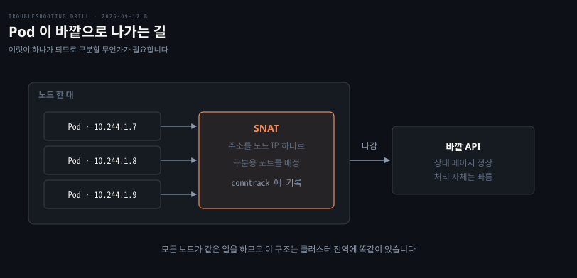
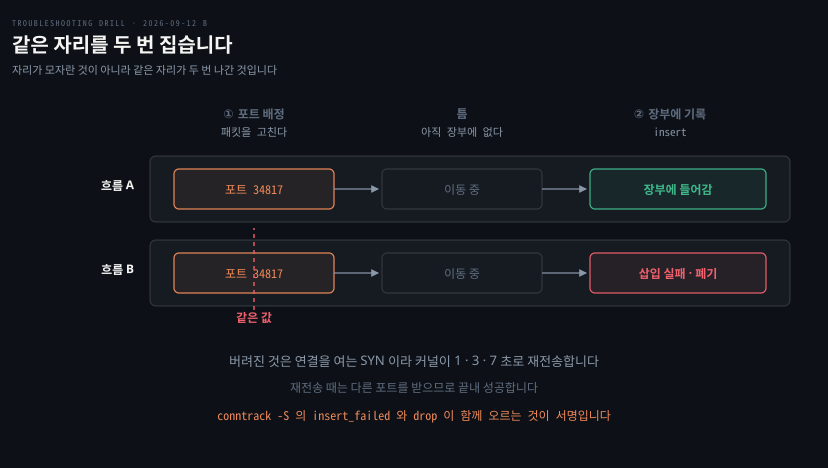

# 정확히 1초씩 늦는 요청

---

> 자리가 남아도는데 실패할 수 있습니다. 포화가 아니라 같은 자리를 두 번 집는 경쟁이기 때문입니다.

## 문제 소개

> 클러스터 전역에서 바깥 API 호출 1% 미만이 아주 가끔 느렸고, 오류는 아니었습니다.

**출처** · [Maxime Lagresle · A reason for unexplained connection timeouts on Kubernetes/Docker](https://maximelagresle.fr/posts/a-reason-for-unexplained-connection-timeouts-on-kubernetes-docker) (2019)


느린 것들의 응답 시간이 아무 값이나 갖지 않았습니다.

```bash
# 느린 요청만 뽑아 소요 시간 집계
  1.0s 대   412건
  3.0s 대   118건
  7.0s 대     9건
  그 외        0건
```

빠른 요청은 평소대로 40ms 안팎이고 느린 것과 빠른 것 사이에 아무것도 없었습니다. 특정 서비스나 노드에 몰리지 않고 전역에 고르게 흩어져 있었으며, 바깥 API 제공자 쪽 접수 로그에는 요청이 늦게 도착한 흔적만 있고 처리 자체는 빨랐습니다.

부하가 높은 시간대에 건수가 늘고 새벽에는 거의 없었습니다. 애플리케이션 스레드 덤프에 이상이 없고 노드 CPU 와 메모리도 여유가 있었습니다.

```bash
$ kubectl get pods -n kube-system | grep -c Running
24

$ conntrack -C
18431
```

이 출력에서 두 가지가 읽힙니다. 계단이 1·3·7초로 **직전 대기의 두 배씩** 늘어나고, 열린 흐름 수는 기본 상한에 한참 못 미칩니다.


## 원인 분석

> 계단이 SYN 재전송을 가리키고, 여유로운 카운터가 포화를 지웁니다.



**배제된 것.** 애플리케이션 로직이 먼저 지워집니다. 전역에 고르게 흩어져 있어 특정 서비스의 코드 문제가 아니고, 스레드 덤프에도 이상이 없었습니다.

상대방 지연도 지워집니다. 제공자 쪽 로그에 처리는 빨랐고 도착이 늦었다고 남아 있습니다.

자원 부족도 지워집니다. 노드 CPU 와 메모리에 여유가 있었고 kube-system Pod 도 정상 수로 떠 있어 CoreDNS 나 kube-proxy 가 죽은 경우가 아닙니다.

**conntrack 포화도 지워집니다.** `conntrack -C` 의 18431 은 기본 상한이 보통 수십만인 것에 비하면 한참 여유입니다. 이 값이 이 문항에서 가장 중요한 배제 재료입니다.

**계단이 무엇을 말하는가.** 1초 → 3초는 2초, 3초 → 7초는 4초 늘어납니다. 더하는 값이 두 배씩이므로 각 대기가 직전의 두 배인 지수 백오프이고, 누적이 `1, 1+2, 1+2+4` 입니다. 다음 계단은 15초입니다.

이 값은 애플리케이션이 정한 것이 아닙니다. 서비스가 여럿인데 전부 정확히 같은 계단입니다. 이것은 리눅스 커널의 **SYN 재전송** 기본 간격입니다. SYN 을 보냈는데 SYN-ACK 이 안 오면 커널이 알아서 재전송하고 애플리케이션은 그 사실을 모른 채 기다립니다.

그러므로 사라진 것은 **연결을 여는 첫 패킷**입니다. 거절을 받았다면 즉시 실패했을 테니 1초를 기다릴 이유가 없고, 끝내 성공한다는 사실은 경로가 막힌 것이 아니라 어쩌다 한 번 사라진다는 뜻입니다.

**남은 것.** Pod 이 바깥으로 나갈 때 노드는 SNAT 으로 여러 Pod 의 주소를 노드 IP 하나로 바꾸면서 구분용 포트를 배정합니다. 그런데 커널이 이 일을 두 단계로 합니다. 먼저 패킷을 고쳐 포트를 배정하고, 그 다음 conntrack 장부에 적습니다.

두 Pod 이 동시에 같은 목적지로 나가면 그 틈에 **같은 포트가 두 번 배정**될 수 있습니다. 아직 장부에 안 적혔으니 이미 쓰는 중인지 알 수 없기 때문입니다. 그러다 장부에 적는 단계에서 늦은 쪽이 삽입에 실패하고 패킷이 버려집니다.

이것으로 전부 맞아떨어집니다.

| 관찰 | 왜 그런가 |
|------|----------|
| 부하가 높을 때만 늘어남 | 동시에 나가는 요청이 많아야 충돌합니다 |
| 전역에 고르게 흩어짐 | 모든 노드가 같은 커널 동작을 합니다 |
| 끝내 성공함 | 재전송 때는 다른 포트를 받습니다 |
| `conntrack -C` 가 여유로움 | 자리가 모자란 것이 아니라 같은 자리를 두 번 집었습니다 |

**확정도.** 원본 사례는 `conntrack -S` 의 `insert_failed` 가 버려진 패킷 수에 비례해 증가하는 것을 확인해 확정했습니다. 이 회차는 지면 풀이라 **유력 가설**이며, 확정에는 그 카운터 확인이 필요합니다.


## 해결 방법

> 개수를 세는 옵션이 아니라 통계를 보는 옵션으로 바꿔야 보입니다.

```bash
# -C 는 개수만 준다. 무슨 일이 있었는지는 -S
conntrack -S
# cpu=0   found=0 invalid=171 insert=0 insert_failed=8 drop=8 ...

# 누적값이므로 두 번 찍어 증가분을 본다
conntrack -S | awk -F'insert_failed=' '{s+=$2} END {print s}'

# 재전송이 실제로 일어나는지 커널 카운터로 교차 확인
nstat -a | grep -i retrans
```

`insert_failed` 는 장부에 적으려다 실패한 횟수이고 `drop` 이 같이 오릅니다. 실패한 삽입 하나가 곧 버려진 패킷 하나입니다. CPU 마다 한 줄인 이유는 통계를 코어별로 세기 때문이고, `/proc/net/softnet_stat` 이 CPU 마다 한 줄인 것과 같은 구조입니다.

- **응급**: 애플리케이션 쪽에서 재시도와 타임아웃을 손봐 사용자 영향을 줄입니다. 원인을 없애지는 못하지만 1초·3초가 사용자에게 그대로 전달되는 것은 막습니다
- **재발 방지**: SNAT 의 포트 선택을 전 범위 무작위로 바꿉니다. `iptables` MASQUERADE 규칙의 `--random-fully` 가 그것이고, 원본 사례에서 클러스터 전체 삽입 실패가 몇 초에 한 번에서 몇 시간에 한 번으로 떨어졌습니다. 지금은 대부분의 CNI 가 기본으로 켭니다
- **검증**: 지면 풀이라 미실행입니다. 확인하려면 조치 전후로 `insert_failed` 의 증가 속도를 비교하고, 응답 시간 분포에서 1·3초 계단의 건수가 줄었는지 함께 봅니다


## 다른 방법 비교

> 같은 증상을 만드는 다른 원인이 여럿이고, 계단의 모양이 먼저 가릅니다.

DNS 해석 지연이 가장 비슷하게 보입니다. 이때도 계단이 생기는데 `resolv.conf` 의 `timeout` 값(기본 5초)을 따르므로 모양이 다릅니다. 5초 계단이면 DNS 쪽이고 1·3·7초면 TCP 재전송입니다.

상대방의 accept 큐 포화도 같은 증상을 냅니다. SYN 이 버려지는 것은 같지만 버린 주체가 상대 서버라, 그쪽 `ListenOverflows` 가 오르고 우리 쪽 `insert_failed` 는 조용합니다. 어느 쪽 카운터가 움직이는지로 갈립니다.

conntrack 테이블 포화도 후보입니다. 이때는 `conntrack -C` 가 `nf_conntrack_max` 에 근접하고 커널 로그에 `table full` 이 남습니다. 이 문항이 그것을 지운 방식이 `-C` 값을 상한과 비교한 것입니다.

**SNAT 자체를 없애는 선택지**도 있습니다. Pod IP 를 네트워크가 실제로 아는 주소로 주면 변환이 필요 없어 경쟁도 사라집니다. AWS VPC CNI 는 Pod 에 VPC 서브넷의 실제 IP 를 줍니다. Calico BGP 는 라우터에게 Pod 대역의 경로를 광고합니다. 다만 공짜가 아닙니다. Pod IP 가 실주소라 IP 를 진짜로 소모하며, 2026-09-09 D 문항의 대역 고갈이 그 대가였습니다.

커넥션 풀 재사용도 효과가 있습니다. SNAT 포트 배정은 새 연결을 열 때만 일어나므로, 연결을 재사용하면 경쟁 기회 자체가 줄어듭니다. 매 요청마다 새로 여는 클라이언트가 이 문제를 가장 크게 겪습니다.

흔히 먼저 떠올리지만 이 사고에 안 맞는 것은 **`nf_conntrack_max` 를 올리는 것**입니다. 자리가 모자란 것이 아니므로 상한을 올려도 충돌 확률은 그대로입니다.


## 내 접근과 실제가 갈린 자리

> 계단의 정체와 포화·경쟁 구분을 스스로 잡았고, 층 하나와 도구 옵션에서 갈렸습니다.

| 내가 본 것 | 실제 | 갈린 이유 |
|-----------|------|----------|
| 로직·애플리케이션 배제 | 맞음 | 전역 분포와 덤프로 지움 |
| 계단이 지수 백오프이고 재시도 | 맞음 | **되물음 없이 나온 자리** |
| `conntrack -C` 를 누적 통신 횟수로 읽음 | 아님. 현재 열린 흐름 수 | 흐름과 패킷의 단위를 섞음 |
| "꽉 차서인데 여유롭다는데 꽉 찰 수가 있나" | 정확한 자문. 포화가 아니라 경쟁 | **스스로 모순을 발견한 자리** |
| 재시도 주체를 프록시·Ingress 로 찾음 | 커널의 TCP 재전송 | 쿠버네티스 컴포넌트 안에서만 후보를 셈 |
| `conntrack -S` · `insert_failed` | 안 나옴 | 관측 도구 칸이 비어 있음 |

가장 큰 소득은 네 번째 줄입니다. `conntrack -C` 를 보고 포화로 갔다가 "여유롭다는데 꽉 찰 수가 있나"로 스스로 멈춰 섰습니다. 이 문항이 그 값을 배제 재료로 넣은 이유가 정확히 그 함정이었고, 자문이 그것을 무력화했습니다.

갈린 곳은 층입니다. "애플리케이션 아래에서 모두가 공유하는 것"을 프록시와 Ingress 로 찾았는데, 답은 그보다 아래인 커널이었습니다. 오늘 A·B 문항에서 반복해 다룬 축이라 같은 자리에서 다시 걸린 셈입니다.


## 나온 개념

> 포화와 경쟁의 구분, 그리고 계단 자체가 관측 도구라는 것입니다.

**자리가 남아도는데 실패할 수 있다**는 것이 이 문항의 축입니다. 상한을 만나는 실패만 생각하면 `-C` 가 여유로운 순간 후보에서 지우게 되는데, 두 단계 사이의 틈에서 같은 자리를 두 번 집는 종류의 실패가 따로 있습니다.

`conntrack` 의 `-C` 와 `-S` 가 갈리는 자리도 나왔습니다. 전자는 개수, 후자는 통계입니다. `insert_failed` 와 `drop` 이 함께 오르는 것이 이 사고의 서명입니다.

숫자의 분포가 그 자체로 관측 수단이라는 것도 이 회차의 소득입니다. 명령을 치기 전에 1·3·7초 계단만 보고 SYN 재전송이 정해졌습니다.

근거는 [무엇을 보려면 무엇을 치는가](../_concepts/무엇을-보려면-무엇을-치는가.md)입니다. 이 회차에서 만든 노트이고 `conntrack -C` 와 `-S` 의 갈림이 거기 들어갔습니다. 커널의 SNAT 경쟁 조건은 [원본 포스트모템](https://maximelagresle.fr/posts/a-reason-for-unexplained-connection-timeouts-on-kubernetes-docker)이 2차 자료입니다.


## 관련 문서

- [kubernetes 계층 목록](./README.md)
- [회차 로그](../_drill/log.md) — 이 문항을 푼 날의 점수와 막힌 지점
- [무엇을 보려면 무엇을 치는가](../_concepts/무엇을-보려면-무엇을-치는가.md) — 단위가 도구를 정한다
- [패킷이 사라지는 네 자리](../_concepts/패킷이-사라지는-네-자리.md) — conntrack 의 조회와 등록 두 시점
- [절반만 뜨고 멈춘 배포](../cloud/2026-09-09_절반만%20뜨고%20멈춘%20배포.md) — Pod IP 를 실주소로 주는 방식의 대가
