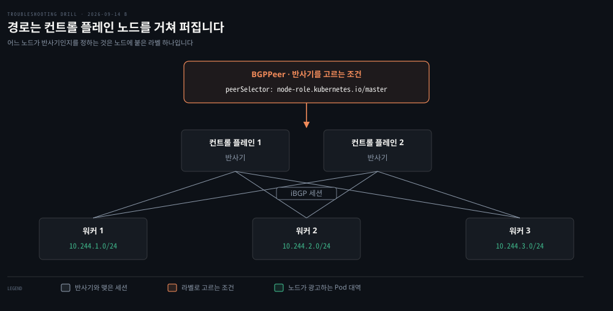
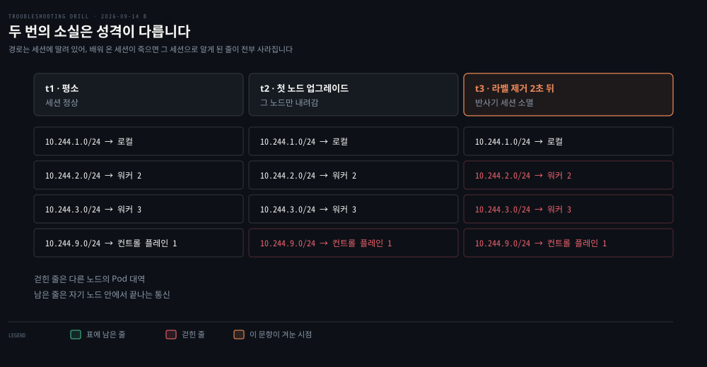

# 업그레이드 2분 뒤 멈춘 클러스터

---

> 컨트롤 플레인을 껐다 켜도 그대로였다는 사실이 컴포넌트 고장을 지웁니다. 남은 것은 클러스터에 적혀 있던 상태이고, 그 상태를 지운 것은 업그레이드 명령 자신이었습니다.

## 문제 소개

> 가장 큰 클러스터를 1.23에서 1.24로 올리자 2분 뒤 서비스 전체가 멈췄습니다.

**출처** · [Reddit · You Broke Reddit: The Pi-Day Outage](https://www.reddit.com/r/RedditEng/comments/11xx5o0/you_broke_reddit_the_piday_outage/) (2023)



`kubeadm` 으로 직접 구축해 여러 해 운영한 클러스터입니다. CNI 는 Calico 이고 컨테이너 런타임은 CRI-O 입니다. 노드가 많아 모든 노드가 서로 BGP 세션을 맺는 풀메시가 버거웠고, 몇 년 전 컨트롤 플레인 노드를 경로 반사기로 두는 구성으로 바꿔 두었습니다. 위 도식의 맨 위 상자가 그 반사기를 고르는 조건입니다.

같은 업그레이드를 시험용 클러스터와 덜 중요한 운영 클러스터에서 먼저 마쳤습니다. 컨트롤 플레인 첫 노드부터 시작했고 2분쯤 지나 서비스 전체가 한꺼번에 멈췄습니다.

```bash
# 메트릭          이 클러스터의 지표가 전부 끊김. 따로 떨어진 CDN 쪽만 남음
# DNS             클러스터 내부 이름과 사내 Consul 이름 해석 실패. 공개 도메인은 정상
# Pod             시작과 종료가 한참 걸림. 100MB 이미지를 받는 데 몇 분
# 컨트롤 플레인 로그  양은 많은데 뚜렷한 오류가 없음
# Calico          calico-kube-controllers 가 ContainerCreating 에 멈춤
# API 서버 로그     쓰기 요청 타임아웃 다수. 쓰기가 아니라 어드미션 웹훅 호출이 시간 초과
```

손쓴 것과 결과입니다.

```bash
# 멈춘 calico-kube-controllers Pod 삭제        → 그대로
# calico-typha Pod 삭제                        → 새 Pod 이 안 생김
# 컨트롤 플레인 컴포넌트 롤링 재시작             → 변화 없음
# 컨트롤 플레인 전체를 껐다 켬                   → 변화 없음
# OPA 웹훅 설정 삭제                            → 타임아웃은 즉시 사라짐, 클러스터는 회복 안 됨
# 백업으로 컨트롤 플레인을 1.23 으로 복원        → 노드가 다시 붙기 시작함
```

출력에서 읽히는 것은 범위입니다. 바깥으로 나가는 길은 살아 있고 클러스터 안에서 서로 부르는 길만 끊겼습니다. 읽히지 않는 것은 그 안쪽이 어디서 끊겼느냐입니다. 같은 노드 안의 Pod 끼리 되는지, 노드를 넘을 때만 안 되는지는 아무도 재지 않았습니다.


## 원인 분석

> 컴포넌트를 갈아 끼워도 그대로라면 깨진 것은 컴포넌트가 아니라 클러스터에 남아 있는 상태입니다.



**배제된 것.** 컨트롤 플레인 컴포넌트를 롤링 재시작하고 전체를 껐다 켰는데도 변화가 없었습니다. 프로세스가 새로 떠도 같은 상태라면 원인은 프로세스 쪽이 아닙니다. OPA 웹훅도 같은 논리로 빠집니다. 설정을 지우자 타임아웃은 즉시 사라졌는데 클러스터는 그대로였으니, 웹훅은 원인이 아니라 결과 쪽입니다.

**낮아진 것.** Calico Pod 이 건강하지 않다는 관찰은 원인처럼 보이지만 순서가 반대일 수 있습니다. `calico-kube-controllers` 가 `ContainerCreating` 에 멈춘 것은 그 Pod 이 뜨려면 이미 네트워크가 있어야 하기 때문입니다. Pod 을 지워도 그대로였다는 사실이 이 후보의 우선순위를 내립니다.

**남은 것.** 1.24 업그레이드가 기존 컨트롤 플레인 노드에서 `node-role.kubernetes.io/master` 라벨을 제거했습니다. 변경 기록의 문장이 그것입니다.

> *For clusters that are being upgraded to 1.24 with `kubeadm upgrade apply`, the command will remove the label `node-role.kubernetes.io/master` from existing control plane nodes.*

지워진 것은 노드 오브젝트 안의 한 줄입니다.

```yaml
apiVersion: v1
kind: Node
metadata:
  name: cp-1
  labels:
    kubernetes.io/hostname: cp-1
    node-role.kubernetes.io/master: ""          # ← 1.24 업그레이드가 이 줄을 지웠다
    node-role.kubernetes.io/control-plane: ""
```

반사기를 고르던 BGPPeer 셀렉터가 그 라벨을 보고 있었습니다. 라벨이 사라지자 셀렉터는 아무 노드도 고르지 못했고, 반사기와 맺고 있던 iBGP 세션이 끊겼습니다.

경로는 세션에 딸려 있습니다. 배워 온 세션이 죽으면 그 세션으로 알게 된 줄이 함께 걷힙니다. 모든 노드가 서로의 Pod 대역을 반사기를 통해 배우고 있었으므로, 각 노드의 라우팅 표에 자기 Pod 대역만 남았습니다.

사후 로그의 순서가 이것을 보여 줍니다. 혼란 2초 전 모든 노드의 `calico-node` 가 첫 컨트롤 플레인 노드로 가는 경로를 지우기 시작했습니다. 업그레이드로 그 노드가 잠시 내려갔으니 여기까지는 정상입니다. 이상한 것은 곧이어 **모든 노드로 가는 경로**가 함께 사라진 점이었습니다. 위 도식의 t2 와 t3 가 그 두 소실입니다.

증상들도 한 뿌리로 묶입니다. 노드를 넘는 Pod 통신이 끊기면 다른 노드에 있는 CoreDNS·OPA·메트릭 수집기에 닿지 못합니다. 이름 해석 실패, 메트릭 소실, 웹훅 타임아웃이 전부 거기서 나옵니다.

**다른 클러스터가 멀쩡했던 이유도 원문에 있습니다.** 반사기 구성은 가장 크고 오래된 클러스터들만 썼습니다. 그 설정은 Calico 전용 CLI 로 받아 손으로 고쳐 올리는 방식이라 코드 어디에도 커밋되지 않았고, 구성한 사람들은 이미 떠난 뒤였습니다. 릴리스 노트를 읽었더라도 대조할 대상이 없었습니다.


## 해결 방법

> 세션이 살아 있는지를 노드에서 직접 보고, 셀렉터가 무엇을 고르는지 세어 봅니다.

```bash
# 세션이 살아 있는가 — 로컬 에이전트와 통신하므로 보려는 그 노드에서 실행한다
sudo calicoctl node status

# 셀렉터가 무엇을 고르는가 — 결과가 0 개면 빈 집합이다
kubectl get nodes -l node-role.kubernetes.io/master
calicoctl get bgppeer -o yaml

# 경로가 남아 있는가
ip route | grep 10.244
```

- **응급 (원문)**: 백업으로 컨트롤 플레인을 1.23 으로 복원했습니다. 쿠버네티스에는 공식 다운그레이드 절차가 없어 복원이 유일한 되돌리기였습니다
- **응급 (해석)**: 원인을 알았다면 사라진 라벨을 노드에 도로 붙이는 쪽이 훨씬 짧습니다. `kubectl label node <컨트롤플레인노드> node-role.kubernetes.io/master=""` 한 줄이면 셀렉터가 다시 노드를 고릅니다
- **재발 방지**: 셀렉터가 플랫폼 소유 라벨이 아니라 우리가 붙인 라벨(`route-reflector: "true"`)을 보게 바꿉니다. 그 BGPPeer 리소스를 Git 에 넣습니다. 플랫폼 표식에 의존하는 설정 목록을 만들어 업그레이드 전에 릴리스 노트와 맞춰 보고, 시험 클러스터가 운영과 같은 구성을 갖게 합니다
- **검증**: 지면 풀이라 실행하지 않았습니다. 조치 뒤 `calicoctl node status` 의 피어가 `Established` 로 돌아오고 `ip route` 에 다른 노드 대역 줄이 다시 보이면 확인된 것으로 봅니다


## 다른 방법 비교

> 같은 증상을 만드는 다른 원인과, 이 사고에서 통하지 않았던 선택지입니다.

노드를 넘는 통신만 끊기는 증상은 다른 자리에서도 납니다. 하부 네트워크가 Pod 대역을 모르는 구성(오버레이 없이 경로 주입도 없는 상태), 노드 간 방화벽이 BGP 의 TCP 179 를 막은 경우, MTU 가 어긋나 큰 패킷만 사라지는 경우가 그렇습니다. 가르는 방법은 같습니다. 같은 노드 쌍과 다른 노드 쌍에 Pod 주소로 걸어 경계를 찾고, 그다음 세션과 경로를 노드에서 읽습니다.

**설치 도구를 바꾸는 것도 답이 아닙니다.** 라벨을 지운 동작은 kubeadm 의 것이고, Kubespray 는 내부적으로 kubeadm 을 쓰므로 같은 일이 납니다. 공식 문서가 비-kubeadm 배포를 v2.9 부터 deprecated 로 두고 다음 릴리스에서 제거한다고 적습니다. 관리형 서비스는 컨트롤 플레인이 우리 노드가 아니라 이 라벨 자체가 없어 해당 사항이 없습니다. 도구를 옮기는 것은 방아쇠를 옮기는 일이지, 플랫폼 소유 표식에 기대는 구조를 치우는 일이 아닙니다.

**Calico 를 최신 버전으로 올리는 것은 이 문제를 고치지 못합니다.** 셀렉터 문자열은 Calico 코드가 아니라 우리가 만든 BGPPeer 리소스 안에 있습니다. 새 버전이 남의 리소스에 적힌 라벨 이름을 고쳐 주지 않고, 장애 중에 CNI 를 갈아 끼우면 변수만 늘어납니다.

**웹훅 타임아웃을 먼저 쫓는 것도 막다른 길입니다.** 그 타임아웃은 API 서버가 다른 노드의 OPA Pod 에 닿지 못해 생긴 결과입니다. 설정을 지우면 타임아웃은 멎지만 경로는 그대로 없습니다. 실제로 그 실험이 이 사고에서 배제의 재료가 됐습니다.


## 나온 개념

> 라벨이 대상 집합을 고른다는 것, 그리고 빈 집합은 에러가 아니라는 것입니다.

라벨은 오브젝트가 아니라 **노드 오브젝트 안의 필드**입니다. 그래서 업그레이드가 고친 것은 노드 하나하나이고, BGPPeer 리소스는 한 글자도 바뀌지 않았습니다.

셀렉터는 링크가 아니라 질의이기 때문입니다. 특정 노드를 가리키는 포인터가 아니라 "지금 이 조건에 맞는 노드가 누구냐"를 매번 다시 묻습니다. 그래서 노드 쪽 한 줄이 사라지면 그 조건을 쓰던 곳이 동시에 빈손이 됩니다. BGPPeer 만이 아니라 같은 라벨을 쓰던 `nodeSelector`·어피니티·모니터링 질의·`kubectl -l` 필터가 모두 같은 순간에 답이 달라집니다.

고를 것이 하나도 없는 상태도 정상적인 결과이므로 경고도 에러도 남지 않습니다. 로그가 조용했던 이유가 여기 있습니다.

**반사기를 컨트롤 플레인에 두는 것은 관례이지 권장 사항이 아닙니다.** Calico 문서는 반사기로 쓸 노드에 `routeReflectorClusterID` 를 붙이라고만 하고 어느 노드를 고르라고는 하지 않습니다.

대신 그 노드에 우리가 만든 라벨을 붙이라고 안내합니다.

> *Typically, you will want to label this node to indicate that it is a route reflector, allowing it to be easily selected by a BGPPeer resource.*

예시로 든 명령이 `kubectl label node my-node route-reflector=true` 입니다. 이 사고는 그 자리에 플랫폼 소유 라벨을 대신 끼워 넣은 구성이었습니다.

컨트롤 플레인 노드를 쓰면 대수가 적고 오래 살아 있다는 이점이 있지만 대가가 따라옵니다. 쿠버네티스는 컨트롤 플레인이 멈춰도 데이터 플레인이 살아 있도록 설계돼 있는데, 반사기를 거기 얹으면 그 분리가 사라집니다. **컨트롤 플레인 유지보수가 곧 데이터 플레인 사고가 됩니다.** 업그레이드는 정의상 컨트롤 플레인을 건드리는 작업이라 이 사고가 정확히 그 자리에서 났습니다.

근거는 [노드 간 경로를 누가 퍼뜨리는가](../_concepts/%EB%85%B8%EB%93%9C-%EA%B0%84-%EA%B2%BD%EB%A1%9C%EB%A5%BC-%EB%88%84%EA%B0%80-%ED%8D%BC%EB%9C%A8%EB%A6%AC%EB%8A%94%EA%B0%80.md) 입니다. 풀메시와 반사기, 빈 셀렉터, 세션과 경로를 노드에서 읽는 명령을 거기 모았습니다. 반사기 자체의 이론은 [AS 안과 AS 사이 §3](../../02_os/book/cntd_computer-networking-top-down/05-02.AS%20%EC%95%88%EA%B3%BC%20AS%20%EC%82%AC%EC%9D%B4.md) 이 정본이고, Calico 가 노드를 작은 라우터로 만드는 구성은 [IP·라우팅·Ethernet §3](../../08_cloud/book/networking-and-kubernetes/01-03.IP%C2%B7%EB%9D%BC%EC%9A%B0%ED%8C%85%C2%B7Ethernet%20%E2%80%94%20%ED%8C%A8%ED%82%B7%EC%9D%B4%20%EA%B8%B8%EC%9D%84%20%EC%B0%BE%EB%8A%94%20%EB%B2%95.md) 에 있습니다.

같은 손잡이가 다른 층에도 있습니다. [Pod 로는 되고 이름으로는 안 되는 호출](./2026-09-07_Pod%20%EB%A1%9C%EB%8A%94%20%EB%90%98%EA%B3%A0%20%EC%9D%B4%EB%A6%84%EC%9C%BC%EB%A1%9C%EB%8A%94%20%EC%95%88%20%EB%90%98%EB%8A%94%20%ED%98%B8%EC%B6%9C.md) 에서는 Service 의 selector 가 Pod 라벨과 어긋나 EndpointSlice 가 조용히 비었습니다.

**1차 확인 (2026-09-16).** 라벨 제거는 [Kubernetes CHANGELOG-1.24](https://github.com/kubernetes/kubernetes/blob/master/CHANGELOG/CHANGELOG-1.24.md) 의 kubeadm 항목에서 확인했습니다. 이름을 바꾼 이유는 [KEP-2067](https://github.com/kubernetes/enhancements/tree/master/keps/sig-cluster-lifecycle/kubeadm/2067-rename-master-label-taint) 이 적습니다. 1.20 이 첫 단계로 예고했고 옛 taint 는 [CHANGELOG-1.25](https://github.com/kubernetes/kubernetes/blob/master/CHANGELOG/CHANGELOG-1.25.md) 에서 제거됐습니다. 반사기 셀렉터와 `calicoctl node status` 의 실행 위치는 [Calico — Configure BGP peering](https://docs.tigera.io/calico/latest/networking/configuring/bgp) 에서 봤습니다. 원문 본문은 Reddit 이 막혀 web.archive.org 사본으로 읽었습니다.


## 관련 문서

- [kubernetes 계층 목록](./README.md) — 클러스터 안에서 나는 문항들
- [회차 로그](../_drill/log.md) — 이 문항을 푼 날의 점수와 막힌 지점
- [노드 간 경로를 누가 퍼뜨리는가](../_concepts/%EB%85%B8%EB%93%9C-%EA%B0%84-%EA%B2%BD%EB%A1%9C%EB%A5%BC-%EB%88%84%EA%B0%80-%ED%8D%BC%EB%9C%A8%EB%A6%AC%EB%8A%94%EA%B0%80.md) — 이 문항에서 갈라져 나온 개념 노트
