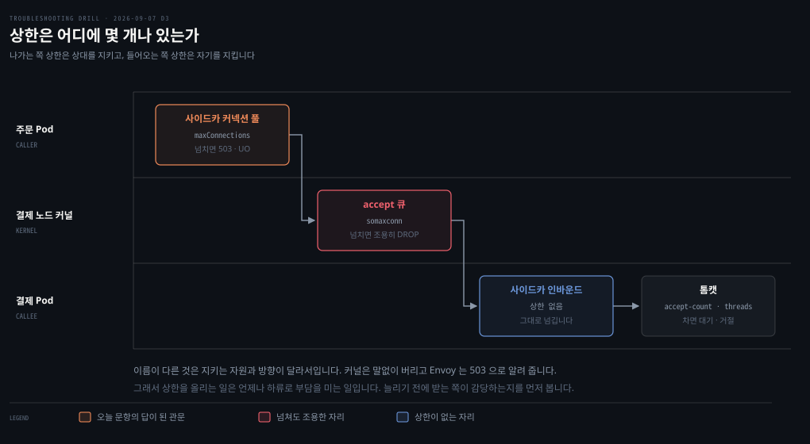

# 트래픽이 늘 때만 섞여 나오는 503

---

> 상태 코드를 뱉으려면 L7 이 필요합니다. 앱이 안 뱉었다면 다른 L7 이 뱉은 것이고, 메시 안에서 그것은 사이드카입니다.

## 문제 소개

> 대상 Pod 는 전부 멀쩡한데 트래픽이 오를 때만 503 이 섞입니다. 결제 앱 로그에는 아무 기록이 없습니다.

메시 안에서 주문 서비스가 결제 서비스를 호출합니다. 평소에는 문제가 없는데 트래픽이 오르는 시간대에만 503이 섞여 나오고, 실패율은 트래픽에 따라 오르내립니다.

```bash
# kubectl get pods -l app=payment
NAME                       READY   STATUS    RESTARTS   AGE
payment-6c9f4d7b8-2xk4m    2/2     Running   0          3h
payment-6c9f4d7b8-9wqzt    2/2     Running   0          3h
payment-6c9f4d7b8-lm5rc    2/2     Running   0          3h

# 주문 Pod 안에서 결제 Pod 를 직접 호출
kubectl exec -it order-xxx -c order -- curl -s -o /dev/null -w '%{http_code}\n' http://10.244.1.31:8080/health
200
```

Pod 셋 다 `2/2 Running`이고 재시작 이력이 없습니다. 결제 서비스 애플리케이션 로그에는 자기가 500대를 냈다는 기록이 없습니다.


## 원인 분석

> HTTP 상태 코드를 만들려면 L7 을 이해하는 무언가가 있어야 합니다. 결제 앱이 안 뱉었다면 다른 L7 이 뱉은 것입니다.



위치는 두 조건으로 좁혀집니다. 이 호출은 클러스터 안에서 Pod끼리 오가므로 **Ingress Gateway를 지나지 않습니다.** 그리고 `2/2`가 답을 들고 있습니다. 결제 애플리케이션과 사이드카 프록시 둘입니다.

503을 만든 것은 그 사이드카이고, **고장 난 게 아니라 의도적으로 거절한** 것입니다. 그래서 앱 로그가 비어 있습니다. 요청이 거기까지 가지 않았으니까요.

503이 "도달할 수 없다"가 아니라 **"지금 처리할 수 없다"**인 것도 여기서 확인됩니다. 도달 못 했다면 응답 자체가 없어 타임아웃이 났을 것입니다.

거절한 이유는 둘로 갈립니다.

- **커넥션 풀 상한 초과**: `maxConnections`나 `http1MaxPendingRequests`를 넘어 더 못 보냅니다
- **보낼 대상이 없음**: `outlierDetection`이 응답 나쁜 인스턴스를 명단에서 빼다가 전부 빠졌습니다

트래픽이 오를 때만이라는 조건에 둘 다 들어맞습니다.


## 해결 방법

> Envoy access log 의 response flag 두 글자가 두 후보를 가릅니다. 확인한 뒤에는 상한을 올리는 대신 받는 쪽을 봅니다.

```bash
kubectl logs order-xxx -c istio-proxy | grep ' 503 '
```

- **UO** (Upstream Overflow): 커넥션 풀 상한을 넘어 거절했습니다
- **UH** (No healthy Upstream): 보낼 만한 대상이 하나도 없었습니다

`UO`로 확인됐다면 조치는 이렇습니다.

- **응급**: 결제 서비스를 스케일 아웃해 처리량을 늘립니다
- **재발 방지**: `DestinationRule`의 상한값을 결제의 실측 용량에 근거해 정합니다. 지금은 근거 없이 기본값일 가능성이 큽니다

**상한만 올리는 것이 답이 아닌 이유**가 여기 있습니다. 커넥션 풀을 늘리면 결제로 더 많은 요청이 흘러갑니다. 그 상한은 원래 결제를 지키려고 있던 것이므로, 받는 쪽이 감당하는지를 먼저 봐야 합니다.


## 다른 방법 비교

> 두 서킷 브레이커는 끊는 대상이 다르고, 상한의 위치를 바꾸는 선택지도 있습니다.

| | 무엇을 끊나 | 언제 |
|---|---|---|
| `connectionPool` | 총량 — 더 보내지 않음 | 동시 요청이 상한을 넘을 때 |
| `outlierDetection` | 개별 대상 — 그 인스턴스만 뺌 | 특정 인스턴스가 5xx나 지연을 낼 때 |

`outlierDetection`은 악순환을 만들 수 있습니다. 하나가 느려져 빠지면 남은 데 트래픽이 몰리고, 그것도 느려져 빠지고, 결국 갈 곳이 없어집니다. Envoy에는 이걸 막는 **패닉 모드**가 있어서, 건강한 비율이 임계 아래로 떨어지면 건강 판정을 무시하고 전부에게 보내기 시작합니다. 다 빼버려서 아무 데도 못 가느니 아픈 놈에게도 보내는 편이 낫다는 판단입니다.

**상한의 위치를 바꾸는 선택지도 있습니다.** 커넥션 풀을 주문 쪽에 두는 대신 결제 쪽에 요청 큐를 두거나, 아예 비동기 메시징으로 바꿔 순간 부하를 흡수하는 방식입니다. 다만 이건 아키텍처 변경이라 응급 조치가 될 수 없습니다.


## 나온 개념

> 상한은 어디에나 있고 구조는 같습니다. 다른 것은 무엇을 지키려는가와 넘쳤을 때의 태도입니다.

이름이 갈리는 것은 **방향** 때문입니다. accept 큐와 스레드 풀은 남이 나에게 보낸 것을 감당하는 상한이라 자기를 지킵니다. Envoy 커넥션 풀은 내가 남에게 보낼 것을 스스로 제한하는 상한이라 상대를 지킵니다.

넘쳤을 때의 태도도 다릅니다. 커널은 말없이 버려 타임아웃으로만 드러나고, Envoy는 503으로 즉시 알려 줍니다. 같은 "몰려서 실패했다"가 계층에 따라 전혀 다른 증상으로 보입니다.

여기서 반복해서 나오는 결론이 하나 있습니다. **상한을 올리는 일은 언제나 하류로 부담을 미는 일입니다.** 톰캣 큐를 늘리면 앱이 더 밀리고, 커넥션 풀을 늘리면 결제가 더 밀립니다. 늘리기 전에 받는 쪽이 감당하는지를 봐야 합니다.

`outlierDetection`은 회복탄력성 패턴 중 서킷 브레이커 계열입니다. Istio는 이것과 `connectionPool` 상한을 한 이름으로 묶어 부릅니다.

근거는 [istio 06-01 실패를 견디는 일을 프록시로 옮겼을 때](../../08_cloud/book/istio-in-action/)입니다. 503, 커넥션 풀, `outlierDetection`, 재시도가 모두 이 편에 있습니다.


## 관련 문서

- [mesh 계층 목록](./README.md) — 서비스 메시에서 푼 문항들
- [회차 로그](../_drill/log.md) — 이 문항을 푼 날의 점수와 막힌 지점
- [실패를 견디는 일을 프록시로 옮겼을 때](../../08_cloud/book/istio-in-action/) — 커넥션 풀과 outlierDetection 의 근거
- [실패율 0.3%가 사라지지 않는 서버](../os/2026-09-07_실패율%200.3%25가%20사라지지%20않는%20서버.md) — 같은 날 푼 문항. 커널 쪽 상한과 짝을 이룹니다
