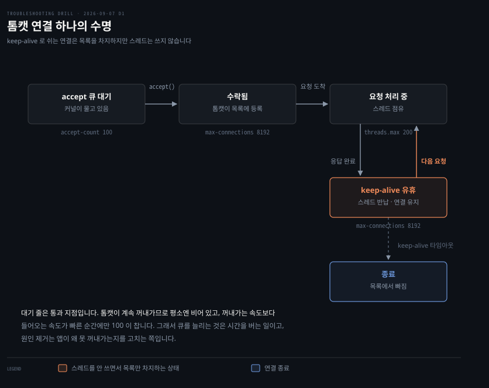

# 실패율 0.3%가 사라지지 않는 서버

---

> 로그가 비어 있는데 클라이언트만 실패를 본다면, 요청이 애플리케이션에 닿기 *전에* 사라진 것입니다. 그래서 수사는 위가 아니라 아래에서 시작합니다.

## 문제 소개

> 자원은 남는데 일부 요청만 사라지는 서버입니다. 무엇을 봐야 할지가 이 문항의 전부입니다.

사내 API 서버 한 대에서 응답 실패율이 0.3% 안팎으로 꾸준히 나옵니다. 클라이언트는 타임아웃을 보고하는데 애플리케이션 로그에는 예외가 하나도 없습니다. 같은 랙에 있는 동일 구성의 다른 서버 두 대는 멀쩡합니다.

서버에서 확인된 것은 여기까지였습니다.

```bash
# uptime
 14:22:31 up 91 days,  3:14,  1 user,  load average: 0.82, 0.77, 0.71

# free -h
               total        used        free      shared  buff/cache   available
Mem:            31Gi        12Gi       4.1Gi       1.2Gi        15Gi        17Gi

# systemctl status api
   Active: active (running) since Mon 2026-06-08 11:03:22 KST; 91 days ago
```

CPU도 메모리도 여유가 있고 프로세스는 재시작 없이 91일째 떠 있습니다. 자원이 부족한 상황이 아닌데도 일부 요청만 사라집니다.


## 원인 분석

> 패킷은 NIC 에서 애플리케이션까지 다섯 층을 지나고, 층마다 넘치면 버립니다. 어느 층의 카운터가 늘고 있는지가 곧 어디서 사라졌는지입니다.


두 사실이 수사 방향을 결정합니다.

**첫째, 애플리케이션 로그가 비어 있습니다.** 앱이 요청을 받아 처리하다 실패했다면 보통 에러가 남습니다. 아무것도 없다는 것은 요청이 앱에 **닿지 않았다**는 뜻입니다. 그러면 앱 위쪽이 아니라 아래쪽을 봐야 합니다.

**둘째, 간헐적입니다.** 규칙이 막는 것이라면 100% 실패해야 하는데 99.7%는 성공합니다. 상시 차단이 아니라 **무언가가 가끔 넘친다**는 신호입니다.

버릴 때마다 커널이 숫자를 세어 둡니다. 그런데 카운터를 읽을 때 함정이 하나 있습니다. **총량이 아니라 증가분을 봐야 합니다.** 카운터는 부팅 이후 누적이라 91일 서버에서는 정상 오차도 큰 숫자로 보입니다. 실습 중에 `/proc/net/softnet_stat`을 두 번 찍었더니 그 차이가 그대로 드러났습니다.

| CPU 0 | 처음 | 잠시 뒤 | 증가 |
|---|---|---|---|
| processed | 2,495,160 | 2,506,564 | +11,404 |
| dropped | 0 | 0 | 0 |
| time_squeeze | 4,816 | 4,840 | +24 |

패킷을 만 개 넘게 더 처리하는 동안 버린 것은 0입니다. 총량 `4,816`만 봤다면 문제로 읽었을 숫자입니다.


## 해결 방법

> 층을 아래에서 위로 훑으며 증가하는 카운터를 찾습니다. 찾은 뒤에는 큐를 늘리는 것과 원인을 고치는 것을 가릅니다.

```bash
ip -s link show eth0                    # RX errors · dropped · missed
ethtool -S eth0 | grep -i -E 'miss|drop|buf'
cat /proc/net/softnet_stat              # 2열이 백로그 넘침
ss -lnt                                 # Recv-Q 가 쌓이는가
nstat -az | grep -i -E 'listen|abort'   # ListenOverflows · ListenDrops
conntrack -C; sysctl net.netfilter.nf_conntrack_max
```

`ListenOverflows`가 늘고 있다면 소켓 accept 큐가 넘친 것입니다. 조치는 둘로 갈립니다.

- **응급**: `net.core.somaxconn`과 애플리케이션의 backlog 설정을 올려 대기 공간을 넓힙니다
- **재발 방지**: 앱이 왜 `accept()`로 꺼내가지 못하는지를 고칩니다. 스레드 풀 부족, GC 정지, 블로킹 I/O가 흔한 원인입니다

큐를 늘리는 것은 시간을 버는 일이지 원인 제거가 아닙니다.


## 다른 방법 비교

> 타임아웃을 방화벽 하나로 잡으면 좁습니다. DROP 과 REJECT 는 증상이 다르고, 도구마다 보는 층이 다릅니다.

**DROP과 REJECT는 증상이 다릅니다.**

| | 클라이언트가 보는 것 |
|---|---|
| REJECT | RST 또는 ICMP로 즉시 거부 — **바로 실패** |
| DROP | 아무 응답 없음 — **타임아웃** |

타임아웃이 났다는 사실은 규칙이 막았다는 뜻이 아니라 **조용히 버려졌다**는 뜻입니다. 그러면 후보가 방화벽 하나가 아니라 다섯 층 전부로 넓어집니다.

**계층별 도구도 겹치지 않습니다.** `tcpdump`는 NIC를 지난 패킷만 보므로 링 버퍼에서 버려진 것은 잡지 못합니다. 반대로 `ss`는 소켓 계층만 보고 그 아래는 못 봅니다. 한 도구로 결론을 내면 그 도구가 안 보여 준 층이 사각으로 남습니다.


## 곁가지 — 톰캣의 세 상한

> accept 큐 100과 max-connections 8192와 스레드 200이 동시에 성립하는 이유입니다. 셋이 같은 것을 세지 않습니다.



"대기 줄이 100인데 어떻게 8192개를 무느냐"가 풀이 중 나온 질문이었습니다. 답은 **대기 줄이 저장소가 아니라 통과 지점**이라는 데 있습니다. 톰캣이 계속 꺼내가므로 평소엔 거의 비어 있고, 꺼내가는 속도보다 들어오는 속도가 빠른 순간에만 찹니다.

8192가 말이 되는 것은 keep-alive 때문입니다. 연결은 살아 있지만 대부분은 요청을 안 보내고 쉽니다. 도식에서 강조한 유휴 상태의 연결은 목록을 차지하되 스레드는 쓰지 않습니다.

| 설정 | 정체 | 기본값 |
|---|---|---|
| `server.tomcat.accept-count` | 대기 줄 | 100 |
| `server.tomcat.threads.max` | 처리 스레드 | 200 |
| `server.tomcat.max-connections` | 물고 있는 연결 | 8192 |

`net.core.somaxconn`은 그 위의 커널 상한입니다. 앱이 1000을 요청해도 커널이 128이면 128로 잘립니다. 앱 설정만 올리고 커널을 안 올리면 조용히 무시되는 함정이 여기 있습니다.


## 나온 개념

> 이 문항에서 갈라져 나온 것들입니다. 대부분 출력을 읽는 법이었습니다.

`uptime`은 현재 시각, 가동 시간, 접속자 수, 그리고 1분·5분·15분 부하 평균 다섯을 한 줄에 보여줍니다.

`load average`는 퍼센트가 아니라 **개수**입니다. 실행 가능 상태로 줄 서 있는 프로세스의 평균 수라 코어 수와 나란히 놓아야 뜻이 생깁니다. 8코어에서 `0.82`는 약 10%이지 82%가 아닙니다. 그리고 리눅스에서는 CPU 대기만이 아니라 **디스크 I/O 대기까지 함께 셉니다.**

`ip -s link`의 네 칸도 뜻이 다릅니다.

- **errors**: 체크섬이나 프레임이 망가진 패킷
- **dropped**: 받았지만 버린 것
- **missed**: NIC가 아예 못 받은 것으로, 링 버퍼 넘침의 직접 지표
- **mcast**: 멀티캐스트

실습 중에 `eth0@if8`과 `link-netnsid 0`이 찍혔습니다. veth 페어의 한쪽이라는 표시이고, **컨테이너 안에서는 물리 NIC의 링 버퍼를 볼 수 없습니다.** 보려면 노드로 나가야 합니다.

대조에 적었지만 1차 자료로 확인하지 않은 것이 있습니다. `somaxconn` 기본값과 `curl` 종료 코드는 기억으로 적었습니다.

근거는 [nk 02-03 Linux 네트워크 진단 도구와 02-01 커널이 패킷을 다루는 법](../../08_cloud/book/networking-and-kubernetes/), 그리고 [lml 08-02 자원마다 창이 따로 나 있다](../../02_os/book/learning-modern-linux/)입니다.


## 관련 문서

- [os 계층 목록](./README.md) — 리눅스 호스트에서 푼 문항들
- [회차 로그](../_drill/log.md) — 이 문항을 푼 날의 점수와 막힌 지점
- [Linux 네트워크 진단 도구](../../08_cloud/book/networking-and-kubernetes/) — 계층 순서 수사가 나온 자리
- [리눅스 사례집 05-01 포트와 소켓](../../02_os/troubleshooting/) — 같은 계층의 인접 사례
