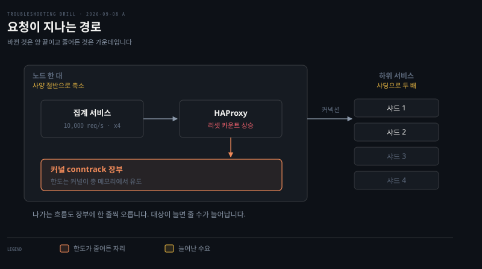

# 아무것도 안 바꿨는데 늘어난 커넥션 리셋

---

> 아무도 무엇을 잘못 바꾸지 않았습니다. 노드 사양을 낮추면 커널이 커넥션 추적 한도를 조용히 함께 내립니다.


## 문제 소개

> 집계 서비스의 오류율이 며칠째 올라 있고, 트래픽이 많은 서비스에서만 납니다.

**출처** · [loveholidays · Kubernetes networking problems due to the conntrack](https://deploy.live/blog/kubernetes-networking-problems-due-to-the-conntrack/) (2023)



집계 서비스가 HAProxy 를 거쳐 하위 서비스로 나가는 구조입니다. 가운데 상자가 노드 한 대의 경계이고, 그 안의 커널 장부에 나가는 흐름이 한 줄씩 오릅니다.

최근 바뀐 것은 양 끝에 있습니다. 오른쪽 대상이 두 배가 됐고 노드 사양은 절반이 됐습니다.

애플리케이션 로그에는 응답을 받지 못했다는 예외가 쌓입니다.

```pseudocode
org.apache.http.NoHttpResponseException: xxxxx failed to respond
```

앞단 HAProxy 의 커넥션 리셋 카운트가 떨어지지 않고 계속 오릅니다. 요청량이 높을 때 몰리고, 이 서비스는 평시 10,000 req/s 에 스파이크 때 4배까지 갑니다.

애플리케이션 코드와 HAProxy 설정은 문제 시작 전후로 변경이 없습니다. 인프라 쪽에만 최근 둘이 있었습니다. 비용 절감으로 노드풀 사양을 낮춰 대당 절반이 됐고, 이 서비스가 부르는 하위 서비스가 샤딩되어 붙는 대상 수가 두 배가 됐습니다.

출력에서 읽히는 것 하나가 결정적입니다. 상대 서비스 로그에 이 요청이 아예 도착하지 않은 경우가 섞여 있습니다. 읽히지 않는 것은 어디서 사라졌는가입니다.


## 원인 분석

> 일부 노드가 conntrack 테이블을 다 썼습니다. 아무도 잘못 바꾸지 않았고 정상 변경 셋이 겹쳤습니다.


패킷이 버려질 수 있는 자리를 아래에서 위로 쌓은 그림입니다. 강조된 conntrack 이 이 사고의 자리이고, 왼쪽이 그 자리의 범위입니다.

**배제된 것.** 상대 서비스의 결함이 아닙니다. 요청이 상대에 도착하지 않은 경우가 있으므로 상대가 거절한 것이 아니라 가는 길에 사라졌습니다.

**낮아진 것.** HAProxy 자체의 한도는 우선순위가 내려갑니다. 다만 이 관찰이 지우는 것은 상대 서비스이지 HAProxy 가 아니므로 완전히 배제되지는 않습니다. 무엇을 더 보면 갈리느냐 — HAProxy 로그의 termination state 가 "내 한도에 걸렸다"고 말하는지 "서버가 응답을 안 줬다"고 말하는지 보면 됩니다.

**남은 것.** conntrack 테이블 포화입니다. 넘친 뒤에 온 패킷은 조용히 버려지고, 커널은 거절 응답을 만들어 주지 않으므로 상대 로그에 남지 않습니다.

세 가지가 겹쳐 한도를 넘었습니다. 노드 사양이 절반이 되어 한도가 함께 줄었습니다. 샤딩으로 추적할 커넥션이 두 배가 됐습니다. 평시 10,000 req/s 에 4배 스파이크가 겹쳐 여유가 없었습니다.

첫 번째가 이 사고의 함정입니다. `nf_conntrack_max` 는 관리자가 정한 값이 아니라 커널이 총 메모리에서 유도합니다. 사양 축소는 CPU 와 메모리 여유만 건드리는 결정으로 보이지만 네트워크 상태 테이블의 상한까지 함께 내립니다. 이 연결이 안 보이면 인프라는 안 건드렸다는 말이 나옵니다.

버려지는 것과 리셋은 같은 사건이 아닙니다. 커널이 조용히 버리면 보낸 쪽은 응답이 없어 타임아웃에 걸리고, 그 소켓을 정리할 때 비로소 RST 가 나갑니다. 상대 로그에 요청이 없다는 것과 리셋 카운트가 오른다는 것이 동시에 성립하는 이유입니다.


## 해결 방법

> 배치를 바꾸는 것이 곧 한도를 올리는 일입니다. 한도가 RAM 에서 나오기 때문입니다.

```bash
# 먼저 HAProxy 를 지웁니다 — 자기 한도에 걸린 것인지 서버가 답을 안 준 것인지
echo "show stat" | socat stdio /var/run/haproxy.sock
#   scur 현재 세션 · slim 한도 · econ 서버 연결 실패

# 증상이 나는 노드에서, 쓰는 수와 한도를 나란히
sysctl net.netfilter.nf_conntrack_count net.netfilter.nf_conntrack_max

# 넘쳐서 버린 적이 있는가
dmesg | grep -i 'nf_conntrack: table full'
```

- **응급**: 이 서비스를 RAM 이 큰 노드에 배치하고 노드당 Pod 수를 제한합니다. `nf_conntrack_max` 직접 상향도 가능하지만 항목당 메모리를 쓰므로 노드 여유 안에서만 올립니다
- **재발 방지**: `entries / limit > 0.75` 알람을 겁니다. 이 지표가 없으면 다음에 사양이나 샤딩이 바뀔 때 같은 자리로 돌아옵니다
- **검증**: 조치 뒤 같은 피크 구간에서 비율이 임계 아래로 내려가고 `NoHttpResponseException` 과 HAProxy 리셋 카운트가 함께 떨어지는지 봅니다. 지면 풀이라 미실행이므로 확인 계획으로 적습니다


## 다른 방법 비교

> 같은 증상을 만드는 다른 원인이 있고, 무엇을 보면 갈리는지가 다릅니다.

응답 없는 연결 끊김은 원인이 여럿입니다. 상대 서버의 accept 큐가 넘쳤거나, 경로 중간의 NAT 나 로드밸런서가 유휴 세션을 회수했거나, MTU 불일치로 큰 패킷만 사라지는 경우입니다. 이 셋은 노드의 conntrack 이 한가해도 일어나므로 count 와 max 를 나란히 읽으면 갈립니다.

도구 선택도 갈립니다. `sysctl` 은 지금 값과 한도를 보여 주지만 과거를 못 봅니다. `dmesg` 는 넘친 사건이 있었는지 보여 주지만 얼마나 차 있는지는 모릅니다. Prometheus 의 `node_nf_conntrack_entries` 는 추세를 보여 주지만 미리 걸어 둬야 합니다. 셋의 역할이 달라 하나로 대신하지 못합니다.

흔히 먼저 떠올리지만 틀린 선택지가 애플리케이션 커넥션 풀입니다. 풀이 고갈되면 클라이언트 쪽에서 대기가 생기지 상대에 요청이 도달하지 않는 일은 없습니다. 상대 로그에 요청이 없다는 관찰이 이 선택지를 지웁니다.


## 내 접근과 실제가 갈린 자리

> 방향은 맞게 잡았고, 마지막 한 칸에서 갈렸습니다.

| 단계 | 내가 간 길 | 실제 | 갈린 이유 |
|------|-----------|------|----------|
| 첫 의심 | HAProxy 에서 예외가 난다 | 프록시는 피해자 | 예외가 보고된 곳과 발생한 곳을 같게 봄 |
| 배제 | 상대 로그에 없음 → 서비스 예외 아님 | 같음 | 성공한 관찰로 후보를 지운 자리. 여기서 방향이 바뀜 |
| 원인 | conntrack 포화, 커널이 상한을 정함 | 같음 | 스스로 도달 |
| 한도 출처 | 커널이 정한다까지 | 총 메모리에서 **유도** | 사양 축소와 증상을 잇지 못함 |
| 첫 확인 | 못 댐 | `sysctl` 두 값 나란히 | 커널에게 묻는 명령을 모름 |

배제가 작동한 것이 이 회차의 소득입니다. "상대 로그에 요청이 없다"는 관찰 하나로 애플리케이션 계층을 지우고 커널 계층으로 내려갔습니다. 이전 회차 오답 노트의 "성공한 관찰이 무엇을 배제하는지 먼저 세는 습관"이 처음 실전에서 돌았습니다.

갈린 곳은 한도의 출처입니다. 커널이 정한다는 것까지는 갔는데 **무엇을 보고** 정하는지를 묻지 않아, 노드 사양 축소가 후보에 오르지 못했습니다. 이 물음은 [한도는 어디서 오는가](../_concepts/한도는-어디서-오는가.md)로 따로 정리했습니다.

대조를 읽은 뒤 스스로 잡아낸 것도 있습니다. 초안 대조가 폐기와 리셋을 한 사건처럼 적었는데, 조용히 버려지는 것이라면 RST 가 나올 수 없다는 지적이 맞아 순서를 세 단계로 고쳤습니다.


## 나온 개념

> 여러 문항에 걸치는 이론은 개념 노트에 모읍니다. 여기서는 이 문항에서 걸린 지점만 적습니다.

- [패킷이 사라지는 네 자리](../_concepts/패킷이-사라지는-네-자리.md) — 이 문항으로 conntrack 자리를 채웠습니다. 범위가 노드 전체라는 것, 읽는 명령이 `sysctl` 이라는 것, 비교값은 나란히 읽는다는 것
- [한도는 어디서 오는가](../_concepts/한도는-어디서-오는가.md) — 이 문항이 기계가 하드웨어에서 유도하는 한도의 사례입니다

근거 노트는 [K8s 패킷 여정 — netfilter·conntrack·라우팅](../../02_os/networking/01-02.K8s%20패킷%20여정%20—%20netfilter·conntrack·라우팅.md) §3 이고, 커널 기본값은 [nf_conntrack-sysctl 공식 문서](https://docs.kernel.org/networking/nf_conntrack-sysctl.html)로 확인했습니다.


## 관련 문서

- [A 계층 목록](./README.md) — 리눅스 호스트 한 대 안
- [회차 로그](../_drill/log.md) — 이 문항을 푼 날의 점수와 막힌 지점
- [패킷이 사라지는 네 자리](../_concepts/패킷이-사라지는-네-자리.md) — 자리별 범위와 진단 명령
- [K8s 패킷 여정](../../02_os/networking/01-02.K8s%20패킷%20여정%20—%20netfilter·conntrack·라우팅.md) — conntrack 장부의 양방향 기록
