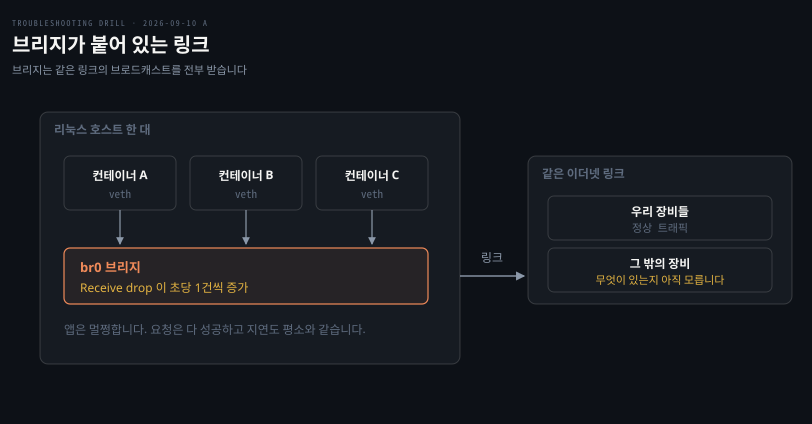

# 초당 한 번 규칙적으로 늘어나는 드롭

---

> 드롭 카운터가 오르는데 아무도 아프지 않다면, 포화가 아니라 받을 이유가 없는 것을 받았을 가능성이 큽니다.

## 문제 소개

> 브리지에 컨테이너를 물린 호스트 한 대에서 인터페이스 드롭 경보가 멈추지 않았습니다.

**출처** · [Hambier Blog · Tracking down dropped packets](https://blog.hambier.lu/post/tracking-dropped-packets) (2019)


모니터링 임계는 10분에 5건인데 실제로는 600건 안팎이 잡혔습니다. 그런데 애플리케이션 쪽에서는 아무도 불평하지 않았습니다. 요청은 다 성공하고 지연도 평소와 같았습니다. 재시작해도, 트래픽이 거의 없는 새벽에도 같은 속도로 늘었습니다.

```bash
# 10초 간격으로 두 번
$ cat /proc/net/dev | grep -E 'Inter|face|br0'
Inter-|   Receive                                        |  Transmit
 face |bytes    packets errs drop fifo frame compressed multicast|...
  br0: 84213551  312904    0 18734    0     0          0     41822

# ... 10초 뒤
  br0: 84228104  312951    0 18744    0     0          0     41830
```

이 출력에서 세 가지가 읽힙니다. 드롭이 **Receive** 열이므로 밖에서 들어온 것이 버려지고 있습니다. 10초에 10건이니 **초당 정확히 1건**입니다. 그 간격은 부하와 무관하게 일정합니다.

읽히지 않는 것도 있습니다. `/proc/net/dev` 는 개수만 세므로 **무엇이** 버려졌는지는 여기서 알 수 없습니다.


## 원인 분석

> 규칙성이 포화를 지우고, 앱이 멀쩡하다는 사실이 고장을 지웁니다.


**배제된 것.** 부하로 인한 폐기가 먼저 지워집니다. 큐가 넘쳐 버리는 것이라면 트래픽에 따라 출렁여야 하는데 새벽에도 같은 속도였습니다. 시계처럼 일정한 값은 사람의 요청이 아니라 기계가 정해진 간격으로 보내는 것을 가리킵니다.

veth 재생성도 지워집니다. 컨테이너가 초당 한 번씩 재생성된다면 애플리케이션이 멀쩡할 수 없고, 배포가 없는 새벽에도 같은 속도라는 사실이 이 후보를 한 번 더 지웁니다.

라우팅 실패도 아닙니다. 라우팅이 깨지면 나가는 트래픽이 실패하는데 이 드롭은 Receive 쪽입니다.

**낮아진 것.** 방화벽 정책으로 인한 폐기는 후보에서 내려갑니다. netfilter 가 버린 패킷은 인터페이스 입장에서 이미 수신에 성공한 것이라 `/proc/net/dev` 의 `drop` 에 오르지 않습니다. 확인하려면 `iptables -L -v -n` 의 룰별 카운터를 따로 읽어야 합니다.

**남은 것.** 받긴 했는데 넘길 곳이 없어 버린 프레임입니다. 브리지에 붙은 인터페이스는 같은 링크의 브로드캐스트를 전부 받는데, 그 프레임의 이더타입을 처리할 핸들러가 없으면 컨테이너 어디에도 못 주고 거기서 끝납니다.

커널 문서가 이 구분을 명시합니다. `rx_dropped` 는 "받았으나 처리하지 못한 패킷 — 자원 부족이나 **지원하지 않는 프로토콜**"이고, "장치의 버퍼 고갈로 버린 것은 포함하지 않아야 한다"고 못 박습니다. 포화는 `rx_missed_errors` 쪽입니다.

**확정도.** 원본 사례는 캡처로 이더타입 `0x8912`·`0x88e1` 프레임이 2초마다 나오는 것을 확인했습니다. 범인은 파워라인 통신을 내장한 케이블 모뎀이었습니다. 이 회차는 지면 풀이라 캡처를 돌리지 않았으므로 **유력 가설**입니다. 확정에는 캡처 한 번이면 충분합니다.


## 해결 방법

> 카운터에서 패킷으로 내려가 정체를 확인한 뒤, 고칠 것이 있는지부터 판정합니다.

```bash
# 카운터는 개수만 알므로 정체는 캡처로 본다
tcpdump -i br0 -e -nn not ip and not ip6

# 층을 나눠 확인 — 인터페이스 층과 netfilter 층은 서로 안 보인다
ethtool -S br0 | grep -E 'rx_missed|rx_dropped|rx_fifo'
iptables -L -v -n
```

- **응급**: 조치가 아니라 판정이 먼저입니다. 이 카운터가 장애 지표가 아니라는 사실을 기록으로 남깁니다. 그래야 다음 사람이 같은 경보에 다시 뛰어들지 않습니다
- **재발 방지**: 경보 임계를 환경에 맞게 고칩니다. 이 링크에 남의 브로드캐스트가 상존한다면 "10분에 5건"은 그 사실을 모르고 정한 값입니다. 양이 많아 자원을 축낼 때만 브리지 계층에서 차단합니다

```bash
# 양이 많을 때만. iptables 로는 막을 수 없다 — IP 계층에 도달하지 않는 프레임이다
sudo ebtables -A INPUT -p 8912 -j DROP
sudo ebtables -A INPUT -p 88e1 -j DROP
```

- **검증**: 지면 풀이라 미실행입니다. 확인하려면 캡처에서 그 이더타입이 초당 1건씩 나오는지 보고, 조치 뒤 드롭 증가분이 멈추는지 10초 간격으로 두 번 찍어 비교합니다


## 다른 방법 비교

> 같은 증상이 진짜 손실일 수도 있습니다. 가르는 것은 캡처에 무엇이 잡히느냐입니다.

캡처에 우리 트래픽이 잡히면 이야기가 완전히 달라집니다. 그때는 포화 쪽으로 돌아가 `ethtool -S` 의 `rx_missed_errors` 와 `/proc/net/softnet_stat` 을 봐야 합니다. 전자가 링 버퍼 포화이고 후자의 세 번째 열이 오르면 CPU 가 NAPI 예산 안에 큐를 못 비운 것입니다.

도구 선택에서 갈리는 자리도 있습니다. `iptables` 는 IP 패킷만 보므로 비 IP 프레임에는 아무 소용이 없습니다. 룰이 부족해서가 아니라 그 프레임이 IP 계층에 도달하지 않기 때문입니다. 이더넷 프레임을 대상으로 하려면 브리지 계층 도구인 `ebtables` 를 씁니다.

흔히 먼저 떠올리지만 틀린 선택지는 **링 버퍼를 키우는 것**입니다. 드롭이 보이면 반사적으로 `ethtool -G` 로 링을 늘리게 되는데, 포화가 아닌 드롭에는 효과가 없습니다. 버퍼가 모자라서가 아니라 받을 이유가 없는 것을 받았기 때문입니다.

경보를 고치는 쪽과 프레임을 막는 쪽 중에서는 전자가 기본입니다. `ebtables` 로 떨어뜨려도 그것 역시 "받아서 버린 것"이라 카운터를 0 으로 만들지 못할 수 있고, 룰을 영구화하려면 부팅 시 복원까지 붙어 운영 부담이 생깁니다. 무엇보다 이 경보는 환경을 반영하지 못한 임계라, 그대로 두면 사람이 곧 무시하게 되고 진짜 드롭이 왔을 때도 무시합니다.


## 내 접근과 실제가 갈린 자리

> 층을 나누는 감각은 붙었고, 드롭의 성격을 나누는 축에서 갈렸습니다.

| 내가 본 것 | 실제 | 갈린 이유 |
|-----------|------|----------|
| `/proc/net/dev` 로 브리지 드롭을 확인 | 맞음. 다만 정체는 캡처로 내려가야 함 | 카운터가 개수만 센다는 것을 한 번 더 물어야 했음 |
| veth 재생성 의심 | 배제. 앱 무영향 + 새벽에도 동일 | 스스로 지웠음 |
| "drop 이면 통신이 안 된 것 아닌가" | 아님. 받았는데 줄 데가 없어도 drop | 드롭을 고장의 동의어로 읽음 |
| netfilter 드롭이 여기 잡히는지 되물음 | 안 잡힘. 인터페이스 층엔 수신 성공 | **층 구분이 질문으로 나온 자리** |

가장 큰 전진은 마지막 줄입니다. netfilter 층과 인터페이스 층을 스스로 갈라 물은 것은 2026-09-07 D1 에서 "네트워크 문제"라는 덩어리에서 못 내려가던 것과 대비됩니다. 재출제가 겨냥한 지식이 그것이었고 그 축은 붙었습니다.

끝까지 안 뒤집힌 것은 **드롭 = 고장**이라는 전제입니다. "라우팅이 안 된 건가"라는 물음이 그 자리이고, 카운터가 올라도 정상일 수 있다는 축은 대조 뒤에 들어왔습니다. 도구 이름에서는 `tcpdump` 가 나왔고 `ethtool -S`·`/proc/net/softnet_stat` 은 안 나왔습니다.


## 나온 개념

> 카운터의 이름과 정의, 그리고 층이 서로를 못 본다는 사실입니다.

`rx_dropped` 와 `rx_missed_errors` 의 구분은 이 회차에서 처음 확인했습니다. 이름만 보면 전자가 포화 카운터로 읽히는데 커널 문서는 반대로 규정합니다. `ebtables` 도 처음 나왔고, `iptables` 와 netfilter 프레임워크를 공유해 체인 구조가 같다는 점이 함께 확인됐습니다.

빈칸을 채우면서 [개념 노트](../_concepts/패킷이-사라지는-네-자리.md)의 기존 서술 하나가 틀렸다는 것도 드러났습니다. `ListenDrops` 를 SYN 큐 드롭으로 적어 두었는데 실제로는 `ListenOverflows` 를 포함하는 상위 집합이고, SYN 큐 초과는 `TcpExtTCPReqQFullDrop` 계열로 갈립니다.

근거는 [패킷이 사라지는 네 자리](../_concepts/패킷이-사라지는-네-자리.md)입니다. 이 회차에서 NIC 링 버퍼와 SYN 큐 두 칸을 채우고, "한 층의 성공이 다른 층의 실패"를 축으로 세웠습니다. 커널 문서는 [Network statistics](https://docs.kernel.org/networking/statistics.html) 가 1차 자료입니다.


## 관련 문서

- [os 계층 목록](./README.md)
- [회차 로그](../_drill/log.md) — 이 문항을 푼 날의 점수와 막힌 지점
- [패킷이 사라지는 네 자리](../_concepts/패킷이-사라지는-네-자리.md) — 자리별 카운터와 명령, 층이 서로를 못 보는 이유
- [실패율 0.3%가 사라지지 않는 서버](./2026-09-07_실패율%200.3%25가%20사라지지%20않는%20서버.md) — 이 문항이 겨냥한 재출제 대상
