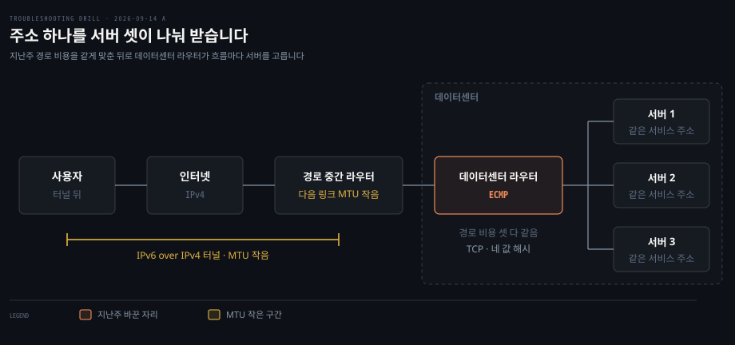
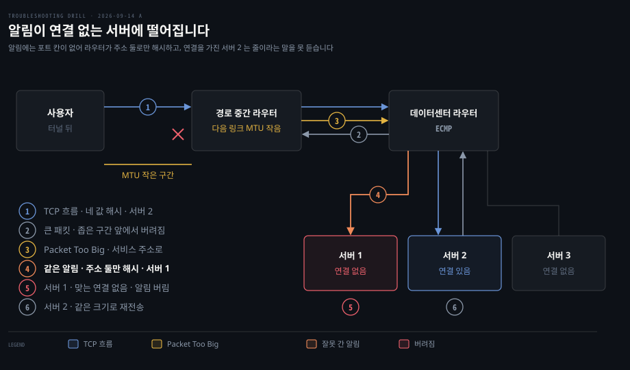

# 몇몇 사용자만 들어오지 못하는 사이트

---

> 줄이라는 알림이 사라진 것이 아니라 연결 없는 서버에 떨어졌을 수 있습니다. 서버 여럿이 주소 하나를 나눠 받으면, 포트가 없는 알림은 흐름과 다른 서버로 갑니다.

## 문제 소개

> 서비스 주소 하나를 서버 여럿이 나눠 받는 데이터센터에서, 분산 범위를 넓힌 뒤 IPv6 터널 사용자 몇몇만 접속하지 못했습니다.

**출처** · [Cloudflare · Marek Majkowski · Path MTU discovery in practice](https://blog.cloudflare.com/path-mtu-discovery-in-practice/) (2015)


전 세계 사용자를 받는 웹 서비스입니다. 데이터센터 안의 서버들이 내부 BGP 로 같은 서비스 주소를 광고하고, 앞단 라우터가 들어오는 트래픽을 그 서버들에 나눠 줍니다.

지난주 이 분산을 쓰는 범위를 넓혔습니다. 설정으로 보면 바꾼 것은 BGP 경로 비용 값을 모두 같게 맞춘 것 하나였습니다. 비용이 같은 경로가 여럿이면 라우터가 알아서 트래픽을 나누는데, 이것이 ECMP(Equal Cost Multi Path)입니다. 라우터는 한 연결의 패킷이 늘 같은 서버에 닿도록 TCP 패킷마다 네 값을 해시합니다.

```bash
# 데이터센터 라우터의 분산 규칙 — 한 연결은 늘 같은 서버로
hash(출발지 IP, 출발지 포트, 목적지 IP, 목적지 포트)  →  서버 선택
```

그 뒤로 접속이 안 된다는 제보가 들어왔습니다. 수는 아주 적었고 대다수 사용자는 아무 일 없이 쓰고 있었습니다. 제보한 사용자는 대부분 IPv6 를 IPv4 위에 실어 나르는 터널로 들어오는 사람들이었고, IPv4 로 들어오는 쪽에서는 드물었습니다.

이 증상에서 두 가지가 읽힙니다. 바뀐 것은 서버가 아니라 라우터가 서버를 고르는 방식이고, 영향은 접속 경로가 특정한 소수에게 몰립니다.

읽히지 않는 것도 있습니다. 위 규칙은 TCP 패킷을 어떻게 나누는지만 말합니다. 포트가 없는 패킷을 라우터가 어떻게 나누는지는 증상 어디에도 없습니다.


## 원인 분석

> 터널 사용자에게 몰린다는 사실이 크기를 가리키고, 변경 직후에 시작됐다는 사실이 경로 중간 방화벽을 뒤로 밀어냅니다. 남는 물음은 줄이라는 알림이 왜 연결을 가진 서버에 닿지 않았는가입니다.



**배제된 것.** 서비스 전체의 장애나 용량 부족이 먼저 지워집니다. 대다수 사용자가 정상이었고 영향은 접속 경로로 갈렸습니다.

서버 쪽 애플리케이션도 지워집니다. 서버 설정은 그대로였고, 같은 서버들이 대다수 사용자에게는 정상으로 응답했습니다.

**낮아진 것.** 경로 중간 방화벽이 ICMP 를 통째로 막는 고전적인 블랙홀은 가장 먼저 떠오르는 후보이고 겉모습도 같습니다. 다만 제보는 우리 라우터를 바꾼 직후에 시작됐습니다. 그 방화벽은 우리가 바꾼 것이 아닙니다. 확정 배제는 아니며 알림이 데이터센터까지 오는지를 보면 갈립니다.

**남은 것.** 크기를 줄이라는 알림이 데이터센터에 와서 엉뚱한 서버로 간 경우입니다.

서버가 터널 사용자에게 큰 패킷을 보내면, 다음 링크가 좁은 라우터가 그 패킷을 버리고 ICMPv6 Packet Too Big 을 돌려보냅니다. 서버는 이 알림을 받아 그 연결의 크기를 줄여야 하는데, 이 주고받기가 경로 MTU 발견(Path MTU Discovery)입니다.

알림의 주소가 원래 패킷과 다릅니다. [RFC 4443](https://www.rfc-editor.org/rfc/rfc4443.txt) §3.2 에서 알림의 목적지는 원래 패킷의 출발지, 곧 서비스 주소입니다. 출발지는 §2.2 대로 알림을 만든 라우터 자신의 주소입니다. 원래 연결의 포트는 ICMPv6 헤더에 칸이 없고, 알림이 인용한 원본 패킷 안에만 있습니다.

원문에 따르면 ECMP 라우터는 ICMP 를 따로 알지 못해 출발지와 목적지 **주소 둘만** 해시했습니다. 목적지는 같아도 출발지가 라우터 주소라 해시 값이 흐름과 달라지고, 알림은 연결을 가진 서버 2 가 아닌 서버 1 로 갈 수 있습니다. [RFC 7690](https://www.rfc-editor.org/rfc/rfc7690.txt) §2 도 인용 안의 헤더는 전달 결정에 쓰이지 않으므로 알림이 흐름과 같은 다음 홉으로 해시될 가능성이 낮다고 적습니다.

서버 1 에는 그 연결이 없습니다. 리눅스 현재 소스의 `tcp_v6_err` 는 인용에서 꺼낸 주소와 포트로 연결된 소켓을 찾고, 없으면 `Icmp6InErrors` 를 올린 뒤 끝냅니다. 서버 2 는 줄이라는 말을 끝내 못 듣고 같은 크기로 재전송만 합니다. 원문은 이 상태를 ICMP 블랙홀이라 부르고 연결 전체가 멈춘다고 적었습니다.

| 관찰 | 왜 그런가 |
|------|----------|
| 변경 직후에 시작됨 | 경로 비용을 같게 맞추자 알림과 연결이 서로 다른 서버로 갈릴 수 있게 되었습니다 |
| 터널 사용자에게 몰림 | 원문: 거의 모든 IPv6 터널은 MTU 가 줄어 있어 알림이 생기는 쪽이 그들입니다 |
| IPv4 쪽은 드묾 | 원문: IPv4 터널 사용자가 적고 경로 MTU 문제가 오래전부터 알려져 있었습니다 |
| 대다수는 정상 | 경로 MTU 가 줄지 않은 사용자에게는 알림 자체가 생기지 않습니다 |

**확정도.** 원문은 이것이 실제로 일어난 일이라고 적지만 무엇으로 확인했는지는 적지 않았습니다. 이 회차는 지면 풀이라 **유력 가설**이고, 확정하려면 서버 여러 대에서 동시에 알림이 어디 도착하는지 봐야 합니다.


## 해결 방법

> 알림이 어느 서버에 도착하는지를 서버 여러 대에서 동시에 봅니다. 응급은 알림에 기대지 않게 크기를 낮추고, 재발 방지는 알림을 연결 가진 서버에 닿게 합니다.

```bash
# 1. 연결을 가진 서버 찾기 — 서버마다 제보 사용자 주소로 거른다. IPv6 는 대괄호로 감싼다
ss -tin dst '[2001:db8:1::77]'
# 예상 — 서버 2 에만 한 줄. backoff 가 오르고 pmtu 는 줄지 않은 값에 머문다

# 2. 알림 캡처 — 서버 셋에서 동시에. 확장 헤더가 없는 패킷 기준
tcpdump -s0 -e -ni eth0 'icmp6 and ip6[40+0] == 2 and ip6[40+1] == 0'
# 예상 — 서버 1 에서만 잡힌다

# 3. 캡처 대신 카운터로 서버별 비교 — 첫 호출 뒤로 증가분을 준다
nstat -z Icmp6InPktTooBigs Icmp6InErrors
# 예상 — 서버 1 에서 둘이 함께 오르고 서버 2 는 그대로다
```

`ss -i` 의 `backoff` 는 재전송 지수 백오프이고 `pmtu` 는 경로 MTU 값입니다. 캡처 필터는 [cloudflare/pmtud](https://github.com/cloudflare/pmtud) README 의 디버그 필터에서 IPv6 절반을 뗀 것이고, `ip6[40]` 이 ICMPv6 타입 자리라는 가정은 확장 헤더가 없을 때만 맞습니다.

카운터는 이름부터 확인했습니다. `Icmp6InPktTooBigs` 는 커널 `net/ipv6/proc.c` 가 `Icmp6`·`In`·`PktTooBigs` 를 이어 붙인 이름입니다. `net/ipv6/icmp.c` 는 소켓을 찾기 **전에** 타입별로 이 값을 올리므로, 연결 없는 서버에서도 오릅니다.

반대 결과가 나오면 가설이 바뀝니다. 어느 서버에서도 안 오르면 알림이 경로 중간에서 막힌 고전적인 블랙홀로 돌아갑니다. 연결을 가진 서버의 캡처에는 보이는데 카운터가 안 오르면 그 서버의 호스트 방화벽을 봅니다.

- **응급**: 원문대로 IPv6 는 모든 경로의 MTU 를 최소 보장값 1280 으로 낮추고, IPv4 는 RFC 4821 블랙홀 탐지를 켭니다. 커널 문서는 `tcp_mtu_probing=1` 을 "평소에는 꺼 두고 ICMP 블랙홀이 감지되면 켠다"로 정의합니다
- **재발 방지**: 알림을 받은 서버가 그것을 모든 서버에 브로드캐스트하게 합니다. 어느 서버로 떨어져도 연결을 가진 서버에 닿고, 흐름을 못 알아보는 서버는 버립니다. 그 데몬이 `cloudflare/pmtud` 이고 출발지당 1 pps, 인터페이스당 10 pps 를 기본 상한으로 둡니다
- **검증**: 지면 풀이라 미실행입니다. 조치 뒤 서버 셋에서 `Icmp6InPktTooBigs` 가 함께 오르는지, 연결을 가진 서버의 `ss -tin` 에서 `pmtu` 가 알림 값으로 내려가고 `backoff` 가 멈추는지 봅니다. 브로드캐스트된 사본은 `tcpdump -e` 에서 목적지 MAC 이 `ff:ff:ff:ff:ff:ff` 로 보입니다

```bash
# 응급 — 원문의 명령
ip -f inet6 route replace <> mtu 1280          # IPv6 — 모든 경로를 1280 으로
echo 1    > /proc/sys/net/ipv4/tcp_mtu_probing  # IPv4 — 블랙홀이 감지되면 탐색
echo 1024 > /proc/sys/net/ipv4/tcp_base_mss     # 탐색 시작 MSS
```

`tcp_base_mss` 는 원문이 쓸 때 기본값이 512 였습니다. 현재 커널 `include/net/tcp.h` 의 `TCP_BASE_MSS` 는 1024 라, 지금은 둘째 줄만으로 원문과 같은 상태가 됩니다.

재발 방지에는 다른 선택지도 있습니다. [RFC 7690](https://www.rfc-editor.org/rfc/rfc7690.txt) §3 이 셋을 듭니다.

| 선택지 | 하는 일 | 대가 |
|--------|--------|------|
| 인용 안의 흐름 값으로 해시 | 라우터가 ICMPv6 적재량 안의 TCP 흐름 값을 꺼내 해시합니다 | 그만큼 깊이 파싱하는 하드웨어가 있어야 합니다. §4 는 저자들이 아는 한 2016년 당시 장비에 없었다고 적습니다 |
| 중간 장치 | 정책 라우팅 뒤나 각 부하 분산기·서버에서 알림을 파싱해 나눠 줍니다 | 장치 하나를 더 운영합니다 |
| 모든 서버에 복사 | 흐름을 알아보는 서버만 쓰고 나머지는 버립니다 | 자원 소비와 스스로 부르는 서비스 거부가 위험이라 속도 제한이 필요합니다. 관찰된 양은 1 Gbit/s HTTPS 에 10 pps 이하였습니다 |

원문이 고른 것은 셋째이고, 고른 이유는 적지 않았습니다. 표에서 읽히는 차이는 첫째가 RFC 7690 이 전제로 든 하드웨어 지원을 요구하는 반면 셋째는 서버 쪽 소프트웨어로 된다는 점입니다.


## 다른 방법 비교

> 같은 증상을 만드는 원인이 셋 더 있고, 알림이 어디까지 오는지가 가릅니다.

경로 중간 방화벽이 ICMP 를 막는 고전적인 블랙홀은 알림이 데이터센터에 **아예 오지 않습니다.** 서버 셋 모두에서 `Icmp6InPktTooBigs` 가 조용하고, 막은 장비가 우리 관리 밖이라 고칠 수 있는 것은 서버 쪽 크기뿐입니다. 응급 조치의 1280 과 RFC 4821 탐지가 원래 이쪽을 위한 처방입니다.

서버 호스트 방화벽이 알림을 버리는 경우는 알림이 **맞는 서버에 오지만 거기서 사라집니다.** 캡처는 netfilter 보다 앞에서 잡으므로 `tcpdump` 에는 보입니다. 커널 `net/ipv6/ip6_input.c` 에서 입력 훅이 ICMPv6 처리보다 앞서므로 카운터는 안 오릅니다. 층이 다르면 서로 안 보인다는 [패킷이 사라지는 네 자리](../_concepts/os-%ED%8C%A8%ED%82%B7%EC%9D%B4-%EC%82%AC%EB%9D%BC%EC%A7%80%EB%8A%94-%EB%84%A4-%EC%9E%90%EB%A6%AC.md)의 축이 여기서 쓰입니다.

터널이나 오버레이의 MTU 를 잘못 잡은 경우는 영향이 **우리 쪽 구성**을 따라갑니다. 서버 쪽 오버레이가 원인이면 터널 없는 사용자도 큰 응답에서 멈추고, 변경 시점과도 맞지 않습니다. 제보가 사용자의 접속 경로로 갈렸다는 사실이 이 후보를 낮춥니다.

셋을 한 번에 가르는 방법은 서버 여러 대를 동시에 보는 것입니다.

| 서버 셋에서 본 것 | 가리키는 원인 |
|------------------|-------------|
| 어느 서버에도 알림이 없음 | 경로 중간 차단 |
| 연결 없는 서버에만 알림이 있음 | 분산이 알림을 흐름과 갈라놓음 |
| 연결 가진 서버에 캡처는 있고 카운터는 그대로 | 서버 호스트 방화벽 |

**모든 경로 MTU 를 낮추는 방법**은 원인과 무관하게 통하지만 공짜가 아닙니다. 원문은 `mtu` 설정이 TCP 만이 아니라 모든 패킷에 걸린다고 적고, 크기를 강제로 줄이는 것은 최적의 해법이 아니라고 덧붙입니다. 경로가 1500 인 대다수 사용자도 작게 받게 됩니다. RFC 7690 §3.1 은 MSS 를 1220 으로 낮추는 방법을, 주소 체계별로 따로 못 정하는 호스트에서 IPv4 까지 끌어내린다는 이유로 바람직하지 않다고 봅니다.

흔히 먼저 떠올리지만 이 사고에 안 맞는 것은 **라우터 해시를 주소 둘로 바꾸는 것**입니다. TCP 도 주소 둘로 나누면 알림과 같아질 것 같지만, 알림의 출발지는 사용자가 아니라 경로 중간 라우터라 해시 값이 여전히 다릅니다. **우리 방화벽에서 ICMP 를 여는 것**도 같은 이유로 소용이 없습니다. 막힌 것이 아니라 다른 서버로 간 것이기 때문입니다.


## 내 접근과 실제가 갈린 자리

> 방향은 스스로 잡았고, 한 주소를 여럿이 쓰는 구조와 해시가 포트까지 보는 이유라는 선행 개념에서 갈렸습니다.

| 내가 본 것 | 실제 | 갈린 이유 |
|-----------|------|----------|
| 바뀐 것은 라우터 분산 하나, 제보는 터널 사용자 | 맞음 | 증상의 두 사실을 스스로 이음 |
| 방향을 크기·터널 쪽으로 잡음 | 맞음. 터널이 경로 MTU 를 줄임 | 스스로 잡은 자리 |
| 첫 확인에 칠 명령 | 비어 있음 | 알림 도착을 볼 도구가 안 나옴 |
| 알림이 안 오는 이유를 경로 중간 방화벽으로 봄 | 알림은 데이터센터까지 왔고 다른 서버에 떨어짐 | 한 주소 뒤에 기계가 여럿인 구조가 비어 있음 |
| 알림의 출발지·목적지를 원래 패킷과 한 번 혼동 | 출발지는 경로 중간 라우터, 목적지는 서비스 주소 | 알림을 누가 만드는지 따로 세우지 않음 |
| "목적지 IP 가 같으니 서버 2 로 가지 않을까" | 해시는 출발지도 봄. 포트 칸도 비어 값이 달라짐 | 해시가 포트까지 보는 이유가 비어 있음 |
| 연결을 가진 서버를 찾는 도구 | `ss` 로 답함 | 스스로 답한 자리 |
| 서버 셋을 동시에 관찰 | 답함 | 스스로 답한 자리 |

앞의 두 줄은 스스로 세운 것입니다. 변경 내용과 제보자의 공통점을 이어 크기 쪽으로 간 것은 이 문항이 겨냥한 첫 갈래였습니다.

막힌 곳은 진단 순서가 아니라 선행 개념이었습니다. 한 주소를 서버 여럿이 함께 쓴다는 구조가 없으니, 알림이 "안 왔다"는 것 말고는 떠올릴 수 없었습니다. 기전은 개념 설명을 들은 뒤 알림 패킷의 출발지·목적지를 표로 채우는 좁은 질문으로 도달했으므로 스스로 푼 자리로 세지 않습니다. 반면 연결을 가진 서버를 `ss` 로 찾는 것과 서버 세 대를 동시에 보는 것은 스스로 답했습니다.


## 나온 개념

> 흐름을 알아보는 값과 그 값이 바깥 헤더에 없는 패킷, 그리고 알림 도착을 세는 카운터입니다.

**한 흐름을 가르는 값이 바깥 헤더에 없는 패킷이 있다**는 것이 이 문항의 축입니다. ICMP 오류는 원본을 인용할 뿐 자기 헤더에 포트가 없습니다. 그래서 받는 호스트는 인용을 열어 흐름을 찾지만 바깥 헤더만 보는 라우터는 흐름과 다른 곳으로 보냅니다. 이 갈림을 [흐름을 가르는 다섯 값](../_concepts/common-%ED%9D%90%EB%A6%84%EC%9D%84-%EA%B0%80%EB%A5%B4%EB%8A%94-%EB%8B%A4%EC%84%AF-%EA%B0%92.md)으로 떼어 냈고, 2026-09-12 B 의 SNAT 포트 배정과 같은 노트에서 만납니다.

카운터 둘이 새로 나왔습니다. `Icmp6InPktTooBigs` 는 소켓을 찾기 전에 오르고, 맞는 소켓이 없으면 `Icmp6InErrors` 가 따라 오릅니다. `ss -i` 의 `pmtu` 와 `backoff` 도 처음 썼습니다. 증상에서 도구로 가는 줄은 [무엇을 보려면 무엇을 치는가](../_concepts/common-%EB%AC%B4%EC%97%87%EC%9D%84-%EB%B3%B4%EB%A0%A4%EB%A9%B4-%EB%AC%B4%EC%97%87%EC%9D%84-%EC%B9%98%EB%8A%94%EA%B0%80.md)에 더했습니다.

근거 노트는 여섯입니다. 경로 MTU 발견과 블랙홀은 [IP·라우팅·Ethernet](../../08_cloud/book/networking-and-kubernetes/01-03.IP%C2%B7%EB%9D%BC%EC%9A%B0%ED%8C%85%C2%B7Ethernet%20%E2%80%94%20%ED%8C%A8%ED%82%B7%EC%9D%B4%20%EA%B8%B8%EC%9D%84%20%EC%B0%BE%EB%8A%94%20%EB%B2%95.md) §Path MTU Discovery 와 [IPv6 와 일반화 포워딩](../../02_os/book/cntd_computer-networking-top-down/04-04.IPv6%20%EC%99%80%20%EC%9D%BC%EB%B0%98%ED%99%94%20%ED%8F%AC%EC%9B%8C%EB%94%A9.md)에 있습니다. 흐름 해시와 포트 없는 ICMP 는 [데이터센터와 웹 페이지 하나의 하루](../../02_os/book/cntd_computer-networking-top-down/06-05.%EB%8D%B0%EC%9D%B4%ED%84%B0%EC%84%BC%ED%84%B0%EC%99%80%20%EC%9B%B9%20%ED%8E%98%EC%9D%B4%EC%A7%80%20%ED%95%98%EB%82%98%EC%9D%98%20%ED%95%98%EB%A3%A8.md) §3 이, 한 주소를 여럿이 나눠 쓰는 애니캐스트는 [AS 안과 AS 사이](../../02_os/book/cntd_computer-networking-top-down/05-02.AS%20%EC%95%88%EA%B3%BC%20AS%20%EC%82%AC%EC%9D%B4.md) §5 가 다룹니다.

1차 확인 범위도 적어 둡니다. 알림의 주소 규칙은 RFC 4443, 완화책 셋은 RFC 7690 원문에서 봤습니다. 카운터와 소켓 조회는 torvalds/linux master 의 [`net/ipv6/icmp.c`](https://github.com/torvalds/linux/blob/master/net/ipv6/icmp.c)·[`net/ipv6/tcp_ipv6.c`](https://github.com/torvalds/linux/blob/master/net/ipv6/tcp_ipv6.c)·[`net/ipv6/proc.c`](https://github.com/torvalds/linux/blob/master/net/ipv6/proc.c) 에서 2026-09-14 에 확인했고, 2015년 커널도 같았는지는 확인하지 않았습니다. `tcp_mtu_probing` 의 뜻은 [ip-sysctl](https://docs.kernel.org/networking/ip-sysctl.html), `ss -i` 필드는 [man7 ss(8)](https://man7.org/linux/man-pages/man8/ss.8.html), `nstat` 의 이름 패턴 인자는 [man7 nstat(8)](https://man7.org/linux/man-pages/man8/nstat.8.html)에서 봤습니다.


## 관련 문서

- [os 계층 목록](./README.md)
- [회차 로그](../_drill/log.md) — 이 문항을 푼 날의 점수와 막힌 지점
- [흐름을 가르는 다섯 값](../_concepts/common-%ED%9D%90%EB%A6%84%EC%9D%84-%EA%B0%80%EB%A5%B4%EB%8A%94-%EB%8B%A4%EC%84%AF-%EA%B0%92.md) — 누가 흐름 값을 쓰고, 그 값이 없는 패킷이 어디서 어긋나나
- [무엇을 보려면 무엇을 치는가](../_concepts/common-%EB%AC%B4%EC%97%87%EC%9D%84-%EB%B3%B4%EB%A0%A4%EB%A9%B4-%EB%AC%B4%EC%97%87%EC%9D%84-%EC%B9%98%EB%8A%94%EA%B0%80.md) — 알림 도착을 세는 도구
- [패킷이 사라지는 네 자리](../_concepts/os-%ED%8C%A8%ED%82%B7%EC%9D%B4-%EC%82%AC%EB%9D%BC%EC%A7%80%EB%8A%94-%EB%84%A4-%EC%9E%90%EB%A6%AC.md) — 캡처와 카운터가 서로를 못 보는 층
- [IPv6 와 일반화 포워딩](../../02_os/book/cntd_computer-networking-top-down/04-04.IPv6%20%EC%99%80%20%EC%9D%BC%EB%B0%98%ED%99%94%20%ED%8F%AC%EC%9B%8C%EB%94%A9.md) — 경로 MTU 발견과 블랙홀 연결
- [데이터센터와 웹 페이지 하나의 하루](../../02_os/book/cntd_computer-networking-top-down/06-05.%EB%8D%B0%EC%9D%B4%ED%84%B0%EC%84%BC%ED%84%B0%EC%99%80%20%EC%9B%B9%20%ED%8E%98%EC%9D%B4%EC%A7%80%20%ED%95%98%EB%82%98%EC%9D%98%20%ED%95%98%EB%A3%A8.md) — §3 흐름 단위 ECMP 와 포트 없는 ICMP
- [AS 안과 AS 사이](../../02_os/book/cntd_computer-networking-top-down/05-02.AS%20%EC%95%88%EA%B3%BC%20AS%20%EC%82%AC%EC%9D%B4.md) — §5 한 주소를 여럿이 나눠 쓰는 애니캐스트
- [5장 실습 — traceroute·ICMP·흐름 표](../../02_os/book/cntd_computer-networking-top-down/05-04.%EC%8B%A4%EC%8A%B5%20-%20traceroute%C2%B7ICMP%C2%B7%ED%9D%90%EB%A6%84%20%ED%91%9C%EB%A5%BC%20%EC%86%90%EC%9C%BC%EB%A1%9C%20%ED%99%95%EC%9D%B8%ED%95%A9%EB%8B%88%EB%8B%A4.md) — §2 ICMP 가 원본을 인용하는 모습
- [IP·라우팅·Ethernet](../../08_cloud/book/networking-and-kubernetes/01-03.IP%C2%B7%EB%9D%BC%EC%9A%B0%ED%8C%85%C2%B7Ethernet%20%E2%80%94%20%ED%8C%A8%ED%82%B7%EC%9D%B4%20%EA%B8%B8%EC%9D%84%20%EC%B0%BE%EB%8A%94%20%EB%B2%95.md) — §Path MTU Discovery, 알림이 막히면 재전송만 되풀이
- [오버레이와 노드 간 트래픽](../../08_cloud/kubernetes/04_networking/04-03.%EC%98%A4%EB%B2%84%EB%A0%88%EC%9D%B4%EC%99%80%20%EB%85%B8%EB%93%9C%20%EA%B0%84%20%ED%8A%B8%EB%9E%98%ED%94%BD.md) — ECMP 는 라우터에서 켜고 해싱 방식은 구현마다 다름
- [작은 것은 되고 큰 것만 멎는다](../../02_os/book/network-fundamentals-lab/06-01.%EC%9E%91%EC%9D%80%20%EA%B2%83%EC%9D%80%20%EB%90%98%EA%B3%A0%20%ED%81%B0%20%EA%B2%83%EB%A7%8C%20%EB%A9%8E%EB%8A%94%EB%8B%A4.md) — 터널이 안쪽 MTU 를 줄이는 자리
- [정확히 1초씩 늦는 요청](../kubernetes/2026-09-12_%EC%A0%95%ED%99%95%ED%9E%88%201%EC%B4%88%EC%94%A9%20%EB%8A%A6%EB%8A%94%20%EC%9A%94%EC%B2%AD.md) — 같은 흐름 값이 SNAT 에서 걸린 문항
