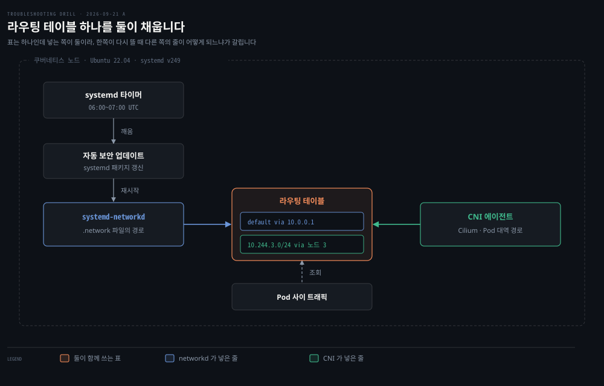

# 배포하지 않은 아침에 끊긴 리전 다섯 곳

---

> "우리가 민 변경이 없다" 는 "변경이 없었다" 가 아닙니다. 새 노드만 멀쩡하다는 사실이 사건을 돌던 노드 안으로 좁히고, 이어지지 않은 리전 다섯 곳의 동시 발동이 결합 대신 같은 기본값을 가리킵니다.

## 문제 소개

> 아무도 배포하지 않은 아침 한 시간 사이에, 서로 이어지지 않은 리전 다섯 곳의 노드 수만 대가 통신을 잃었습니다.

**출처** · [Datadog · 2023-03-08 Incident: Infrastructure connectivity issue affecting multiple regions](https://www.datadoghq.com/blog/2023-03-08-multiregion-infrastructure-connectivity-issue/) (사건 2023-03-08 · 발표 2023-05-16)



관측 플랫폼을 운영하는 Datadog 은 쿠버네티스 클러스터 수백 개를 US1·EU1·US3·US4·US5 다섯 리전에 나눠 돌립니다. 리전은 클라우드 제공자 세 곳에 걸쳐 있고, 리전끼리는 직접 연결도 결합도 없습니다.

배포는 몇 해째 같은 방식입니다. 코드든 보안 패치든 설정이든 리전 단위, 클러스터 단위, 노드 단위로 밀고, 자리에서 고치지 않고 노드와 컨테이너를 blue/green 으로 새것으로 바꿉니다. 실패하면 자동으로 되돌립니다. 하루에 수십 번 돌리는 절차라 믿을 만하다고 원문은 적습니다.

2023년 3월 8일 06:00 UTC 부터 한 시간 사이에 노드 수만 대가 오프라인이 됐습니다. 내부 모니터링이 첫 경보를 낸 것은 06:03 이고, 06:31 에는 고객에게 보일 만큼 노드가 빠져 공개 장애가 됐습니다.

```bash
# 범위       리전 다섯 곳이 동시에. 리전끼리 직접 연결도 결합도 없음
# 제공자     클라우드 세 곳 모두
# 시각       06:00~07:00 UTC 한 창에 몰림
# 우리 배포   그 시간대에 민 코드·설정 변경 없음
# 컨테이너    컨테이너끼리 통신 불가, 노드는 오프라인으로 잡힘
# 새 노드     증상 없음
# 재부팅 노드  증상 없음
# 재현       새로 띄우는 시험으로는 이 순서가 재현되지 않음 (원문 요지)
```

이 관찰에서 읽히는 것은 둘입니다. 원인이 우리 파이프라인 밖에 있으면서 돌던 노드 안에서 벌어졌다는 것, 그리고 리전 다섯 곳이 무언가를 공유한다는 것입니다. 어떤 장치가 노드를 바꿨는지, 무엇을 지웠는지는 읽히지 않습니다. 그건 노드에 들어가 표를 떠 봐야 보입니다.

복구에는 이틀이 걸렸습니다. 웹 접근은 09:13 에 돌아왔고 첫 주요 서비스는 16:44 에 정상화됐습니다. 모든 리전의 모든 서비스가 돌아온 것은 3월 9일 08:58, 밀린 과거 데이터까지 채운 것은 3월 10일 06:25 입니다.


## 원인 분석

> 제공자 셋과 리전 다섯의 동시 발동이 외부 장애와 우리 배포를 지우고, 새 노드가 멀쩡하다는 사실이 이미지 결함을 지웁니다. 남는 것은 돌던 노드를 제자리에서 바꾼 장치입니다.


제공자 세 곳에서 동시에 났다는 관찰이 클라우드 사업자 장애를 지웁니다. 한 사업자의 사고로는 나머지 둘이 설명되지 않습니다.

우리 배포는 두 겹으로 지워집니다. 그 시간대에 민 변경이 없었고, 설령 있었더라도 파이프라인은 리전 단위로 순차 진행하므로 다섯 리전을 같은 분에 칠 수 없습니다.

새 노드와 재부팅한 노드가 멀쩡하다는 관찰은 이미지 자체의 결함을 지웁니다. 같은 이미지로 띄운 노드가 정상이면, 문제는 이미지가 담은 상태가 아니라 **돌던 노드에 시간이 지나 일어난 사건**입니다.

첫 확인 전까지는 두 갈래가 남습니다. 라우팅 테이블에서 줄이 지워졌거나, 표는 멀쩡한데 필터나 데이터패스가 막았거나입니다. 끊긴 노드와 새 노드의 표를 나란히 놓으면 이 둘이 갈립니다. 이 사고는 앞쪽이었습니다.

남는 것은 우리가 밀지 않았는데도 돌던 노드를 제자리에서 바꾼 장치이고, 그것이 OS 이미지에 켜져 있던 자동 보안 업데이트였습니다.

> *"a security update to systemd was automatically applied to a number of VMs, which caused a latent adverse interaction in the network stack (on Ubuntu 22.04 via systemd v249) to manifest upon systemd-networkd restarting. Namely, systemd-networkd forcibly deleted the routes managed by the Container Network Interface (CNI) plugin (Cilium) we use for communication between containers. This caused the affected nodes to go offline."*

업데이트가 `systemd` 패키지를 갈면서 네트워크 설정 데몬 `systemd-networkd` 가 다시 떴습니다. 다시 뜬 networkd 는 자기 설정 파일에 없는 경로를 라우팅 테이블에서 지웁니다. 그 경로가 CNI 가 넣어 둔 Pod 대역 줄이었고, 노드를 넘는 컨테이너 통신이 거기서 끊겼습니다.

새 노드가 멀쩡한 이유는 도식의 두 줄이 보여 주듯 순서입니다. 정상 부팅에서는 networkd 가 먼저 뜨고 CNI 가 뒤에 줄을 넣으므로, networkd 가 볼 때 지울 남의 줄이 아직 없습니다.

> *"neither a fresh node nor a rebooted node exhibit this behavior because during a normal boot sequence systemd-networkd always starts before routing rules are installed by the CNI plugin. In other words, outside of the systemd-networkd update scenario on a running node, no obvious test reproduces the exact sequence."*

재현이 안 됐던 이유도 이 문장에 있습니다. 새로 띄우는 시험은 사고의 순서를 밟지 않습니다. 재현되지 않은 것이 아니라 시험이 틀린 순서를 재고 있었습니다.

리전 다섯 곳이 한 시간 안에 함께 터진 이유는 결합이 아니라 기본값입니다. 기반 이미지에 켜져 있던 예전 보안 업데이트 통로가 OS 기본값으로 06:00~07:00 UTC 창에 돌았습니다. 선이 하나도 이어져 있지 않아도, 같은 이미지에서 온 노드는 같은 시계를 보고 같은 창에 깨어납니다.

> *"the time at which the automatic update happens is set by default in the OS to a window between 06:00 and 07:00 UTC. Thus it affected multiple regions at the exact same time, even though the regions have no direct network connection or coupling between them."*

원문은 이 간접 결합이 초기 대응자들을 헷갈리게 했다고 덧붙입니다. 리전끼리 이어진 데가 없다는 사실을 아는 사람일수록 동시 발동을 우연이나 외부 요인으로 먼저 읽게 됩니다.

networkd 가 남의 경로를 지우는 동작은 버그가 아니라 문서화된 기본값입니다. `networkd.conf(5)` 의 `ManageForeignRoutes=` 가 이를 정하고 기본값이 `yes` 입니다. 원문은 이 키를 지목하지 않고 "재시작해도 라우팅 테이블을 그대로 두도록 설정을 바꿨다" 고만 적으므로, 원문의 조치와 이 키를 잇는 것은 man page 를 대조한 해석입니다.


## 해결 방법

> 확인은 두 노드의 표를 나란히 놓는 데서 시작합니다. 조치는 재시작해도 남의 줄을 두게 하는 설정과, 그 재시작을 부른 장치를 끄는 일 둘입니다.

```bash
# 끊긴 노드와 새로 띄운 노드에서 각각 — 컨테이너 대역 줄이 한쪽에만 있는가
ip -4 route show table all

# 갈렸으면 누가 언제 지웠는가로 간다
journalctl -u systemd-networkd --since "06:00" --until "07:30"
journalctl --since "06:00" | grep -i -e upgrade -e dpkg -e systemd
systemctl list-timers --all      # 06:00~07:00 창에 걸린 타이머가 있는가

# 표가 같으면 줄 삭제 가설을 버리고 필터와 데이터패스로 간다
iptables -vnL                    # 규칙별 카운터. 드랍 로그는 -j LOG 규칙이 있어야 남는다
```

첫 명령에서 갈림이 납니다. 끊긴 노드에만 컨테이너 대역 줄이 없으면 넣은 쪽과 지운 쪽이 다르다는 뜻이고, 그다음은 언제 누가 지웠는지의 문제입니다. 두 표가 같으면 줄 삭제 가설을 버리고 필터 규칙과 데이터패스로 내려갑니다. Cilium 처럼 eBPF 로 데이터패스를 짜는 CNI 라면 iptables 카운터만으로는 부족해 CNI 자체의 진단으로 넘어가야 합니다.

- **응급**: 노드를 재부팅합니다. 부팅 순서가 networkd 다음 CNI 라 재부팅만으로 줄이 다시 깔립니다. 원문은 비정상 노드를 바로 폐기하지 않는 제공자에서 이 편이 옳은 복구였고, 데이터를 쥔 워크로드를 그대로 살려 훨씬 빨랐다고 적습니다. CNI 에이전트만 다시 띄워 줄을 새로 깔게 하는 방법도 원리상 통하지만, 원문이 택한 길은 아니고 여기서 확인하지 않았습니다
- **재발 방지 하나**: 이미지에 켜져 있던 예전 자동 업데이트 통로를 끕니다. 원문은 이것이 보안 태세를 낮추지 않는다고 밝힙니다. 보안 업데이트는 이미 변경 관리 도구가 적용하고 있어 이 통로가 중복이었기 때문입니다
- **재발 방지 둘**: networkd 가 재시작해도 라우팅 테이블을 건드리지 않게 합니다. `/etc/systemd/networkd.conf` 의 `[Network]` 절에 `ManageForeignRoutes=no` 를 두는 것이 그 동작입니다
- **재발 방지 셋**: 비슷한 예전 통로가 다른 이미지에 남아 있는지 인프라 전체를 감사합니다
- **검증**: 지면 풀이라 실행하지 않았습니다. 확인하는 길은 사고의 순서를 그대로 밟는 시험입니다. CNI 줄이 깔린 노드에서 `systemctl restart systemd-networkd` 를 치고, 설정 전과 후에 `ip route` 로 컨테이너 대역 줄이 사라지는지 남는지를 봅니다. 새로 띄우는 시험이 놓친 순서를 이 시험이 잽니다

원문은 재발 여부에 한 단어로 답합니다.

> *"Will it happen again? No. We have disabled this legacy security update channel across all affected regions so it will not happen again. We have also changed the configuration of systemd-networkd so that it leaves the routing table unchanged upon restart. Finally, we have audited our infrastructure for potential similar legacy update channels."*


## 다른 방법 비교

> 같은 증상의 다른 원인, 흔히 먼저 떠올리지만 통하지 않는 선택지, 그리고 2년 뒤 같은 방아쇠가 당겨진 다른 회사입니다.

라우팅 테이블에서 Pod 대역 줄이 빠지는 증상은 다른 자리에서도 납니다. [업그레이드 2분 뒤 멈춘 클러스터](../kubernetes/2026-09-14_%EC%97%85%EA%B7%B8%EB%A0%88%EC%9D%B4%EB%93%9C%202%EB%B6%84%20%EB%92%A4%20%EB%A9%88%EC%B6%98%20%ED%81%B4%EB%9F%AC%EC%8A%A4%ED%84%B0.md) 에서는 반사기를 고르는 셀렉터가 빈 집합이 되면서 BGP 세션이 끊겼고, 그 세션으로 배운 줄이 걷혔습니다.

두 사고를 가르는 것은 빠진 줄의 출처와 시각입니다. 그쪽은 세션을 잃은 순간 원격 노드에서 배운 줄이 걷히고, 이쪽은 networkd 가 다시 뜬 시각에 CNI 가 넣은 줄이 걷힙니다. `journalctl -u systemd-networkd` 의 재시작 시각이 증상 시작과 맞물리는지가 첫 갈림입니다.

흔히 먼저 떠올리는 선택지 셋은 이 사고에서 통하지 않습니다.

| 선택지 | 왜 통하지 않는가 |
|--------|----------------|
| 제공자 장애로 보고 기다린다 | 제공자 세 곳이 한 창에 함께 무너졌으므로 한 사업자의 사고로 설명되지 않습니다 |
| 최근 배포를 되돌린다 | 그 시간대에 민 것이 없어 되돌릴 대상이 없습니다. 배포 롤백 장치는 파이프라인이 만든 변경만 되돌립니다 |
| 스테이징에서 재현을 기다린다 | 새로 띄우는 시험은 부팅 순서를 밟아 사고가 나지 않습니다 |

자동 업데이트를 끄는 데는 대가가 붙습니다. 원문이 끄는 것을 괜찮다고 한 조건은 변경 관리 도구가 보안 업데이트를 이미 적용하고 있다는 것입니다. 그런 도구가 없는 조직이 통로만 끄면 보안 패치가 멈춥니다. 끄는 것과 파이프라인으로 옮기는 것은 한 묶음입니다.

같은 방아쇠가 2025년 6월 10일 Heroku 에서 다시 당겨졌습니다. [Heroku 의 요약 보고](https://www.heroku.com/blog/summary-of-june-10-outage/) 는 자동 시스템 패키지 업그레이드가 네트워크 서비스를 재시작시켰고, 그 서비스가 첫 부팅 때만 올바른 경로를 적용하는 예전 스크립트에 기대고 있어 재시작 뒤 경로가 다시 깔리지 않았다고 적습니다. 원인을 이렇게 요약합니다.

> *"A lack of sufficient immutability controls allowed an automated process to make unplanned changes to our production environment."*

[시정 조치 보고](https://www.heroku.com/blog/corrective-action-update-june-10-outage/) 의 첫 항목은 *"Implemented a permanent halt on all unattended vendor operating system upgrades"* 입니다. 두 회사가 모두 자동 업데이트 통로를 막는 것을 첫 조치로 적었습니다. 다만 Heroku 원문은 `ManageForeignRoutes=` 를 지목하지 않으므로, 두 사고가 같은 설정 키에서 났다는 설명은 2차 기사의 해석으로 남겨 둡니다.


## 나온 개념

> 한 노드의 라우팅 테이블에 쓰는 주체가 둘일 때 누가 그 줄을 소유하는가, 그리고 배포 파이프라인 밖에서 노드를 바꾸는 장치입니다.

이 문항에서 처음 나온 이름이 `systemd-networkd` 였습니다. systemd 가 들고 있는 네트워크 설정 데몬으로, `.network` 파일을 읽어 인터페이스를 올리고 주소와 경로를 넣습니다. 이 데몬은 자기 설정에 없는 경로를 찌꺼기로 보고 지우는 것이 기본이라, CNI 가 같은 표에 줄을 넣는 쿠버네티스 노드에서는 재시작 한 번이 남의 작업을 지웁니다. 경로를 넣는 주체와 표를 자기 것으로 아는 주체가 다를 때 이 물음이 생기고, 그 정리는 [한 노드의 라우팅 테이블을 둘이 만질 때](../_concepts/%ED%95%9C-%EB%85%B8%EB%93%9C%EC%9D%98-%EB%9D%BC%EC%9A%B0%ED%8C%85-%ED%85%8C%EC%9D%B4%EB%B8%94%EC%9D%84-%EB%91%98%EC%9D%B4-%EB%A7%8C%EC%A7%88-%EB%95%8C.md) 에 있습니다.

배포 파이프라인과 별개로 노드를 바꾸는 길이 OS 에 이미 들어 있습니다. 자동 보안 업데이트는 systemd 타이머가 정해진 창에 깨우는 패키지 갱신이고, 같은 이미지에서 온 노드는 리전이 달라도 같은 창에 함께 돕니다. 그 길이 파이프라인과 어떻게 다르고 무엇으로 막는지는 [파이프라인 밖에서 노드를 바꾸는 장치](../_concepts/%ED%8C%8C%EC%9D%B4%ED%94%84%EB%9D%BC%EC%9D%B8-%EB%B0%96%EC%97%90%EC%84%9C-%EB%85%B8%EB%93%9C%EB%A5%BC-%EB%B0%94%EA%BE%B8%EB%8A%94-%EC%9E%A5%EC%B9%98.md) 에 모았습니다.

첫 확인에 쓴 라우팅 테이블 읽기는 [결국은 선과 공기를 타고 다니는 비트다 §8](../../02_os/book/learning-modern-linux/07-01.%EA%B2%B0%EA%B5%AD%EC%9D%80%20%EC%84%A0%EA%B3%BC%20%EA%B3%B5%EA%B8%B0%EB%A5%BC%20%ED%83%80%EA%B3%A0%20%EB%8B%A4%EB%8B%88%EB%8A%94%20%EB%B9%84%ED%8A%B8%EB%8B%A4.md) 과 [Linux 네트워크 진단 도구 §6](../../08_cloud/book/networking-and-kubernetes/02-04.Linux%20%EB%84%A4%ED%8A%B8%EC%9B%8C%ED%81%AC%20%EC%A7%84%EB%8B%A8%20%EB%8F%84%EA%B5%AC%20%E2%80%94%20%EA%B3%84%EC%B8%B5%20%EC%88%9C%EC%84%9C%EB%8C%80%EB%A1%9C%20%EC%88%98%EC%82%AC%ED%95%98%EA%B8%B0.md) 이 정본입니다. 표가 같을 때 내려가는 드랍 자리 넷은 [패킷이 사라지는 네 자리](../_concepts/%ED%8C%A8%ED%82%B7%EC%9D%B4-%EC%82%AC%EB%9D%BC%EC%A7%80%EB%8A%94-%EB%84%A4-%EC%9E%90%EB%A6%AC.md) 에 있습니다.

**1차 확인 (2026-09-22).**

- Datadog 사고 보고의 인용 네 곳과 시각을 원문에서 축자로 확인했습니다
- `ManageForeignRoutes=` 의 정의와 기본값 `yes`, v246 도입, `[Network]` 절 소속을 `networkd.conf(5)` 에서 확인했습니다. freedesktop.org 가 봇 차단으로 막혀 man7.org 가 렌더한 판본(systemd 262~devel)으로 읽었습니다
- Heroku 요약 보고와 시정 조치 보고의 인용 두 곳을 원문에서 확인했습니다
- **확인 안 함**: 06:00~07:00 창을 만드는 타이머 유닛의 이름과 기본값. 원문은 "set by default in the OS" 라고만 적습니다
- **확인 안 함**: systemd v249 의 어느 변경이 이 상호작용을 드러냈는지. 원문은 잠복해 있던 상호작용이라고만 적습니다
- **확인 안 함**: CNI 에이전트 재시작만으로 줄이 복구되는지. 원리상 통하지만 이 회차에서 재 보지 않았습니다


## 관련 문서

- [os 계층 목록](./README.md) — 리눅스 호스트에서 나는 문항들
- [회차 로그](../_drill/log.md) — 이 문항을 푼 날의 점수와 막힌 지점
- [한 노드의 라우팅 테이블을 둘이 만질 때](../_concepts/%ED%95%9C-%EB%85%B8%EB%93%9C%EC%9D%98-%EB%9D%BC%EC%9A%B0%ED%8C%85-%ED%85%8C%EC%9D%B4%EB%B8%94%EC%9D%84-%EB%91%98%EC%9D%B4-%EB%A7%8C%EC%A7%88-%EB%95%8C.md) — networkd 와 CNI 의 경로 소유권
- [파이프라인 밖에서 노드를 바꾸는 장치](../_concepts/%ED%8C%8C%EC%9D%B4%ED%94%84%EB%9D%BC%EC%9D%B8-%EB%B0%96%EC%97%90%EC%84%9C-%EB%85%B8%EB%93%9C%EB%A5%BC-%EB%B0%94%EA%BE%B8%EB%8A%94-%EC%9E%A5%EC%B9%98.md) — 자동 보안 업데이트와 기본 창
- [The Pragmatic Engineer · Inside DataDog's $5M Outage](https://newsletter.pragmaticengineer.com/p/inside-the-datadog-outage) (2023-05-16) — 이 사고를 가장 깊게 다룬 바깥 기사, 2차
- [The Pragmatic Engineer · Why reliability is hard at scale](https://newsletter.pragmaticengineer.com/p/why-reliability-is-hard-at-scale) (2025-07-22) — Heroku 2025 사고를 Datadog 과 한 기전으로 묶어 다룬 기사, 2차
