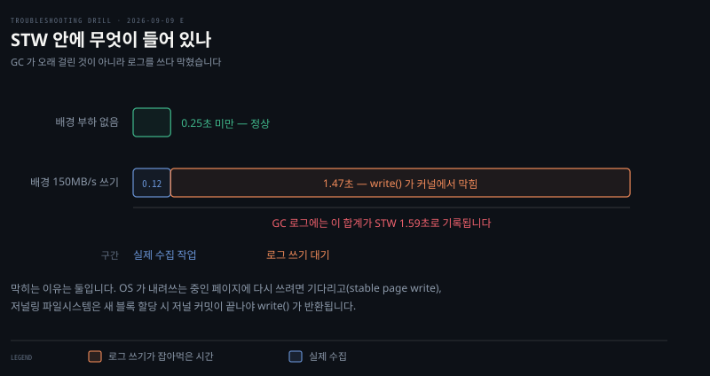

# 수거량에 비해 지나치게 긴 멈춤

---

> GC 가 오래 걸린 것이 아닙니다. 로그를 쓰는 write() 가 커널에서 막혔고, 멈춤을 풀기 전에 쓰므로 그 대기가 STW 로 기록됩니다.


## 문제 소개

> 지연에 민감한 자바 서비스가 이따금 몇 초씩 멈춥니다. 수집한 양에 비해 멈춤이 지나치게 깁니다.

**출처** · [LinkedIn · Eliminating Large JVM GC Pauses Caused by Background IO Traffic](https://www.linkedin.com/blog/engineering/archive/eliminating-large-jvm-gc-pauses-caused-by-background-io-traffic) (2016)


힙은 8GB 이고 컬렉터는 G1 입니다. Young 수집은 병렬로 돌고 이 힙 크기면 정상일 때 1초 안에 끝납니다.

그런데 STW 멈춤이 4.17초로 찍힌 구간이 있습니다. 다른 장비에서는 CMS 로 11.45초까지 나왔습니다.

이상한 것은 그 멈춤 동안 실제로 한 수집 작업의 양입니다. 회수한 메모리도 적고 처리한 영역도 작습니다. 수집 자체는 짧게 끝난 것으로 보이는데 멈춤 시간만 깁니다.

메모리 쪽 지표는 조용합니다. 힙 사용량이 단조 증가하지 않습니다. Full GC 가 몰아치는 패턴도 아니고 OOM 도 나지 않았습니다.

멈춤 시점에는 규칙이 하나 있습니다. 이 장비에서 다른 배치 작업이 디스크에 대량으로 쓰고 있을 때 몰립니다.

| 조건 | 5분간 관측 |
|------|-----------|
| 배경 부하 없음 | 250ms 넘는 멈춤 0회 |
| 배경에 150MB/s 쓰기 | 3.6초 초과 1회, 0.5초 초과 3회 |

담당자는 힙을 키우고 GC 파라미터를 조정해 봤지만 달라지지 않았습니다. 출력에서 읽히지 않는 것은 그 4초 동안 JVM 이 무엇을 하고 있었는가입니다.


## 원인 분석

> 멈춤 시간이 전부 수집 시간이 아닙니다. 로그를 쓰는 시간이 그 안에 들어 있습니다.



관측된 멈춤 1.59초를 구간으로 가른 그림입니다. 파란 구간이 실제 수집 0.12초이고, 나머지 1.47초가 로그를 쓰는 `write()` 가 커널에서 막힌 시간입니다.

**배제된 것.** 컬렉터 알고리즘이 아닙니다. G1 과 CMS 는 마킹과 회수 방식이 완전히 다른데 둘 다 같은 모양으로 느려졌습니다. 알고리즘 안의 문제라면 두 컬렉터가 같은 증상을 낼 이유가 없습니다.

**배제된 것.** 메모리 부족도 누수도 아닙니다. 힙 사용량이 단조 증가하지 않고 Full GC 가 몰아치지 않으며 OOM 도 없습니다. 힙을 키워도 달라지지 않은 것이 이를 굳힙니다.

**배제된 것.** GC 튜닝 영역이 아닙니다. `-Xmx`·`MaxGCPauseMillis`·`ParallelGCThreads` 는 전부 GC 라는 기계의 손잡이인데, 손잡이를 다 돌려도 변하지 않았습니다. 시간을 먹는 것이 그 기계 안에 없다는 뜻입니다.

**남은 것.** STW 구간에 수집 말고 하나가 더 들어 있습니다. GC 로그 쓰기입니다. JVM 은 멈춤을 풀기 *전에* 로그를 쓰고, 그 쓰기는 `write()` 시스템 콜이며 디스크로 갑니다.

배경에서 초당 150MB 를 쓰고 있으면 그 `write()` 가 커널에서 막힙니다. STW 는 아직 안 풀렸으므로 앱 전체가 그만큼 더 서 있습니다. 원 사례는 13:32:35 에 시작한 `write()` 가 1.47초 막혀 36.64 에 끝난 것을 잡았고, 그 구간의 STW 1.59초는 수집 0.12초와 블로킹 1.47초의 합이었습니다.

여기서 진단이 어긋나는 이유가 나옵니다. GC 로그가 자기 자신 때문에 늦은 시간을 GC 멈춤으로 기록합니다. 로그를 근거로 GC 를 의심하면 계속 헛짚습니다.

### 버퍼드 쓰기인데 왜 막히는가

"버퍼에만 쓰고 바로 돌아온다"는 통념이 항상 맞지는 않습니다. 커널에서 막히는 경로가 둘 있습니다.

- **Stable page write** — OS 가 그 페이지를 디스크로 내려쓰는 중이면, 같은 페이지에 다시 쓰려는 `write()` 는 그 작업이 끝날 때까지 기다립니다
- **Journal committing** — EXT4 같은 저널링 파일시스템은 새 블록을 할당하는 쓰기에서 저널 커밋이 끝나야 `write()` 가 반환됩니다


## 해결 방법

> 로그를 디스크에서 떼거나, 로그 쓰기를 STW 경로에서 떼어냅니다.

```bash
# JVM 이 부르는 write() 를 시간과 함께 추적합니다
strace -f -T -e trace=write -p <pid>
#   -T 각 시스템 콜에 걸린 시간을 뒤에 붙입니다
#   -f 스레드까지 따라갑니다
#   write() 하나에 <1.470000> 같은 초 단위가 찍히면 확정입니다

# 지금 tmpfs 로 잡힌 곳 확인
df -h -t tmpfs
```

- **응급**: GC 로그를 디스크가 아닌 곳으로 옮깁니다. `-Xloggc:/dev/shm/gc.log` 처럼 tmpfs 를 쓰면 메모리를 파일시스템처럼 쓰므로 디스크를 기다릴 일이 없습니다. 대가는 크래시나 재부팅 시 로그가 사라진다는 것이라, 정작 크래시 원인을 볼 때 근거가 없을 수 있습니다
- **재발 방지**: GC 로그 전용 SSD 를 둡니다. 원 사례가 이 방법으로 250ms 를 넘는 멈춤을 0회로 되돌렸고, 배경 부하가 없을 때와 같은 수준입니다. 250ms 는 정상 멈춤의 크기가 아니라 이 이상이면 이상으로 보기로 한 관측 임계값이고, 전용 저장소가 하는 일은 속도보다 다른 작업과 디스크를 다투지 않게 하는 쪽이 큽니다. 저렴한 대안으로 전용 HDD 도 완화가 됩니다. 근본적으로는 JVM 이 GC 로깅을 별도 스레드로 분리해 STW 경로에서 빼는 것이 구조적 해결입니다
- **검증**: 같은 배경 부하를 걸고 5분간 250ms 초과 멈춤이 몇 번 나는지 셉니다. 조치 전 3.6초 초과 1회와 0.5초 초과 3회가 기준선입니다


## 다른 방법 비교

> 긴 STW 를 만드는 다른 원인이 있고, 무엇을 보면 갈리는지가 다릅니다.

세이프포인트 도달 지연이 같은 증상을 냅니다. STW 를 걸려면 모든 스레드가 세이프포인트에 도착해야 하는데, 긴 루프를 도는 스레드 하나가 늦으면 나머지가 기다립니다. 이때도 로그에는 멈춤이 길게 찍히지만 원인이 IO 가 아닙니다. `-XX:+PrintSafepointStatistics` 로 도달 시간과 수집 시간을 나눠 보면 갈립니다.

스와핑도 후보입니다. JVM 힙 일부가 스왑으로 나가 있으면 수집 중 페이지 폴트가 나 멈춤이 길어집니다. 이쪽은 `vmstat` 의 `si`·`so` 가 0 이 아닌지로 갈립니다.

`strace` 와 `-XX:+PrintGCApplicationStoppedTime` 은 보는 것이 다릅니다. 전자는 시스템 콜 하나하나의 소요를 보여 주지만 오버헤드가 있어 상시 켤 수 없습니다. 후자는 멈춤 총량을 보여 주지만 그 안의 구성은 못 나눕니다. 상시 관측은 후자로 하고, 의심이 굳으면 전자로 확정하는 순서가 맞습니다.

CPU 경합도 GC 를 느리게 만듭니다. GC 는 CPU 작업이므로 코어가 포화면 수집 자체가 늘어집니다. 다만 이 사례와 증상이 갈립니다. CPU 경합이면 오래 걸린 만큼 회수량도 따라오는데, 여기는 일은 적게 하고 시간만 길었습니다. 문항 제목이 수거량에 비해 긴 멈춤인 이유가 그것입니다. 배경 부하의 성격도 갈림길이라, CPU 바쁜 배치였다면 다른 진단으로 갑니다. GC 워커 스레드 과소·과다는 또 다른 시나리오이고 [GC 로그로 문제 진단 네 시나리오](../../01_language/book/tsj_troubleshooting-java/11-03.GC%20로그로%20문제%20진단%20네%20시나리오.md) §4 가 그것을 다룹니다.

흔히 먼저 떠올리지만 틀린 선택지가 힙 증설과 컬렉터 교체입니다. 이 사례는 그 둘을 이미 시도해 실패한 상태로 주어졌고, 그 실패가 오히려 GC 자체를 배제하는 근거였습니다.


## 내 접근과 실제가 갈린 자리

> 기전을 스스로 재구성했고, 명령 이름과 저장소 종류에서 갈렸습니다.

| 단계 | 내가 간 길 | 실제 | 갈린 이유 |
|------|-----------|------|----------|
| 컬렉터 배제 | 둘 다 느리니 알고리즘 아님 | 같음 | 스스로 도달 |
| 방향 | 대량 쓰기라 커널 작업이 들어간다 | 같음 | 절반은 맞음 |
| 첫 연결 | 그 메모리가 과부하를 만든 것인가 | 메모리가 아니라 대기 | 증상이 이미 메모리를 지우고 있었음 |
| STW 구성 | 수집 말고 또 뭐가 있는지 모르겠다 | 수집 + 로그 쓰기 | 로그를 쓰는 시점을 묻지 않음 |
| 첫 확인 | 시스템 콜 추적 (방향) | `strace -T` | 방향은 맞고 명령을 못 댐 |
| 처방 | 로그 디스크 분리 | tmpfs · 전용 SSD | 저장소 종류까지는 못 감 |

이 회차의 소득은 되물음에 답하며 기전을 스스로 세운 것입니다. "GC 에서 회수를 별로 안 했는데 왜 멈춘 거지"라는 자문이 정확히 급소였고, 거기서 STW 를 구간으로 나누는 데까지 갔습니다.

갈린 곳은 두 자리입니다. 하나는 로그를 언제 쓰는지를 묻지 않은 것입니다. "GC 하면서 쓴다"까지는 맞혔는데 그것이 멈춤을 풀기 전이라는 점이 이 사고의 전부였습니다. 다른 하나는 명령 이름입니다. 방향을 "시스템 콜 추적"으로 잡은 것은 이전 회차보다 나아진 자리이지만 `strace` 를 대지 못했습니다.

첫 확인을 첫 칸으로 올린 첫 회차인데, 명령까지는 아니어도 방향은 나왔습니다. 이전 다섯 번은 그 칸이 비어 있었습니다.


## 나온 개념

> 여러 문항에 걸치는 이론은 개념 노트에 모읍니다. 여기서는 이 문항에서 걸린 지점만 적습니다.

### 로그는 계측 대상에 영향을 줍니다

측정하려고 남기는 기록이 측정값을 바꿉니다. GC 로그가 GC 멈춤을 늘리고, 그 늘어난 시간이 다시 GC 로그에 GC 멈춤으로 적힙니다. 관측 수단이 관측 대상 안에 있으면 이런 일이 납니다.

같은 모양을 어제 B 문항에서도 봤습니다. 내부 모니터링이 클러스터 DNS 에 의존해 DNS 가 죽자 함께 죽었습니다. 관측 경로가 대상과 자원을 공유하면 정작 필요할 때 눈이 멉니다.

### 시간의 출처를 나눠 봅니다

"이 시간이 정말 그 작업의 시간인가"를 묻는 축입니다. 어제 두 문항이 "이 자원은 누구 것인가"를 물었다면 이 문항은 시간에 같은 질문을 합니다. 한 덩어리로 보이는 지표를 구간으로 가르면 다른 것이 보입니다.

### CMS 는 지금 없습니다

Concurrent Mark Sweep 은 G1 이전 세대의 저지연 컬렉터입니다. Java 9 에서 deprecated, Java 14 에서 제거됐습니다. 이 문항에서 CMS 가 의미 있는 이유는 사용법이 아니라 알고리즘이 다른 두 컬렉터가 같은 증상을 냈다는 배제 근거이기 때문입니다.

### 내 노트가 덮는 것과 덮지 않는 것

GC 로그 자체는 이미 정리해 두었습니다. [GC 로그 활성화와 힙 구조](../../01_language/book/tsj_troubleshooting-java/11-01.GC%20로그%20활성화와%20힙%20구조.md)가 켜는 법을, [GC 로그 파일 저장과 로테이션](../../01_language/book/tsj_troubleshooting-java/11-02.GC%20로그%20파일%20저장과%20로테이션.md)이 `file=`·`filecount`·`filesize` 로 파일에 남기는 법을, [GC 로그로 문제 진단 네 시나리오](../../01_language/book/tsj_troubleshooting-java/11-03.GC%20로그로%20문제%20진단%20네%20시나리오.md)가 누수와 메모리 부족을 가르는 법을 담고 있습니다.

덮지 않던 자리가 이 문항이 채운 곳입니다. 11-02 는 운영에서 과도한 GC 로깅이 오버헤드를 준다고 적었지만 **왜** 오버헤드가 되는지는 적지 않았습니다. 답이 이것입니다 — 로그를 STW 안에서 쓰기 때문이고, 그래서 로그를 어디에 두느냐가 멈춤 시간을 바꿉니다. 로그 레벨을 낮추라는 그 노트의 권고도 같은 이유에서 나옵니다.

근거는 원 사례와 `strace` 매뉴얼이고, 커널의 두 블로킹 경로(stable page write · journal committing)는 원문이 밝힌 것입니다.


## 관련 문서

- [E 계층 목록](./README.md) — JVM 과 애플리케이션
- [회차 로그](../_drill/log.md) — 이 문항을 푼 날의 점수와 막힌 지점
- [한도는 어디서 오는가](../_concepts/한도는-어디서-오는가.md) — 어제 두 문항의 공통 축
- [GC 로그 파일 저장과 로테이션](../../01_language/book/tsj_troubleshooting-java/11-02.GC%20로그%20파일%20저장과%20로테이션.md) — 로그를 파일로 남기는 법. 이 문항이 그 오버헤드의 정체를 채웁니다
- [GC 로그로 문제 진단 네 시나리오](../../01_language/book/tsj_troubleshooting-java/11-03.GC%20로그로%20문제%20진단%20네%20시나리오.md) — 누수·메모리 부족·병렬성 튜닝 구분
