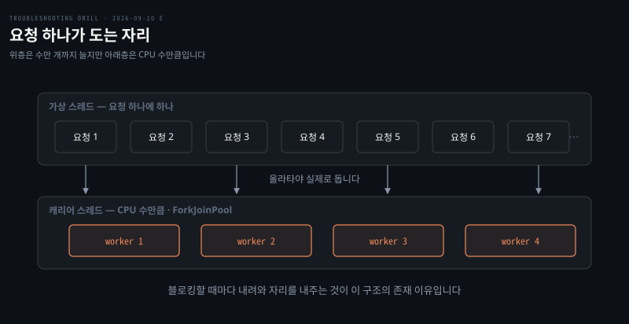
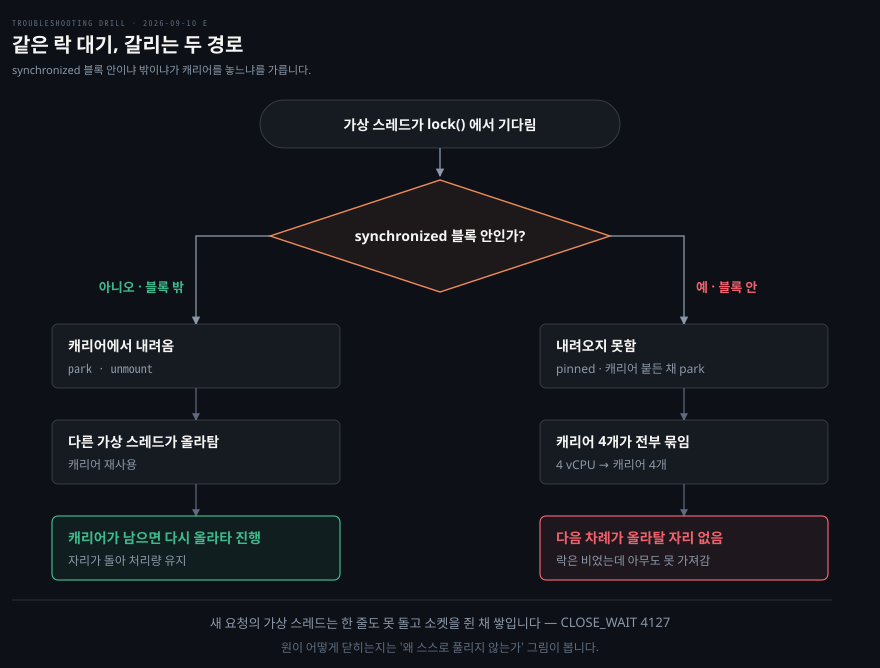

# CPU 는 노는데 응답이 끊긴 서비스

---

> 기다리는 대상이 자기 실행 수단이면 부하가 빠져도 풀리지 않습니다.

## 문제 소개

> JDK 21 로 올리고 요청 처리를 가상 스레드로 바꾼 뒤, 며칠 지나 인스턴스가 응답을 멈췄습니다.

**출처** · [Java Code Geeks · Virtual Threads Two Years In](https://www.javacodegeeks.com/2026/05/virtual-threads-two-years-in-production-war-stories-the-pinning-edge-cases-and-what-jdk-25-fixed.html) (2026) · 프로덕션 사례 모음이고 원 보고는 Netflix 의 JDK 21 + Spring Boot 3 사례입니다


올린 직후는 멀쩡했고 오히려 처리량이 늘었습니다. 트래픽이 붙는 시간대에 인스턴스 몇 대가 응답을 아예 안 하기 시작했고, 프로세스는 살아 있고 종료되지도 않았습니다. 예외 로그가 한 줄도 없고 로그 자체가 그 시각부터 멈췄습니다. 헬스체크가 떨어져 재시작되면 다시 몇 시간은 정상이었습니다.

```bash
$ top -p 3142
  PID  USER  %CPU  %MEM    TIME+  COMMAND
 3142  app    0.7  62.1  18:22.4  java

$ ss -tan state close-wait | wc -l
4127
```

힙은 여유가 있고 GC 로그에도 긴 정지가 없었습니다.

```bash
[2026-09-10T14:02:11.338+0900][info][gc] GC(884) Pause Young (Normal) 612M->344M(2048M) 8.431ms
```

읽히는 것이 셋입니다. CPU 0.7% 는 무한 루프를 지웁니다. GC 정지 8ms 는 수집을 지웁니다. `CLOSE_WAIT` 4127 은 연결이 성사됐었다는 증거입니다.


## 원인 분석

> 소켓이 쌓여서 앱이 멈춘 것이 아니라, 앱이 멈춰서 소켓이 쌓였습니다.



**배제된 것.** 과부하가 먼저 지워집니다. 무한 루프나 폭주라면 CPU 가 100% 여야 하는데 0.7% 입니다. GC 도 지워집니다. 마지막 로그의 정지가 8.431ms 이고 힙도 여유가 있습니다.

네트워크 고장도 지워집니다. 연결이 끊겼다면 `CLOSE_WAIT` 에 들어오지도 못합니다. `CLOSE_WAIT` 는 3-way 핸드셰이크가 끝나고 요청까지 오간 뒤 상대가 정상적으로 FIN 을 보낸 상태라, 통신이 정상이었다는 증거입니다.

**인과의 방향.** `CLOSE_WAIT` 는 원인이 아니라 결과입니다. 상대가 FIN 을 보냈고 커널은 ACK 했는데 앱이 `close()` 를 부르지 않은 상태이므로, 클라이언트 4127 명이 기다리다 끊었는데 앱이 그것을 처리조차 못 하고 있다는 뜻입니다. 로그가 안 찍히는 것도 같은 결과입니다. 로그를 찍을 코드까지 아무도 도달하지 못합니다.

**남은 것.** CPU 를 안 쓰는 상태는 놀고 있거나 기다리고 있는 둘인데, `CLOSE_WAIT` 가 첫 번째를 지웁니다. 요청은 왔습니다.

가상 스레드는 블로킹할 때마다 캐리어 스레드에서 내려와 자리를 내주는 것이 존재 이유입니다. 그런데 내려오지 못하는 자리가 있습니다. JDK 21 의 `synchronized` 구현은 가상 스레드의 unmount 를 지원하지 않아, 그 안에서 I/O 를 기다리면 캐리어를 붙든 채 멈춥니다. 네이티브 메서드 호출도 같습니다.

**왜 스스로 풀리지 않는가.** 단순 고갈이 아니라 교착이기 때문입니다. 가상 스레드들이 `synchronized` 안에서 I/O 를 기다리며 캐리어를 전부 점유하면, 그 I/O 를 완료시킬 작업도 가상 스레드인데 실행할 캐리어가 남아 있지 않습니다. 기다리는 대상이 자기 자신의 실행 수단이라 부하가 빠져도 풀리지 않고 재시작만이 답입니다.

CPU 0.7% 도 여기서 맞아떨어집니다. 캐리어 스레드들은 점유돼 있으나 일하고 있지 않습니다.

**확정도.** 원본 사례에서 범인은 자기 코드가 아니었습니다. 서드파티 추적 라이브러리가 내부에서 쓰던 `synchronized` 였고 JFR 의 `jdk.VirtualThreadPinned` 이벤트가 그것을 지목했습니다. 이 회차는 지면 풀이라 유력 가설입니다. 확정에는 그 이벤트 확인이 필요합니다.


## 해결 방법

> 스레드가 어디서 멈췄는지 보고, pinning 이 어디서 나는지 이벤트로 확정합니다.

```bash
# 스레드 덤프 — 캐리어가 synchronized 안에 멈춰 있는지
jcmd <pid> Thread.print | grep -A12 'ForkJoinPool-1-worker'

# 가상 스레드까지 보이는 새 형식 (JDK 21+)
jcmd <pid> Thread.dump_to_file -format=json /tmp/vt.json

# pinning 이 어디서 나는지 — 이 사고의 결정타
jcmd <pid> JFR.start settings=profile duration=60s filename=/tmp/pin.jfr
jfr summary /tmp/pin.jfr | grep -i pinned
```

`jstack` 으로는 부족합니다. 가상 스레드는 수만 개라 전통 덤프 형식으로는 다 나오지 않습니다.

- **응급**: 재시작으로 되살린 뒤 가상 스레드를 끕니다. 스프링 부트라면 `spring.threads.virtual.enabled=false` 로 플랫폼 스레드 풀로 돌아갑니다. 처리량은 줄지만 교착은 사라집니다
- **재발 방지**: pinning 원인을 `ReentrantLock` 으로 바꾸거나, JDK 24 이상으로 올립니다. JEP 491 이 `synchronized` 안에서도 unmount 되도록 고쳤습니다. 자기 코드가 아니라 라이브러리가 원인이면 그 라이브러리를 올립니다
- **검증**: 지면 풀이라 미실행입니다. 확인하려면 조치 뒤 JFR 에 `jdk.VirtualThreadPinned` 이벤트가 사라지는지 보고, 부하 시험에서 `CLOSE_WAIT` 가 쌓이지 않는지 함께 봅니다


## 다른 방법 비교

> 같은 증상을 만드는 다른 원인이 여럿이고, 스레드 덤프가 가릅니다.

전통적인 데드락이라면 두 스레드가 서로의 락을 기다리는 형태라 JVM 이 스레드 덤프에 직접 표시해 줍니다. 이 사고는 락 자체는 비어 있고 캐리어가 없어 못 도는 것이라 덤프의 데드락 탐지에 안 걸립니다. 힙 덤프를 떠 보면 락이 **주인 없이** 대기자만 쌓여 있는 상태가 보이는데, 그 어긋남이 단서입니다.

커넥션 풀 고갈도 비슷하게 보입니다. CPU 가 낮고 응답이 없고 `CLOSE_WAIT` 가 쌓입니다. 가르는 것은 스레드 덤프에서 대기 지점이 풀의 `getConnection` 인지 `synchronized` 블록인지입니다.

외부 의존 응답 지연도 후보입니다. 이때는 캐리어가 놀고 있고 가상 스레드들이 정상적으로 unmount 된 상태라, 캐리어 스레드가 `ForkJoinPool` 에서 대기 중으로 보입니다. 점유돼 있는지 놀고 있는지가 갈림길입니다.

`CLOSE_WAIT` 자체를 고치려는 접근은 방향이 틀렸습니다. `ulimit -n` 을 올리거나 소켓 타임아웃을 줄이면 fd 고갈 시점을 미룰 뿐 교착은 그대로입니다. 4127 은 흔한 기본값 65536 에 못 미쳐 아직 고갈 전이지만, 방치하면 `Too many open files` 로 터집니다. 같은 원인의 다음 단계이지 별개 문제가 아니라, `CLOSE_WAIT` 는 터지기 전에 보이는 선행 지표로 쓰는 편이 맞습니다.


## 내 접근과 실제가 갈린 자리

> `CLOSE_WAIT` 의 정의와 가상 스레드 pinning 을 스스로 짚었고, 인과 방향과 조건에서 갈렸습니다.

| 내가 본 것 | 실제 | 갈린 이유 |
|-----------|------|----------|
| CPU 0.7% 라 과부하 아님 | 맞음 | 숫자로 지움 |
| `CLOSE_WAIT` 는 FIN 받고 `close()` 안 부른 상태 | 맞음 | 정의를 정확히 재구성 |
| 소켓이 쌓여서 앱이 멈췄다 | 반대. 앱이 멈춰서 쌓임 | 결과를 원인으로 읽음 |
| `CLOSE_WAIT` 는 통신 성공의 증거 | 맞음 | 앞 문항의 `refused` 논리를 옮겨 옴 |
| 가상 스레드가 캐리어에 반납을 못 함 | 맞음. 그것이 pinning | **되물음 없이 나온 자리** |
| 그 조건이 `synchronized` 안 | 안 나옴 | 조건까지 못 감 |
| 스레드 상태를 보는 명령 | `jcmd Thread.print`, JFR | 네트워크 쪽만 봐서 안 나옴 |

가장 큰 전진은 pinning 을 이름과 기전으로 꺼낸 것입니다. "유저 레벨 스레드가 커널 레벨 스레드에게 반납을 못 한다"가 정확한 서술이고, 거기서 조건 하나만 채우면 사고 전체가 닫혔습니다.

인과 방향이 한 번 뒤집힌 것은 남습니다. 쌓인 것이 눈에 크게 보일 때 그것을 원인으로 읽는 패턴은 2026-09-08 B 에서 "가장 크게 망가진 것을 원인으로 읽었다"와 같은 축입니다.


## 나온 개념

> 가상 스레드가 내려오지 못하는 조건, 그리고 관측 도구가 갈리는 자리입니다.

`synchronized` 안에서 블로킹하면 가상 스레드가 캐리어를 붙든 채 멈춘다는 것은 노트에 있는 내용입니다. 이 회차에서 새로 확인한 것은 그 제약이 **교착까지 갈 수 있다**는 점입니다. 자리를 못 내주는 것이 성능 저하로 끝나지 않고, 완료에 필요한 작업까지 캐리어를 못 얻으면 서로를 영원히 기다립니다.

도구 쪽에서는 `jcmd Thread.dump_to_file` 과 JFR `jdk.VirtualThreadPinned` 이 새로 나왔습니다. 전통 `jstack` 이 가상 스레드 시대에 부족해진 이유가 함께 확인됐습니다.

fd 상한은 프로세스당 `ulimit -n` 과 시스템 전체 `fs.file-max` 로 걸리고, 소켓도 fd 라 여기 포함됩니다.

근거는 [자바와 가상 스레드](../../01_language/book/Inside%20the%20Java%20Virtual%20Machine%20JVM%20Advanced%20Features%20and%20Best%20Practices/ch05_efficient-concurrency/01-04.자바와%20가상%20스레드%20—%20Virtual%20Threads.md) §2 입니다. "모든 블로킹이 unmount 되는 것은 아니다"가 그 자리이고, [Virtual Threads 기초](../../01_language/book/Inside%20the%20Java%20Virtual%20Machine%20JVM%20Advanced%20Features%20and%20Best%20Practices/ch05_efficient-concurrency/01-05.Virtual%20Threads%20기초.md) §11 이 `synchronized` 를 더 다룹니다.


## 관련 문서

- [runtime 계층 목록](./README.md)
- [회차 로그](../_drill/log.md) — 이 문항을 푼 날의 점수와 막힌 지점
- [자바와 가상 스레드](../../01_language/book/Inside%20the%20Java%20Virtual%20Machine%20JVM%20Advanced%20Features%20and%20Best%20Practices/ch05_efficient-concurrency/01-04.자바와%20가상%20스레드%20—%20Virtual%20Threads.md) — mount·unmount 와 내려오지 못하는 조건
- [수거량에 비해 지나치게 긴 멈춤](./2026-09-08_수거량에%20비해%20지나치게%20긴%20멈춤.md) — 같은 계층, 관측 수단이 관측 대상 안에 있던 사례
