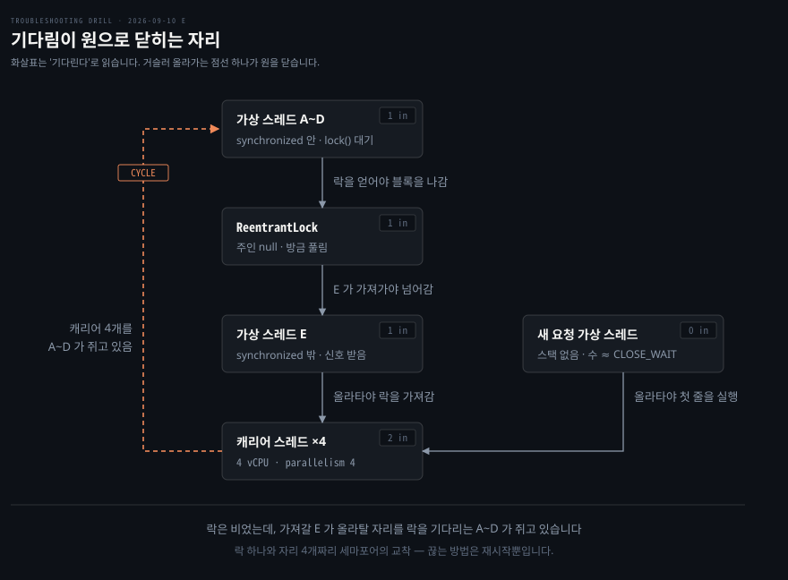

# CPU 는 노는데 응답이 끊긴 서비스

---

> 가상 스레드가 캐리어를 붙든 채 락을 기다립니다. 그 락을 넘겨받을 스레드는 올라탈 캐리어가 없어 멈춘 교착이라, 부하가 빠져도 풀리지 않습니다.

## 문제 소개

> JDK 21 로 올리고 요청 처리를 가상 스레드로 바꾼 뒤, 며칠 지나 인스턴스가 응답을 멈췄습니다.

**출처** · [Netflix TechBlog · Java 21 Virtual Threads - Dude, Where's My Lock?](https://netflixtechblog.com/java-21-virtual-threads-dude-wheres-my-lock-3052540e231d) (2024) · 원 보고입니다. 이 문항은 사례 모음 [Java Code Geeks · Virtual Threads Two Years In](https://www.javacodegeeks.com/2026/05/virtual-threads-two-years-in-production-war-stories-the-pinning-edge-cases-and-what-jdk-25-fixed.html) (2026) 에서 골랐습니다


그림이 이 사고의 무대입니다. 요청이 하나 들어올 때마다 **가상 스레드**(virtual thread)가 하나 생깁니다. 가상 스레드는 JVM 이 관리하는 가벼운 실행 단위라 수만 개를 만들어도 부담이 적습니다. 하지만 실제로 CPU 에서 돌려면 아래층의 **캐리어 스레드**(carrier thread)에 올라타야 합니다. 캐리어는 진짜 OS 스레드로, 자바에서는 플랫폼 스레드라고 부릅니다. 개수의 기본값은 JVM 이 보는 CPU 수입니다. 가상 스레드를 캐리어에 배정하는 일은 JVM 의 스케줄러인 `ForkJoinPool` 이 맡습니다[^park].

가상 스레드가 캐리어에 올라타는 것을 mount, 내려오는 것을 unmount 라고 부릅니다. 가상 스레드는 I/O 나 락을 기다리는 순간 내려와 자리를 비웁니다. 그래서 캐리어 몇 개로 요청 수천 개를 돌릴 수 있습니다. 이 사고는 그 내려오기가 막힌 이야기입니다.

아래 증상과 출력은 원본 사례를 바탕으로 문항용으로 구성했습니다. 올린 직후는 멀쩡했고 오히려 처리량이 늘었습니다. 트래픽이 붙는 시간대에 인스턴스 몇 대가 응답을 아예 안 하기 시작했습니다. 프로세스는 살아 있었고 종료되지도 않았습니다. 예외 로그가 한 줄도 없고 로그 자체가 그 시각부터 멈췄습니다. 헬스체크가 떨어져 재시작되면 다시 몇 시간은 정상이었습니다.

```bash
# top -p 3142
  PID  USER  %CPU  %MEM    TIME+  COMMAND
 3142  app    0.7  62.1  18:22.4  java

# ss -tan state close-wait | wc -l
4127
```

힙은 여유가 있고 GC 로그에도 긴 정지가 없었습니다.

```bash
[2026-09-10T14:02:11.338+0900][info][gc] GC(884) Pause Young (Normal) 612M->344M(2048M) 8.431ms
```

읽히는 것이 셋입니다. CPU 0.7% 는 무한 루프를 지웁니다. GC 정지 8ms 는 수집을 지웁니다. `CLOSE_WAIT` 는 상대가 연결을 닫았는데 이쪽 앱이 아직 소켓을 닫지 않은 상태입니다. 그런 소켓이 4127 개라는 사실은 연결이 성사됐었다는 증거입니다.


## 원인 분석

> 소켓이 쌓여서 앱이 멈춘 것이 아니라, 앱이 멈춰서 소켓이 쌓였습니다.


앱은 무엇을 기다리다 멈췄을까요? 그림이 답을 먼저 보여 줍니다. 같은 `lock()` 대기라도 `synchronized` 블록 밖이면 가상 스레드가 캐리어에서 내려옵니다. 블록 안이면 내려오지 못합니다. 아래는 증거로 그 결론까지 좁혀 가는 순서입니다.

### 증거가 지우는 것

흔한 용의자부터 지웁니다. 무한 루프나 폭주라면 CPU 가 100% 여야 하는데 0.7% 입니다. GC 도 마지막 로그의 정지가 8.431ms 라 지워집니다. 네트워크 고장도 지워집니다. `CLOSE_WAIT` 는 3-way 핸드셰이크가 끝난 뒤 상대가 FIN 을 보낸 상태라, 연결까지는 정상이었다는 증거이기 때문입니다.

남는 것은 기다림입니다. CPU 를 안 쓰는 상태는 놀고 있거나 기다리고 있는 둘인데, 연결이 왔으므로 첫 번째가 지워집니다.

### 인과의 방향

`CLOSE_WAIT` 는 원인이 아니라 결과입니다. 순서를 보면 드러납니다. 소켓은 가상 스레드보다 **먼저** 생깁니다. 커널이 핸드셰이크를 마치고 Tomcat 이 `accept()` 로 받은 다음에야 그 요청을 처리할 가상 스레드가 만들어지고, 그때부터 소켓의 담당자는 그 가상 스레드 하나뿐입니다.

클라이언트가 끊어 FIN 이 오면 ACK 까지는 커널이 알아서 합니다. 그런데 `CLOSE_WAIT` 에서 다음으로 넘어가는 `close()` 는 커널이 대신 불러 주지 않습니다. 담당 가상 스레드가 한 줄도 실행하지 못하면 그 호출이 영영 일어나지 않습니다. 소켓 상태 자체는 커널의 것이고, 스레드와 이어지는 고리는 `close()` 를 부를 주체 하나뿐입니다. `CLOSE_WAIT` 는 가상 스레드 때문에 생긴 상태가 아니라 가상 스레드가 멈춰서 **없어지지 못하는** 상태입니다.

원본 사례의 덤프가 이것을 숫자로 보여 줍니다. 스택이 텅 빈 가상 스레드가 수천 개였고 그 수는 `CLOSE_WAIT` 소켓 수와 거의 같았습니다. 로그가 안 찍히는 것도 같은 이유입니다. 로그를 찍을 코드까지 아무도 도달하지 못합니다.

### 기다린 자리

원본 사례에서 기다린 것은 I/O 가 아니라 락이었습니다. 분산 추적 라이브러리 Brave 의 `RealSpan.finish()` 가 `synchronized` 로 들어간 뒤, 그 안에서 Zipkin 리포터의 `ReentrantLock` 을 기다렸습니다. 인스턴스가 4 vCPU 라 캐리어도 4개였고, 가상 스레드 4개가 이 자리에 동시에 걸리자 캐리어가 하나도 남지 않았습니다.

`synchronized` 안에서 기다리면 가상 스레드가 캐리어를 붙든 채 멈춥니다. 이것을 **pinning**(고정)이라고 합니다. 기전과 재현은 [가상 스레드가 내려오지 못할 때](../_concepts/runtime-가상-스레드가-내려오지-못할-때.md)에 있습니다. 기다린 대상이 아니라 기다린 **장소**가 문제라는 것이 요지입니다.

### 왜 스스로 풀리지 않는가

단순 고갈이 아니라 교착이기 때문입니다. 고갈은 기다리면 앞의 작업이 끝나면서 자리가 납니다. 교착은 기다림이 원을 그려 닫힌 상태라 그 원을 끊을 주체가 안에 없습니다.



화살표는 "기다린다"로 읽습니다. 원본 사례의 등장인물로 한 바퀴 따라가 보겠습니다. 가상 스레드 A~D 가 `synchronized` 안에서 락을 기다리며 캐리어 4개를 붙들고 있습니다. 락을 쥐고 있던 스레드가 락을 풀며 대기열의 다음 차례 E 를 깨웁니다. E 는 `synchronized` 밖에서 기다리던 스레드라 이미 내려와 있습니다. 락을 가져가려면 캐리어에 다시 올라타야 합니다. 그 캐리어를 A~D 가 쥐고 있고 A~D 는 락을 얻어야 놓습니다.

E 는 캐리어를, 캐리어는 A~D 를, A~D 는 락을 기다립니다. 락은 신호를 받은 E 가 가져가기를 기다립니다. 끝이 처음으로 돌아오므로 원이 닫힙니다. 그래서 **락은 비어 있는데 아무도 가져가지 못합니다.** 락을 넘겨받을 E 가 올라탈 자리를, 락을 기다리는 A~D 가 쥐고 있습니다. 기다리는 대상이 자기 실행 수단이라는 말이 이 뜻이고, 부하가 0 이 돼도 안에서 끊기지 않으므로 재시작만이 답입니다. Netflix 는 이것을 락 하나와 자리 4개짜리 세마포어의 교착으로 정리했습니다. 캐리어 풀이 그 세마포어입니다.

풀이 캐리어를 더 만들어 원을 끊지도 못합니다. 상한 때문이 아니라 pinning 이 풀에 블로킹을 신고하지 않아 늘려야 할 이유가 전달되지 않기 때문인데, 그 경로도 [개념 노트](../_concepts/runtime-가상-스레드가-내려오지-못할-때.md)에 있습니다.

CPU 0.7% 가 여기서 맞아떨어집니다. 캐리어는 점유돼 있으나 일하고 있지 않습니다. 점유만 보면 바쁜 서버 같고 CPU 만 보면 노는 서버 같은데, 실제로는 둘 다 아니고 멈춘 서버입니다.

### 원본 사례는 어떻게 확정했나

이 회차는 지면 풀이라 결론은 유력 가설입니다. 확정은 원본 사례가 밟은 순서로 합니다.

Netflix 는 먼저 평소처럼 스레드 덤프를 봤는데 할 일 없는 JVM 으로만 보였습니다. `jcmd Thread.dump_to_file` 로 다시 뜨자 스택 없는 가상 스레드 수천 개와 `synchronized` 안에서 락을 기다리는 가상 스레드 4개가 드러났습니다. 락의 주인은 그 덤프에도 없어 힙 덤프를 Eclipse MAT 로 열었더니 주인 필드가 비어 있었습니다. 락이 막 풀렸고 다음 차례가 아직 가져가지 못한 중간 상태였습니다.

범인은 자기 코드가 아니었습니다. 추적 라이브러리 안의 `synchronized` 였으니 애플리케이션 코드를 뒤져서는 찾을 수 없는 자리였습니다.

> **정정 (2026-09-13)**: 처음 정리에서는 가상 스레드가 I/O 를 기다렸고 JFR(JDK Flight Recorder, JVM 내장 이벤트 기록 도구)의 `jdk.VirtualThreadPinned` 이벤트가 범인을 지목했다고 적었습니다. 둘 다 사례 모음 기사의 서술이었습니다. Netflix 원문과 대조하니 기다린 것은 락이었고 JFR 은 나오지 않아 원문 기준으로 고쳤습니다.


## 해결 방법

> 멈춘 JVM 에서는 jstack 형식 스레드 덤프와 JFR 이 헛돕니다. 가상 스레드 스택은 `Thread.dump_to_file` 로, 락의 주인은 힙 덤프로 봅니다.

손에 익은 도구로 먼저 보면 이 사고는 잘 안 보입니다. `jcmd Thread.print` 는 jstack 과 같은 형식이라 캐리어가 가상 스레드를 태우고 있다는 한 줄 말고는 앱의 호출 스택이 나오지 않습니다. 원본 사례가 할 일 없는 JVM 으로 본 것도 이 형식입니다. JFR 의 `jdk.VirtualThreadPinned` 도 멈춘 동안은 0건입니다. 도구별로 무엇이 보이고 안 보이는지는 [개념 노트](../_concepts/runtime-가상-스레드가-내려오지-못할-때.md)에 JDK 21.0.3 실측으로 정리했습니다.

```bash
# 1. 가상 스레드까지 담는 덤프 (JDK 21+)
jcmd <pid> Thread.dump_to_file -format=json /tmp/vt.json
# parkOnCarrierThread 가 찍힌 가상 스레드가 pinning 으로 멈춘 것이다 (실측 4)
grep -c 'parkOnCarrierThread' /tmp/vt.json

# 2. 락의 주인 — 스레드 덤프에 안 나오므로 힙 덤프를 떠서 MAT 로 락 객체를 연다
jcmd <pid> GC.heap_dump /tmp/heap.hprof

# 3. 조치 뒤 재발 확인 — 녹화는 JVM 을 켤 때부터 켜 둔다
java -XX:StartFlightRecording=name=pin,settings=profile -jar app.jar
# 부하 시험 뒤 녹화 내용을 파일로 떨군다 — 이 줄이 없으면 아래 파일이 생기지 않는다
jcmd <pid> JFR.dump name=pin filename=/tmp/pin.jfr
jfr print --events jdk.VirtualThreadPinned /tmp/pin.jfr
```

- **응급**: 재시작으로 되살린 뒤 가상 스레드를 끕니다. 스프링 부트라면 `spring.threads.virtual.enabled=false` 로 플랫폼 스레드 풀로 돌아갑니다[^boot-vt]. 처리량은 줄지만 교착은 사라집니다
- **재발 방지**: 블로킹이 일어나는 `synchronized` 블록을 `java.util.concurrent` 락으로 바꾸거나, JDK 24 이상으로 올립니다. 이 사고에서도 문제는 `ReentrantLock` 이 아니라 그것을 감싼 `synchronized` 였습니다. 라이브러리가 원인이면 그 라이브러리를 올립니다
- **검증**: 지면 풀이라 미실행입니다. 조치 뒤 부하 시험을 JFR 녹화와 함께 돌려 `jdk.VirtualThreadPinned` 이벤트와 `CLOSE_WAIT` 누적이 사라졌는지 봅니다


## 다른 방법 비교

> 같은 증상을 만드는 원인이 여럿입니다. 가상 스레드까지 담는 덤프와 힙 덤프가 가릅니다.

| 후보 | 가르는 신호 |
|------|-----------|
| 전통적인 데드락 | 스레드 덤프가 데드락을 직접 표시합니다 |
| pinning 교착 (이 사고) | 데드락 탐지에 안 걸립니다. 원본 사례에서는 힙 덤프에 주인 없는 락이 보였습니다 |
| 커넥션 풀 고갈 | 덤프의 대기 지점이 풀의 `getConnection` 입니다 |
| 외부 의존 응답 지연 | 캐리어가 놀고 있고 가상 스레드는 정상적으로 내려와 있습니다 |

넷을 가르는 신호가 전부 가상 스레드의 스택에 있으므로 `Thread.dump_to_file` 로 봅니다. 이 사고만 락이 비어 있고 캐리어가 없어 못 도는 형태라 JVM 의 데드락 탐지에 안 걸립니다.

`CLOSE_WAIT` 자체를 고치려는 접근은 방향이 틀렸습니다. `ulimit -n` 을 올리거나 소켓 타임아웃을 줄이면 fd(파일 디스크립터) 고갈 시점을 미룰 뿐 교착은 그대로입니다. 소켓도 fd 라 계속 쌓이면 결국 `Too many open files` 로 터집니다. 같은 원인의 다음 단계이지 별개 문제가 아니라, 터지기 전에 보이는 선행 지표로 쓰는 편이 맞습니다.


## 내 접근과 실제가 갈린 자리

> `CLOSE_WAIT` 의 정의와 가상 스레드 pinning 은 스스로 짚었습니다. 인과 방향과 조건에서 갈렸습니다.

| 내가 본 것 | 실제 | 갈린 이유 |
|-----------|------|----------|
| CPU 0.7% 라 과부하 아님 | 맞음 | 숫자로 지움 |
| `CLOSE_WAIT` 는 FIN 받고 `close()` 안 부른 상태 | 맞음 | 정의를 정확히 재구성 |
| 소켓이 쌓여서 앱이 멈췄다 | 반대. 앱이 멈춰서 쌓임 | 결과를 원인으로 읽음 |
| `CLOSE_WAIT` 는 통신 성공의 증거 | 맞음. 정확히는 연결 수립의 증거 | 앞 문항의 `refused` 논리를 옮겨 옴 |
| 가상 스레드가 캐리어에 반납을 못 함 | 맞음. 그것이 pinning | **되물음 없이 나온 자리** |
| 그 조건이 `synchronized` 안 | 안 나옴 | 조건까지 못 감 |
| 스레드 상태를 보는 명령 | `jcmd Thread.dump_to_file`, 힙 덤프 | 네트워크 쪽만 봐서 안 나옴 |

가장 큰 전진은 pinning 을 이름과 기전으로 꺼낸 것입니다. "유저 레벨 스레드가 커널 레벨 스레드에게 반납을 못 한다"로 기전의 핵심을 짚었습니다. 엄밀히는 가상 스레드가 캐리어를 스케줄러에 돌려주지 못하는 상태입니다. 거기서 조건 하나만 채우면 사고 전체가 닫혔습니다.

인과 방향이 한 번 뒤집힌 것은 남습니다. 쌓인 것이 눈에 크게 보일 때 그것을 원인으로 읽는 패턴은 2026-09-08 B 에서 "가장 크게 망가진 것을 원인으로 읽었다"와 같은 축입니다.


## 나온 개념

> 가상 스레드가 내려오지 못하는 조건, 그리고 관측 도구가 갈리는 자리입니다.

`synchronized` 안에서 블로킹하면 가상 스레드가 캐리어를 붙든 채 멈춘다는 것은 노트에 있던 내용입니다. 이 회차에서 새로 확인한 것은 그 제약이 **교착까지 갈 수 있다**는 점입니다. 자리를 못 내주는 것이 성능 저하로 끝나지 않고, 락을 넘겨받을 스레드까지 캐리어를 못 얻으면 서로를 영원히 기다립니다. 기전·재현·관측은 [가상 스레드가 내려오지 못할 때](../_concepts/runtime-가상-스레드가-내려오지-못할-때.md)로 뺐습니다.

도구 쪽에서는 `jcmd Thread.dump_to_file` 과 힙 덤프가 새로 나왔습니다. fd 상한은 프로세스당 `ulimit -n` 과 시스템 전체 `fs.file-max` 로 걸리고, 소켓도 fd 라 여기 포함됩니다.

근거는 [자바와 가상 스레드](../../01_language/book/Inside%20the%20Java%20Virtual%20Machine%20JVM%20Advanced%20Features%20and%20Best%20Practices/ch05_efficient-concurrency/01-04.자바와%20가상%20스레드%20—%20Virtual%20Threads.md) §2 의 "모든 블로킹이 unmount 되는 것은 아니다"이고, [Virtual Threads 기초](../../01_language/book/Inside%20the%20Java%20Virtual%20Machine%20JVM%20Advanced%20Features%20and%20Best%20Practices/ch05_efficient-concurrency/01-05.Virtual%20Threads%20기초.md) §11 이 `synchronized` 를 더 다룹니다.


## 관련 문서

- [runtime 계층 목록](./README.md)
- [회차 로그](../_drill/log.md) — 이 문항을 푼 날의 점수와 막힌 지점
- [자바와 가상 스레드](../../01_language/book/Inside%20the%20Java%20Virtual%20Machine%20JVM%20Advanced%20Features%20and%20Best%20Practices/ch05_efficient-concurrency/01-04.자바와%20가상%20스레드%20—%20Virtual%20Threads.md) — mount·unmount 와 내려오지 못하는 조건
- [수거량에 비해 지나치게 긴 멈춤](./2026-09-08_수거량에%20비해%20지나치게%20긴%20멈춤.md) — 같은 계층, 관측 수단이 관측 대상 안에 있던 사례

---

[^park]: [JDK 21.0.3 `VirtualThread.java`](https://github.com/openjdk/jdk21u/blob/jdk-21.0.3-ga/src/java.base/share/classes/java/lang/VirtualThread.java) — `parkOnCarrierThread()` 가 `setState(PINNED)` 후 `U.park()` 로 캐리어를 재웁니다. park 가 끝난 뒤에야 `VirtualThreadPinnedEvent` 를 커밋합니다. `createDefaultScheduler()` 의 `parallelism` 기본값은 `availableProcessors()`, `maxPoolSize` 기본값은 `max(parallelism, 256)` 입니다.
[^boot-vt]: [Spring Boot — Application Properties](https://docs.spring.io/spring-boot/appendix/application-properties/index.html) — `spring.threads.virtual.enabled` "Whether to use virtual threads.", 기본값 `false`.
