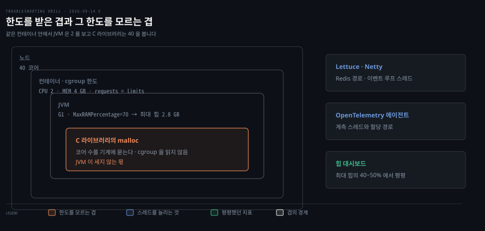
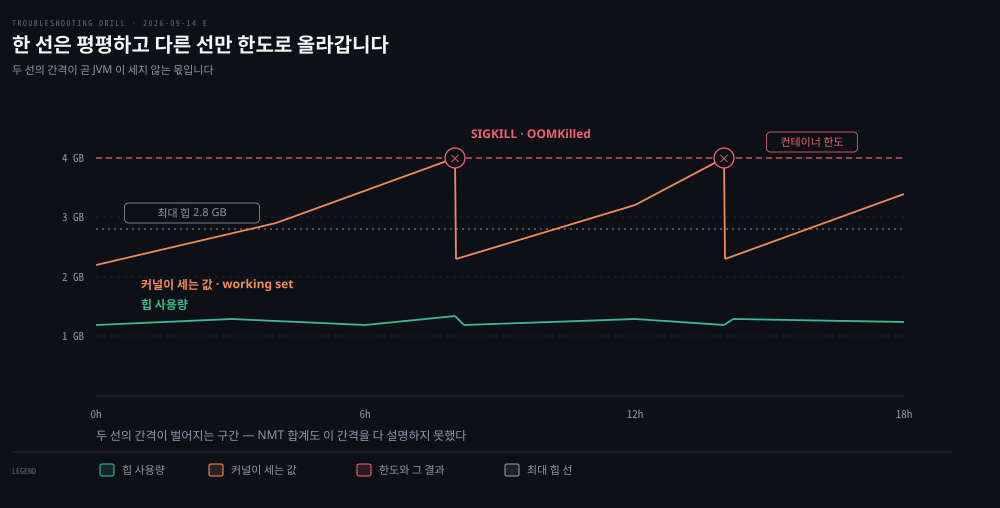

# 힙은 평평한데 몇 시간마다 죽는 컨테이너

---

> 힙이 평평하다는 관찰은 힙 누수만 지웁니다. 커널이 한도와 비교하는 값은 JVM 이 세는 여섯 칸의 합보다 크고, 그 차이가 자라고 있었습니다.

## 문제 소개

> GC 와 힙 크기를 손봐 지표가 좋아졌는데, 일주일 뒤부터 Pod 이 `OOMKilled` 로 죽기 시작했습니다.

**출처** · [Rohlik · Taming JVM Memory on JDK 25 — Part 2: OOMs While the Heap Is Flat](https://blog.rohlik.group/blog/taming-jvm-memory-jdk25-part2) (2026)



쿠버네티스에서 도는 Spring Boot 서비스입니다. JDK 25 에 G1 컬렉터를 명시했고 최대 힙은 `MaxRAMPercentage=70` 으로 컨테이너 한도에서 잡습니다. requests 와 limits 를 같게 둬 Guaranteed QoS 입니다.

Redis 를 많이 부르는 경로가 있어 Netty 기반 Lettuce 클라이언트를 씁니다. OpenTelemetry 자바 에이전트도 붙여 두었습니다. 컨테이너에 준 CPU 는 2 코어이고 그 컨테이너가 올라간 노드는 40 코어입니다.

얼마 전의 튜닝은 효과가 분명했습니다. 힙 사용량이 며칠 내내 최대 힙의 40~50% 에서 평평했고 GC 로그도 조용해졌습니다. Full GC 도 긴 멈춤도 없었고 p99 지연까지 가라앉았습니다.

```bash
# 컨테이너 메모리 한도          4 GB
# 최대 힙 (한도의 70%)          약 2.8 GB
# 힙 사용량                     최대 힙의 40~50% — 며칠째 평평
# container working set         시간이 지나며 조금씩 올라 한도에 닿음
# 애플리케이션 로그              java.lang.OutOfMemoryError 없음
```

출력에서 읽히는 것은 **두 값이 갈렸다**는 사실입니다. 힙은 평평한데 커널이 세는 값만 오릅니다. 재시작하면 몇 시간을 버티고 같은 일이 되풀이됩니다.

읽히지 않는 것은 오르는 쪽의 정체입니다. 힙을 뺀 다섯 칸인지, JVM 이 세지 않는 몫인지가 이 출력만으로는 갈리지 않습니다.


## 원인 분석

> 두 선의 간격이 벌어지는 구간이 이 사고의 전부입니다. 그 간격은 JVM 에게 물어도 답이 없는 몫이었습니다.



**배제된 것.** 힙 누수가 먼저 빠집니다. 힙 사용량이 며칠째 평평하고 GC 로그도 조용합니다. `OutOfMemoryError` 가 없다는 사실도 같은 방향입니다. JVM 이 자기 한도에 걸려 스스로 멈춘 것이 아니라, 커널이 바깥에서 죽였기 때문입니다.

**낮아진 것.** JVM 이 세는 나머지 다섯 칸입니다. 스레드 스택과 direct buffer 는 Netty 를 쓰는 구성에서 가장 그럴듯한 후보이고 먼저 재 볼 값이 맞습니다. 다만 원문에서 NMT 가 설명한 네이티브 메모리는 약 1.5 GB 였고, RSS 와 힙의 차이는 4 GB 컨테이너에서 약 2 GB 였습니다. 다섯 칸으로는 간격이 다 설명되지 않습니다.

**남은 것.** JVM 이 세지 않는 쪽입니다. C 라이브러리가 `malloc` 으로 내준 메모리이고, 커널은 그것까지 합쳐 한도와 비교합니다.

```bash
# 커널이 세는 것 (RSS)
JVM 이 아는 영역   힙 · 메타스페이스 · 코드 캐시 · 스레드 스택 · direct buffer · GC 자료구조
JVM 이 모르는 영역  C 라이브러리가 malloc 으로 내준 메모리
```

glibc 는 여러 스레드가 락을 덜 다투도록 힙을 arena 여럿으로 나눕니다. 64비트에서 arena 수의 기본 상한은 코어 수의 8 배입니다.

원문의 요점은 **그 코어 수가 컨테이너의 CPU 한도가 아니라 노드의 코어 수**라는 것입니다. 2 코어짜리 컨테이너가 40 코어 노드에 올라가면 상한이 320 이 됩니다. cgroup 의 CPU 한도는 쓸 수 있는 시간의 몫을 자르는 것이라 코어 목록을 가리지 않고, C 라이브러리는 cgroup 이 아니라 기계에 코어 수를 묻습니다.

한 번 쓴 arena 는 거의 비어도 잘 반납되지 않습니다. 살아 있는 할당 몇 개가 64 MB 덩이 하나를 통째로 붙잡습니다. 그래서 누수처럼 보이지만 잃어버린 것이 아니라 **돌려주지 않고 쌓인 것**입니다.

이 서비스는 거기에 스레드가 많았습니다. Lettuce 의 `ClientResources` 를 하나로 공유하지 않고 여러 개 만들어 Netty 이벤트 루프가 그만큼 늘었고, OpenTelemetry 에이전트가 할당 경로를 더했습니다. 원문의 표현으로 arena 는 설계대로 동작했고 컨테이너가 그것을 감당하지 못했을 뿐입니다.


## 해결 방법

> 두 값을 쌍으로 놓는 것에서 시작해, NMT 합계가 RSS 를 설명하는지로 갈립니다.

```bash
# 1. RSS 와 committed 힙을 한 그래프에 — 차이가 끝없이 벌어지면 네이티브 쪽
#    (process.rss 옆에 jvm.memory.committed)

# 2. NMT — JVM 을 -XX:NativeMemoryTracking=summary 로 띄워 둬야 한다
jcmd <pid> VM.native_memory baseline
# ... 시간이 지난 뒤 ...
jcmd <pid> VM.native_memory summary.diff

# 3. NMT 의 Total committed 가 RSS 보다 한참 작으면 할당기를 본다
#    /proc/<pid>/smaps 에서 약 64 MB 짜리 익명 매핑이 길게 늘어서는지
pmap -x <pid>
```

갈림은 2번에서 납니다. NMT 의 어느 영역이 함께 자라면 JVM 이 아는 곳이므로 그 영역을 따라갑니다. NMT 합계는 평평한데 RSS 만 오르면 JVM 바깥이라 3번으로 내려갑니다.

- **응급 (원문)**: 컨테이너 환경 변수로 `MALLOC_ARENA_MAX` 를 낮춥니다. 코어 수에서 유도되지 않게 개수 상한을 직접 주는 것이고, 원문은 4 를 골랐습니다
- **재발 방지 (원문)**: `ClientResources` 를 하나로 공유하고 안 쓰는 OpenTelemetry 계측을 끕니다. `-XX:MaxDirectMemorySize` 와 Netty 의 arena 수를 노드 CPU 에 맡기지 않고 명시합니다. 그래도 안 되면 `LD_PRELOAD` 로 jemalloc 이나 tcmalloc 으로 할당기를 바꿉니다
- **검증 (원문)**: 값을 바꿔 가며 정상 상태 RSS 와 p99 지연을 함께 쟀습니다. 아래 표가 그 결과입니다

| `MALLOC_ARENA_MAX` | 정상 상태 RSS | p99 지연 |
|---|---|---|
| 설정 안 함 (노드 40 코어 × 8) | 몇 시간 안에 OOMKilled | — |
| 8 | 약 3.2 GB | 기준 |
| 4 | 약 2.4 GB | 기준 대비 +2% |
| 2 | 약 2.0 GB | 기준 대비 +11% |

4 를 고른 이유가 표에 보입니다. 2 까지 내리면 메모리는 더 줄지만 락 경쟁이 늘어 지연이 11% 올랐습니다. **메모리와 지연을 교환하는 손잡이**입니다.


## 다른 방법 비교

> 같은 증상을 만드는 다른 원인과, 먼저 떠올리기 쉬운 헛수고입니다.

[Docker 컨테이너 네이티브 메모리와 OOMKilled](../../01_language/book/Inside%20the%20Java%20Virtual%20Machine%20JVM%20Advanced%20Features%20and%20Best%20Practices/ch02_automatic-memory-management/01-05.%EC%8B%A4%EC%A0%84%20%E2%80%94%20Docker%20%EC%BB%A8%ED%85%8C%EC%9D%B4%EB%84%88%20%EB%84%A4%EC%9D%B4%ED%8B%B0%EB%B8%8C%20%EB%A9%94%EB%AA%A8%EB%A6%AC%EC%99%80%20OOMKilled.md) 의 사례도 힙은 멀쩡한데 RSS 가 터졌습니다. 거기는 닫지 않은 `Inflater` 의 네이티브 zlib 메모리였습니다. 둘 다 NMT 밖이라 NMT 만으로는 안 갈립니다. 할당 주체를 보는 도구와 `MALLOC_ARENA_MAX` 에 반응하는지가 가릅니다.

**최대 힙을 더 낮추는 것은 이 사고의 답이 아닙니다.** 힙은 이미 절반도 안 찼으므로 `-Xmx` 를 줄여도 자라는 쪽은 그대로입니다. 한도까지 닿는 시간만 늘어나고 같은 일이 되풀이됩니다. 이것은 원문이 검증한 내용이 아니라 위 기전에서 나오는 해석입니다.

**컨테이너 한도를 올리는 것도 같은 성격입니다.** arena 상한이 노드 코어 수에서 나오므로 한도를 올리면 터지는 주기가 길어질 뿐입니다.


## 나온 개념

> 힙 대시보드가 보여 주는 것은 여섯 칸 중 하나이고, 커널은 일곱 번째 줄까지 셉니다.

근거는 [힙 밖에서 쌓이는 메모리](../_concepts/%ED%9E%99-%EB%B0%96%EC%97%90%EC%84%9C-%EC%8C%93%EC%9D%B4%EB%8A%94-%EB%A9%94%EB%AA%A8%EB%A6%AC.md) 입니다. 가상 메모리와 RSS 의 구분, JVM 이 세는 여섯 칸과 세지 않는 몫, arena 가 쌓이는 다섯 걸음, 스레드 수와 arena 수의 연결을 도식과 함께 거기 모았습니다.

이 문항에서 갈라져 나온 축은 둘입니다. `OutOfMemoryError` 의 부재가 지워 주는 범위가 힙까지라는 것, 그리고 환경 값을 **누가 읽느냐**를 묻는 습관입니다. JVM 은 cgroup 을 읽고 C 라이브러리는 기계를 읽습니다.

- [Native Memory Tracking — NMT와 shared library 한계](../../01_language/book/jpf_java-performance/08-02.Native%20Memory%20Tracking%20%E2%80%94%20NMT%EC%99%80%20shared%20library%20%ED%95%9C%EA%B3%84.md) — §3 NMT 가 못 보는 할당, §5 `MALLOC_ARENA_MAX`
- [cgroup 사례 — Endowus OOMKilled](../../02_os/kernel/01-06.cgroup%20%EC%82%AC%EB%A1%80%20%E2%80%94%20Endowus%20OOMKilled.md) — RSS 와 힙, `MaxRAMPercentage` 로 한도 잡기
- [OOMKilled 사례 분석](../../08_cloud/kubernetes/09_operations/09-02.OOMKilled%20%EC%82%AC%EB%A1%80%20%EB%B6%84%EC%84%9D.md) — 쿠버네티스 쪽에서 같은 증상을 읽는 순서

**1차 확인 (2026-09-21).** arena 상한이 코어 수에서 유도되는 계산과 arena 힙의 최대 크기는 glibc 소스 `malloc/arena.c` 에서 봤습니다. [mallopt(3)](https://man7.org/linux/man-pages/man3/mallopt.3.html) 은 `M_ARENA_MAX` 의 뜻과 arena 수·메모리 사용의 교환을 적지만 곱수는 적지 않습니다. JVM 이 컨테이너 설정을 읽게 된 변경은 [JDK-8146115](https://bugs.openjdk.org/browse/JDK-8146115) 이고 JDK 10 과 8u191 에 들어갔습니다.


## 관련 문서

- [runtime 계층 목록](./README.md) — 프로세스가 멈추거나 느려지는 문항들
- [회차 로그](../_drill/log.md) — 이 문항을 푼 날의 점수와 막힌 지점
- [힙 밖에서 쌓이는 메모리](../_concepts/%ED%9E%99-%EB%B0%96%EC%97%90%EC%84%9C-%EC%8C%93%EC%9D%B4%EB%8A%94-%EB%A9%94%EB%AA%A8%EB%A6%AC.md) — 이 문항에서 갈라져 나온 개념 노트
