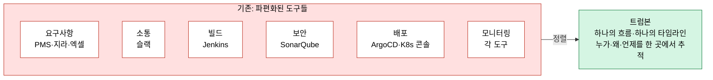
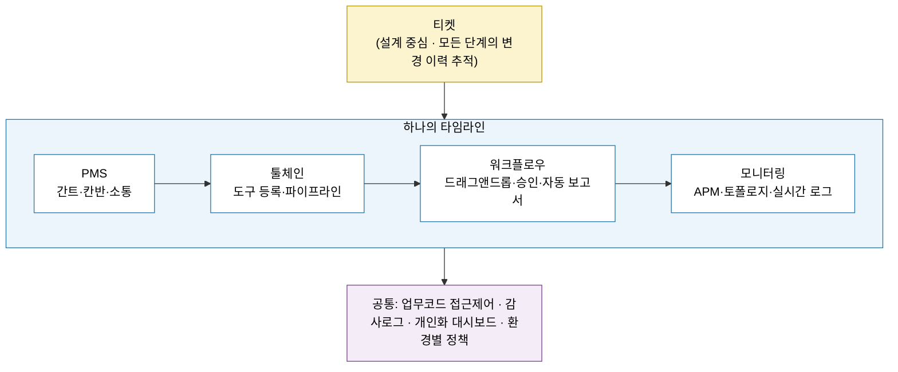
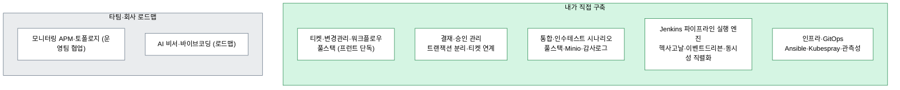

# 트럼본(TROMBONE)이란 — 면접 대비 정리

> 오케스트로의 차세대 DevSecOps 플랫폼. 이 문서는 "트럼본이 무엇이고, 그 안에서 내가 무엇을 담당했는가"를 면접에서 설명하기 위한 정리본입니다.

## 한 줄 정의

트럼본은 흩어져 있는 DevOps 환경을 하나의 흐름으로 정렬하는 플랫폼입니다. 핵심 메시지는 "DevOps를 도구가 아니라 흐름으로 본다"입니다. Jenkins·Git·ArgoCD·SonarQube 같은 도구를 더 만드는 대신, 이미 있는 도구들의 흐름을 정렬해 요구사항부터 모니터링까지를 하나의 타임라인으로 잇습니다.

## 왜 만들어졌나

대부분의 조직은 자동화 도구를 이미 갖추고 있습니다. 그런데 "지금 이 배포는 누가 왜 시작했지?", "이 빌드는 어떤 이슈를 해결하려던 거지?"라는 질문에 답하기 어렵습니다. 각 팀은 열심히 일하지만 스크립트와 파이프라인은 시간이 갈수록 관리하기 어려워지고, 결국 자동화를 했는데도 사람에게 더 의존하게 되면서 DevOps가 블랙박스가 됩니다.

이 문제는 세 가지 파편화에서 옵니다. 첫째, 환경이 파편화돼 있습니다. 레거시(FTP 수동 배포), VM(Ansible 스크립트), 쿠버네티스(GitOps·Helm·ArgoCD)가 한 조직 안에 공존하는데 운영 방식이 제각각이고 표준화·문서화가 안 돼 있습니다. 둘째, 정보가 파편화돼 있습니다. 요구사항은 PMS·지라·엑셀에, 소통은 슬랙에, 빌드 상태는 Jenkins에, 테스트 결과는 별도 도구에, 보안 분석은 SonarQube에, 배포 대상은 K8s 콘솔에 흩어져 있어 개발팀과 운영팀이 여러 도구를 오가며 정보를 모아야 합니다. 셋째, 이렇게 끊어진 경험 탓에 문제가 생기면 어디서 막혔는지 찾기 위해 여러 시스템을 헤매게 됩니다.

특히 금융권에서 이 고통이 큽니다. 한 고객사는 레거시·VM·쿠버네티스 세 환경을 동시에 운영하면서, 금융감독원 변경관리 규정 때문에 쿠버네티스 배포까지 모두 변경관리·감사 대상이었습니다. 문제는 이 세 환경을 중앙에서 통제할 방법이 없었다는 점입니다. 팀마다 따로 운영하니 변경을 추적하고 감사에 대응하기가 어려웠습니다. 트럼본은 바로 이 흩어진 흐름을 정렬하기 위해 시작됐습니다.

## 무엇을 하나 (구성)

트럼본의 설계 중심은 **티켓**입니다. 개발 프로세스의 모든 단계를 티켓으로 묶어 변경 이력을 추적하고, 누가·언제·무엇을·왜 했는지를 사후에 재구성할 수 있게 합니다. 그 위에 네 영역이 올라갑니다.

- **PMS**: 간트차트로 전체 일정을, 칸반보드로 일감 진행 상황을 보고, 댓글·멘션으로 바로 소통합니다. 일정·태스크·소통을 한 곳으로 모아 슬랙·엑셀을 오갈 필요를 없앱니다.
- **툴체인**: 흩어진 개발 도구를 등록하고 프로젝트별 맞춤 툴체인을 구성합니다. 파이프라인 스크립트를 직접 작성하거나 템플릿으로 만들고, 실행과 실시간 상태, 품질 이슈를 한 화면에서 확인합니다.
- **워크플로우**: 드래그앤드롭으로 조직에 맞는 워크플로우를 구성하고, 단계마다 승인을 넣어 중요한 업무는 담당자가 반드시 확인하게 합니다. 티켓이 워크플로우로 실행되고, 진행 현황을 한눈에 보며, 티켓이 끝나면 보고서가 자동으로 만들어집니다. 어느 단계에서 병목이 생겼는지도 바로 드러납니다.
- **모니터링**: 배포한 애플리케이션을 APM으로 확인하고, 토폴로지 위에서 파드 상태를 보다가 필요하면 실시간 로그까지 내려갑니다. 개발자에게 미들웨어를 직접 열어 주지 않고도 디버깅이 가능합니다.

여기에 업무코드 기반 접근제어(해당 코드를 가진 사용자만 그 시스템 기능에 접근), 감사로그, 개인화 대시보드, 개발/테스트/운영 환경별 정책이 공통으로 깔립니다. 결과적으로 기획·QA·운영·개발 모든 조직이 같은 릴리즈 단위, 같은 승인 절차, 같은 타임라인 안에서 일하게 됩니다.

티켓을 중심으로 네 영역이 하나의 타임라인으로 이어지는 구조입니다.

## 내가 담당한 영역

트럼본 본체에서 Spring Boot 백엔드와 React 프런트엔드 양쪽을 담당했고, 프런트는 단독으로 맡았습니다. 위 제품 기능 중 내가 실제로 만든 부분은 다음과 같습니다(상세는 work/ 의 각 파일 참고).

- **티켓·변경관리·워크플로우** — 제품의 척추에 해당하는 도메인입니다. 티켓 CRUD·검색·연계·진행이력을 프런트와 백엔드에서 단독 구축했고, 2025년에는 변경관리 화면 상태를 React Context 기반으로, 데이터 계층을 v3 API로 재아키텍처했습니다. (→ tps-app.md)
- **결재·승인 관리** — 결재를 비즈니스 트랜잭션으로 보고, 결재 완료와 외부 호출 후속 처리를 트랜잭션 분리해 외부 장애가 결재 상태를 오염시키지 않게 했습니다. 승인관리 페이지를 신규 구축하고 티켓·결재를 단일 흐름으로 연계했습니다. (→ tps-app.md)
- **통합·인수테스트 시나리오 관리** — 테스트를 티켓 흐름의 한 단계로 통합한 제품 기능입니다. 시나리오 그룹·시나리오 CRUD, 티켓 진행이력 연계, Minio 파일 증빙, 감사로그 적재를 풀스택으로 구현했습니다. (→ tps-app.md)
- **Jenkins 파이프라인 실행 엔진** — 트럼본이 외부 Jenkins를 호출하고 상태를 추적하는 신규 엔진(operator-api·executor·message-lib)입니다. UC01~04 흐름을 이벤트 드리븐(Redpanda·Avro·Outbox)으로 짜고, 비관적·낙관적 락으로 동시성을 직렬화했으며, 결재 도메인은 헥사고날·DDD(Aggregate Root·VO·Port 분리)로 모델링했습니다. (→ ppp-engine.md)
- **인프라·GitOps** — 운영을 코드로 형상관리해 왔습니다. 초기에는 Ansible 로 STG 환경 VM CI/CD(git→gradlew/yarn 빌드→systemd·nginx 무중단 배포)와 Kubespray 기반 쿠버네티스 클러스터 구축을 자동화했고, 이후 Grafana 단일화·Promtail→Alloy 전환·305P Jenkins app-of-apps 부트스트랩·ERROR/Outbox 운영 대시보드를 GitOps(ArgoCD/Helm)로 관리했습니다. (→ tps-manifest.md)

내 담당 영역을 트럼본 전체 위에 얹으면 다음과 같습니다. 초록은 내가 직접 만든 부분, 회색은 타팀·회사 로드맵 영역입니다.

## AI 진화 방향 (회사 로드맵)

트럼본은 "흐름을 보여주는 플랫폼"에서 "흐름을 이해하는 플랫폼"으로 가려 합니다. 회의록에서 요구사항을 자동 추출하고, 상황에 맞는 스크립트를 추천하며, 빌드·배포 실패 원인을 자동 분석하는 비서 역할, 그리고 바이브 코딩을 위한 MCP·Context Hub를 방향으로 잡고 있습니다. (이 부분은 회사가 그리는 로드맵이며, 내 직접 작업 영역과는 구분됩니다.)

## 면접 한 줄 요약

트럼본은 흩어진 DevOps 흐름을 티켓 기반으로 정렬해 금융권 변경관리·감사 요건까지 충족시키는 플랫폼이고, 저는 그 안에서 티켓·결재·워크플로우 도메인을 풀스택(프런트 단독)으로, 그리고 외부 Jenkins를 다루는 파이프라인 실행 엔진을 헥사고날·이벤트 드리븐으로 직접 설계·구축했습니다.

---

> 출처: 오케스트로 Solution Day 2025 "DevOps와 AI — TROMBONE" 발표(김성구 본부장), DevOps 웨비나 "트럼본 엔터프라이즈" 소개 자막. 자막은 자동 생성본이라 용어를 정확한 표현으로 복원해 정리했습니다.
